# 《人工智能导论》复习文档

## 第一章 搜索
### 1. 深度优先搜索 - 优先扩展深的节点
- 按照顺序的第一个解，不保证最优解
- 深度不合理时可能无解
- 最坏等同于穷举
- 通用方法，与问题无关
- 节省内存，只存储当前路径

### 2. 广度优先搜索 - 优先扩展浅的节点
- 问题有解时一定能找到解
- 单位耗散值（每一步代价都一样）时，一定能找到最优解
- 通用方法，与问题无关
- 效率低
- 存储量大

### 3. Dijkstra算法 - 优先扩展距离起点最近的节点
- BFS没有考虑节点的距离问题
- 问题有解时可以找到最优解
- 只考虑节点和起点距离，没有考虑节点到终点的距离

### 4. A算法 - 优先扩展f(n)小的节点
$$f(n) = g(n) + h(n)$$
- $g^*(n)$：从`start`到当前节点的最短路径的耗散值
- $h^*(n)$：从当前节点到`goal`的最短路径的耗散值
- $f^*(n)$：从`start`途经当前节点到`goal`的最短路径的耗散值
- $f(n)$ $h(n)$ $g(n)$：分别是对上述三个值的估计
- *notice: g值直接计算出，h值是一种事先给定的评估，计算h的时候只看当前节点，不要把路径上的h也累加上去*

算法操作：
```text
A 算法：

1. 把初始节点 s 放入 OPEN
2. CLOSED 为空
3. 计算 s 的 f 值

4. 当 OPEN 不为空时：
   1）取出 OPEN 中 f 最小的节点 n
   2）如果 n 是目标节点，返回 n
   3）把 n 从 OPEN 移到 CLOSED
   4）扩展 n，得到所有子节点 m_i
   5）对每个子节点 m_i：
      - 计算如果从 n 走到 m_i 的新 g 和 f 值
      - 如果 m_i 是新节点，就加入 OPEN，记录其 g 值 f 值和父节点 n
      - 如果 m_i 已经在 OPEN 中，但这条新路线更好，就更新它的 g 值 f 值和父节点 n
      - 如果 m_i 已经在 CLOSED 中，但这条新路线更好，就更新它的 g 值 f 值和父节点 n，并把它从 CLOSED 移到 OPEN
   6）重新按 f 值给 OPEN 排序

5. 如果 OPEN 空了还没找到目标，返回失败
```

代码版：
```python
def A(s):
    OPEN=[s] # 已经发现但未扩展的节点
    CLOSED=[] # 已经扩展过的节点

    g[s] = 0
    f[s]=g[s]+h[s]
    parent[s] = None

    while OPEN is not empty:
        n = OPEN[0] # OPEN中f值最小的节点

        if n == goal:
            return n # 到达目标节点，返回
        OPEN.remove(n)
        CLOSED.append(n) # 将n从OPEN移到CLOSED

        for child in expand(n): # 扩展n，得到子节点
            g_tmp = g[n] + dist(n, child)
            f_tmp = g_tmp + h[child] 

            if child not in OPEN and child not in CLOSED: # child是新节点
                g[child] = g_tmp
                f[child] = f_tmp
                parent[child] = n
                OPEN.append(child)
            elif child in OPEN:
                if f_tmp < f[child]: # child已在OPEN中，但通过n到child的路径更短
                    g[child] = g_tmp
                    f[child] = f_tmp
                    parent[child] = n
            elif child in CLOSED:
                if f_tmp < f[child]: # child已在CLOSED中，但通过n到child的路径更短
                    g[child] = g_tmp
                    f[child] = f_tmp
                    parent[child] = n
                    CLOSED.remove(child) 
                    OPEN.append(child)
            OPEN=sorted(OPEN, key=lambda x: f[x]) # OPEN中的节点按f值从小到大排序
    return -1
```

回溯方法：从目标开始顺序访问父节点

e.g. 八数码问题，定义$h$是当前节点不在位的数字数
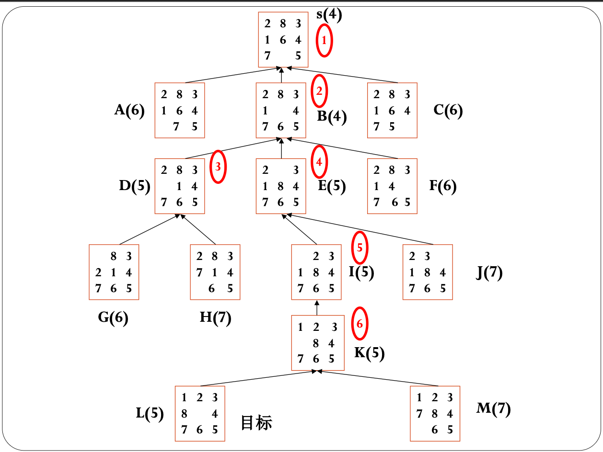


练习题
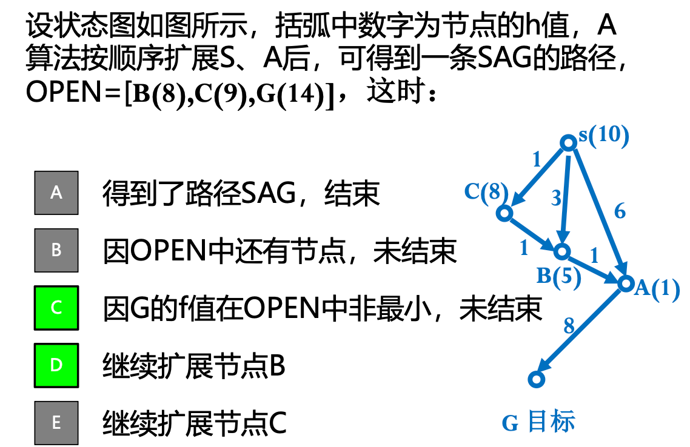


### 5. A*算法
1. A算法中，$h(n) \leq h^*(n)$，即为A*算法（只许乐观，不许悲观）
2. 两个定理
   - **thm1 可采纳性定理**：若存在从初始节点s到目标节点t有路径，则A*必能找到最佳解结束
   - **thm2**：如果$h_2(n) > h_1(n)$ (目标节点除外)，则$A_1扩展的节点数 \geq A_2扩展的节点数$，直观理解为$h_2$包含的信息更多更接近真实值
   - **corollary**：在所有可采纳启发式函数中，$h^*(n)$是最好的，A*算法在使用$h^*(n)$时效率最高
3. 评价h：平均分叉法 $N=\frac{1-b^{d+1}}{1-b}$（等比数列求和，求解b），b越小效果越好
4. 例子
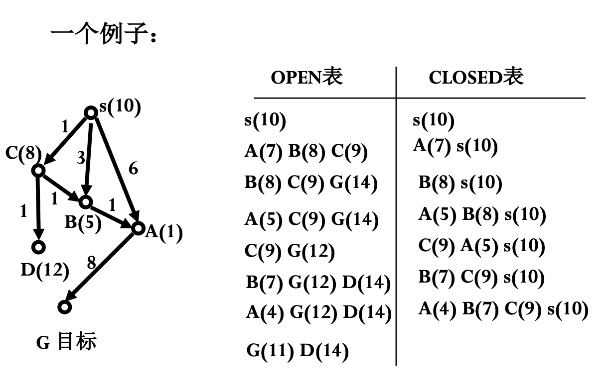
5. 改进h函数，以减少重复探索
   1. $n_i$是$n_j$的父节点，$C(n_i, n_j)$是其耗散值，保证$h(n_i) - h(n_j) \leq C(n_i, n_j)$且$h(g)=0$
   2. 满足单调条件的h一定满足A*条件，当h(n)恒等于0时h单调
   3. OPEN表上任以具有$f(n) < f^*(s)$的节点定会被A\*扩展，A\*选作扩展的任一节点定有$f(n)\leq^*(s)$

### 6. A*算法的改进
$\text{OPEN}=(f<f^*(s)的点 | f=f^*(s)的点)$

改进：$f_m$为到目前为止已扩展节点的最大f值，用$f_m$代替$f^*(s)$

算法操作：
```text
改进 A* 算法：

1. 把初始节点 s 放入 OPEN
2. CLOSED 为空
3. 计算 s 的 f 值
4. 设置 f_m = 0

5. 当 OPEN 不为空时：
   1）找出 OPEN 中所有满足 f(n_i) < f_m 的节点，记为 NEST
   2）如果 NEST 不为空：
        从 NEST 中取 g 值最小的节点 n
     否则：
        从 OPEN 中取 f 值最小的节点 n 并令 f_m = f(n)
   3）如果 n 是目标节点，返回 n
   4）把 n 从 OPEN 移到 CLOSED
   5）扩展 n，得到所有子节点 m_i
   6）对每个子节点 m_i：
      - 计算如果从 n 走到 m_i 的新 g 和 f 值
      - 如果 m_i 是新节点，就加入 OPEN，记录其 g 值 f 值和父节点 n
      - 如果 m_i 已经在 OPEN 中，但这条新路线更好，就更新它的 g 值 f 值和父节点 n
      - 如果 m_i 已经在 CLOSED 中，但这条新路线更好，就更新它的 g 值 f 值和父节点 n，并把它从 CLOSED 移到 OPEN
   7）重新按 f 值给 OPEN 排序

5. 如果 OPEN 空了还没找到目标，返回失败
```

代码版：
```python
def Modified_A_star(s):
    OPEN = [s]          # 已经发现但未扩展的节点
    CLOSED = []         # 已经扩展过的节点

    g[s] = 0
    f[s] = g[s] + h[s]
    parent[s] = None

    f_m = 0             # 修正A*中新增加的门槛值

    while OPEN is not empty:

        # 找出 OPEN 中所有 f 值小于 f_m 的节点
        NEST = [node for node in OPEN if f[node] < f_m]

        
        if NEST is not empty: # 如果 NEST 非空，从 NEST 中选 g 值最小的节点
            n = sorted(NEST, key=lambda x: g[x])[0]  # 从 NEST 中选 g 值最小的节点 n
        else: # 如果 NEST 为空，则退回普通A*选择方式：取 OPEN 中 f 值最小的节点，并更新 f_m
            n = OPEN[0]
            f_m = f[n] # 更新 f_m 为当前选中节点 n 的 f 值

        if n == goal:
            return n    # 到达目标节点，返回

        OPEN.remove(n)
        CLOSED.append(n)

        for child in expand(n):  # 扩展 n，得到子节点
            g_tmp = g[n] + dist(n, child)
            f_tmp = g_tmp + h[child]

            if child not in OPEN and child not in CLOSED:
                g[child] = g_tmp
                f[child] = f_tmp
                parent[child] = n
                OPEN.append(child)

            elif child in OPEN:
                if f_tmp < f[child]:
                    g[child] = g_tmp
                    f[child] = f_tmp
                    parent[child] = n

            elif child in CLOSED:
                if f_tmp < f[child]:
                    g[child] = g_tmp
                    f[child] = f_tmp
                    parent[child] = n

                    CLOSED.remove(child)
                    OPEN.append(child)

        OPEN = sorted(OPEN, key=lambda x: f[x])

    return -1
```
例子
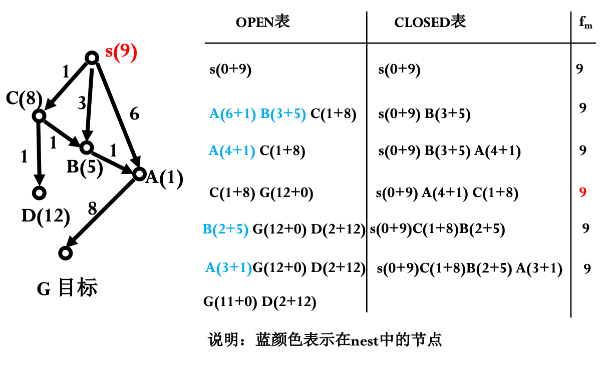

练习题：（这里的B和C的f大于fm，故只需取f<fm的A即可）
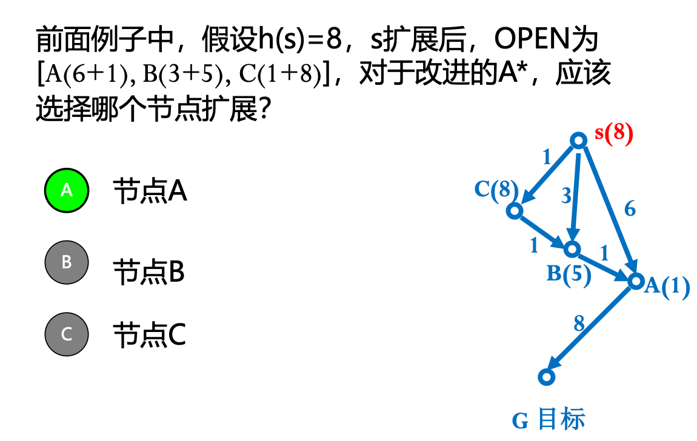

### 7. Viberti算法与拼音输入法
（见作业，略去）

## 第二章 神经网络与深度学习
### 1. 神经网络基础与MLP
1. 一些基本函数
   - $net = w_1 \cdot x_1 + w_2 \cdot x_2 + ... + w_n \cdot x_n + b = \sum_{i=1}^n w_i x_i + b$
   - Sigmoid函数：$\sigma(net) = \frac{1}{1 + e^{-net}}$
   - 其他激活函数：$\text{ReLU}(net) = \max(0, net)$，$\tanh(net)=\frac{e^{net}-e^{-net}}{e^{net}+e^{-net}}$，$\text{sgn}(net)=\begin{cases} 1, & net \geq 0 \\ -1, & net < 0 \end{cases}$，$\text{softmax}(net_i) = \frac{e^{net_i}}{\sum_{j} e^{net_j}}$
   - 损失函数：对样本$d$，$E_d(w)=\frac{1}{2}\sum_{k=1}^{m}(t_{kd} - o_{kd})^2$（t是真实值，o是预测值）
   - 损失函数：对整体，$E(w) =  \sum_{d=1}^{D} E_d(w)=\frac{1}{2}\sum_{d=1}^{D} \sum_{k=1}^{m}(t_{kd} - o_{kd})^2$
   - 交叉熵损失函数：对样本$d$，$E_d(w) = -\sum_{k=1}^{m} t_{kd} \log(o_{kd})$
   - 交叉熵损失函数：对整体，$E(w) = \sum_{d=1}^{D} E_d(w) = -\sum_{d=1}^{D} \sum_{k=1}^{m} t_{kd} \log(o_{kd})$
   - 训练目标：$\min_{w} E(w)$
   - 梯度下降：$w \leftarrow w - \eta \nabla E(w)$，其中$\nabla E(w) = \left( \frac{\partial E}{\partial w_1}, \frac{\partial E}{\partial w_2}, ..., \frac{\partial E}{\partial w_n} \right)$
   
2. 梯度计算
   1. 符号约定：$x_{ji}$表示j的第i个输入，$w_{ji}$表示j的第i个输入的权重
   2. 输出层梯度计算：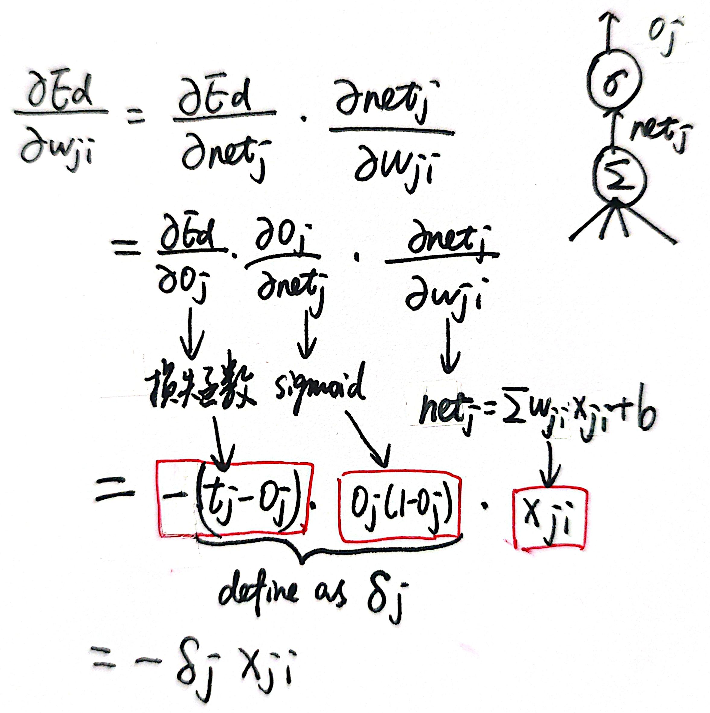
   3. 隐藏层梯度计算：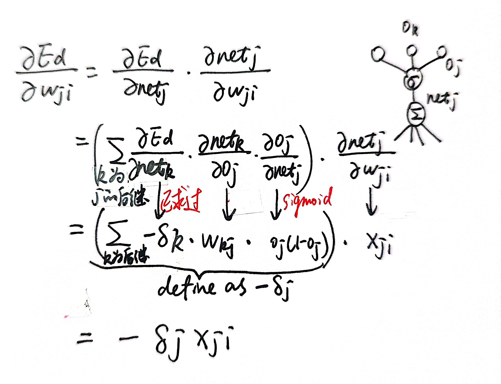
3. BP算法
   1. 前向传播：计算每个节点的输出
   2. 反向传播：计算输出层$\delta_k=(t_k-o_k)o_k(1-o_k)$，再计算每一个隐藏层$\delta_j = o_j(1-o_j) \sum_{k} \delta_k w_{kj}$
   3. 用$\delta$更新权重：$w_{ji} \leftarrow w_{ji} + \eta \delta_j x_{ji}$
4. 梯度消失问题
    1. $o_j(1-o_j)\leq 1/4$
    2. 解决方法：使用ReLU、残差连接、批归一化等技术
5. 过拟合问题
    1. 解决方法：正则化、Dropout、数据增强等技术
    2. 正则化：$E_d(w) = \frac{1}{2}\sum_{k=1}^{m}(t_{kd} - o_{kd})^2 + \frac{1}{2}\lambda \Vert w \Vert^2$，其中$R(w)$是正则化项，$\lambda$是正则化系数

### 2. CNN
1. 局部连接，权重共享
2. 参数量对比（以5*5到3*3为例）
   1. 全连接：$(5\times5+1)\times(3\times3)=234$
   2. CNN：$3\times3+1=10$
3. 输出规模：$\frac{N+2P-F}{S}+1$，其中$N$是输入大小，$F$是卷积核大小，$P$是padding大小，$S$是stride大小
4. 考虑多通道输入和多卷积核：
   - 输入为$N\times N \times C_{in}$
   - $C_{out}$个卷积核，卷积核大小为$F\times F \times C_{in}$
   - 输出为$\big(\frac{N+2P-F}{S}+1\big) \times \big(\frac{N+2P-F}{S}+1\big) \times C_{out}$
   - 参数量为$(F\times F \times C_{in} + 1) \times C_{out}$
5. 练习题
   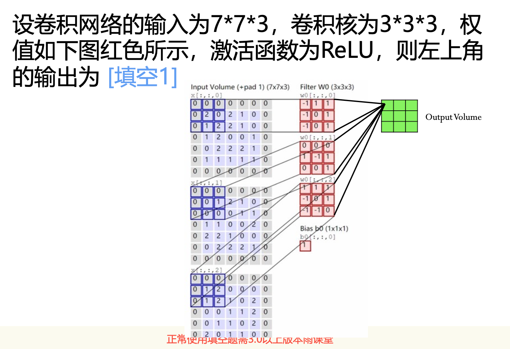
6. 池化层：最大池化/平均池化
7. 例：VGG-16
```
224×224×64
   ↓  2×2最大池化（stride=2）
112×112×128   ← 空间减半，卷积核增加
   ↓
56×56×256
   ↓
28×28×512
   ↓
14×14×512
   ↓
7×7×512
   ↓  展平+全连接
1×1×4096 → 1×1×1000（softmax分类）
```
8. （补充by Sonnet4.6）VGG-16的参数量

| 阶段 | 层 | 输入尺寸 | 卷积核 | 输出尺寸 | 参数量 |
|------|----|---------|--------|---------|--------|
| Block1 | Conv1-1 | 224×224×3 | 3×3×3, 64核 | 224×224×64 | $(3\times3\times3+1)\times64=1{,}792$ |
| | Conv1-2 | 224×224×64 | 3×3×64, 64核 | 224×224×64 | $(3\times3\times64+1)\times64=36{,}928$ |
| | MaxPool | → 112×112×64 | — | — | 0 |
| Block2 | Conv2-1 | 112×112×64 | 3×3×64, 128核 | 112×112×128 | $(3\times3\times64+1)\times128=73{,}856$ |
| | Conv2-2 | 112×112×128 | 3×3×128, 128核 | 112×112×128 | $(3\times3\times128+1)\times128=147{,}584$ |
| | MaxPool | → 56×56×128 | — | — | 0 |
| Block3 | Conv3-1 | 56×56×128 | 3×3×128, 256核 | 56×56×256 | $(3\times3\times128+1)\times256=295{,}168$ |
| | Conv3-2 | 56×56×256 | 3×3×256, 256核 | 56×56×256 | $(3\times3\times256+1)\times256=590{,}080$ |
| | Conv3-3 | 56×56×256 | 3×3×256, 256核 | 56×56×256 | $(3\times3\times256+1)\times256=590{,}080$ |
| | MaxPool | → 28×28×256 | — | — | 0 |
| Block4 | Conv4-1 | 28×28×256 | 3×3×256, 512核 | 28×28×512 | $(3\times3\times256+1)\times512=1{,}180{,}160$ |
| | Conv4-2 | 28×28×512 | 3×3×512, 512核 | 28×28×512 | $(3\times3\times512+1)\times512=2{,}359{,}808$ |
| | Conv4-3 | 28×28×512 | 3×3×512, 512核 | 28×28×512 | $(3\times3\times512+1)\times512=2{,}359{,}808$ |
| | MaxPool | → 14×14×512 | — | — | 0 |
| Block5 | Conv5-1 | 14×14×512 | 3×3×512, 512核 | 14×14×512 | $(3\times3\times512+1)\times512=2{,}359{,}808$ |
| | Conv5-2 | 14×14×512 | 3×3×512, 512核 | 14×14×512 | $(3\times3\times512+1)\times512=2{,}359{,}808$ |
| | Conv5-3 | 14×14×512 | 3×3×512, 512核 | 14×14×512 | $(3\times3\times512+1)\times512=2{,}359{,}808$ |
| | MaxPool | → 7×7×512 | — | — | 0 |
| FC | FC1 | 7×7×512=25088 | → 4096 | — | $(25088+1)\times4096=102{,}764{,}544$ |
| | FC2 | 4096 | → 4096 | — | $(4096+1)\times4096=16{,}781{,}312$ |
| | FC3 | 4096 | → 1000 | — | $(4096+1)\times1000=4{,}097{,}000$ |

| 部分 | 参数量 |
|------|--------|
| 卷积层合计 | ≈ **14,714,688**（约1470万） |
| 全连接层合计 | ≈ **123,642,856** （约1.24亿） |
| **总计** | ≈ **138,357,544** （约**1.38亿**） |

9. GoogLeNet
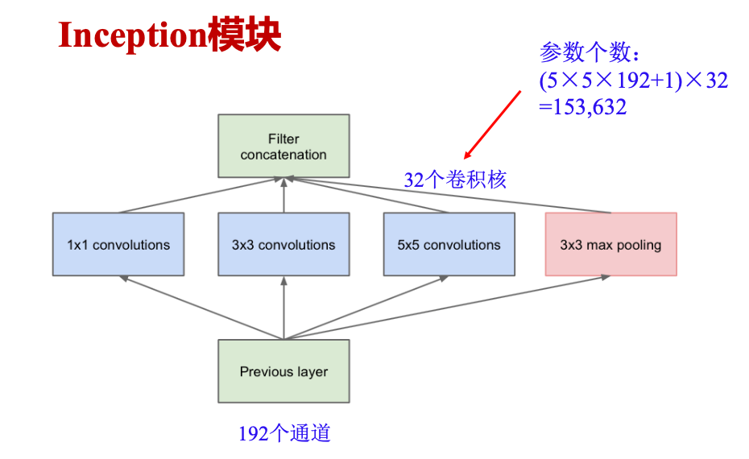
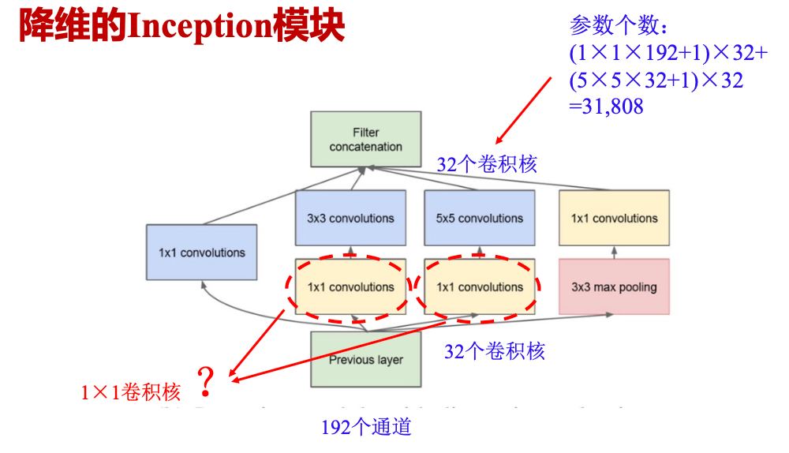
10. ResNet
    1. 残差模块：$y = F(x) + x$，其中$F(x)$是残差函数，由两层卷积组成，通道数不变
    2. ResNet通过增加stride而不是池化实现大小减半
    3. 在大小减半通道数翻倍的过程中，捷径需要使用1×1卷积来调整维度从$X_C$到$X_{2C}$（参数量$(1\times1\times C+1)\times 2C$）
    4. ResNet-50结构：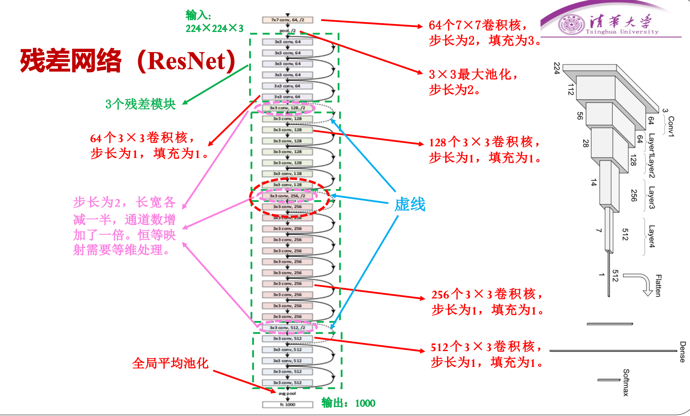
### 3. Word2Vec
1. NNLM 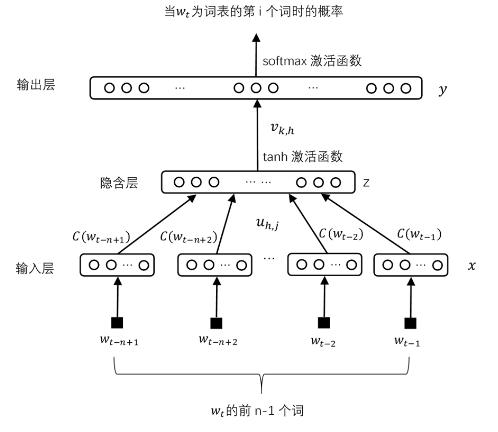
    问题：词表大时softmax计算量太大、全连接层参数量太大
2. 训练语言模型：
   - $\max_{\theta} \prod_{w\in C}p(w=k|context(w),\theta) = \max_{\theta} \sum_{w\in C} \log p(w=k|context(w),\theta)$
3. Word2Vec(CBOW) 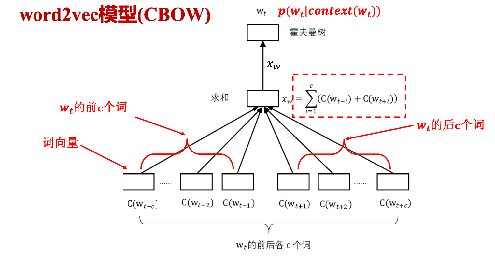
    - 得到$x_w$后，向右走的概率是$p(R)=\sigma(x_w\cdot \theta)=1/(1+e^{-x_w\cdot \theta})$，向左走的概率是$p(L)=1-p(R)$
    - 词w的最大似然函数：$\prod_{i=2}^{l_w}p(d_i^w|x_w,\theta_{i-1}^w)=\prod_{i=2}^{l_w}[\sigma(x_{d_i^w}\cdot \theta_{i-1}^w)]^{d_i^w}[1-\sigma(x_{d_i^w}\cdot \theta_{i-1}^w)]^{1-d_i^w}$ （课件写反了，我们约定向右走是1，向左走是0）
    - 损失函数$L=-\sum_{i=2}^{l_w} [d_i^w \log \sigma(x_{d_i^w}\cdot \theta_{i-1}^w) + (1-d_i^w) \log (1-\sigma(x_{d_i^w}\cdot \theta_{i-1}^w))]$
4. Word2Vec(Skip-gram) 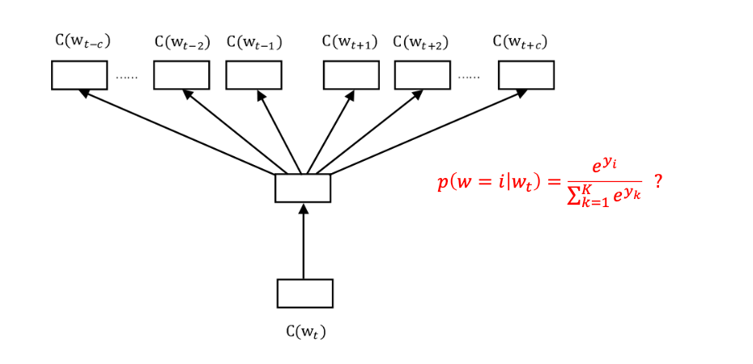
   - CBOW用多预测一，Skip-gram用一预测多，后者信息更丰富，但训练也更慢
5. 应用：文本情感分析（见作业）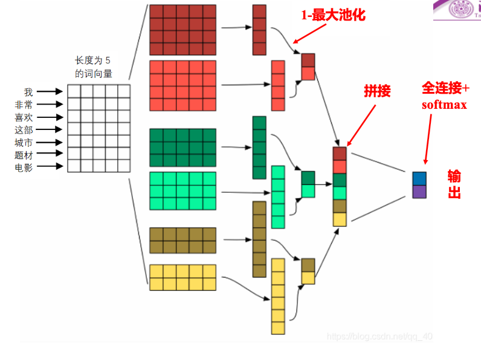

### 4. RNN
1. 循环模块间共用参数，每一个循环模块输入当前时刻输入（$\boldsymbol{x}^{i}$）和上一个时刻的隐藏状态（$\boldsymbol{h}^{(i-1)}$），通过全连接网络得到输出层再做$\tanh$激活，输出当前时刻的隐藏状态（$\boldsymbol{h}^i$）
2. $\boldsymbol{h^i} = \tanh(W \cdot \boldsymbol{h}^{(i-1)} + U \cdot \boldsymbol{x}^i + \boldsymbol{b} )$ （课件漏写了$\boldsymbol{b}$）
3. 结构图：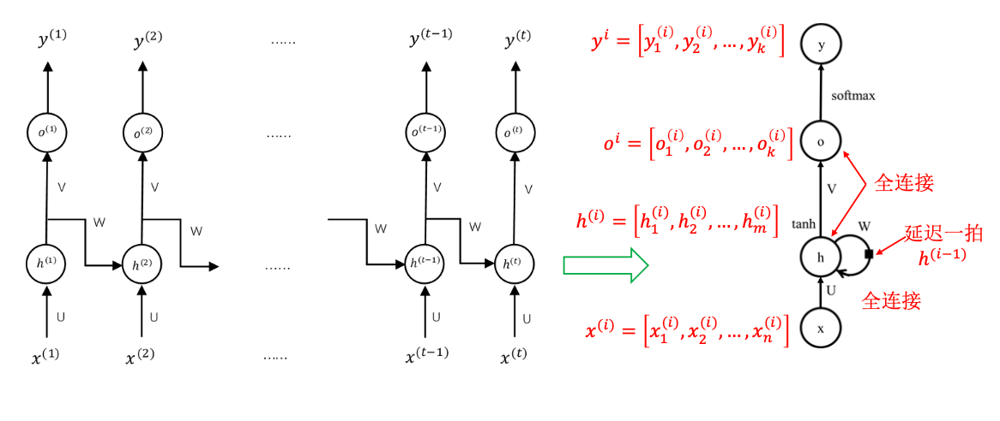
4. 双向RNN：同时从前往后和从后往前两个方向建模，得到的隐藏状态拼接起来作为输出
5. LSTM：引入门控机制，解决长距离依赖问题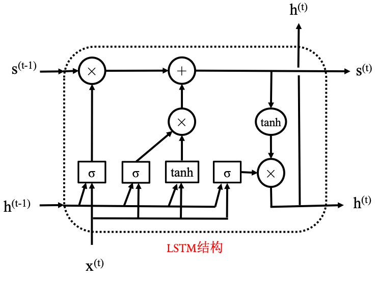
   1. 门：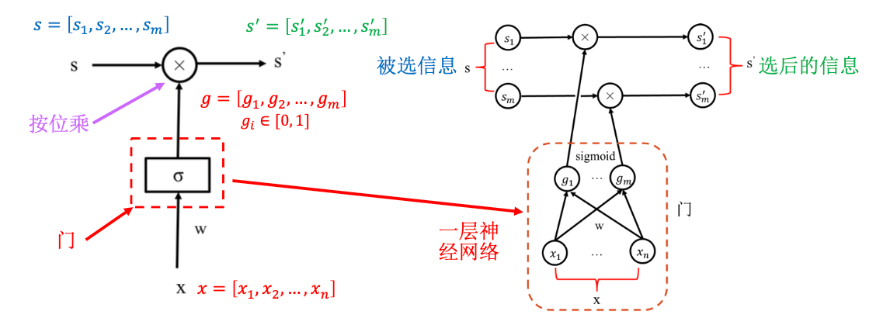
   2. 第一个门遗忘门，得到$\boldsymbol{f^t}=\sigma(W^f \cdot \boldsymbol{h}^{(t-1)}+ U^f\cdot \boldsymbol{x}^t + \boldsymbol{b}^f)$，和前一状态$\boldsymbol{s^{(t-1)}}$做逐元素乘
   3. 第二个门输入门，得到$\boldsymbol{g^t}=\sigma(W^g \cdot \boldsymbol{h}^{(t-1)}+ U^g\cdot \boldsymbol{x}^t + \boldsymbol{b}^g)$，和隐藏层输出$\boldsymbol{i}^t=\tanh(W^i \cdot \boldsymbol{h}^{(t-1)} + U^i \cdot \boldsymbol{x}^t + \boldsymbol{b}^i)$做逐元素乘再和遗忘门的结果相加得到当前状态$\boldsymbol{s^t}$
   4. 第三个门输出门，得到$\boldsymbol{q^t}=\sigma(W^q \cdot \boldsymbol{h}^{(t-1)} + U^q \cdot \boldsymbol{x}^t + \boldsymbol{b}^q)$，和当前状态$\tanh(\boldsymbol{s^t})$做逐元素乘得到输出


## 第三章 对抗搜索
### 1. Minimax算法和Alpha-Beta剪枝
1. Minimax算法：深度优先、自底向上回溯计算 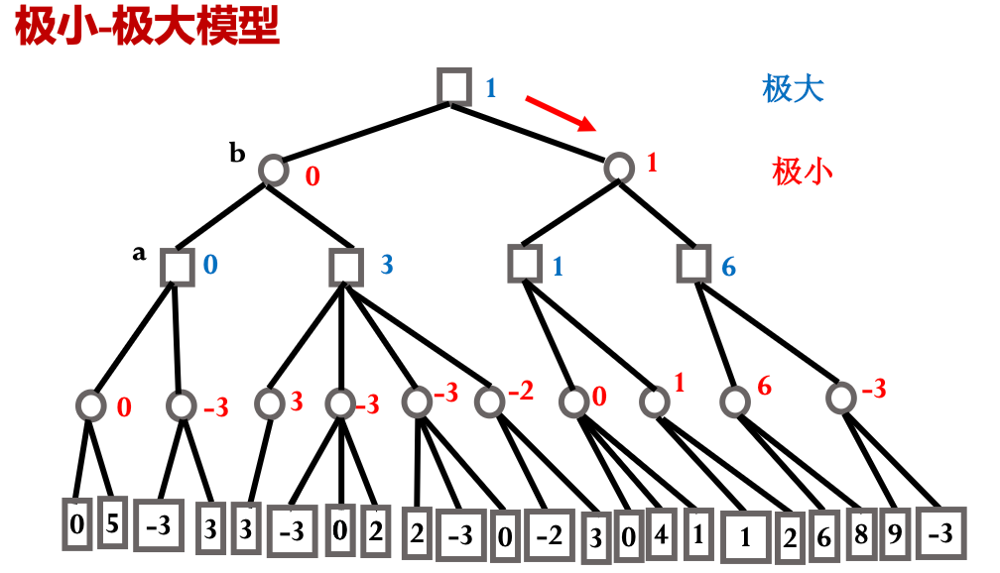
2. $\alpha-\beta$剪枝：
   1. 极大节点（方形）的下界为$\alpha$，极小节点（圆形）的上界为$\beta$
   2. 当前节点$\beta$$\leq$**祖先**节点$\alpha$时（极小$\leq$极大），$\alpha$剪枝
   3. 当前节点$\alpha$$\geq$**祖先**节点$\beta$时（极大$\geq$极小），$\beta$剪枝
   4. 注意：①*要将当前节点的值和其祖先路径的所有值比较，而不是只和父节点比较*　②*剪枝结果是当前节点剩下的子分支都不看了*  ③*一次剪枝过程只能得到一次走步，不是规划所有路径*　④*要求准确的估值*
3. 算法操作：
```text
Alpha-Beta剪枝算法：
1. 如果当前节点是叶节点（达到最大深度或终局），直接返回估值 evaluate(node)
2. 如果当前节点是极大节点（MAX层）：
   1）初始化局部变量 alpha = -∞（代表"我目前能保证的最优值"，初始时一无所知）
   2）对每个子节点 child 递归调用 Alpha-Beta，得到返回值 v
   3）更新 alpha = max(alpha, v)
   4）如果 alpha >= beta：
        剪枝，直接返回 alpha（当前MIN祖先已经有了比alpha更好的选择，不会来这里）
   5）所有子节点处理完后，返回 alpha
3. 如果当前节点是极小节点（MIN层）：
   1）初始化局部变量 beta = +∞（代表"我目前能压制的最低值"，初始时一无所知）
   2）对每个子节点 child 递归调用 Alpha-Beta，得到返回值 v
   3）更新 beta = min(beta, v)
   4）如果 beta <= alpha：
        剪枝，直接返回 beta（当前MAX祖先已经有了比beta更好的选择，不会来这里）
   5）所有子节点处理完后，返回 beta
```
4. 代码版：
```python
def alpha_beta(node, depth, alpha, beta, maximizing_player):
    # 基础情况：到达叶节点或搜索深度上限，直接返回静态估值
    if depth == 0 or is_terminal(node):
        return evaluate(node)

    if maximizing_player:          # 当前是极大节点（MAX层）
        value = -float('inf')      # 初始化为 -∞，代表还没有找到任何好的子节点
        for child in expand(node): # 遍历所有子节点
            v = alpha_beta(child, depth - 1, alpha, beta, False)
            # 递归进入极小层，alpha 和 beta 原样传下去（共享同一条路径上的上下界）
            value = max(value, v)  # MAX节点取最大值
            alpha = max(alpha, value)
            # 更新 alpha：记录从根到当前节点这条路上 MAX 能保证的最优下界
            if alpha >= beta:
                break              # 剪枝：MIN祖先已有更好选择（≤beta），不会选这条路
        return value               # 返回该 MAX 节点的最优值

    else:                          # 当前是极小节点（MIN层）
        value = float('inf')       # 初始化为 +∞，代表还没有找到任何子节点
        for child in expand(node): # 遍历所有子节点
            v = alpha_beta(child, depth - 1, alpha, beta, True)
            # 递归进入极大层，alpha 和 beta 原样传下去
            value = min(value, v)  # MIN节点取最小值
            beta = min(beta, value)
            # 更新 beta：记录从根到当前节点这条路上 MIN 能压制的最优上界
            if beta <= alpha:
                break              # 剪枝：MAX祖先已有更好选择（≥alpha），不会选这条路
        return value               # 返回该 MIN 节点的最优值


# 调用方式：从根节点出发，初始 alpha=-∞，beta=+∞，MAX先走
result = alpha_beta(root, max_depth, -float('inf'), float('inf'), True)
```
5. 练习题（考察一次搜索只走一步）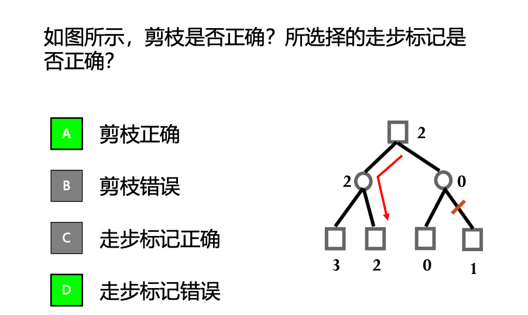
### 2. 蒙特卡洛树搜索（MCTS）
1. 选择$\rightarrow$扩展$\rightarrow$模拟$\rightarrow$回溯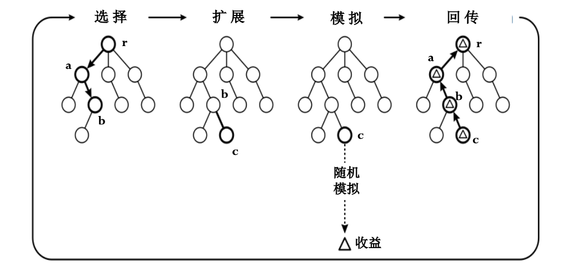
2. 计算信心上限UCB：
   - $$I_j = \bar{X}_j+c\sqrt{\frac{2\ln(n)}{T_j(n)}}$$
   - 其中，$\bar{X}_j$是第j个子节点的平均奖励，$n$是访问的总次数，$T_j(n)$是第j个子节点被访问的次数
3. 信心上限树算法：
```python
def UCT(s0)
    root = Node(s0)  # 创建根节点，状态为初始状态s0

    while t < BUDGET and not terminal(root.state):  # 在计算预算内循环
        node = root

        # 选择阶段：从根节点开始，根据UCB选择子节点，直到一个未完全扩展的节点或终局节点
        while fully_expanded(node) and not terminal(node.state):
            node = select_child(node)  # 根据UCB选择子节点

        # 扩展阶段：选出来的点若不是终局节点（即为未完全扩展的节点），扩展该节点
        if not terminal(node.state):
            node = expand(node)  # 扩展一个新的子节点

        # 模拟阶段：从新扩展的节点开始，随机模拟游戏直到结束，得到奖励
        reward = simulate(node.state)

        # 回溯阶段：将模拟得到的奖励回溯更新路径上所有节点的统计信息
        backpropagate(node, reward)

    return best_child(root)  # 返回根节点的最佳子节点对应的动作
```
4. 练习题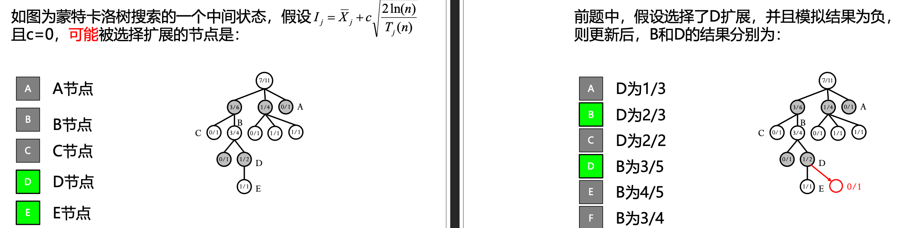 
    - (1)解析：*选择的路径必然是root->左->B，每次选择出的节点要么是终局节点要么是未完全扩展的节点，也就是说已经完全扩展的非终局节点会且必然会向下走。由于D节点已经被扩展过一次，说明它是一个未完全扩展的节点，因此它的父亲节点B是已经完全扩展的非终局节点，故不可能是B。但是我们不知道D是否已经完全扩展，若D还未完全扩展，选D；若D已经完全扩展，选E。*
    - (2)解析：*只需明确白色和黑色的点表示不同玩家的胜率即可做对，新的一层白色玩家输，故上面一层（黑）新增赢一局，上面两层（白）新增输一局*
### 3. ALphaGO
1. 策略网络（policy network）：
   1. 引入人类知识，设计$48$个通道，输入规模为$19\times 19\times 48$，通过13个卷积层，得到$19\times 19$的输出，每个位置的落子概率$p(s_a)$表示在局面$s$下落子$a$的概率
   2. 训练数据依靠16万盘人类棋手的数据，转化为$19\times 19$的分类问题
   3. 损失函数$L=-t_a\log(p_a)$
   4. 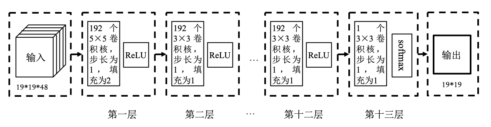
2. 评估网络（value network）：
   1. 输入为当前棋局$19\times 19\times 19$，输出为当前棋局的收益$[-1,1]$
   2. 训练数据依靠16万盘人类棋手的数据，转化为回归问题，获胜为$1$失败为$-1$
   3. 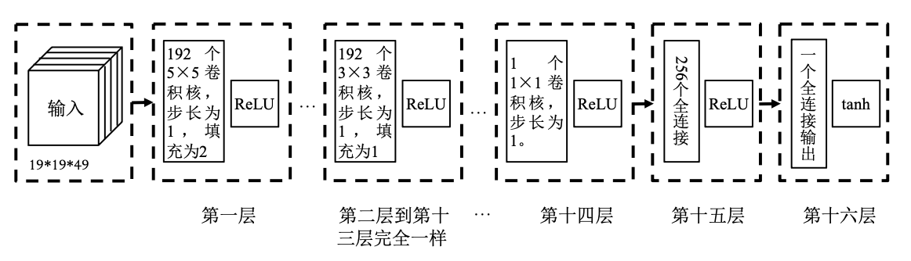
3. 与MCTS结合的新设定：
   1. 对节点$s$做第$i$次模拟的估值：
   $$v_i(s)=\lambda\text{value}(s)+(1-\lambda)\text{rollout}(s)$$
   2. 新的信心上限：
   $$Q(s_a)+u(s_a)=\frac{\sum_{i=1}^nv_i(s_a)}{n} + c\cdot p(s_a)\frac{\sqrt{N(s)}}{N(s_a)+1}$$
   3. 其中，$s_a$表示在局面$s$下$a$这步棋的新局面，$Q(s_a)$是对这个新局面的所有模拟结果取平均，$u(s_a)$是探索项
4. MCTS过程：
   1. 选择：用$Q(s_a)+u(s_a)$代替信心上限，选择最大的节点$s_l$，**每个节点要记录总收益、行棋到该节点概率、被选择次数**
   2. 生成：生成$s_l$的全部子节点（和普通MCTS不同，这里由策略网络直接获得其所有可能子节点），策略网络给出概率，并设置总收益为$0$、选中次数是$0$
   3. 模拟：对$s_l$模拟规定次数，采用小的rollout网络（比策略网络快1000倍），计算$v_i(s)=\lambda\text{value}(s)+(1-\lambda)\text{rollout}(s)$并取平均作为该节点的收益$v$
   4. 回传：$v$值上传，更新其总收益和选择次数，注意正负号的切换，根节点子节点中被选择次数最多的节点作为最终的走步
5. （补充 by Sonnet4.6）：AlphaGo MCTS和普通MCTS的区别
   1. 选择阶段的打分公式。普通MCTS用UCB，探索项只考虑访问次数。AlphaGo用$Q(s_a)+u(s_a)$，探索项里乘了策略网络的先验概率$p(s_a)$，让网络认为好的走法从一开始就获得更高的探索优先级，而不是等随机访问到才发现它好。
   2. 模拟阶段。普通MCTS的simulate是纯随机走到终局，一次迭代一次rollout。AlphaGo选中$s_l$后做规定次数的模拟，每次是$\lambda\text{value}(s)+(1-\lambda)\text{rollout}(s)$的加权，不是纯随机，而且rollout用的是快速策略网络而非随机落子。
   3. 扩展阶段。普通MCTS每次expand只加入一个新子节点，逐步扩展。AlphaGo一次性生成$s_l$的所有子节点，同时用策略网络给每个子节点赋予先验概率$p(s_a)$，作为$u(s_a)$探索项的一部分。

### 4. 3种强化学习的策略
1. 基于策略梯度的强化学习：
   1. 自我博弈产生$(s,a,p_a,t_a)$，表示$(当前棋局s,在a处行棋,获胜概率,胜负值(\pm1))$
   2. 损失函数$L=-t_a\log(p_a)$
   3. 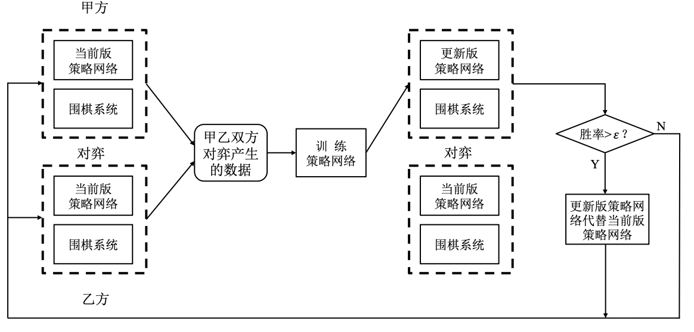
2. 基于价值评估的强化学习：
   1. 自我博弈产生$(s,a,V(s,a),R)$，表示$(当前棋局s,在a处行棋,估值,胜负值(\pm1))$
   2. 损失函数$L=(R-V(s,a))^2$或$(R_i+\gamma V(s_{i+1})-V(s_i))^2$
   3. 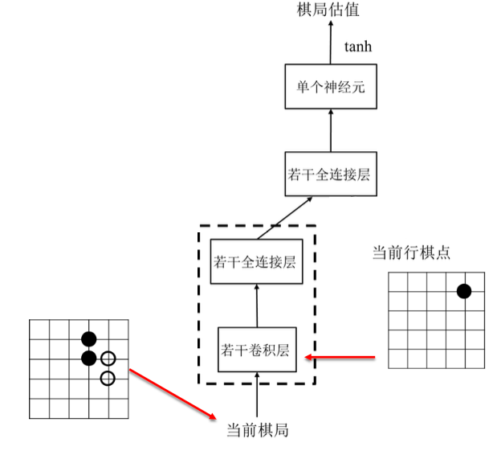
3. 基于演员-评价方法的强化学习：
   1. 收益增量：$A=R-V(s)\in [-2,2]$（胜负值-预期收益）
   2. 评价部分损失函数（希望评估越准越好）：$L_1(w)=(R-V(s))^2$，$R$是胜负值，$V(s)$是预期收益
   3. 演员部分损失函数（希望收益大的概率大）：$L_2(w)=-A\log(p_a)$，$p_a$是在策略网络在$a$处行棋概率，$A=R-V(s)$是收益增量
   4. 综合损失函数：$L(w)=L_1(w)+\lambda L_2(w)$
   5. 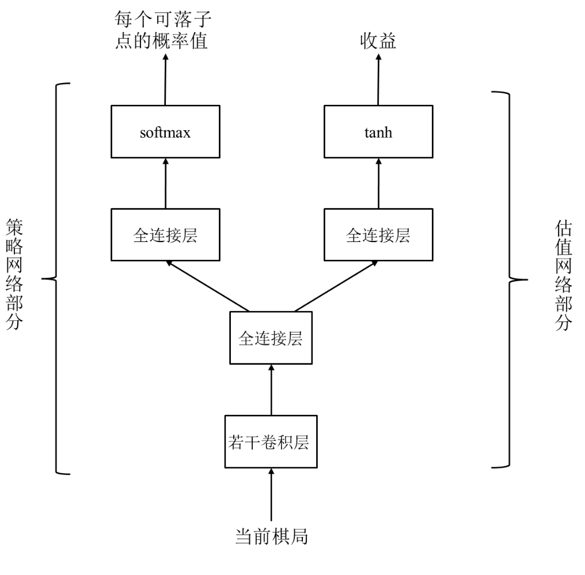
### 5. AlphaGO Zero
1. 应用演员-评价思想，策略和评价网络同时训练：
   1. 输入$17$个通道：目前$8$个棋局每个棋局黑白$2$通道，再加一个通道表示当前行棋方是黑还是白
   2. 估值网络输出取值在$[-1,1]$，损失函数$L_1=(z-v)^2$，$z$为胜负值，$v$为估值输出
   3. 策略网络输出$19\times 19+1$，多了一个放弃行为，损失函数$L_2=-\pi_1\log(p_1)-\pi_2\log(p_2)-\dots-\pi_362\log(p_{362})$，其中$\pi_i$表示MCTS给出的每个落子点的概率，$p_i$表示策略网络输出的每个落子点的概率 *p.s. 这里没有人类棋谱的预训练，所以真实数据标注就来自MCTS的结果*
   4. 总损失函数$L=L_1+L_2+\Vert\theta\Vert^2_2$
   5. 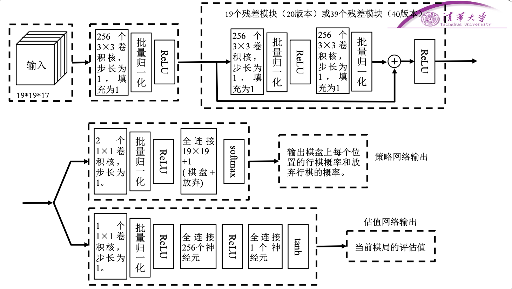
2. 和MCTS结合：
   1. 对节点$s$做第$i$次模拟的估值，**取消了AlphaGO的rollout部分**
   $$v_i(s)=\text{value}(s)$$
   2. 信心上限不变
   $$Q(s_a)+u(s_a)=\frac{\sum_{i=1}^nv_i(s_a)}{n} + c\cdot p(s_a)\frac{\sqrt{N(s)}}{N(s_a)+1}$$
3. MCTS过程：
   1. 选择：用$Q(s_a)+u(s_a)$代替信心上限，选择最大的节点$s_l$，**每个节点要记录总收益、行棋到该节点概率、被选择次数**
   2. 生成：生成$s_l$的全部子节点（和普通MCTS不同，这里由策略网络直接获得其所有可能子节点），策略网络给出概率，并设置总收益为$0$、选中次数是$0$
   3. 模拟：对$s_l$模拟规定次数，计算$v_i(s)=\text{value}(s)$，再取平均作为该节点的收益$v$，注意**这里没有AlphaGO的rollout网络**
   4. 回传：v值上传，更新其总收益和选择次数，注意正负号的切换，最终得到根的每一个子节点的$\pi_i$
4. 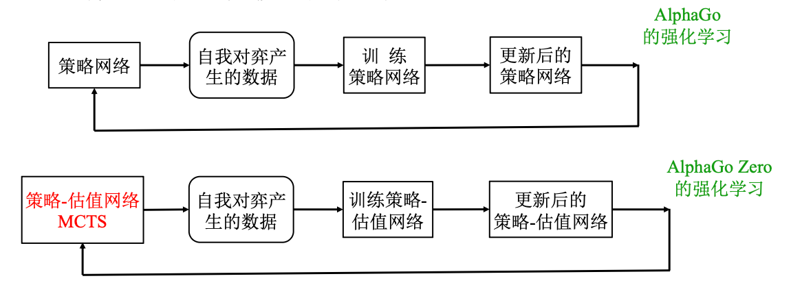
5. 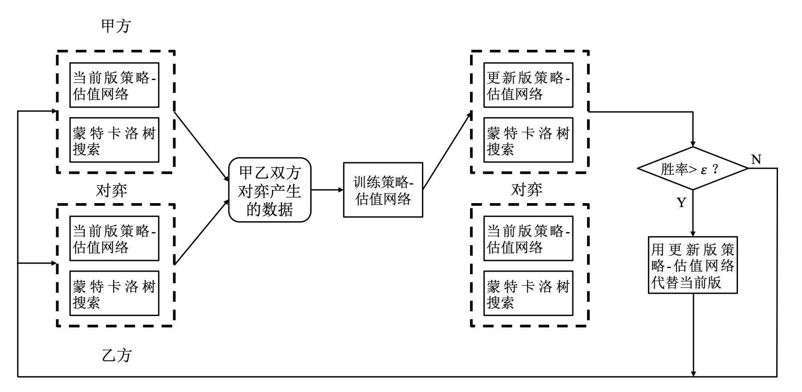
   - 解读MCTS和网络的交互关系（by Sonnet 4.6）
   - **图的流程解读**：左边甲乙双方各自用"当前版策略-估值网络+MCTS"来下棋，产生对弈数据。这些数据拿去训练，得到一个更新版的策略-估值网络。然后右边让更新版和当前版再对弈，如果更新版胜率超过阈值ε，就用更新版替换当前版，进入下一轮循环。
   - **为什么不是死循环**：关键在于这是一个**迭代自举**的过程，不需要同时准备好两者。第0轮：网络随机初始化，MCTS用这个很差的网络跑搜索，产生的π虽然质量很低，但仍然比随机策略强一点点（因为MCTS本身的搜索就有价值，哪怕网络很差）。用这些数据训练出第1版网络。第1轮：第1版网络比随机初始化稍好，MCTS配合它产生质量稍高一点的π，训练出第2版网络。如此循环，每一轮网络都比上一轮稍强，MCTS产生的数据质量也随之提高，形成正向螺旋。
   - **为什么MCTS的π比网络直接输出的p更好**：这是整个循环能收敛的核心原因。网络直接输出p是一步预测，而MCTS用p跑了大量模拟之后统计出的π是经过深度搜索的结果，相当于网络"想了很久"之后的答案。π天然比p更准确，用更准确的π来监督训练p，p就会越来越接近π的质量，然后配合MCTS又能产生更好的π，循环上升。
6. （补充）AlphaGo和AlphaGoZero
   1. **原版AlphaGo**：网络训练和MCTS是两个相对独立的阶段。先用人类棋谱预训练策略网络，再用自我博弈强化学习训练策略网络和估值网络，监督信号来自实际走棋（策略）/实际的胜负值（估值），训练完之后网络参数固定。比赛时MCTS调用这些固定的网络来辅助搜索，但MCTS的搜索结果本身不会反过来更新网络。训练和推理是分开的两个阶段。
   2. **AlphaGo Zero**：训练和搜索是持续联动的循环。MCTS的搜索结果π作为监督信号训练网络，更新后的网络又用来跑更好的MCTS，产生更好的π，再训练网络。训练从未真正"结束"，网络在自我博弈中持续进化。

## 第四章 统计机器学习
### 1. SVM
1. 学习目标：学一个间隔最大化的分类超平面$w^*x+b^*=0$，从而得到决策函数$f(x)=\text{sgn}(w^*x+b^*)$
2. 函数间隔与几何间隔
   1. 函数间隔：超平面和样本点的函数间隔为$\hat{\gamma}_i=y_i(w\cdot x_i + b)$，超平面和训练集的函数间隔为$\hat{\gamma}=\min_i\hat{\gamma}_i$
   2. 几何间隔：超平面和样本点的几何间隔为$\gamma_i=y_i(\frac{w}{\Vert w \Vert}\cdot x_i + \frac{b}{\Vert w \Vert})$，超平面和训练集的几何间隔为$\gamma=\min_i\gamma_i$
   3. $几何间隔\gamma=函数间隔\hat{\gamma}/\Vert w\Vert$
3. 推导过程
> 1. 希望几何间隔最大化：
> $$\max_{w,b}\gamma \space \space s.t. \space y_i(\frac{w}{\Vert w \Vert}\cdot x_i + \frac{b}{\Vert w \Vert})\geq\gamma$$
> 2. 由于可缩放，取$\gamma\Vert w\Vert=1$，于是问题转化为：
> $$\min_{w,b}\frac{1}{2}\Vert w \Vert^2 \space \space s.t. \space y_i(w\cdot x_i + b)\geq1$$
> 3. 让等号成立的点称为支持向量
> 4. 于是构造 
> $$L(w,b,\alpha)=\frac{1}{2}\Vert w \Vert^2 + \sum_i^N\alpha_i[1-y_i(w\cdot x_i+b)]$$
> 5. 求解
> $$\min_{w,b}\max_{\alpha}L(w,b,\alpha)$$
> 6. 转化为对偶问题
> $$\max_{\alpha}\min_{w,b}L(w,b,\alpha)$$
> 7. 求偏导
> $$\frac{\partial}{\partial b}L=0$$
> $$\frac{\partial}{\partial w}L=0$$
> 8. 对偶问题被化为
> $$\min_{\alpha}\big(\frac{1}{2}\sum_i^N\sum_j^N\alpha_i\alpha_jy_iy_j(x_i\cdot x_j)-\sum_i^N\alpha_i\big)\space \space s.t. \space \sum_i^N\alpha_iy_i=0, \alpha_i\geq 0$$
> 9.  再通过$\frac{\partial}{\partial b}L=0$和$\frac{\partial}{\partial w}L=0$可求得
> $$w^*=\sum_i^N \alpha_i^*y_ix_i$$
> $$b^*=y_j-\sum_i^N \alpha_i^*y_i(x_i\cdot x_j)$$
> 与$\alpha_i>0$对应的实例$x_i$为支持向量
4. 为了解决线性不可分问题，新的推导过程：
> 1. 引入松弛变量，约束变为
> $$y_i(w\cdot x_i + b)\geq1-\xi_i$$
> 2. 于是新的求解目标成为
> $$\min_{w,b,\xi}\big(\frac{1}{2}\Vert w \Vert^2+C\sum_i^N\xi_i\big)$$
> $C>0$为惩罚参数，惩罚误分类，调和间隔大和误分类少的tradeoff
> 
> 3. 求解过程略去，最终结果等同为：
> $$\min_{\alpha}\big(\frac{1}{2}\sum_i^N\sum_j^N\alpha_i\alpha_jy_iy_j(x_i\cdot x_j)-\sum_i^N\alpha_i\big)\space \space s.t. \space \sum_i^N\alpha_iy_i=0, 0\leq \alpha_i\leq C$$
> $$w^*=\sum_i^N \alpha_i^*y_ix_i$$
> $$b^*=y_j-\sum_i^N \alpha_i^*y_i(x_i\cdot x_j)$$
> 4. 此时，$\alpha_i>0$对应的$x_i$为支持向量，进一步分类：
> 
> 若$\alpha_i<C$，则$\xi_i=0$，恰好在分割边界上
> 
> 若$\alpha_i=C,0<\xi_i<1$，则落在分割边界和超平面之间正确的一侧
>
> 若$\alpha_i=C,\xi_i=1$，则落在超平面上
>
> 若$\alpha_i=C,\xi_i>1$，则落在误分一侧

5. 练习题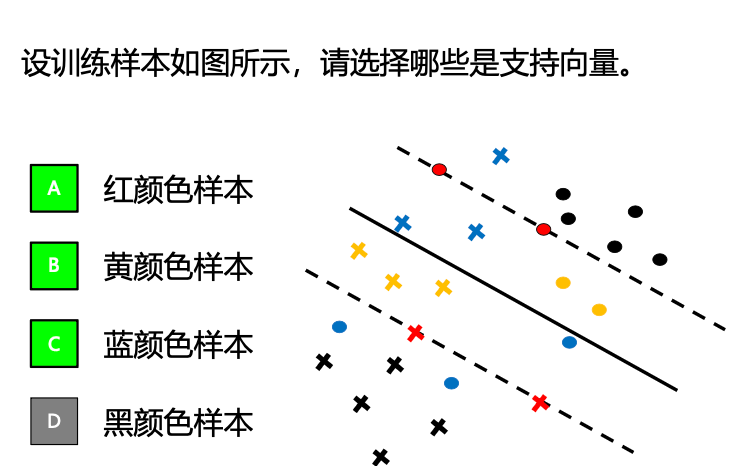

### 2. 非线性SVM
1. 寻找映射$\phi(x):\boldsymbol{X}\rightarrow\boldsymbol{H}$，把椭圆映射成直线，变成线性可分问题
2. 求解问题
> $$\min_{\alpha}\big(\frac{1}{2}\sum_i^N\sum_j^N\alpha_i\alpha_jy_iy_j(\phi(x_i)\cdot \phi(x_j))-\sum_i^N\alpha_i\big)\space \space s.t. \space \sum_i^N\alpha_iy_i=0, 0\leq \alpha_i\leq C$$
3. 核函数$K$满足$K(x,z)=\phi(x)\cdot \phi(z)$
    - 例：$K(x,z)=(x\cdot z)^2$，$\phi(x)$有多种方式，比如$\phi(x) = \left( (x^{(1)})^2, \sqrt{2}x^{(1)}x^{(2)}, (x^{(2)})^2 \right)^T$，再比如$\phi(x) = \left( (x^{(1)})^2, x^{(1)}x^{(2)}, x^{(1)}x^{(2)}, (x^{(2)})^2 \right)^T$，维度不一样
4. 问题的解为：
> $$\min_{\alpha}\big(\frac{1}{2}\sum_i^N\sum_j^N\alpha_i\alpha_jy_iy_jK(x_i,x_j)-\sum_i^N\alpha_i\big)\space \space s.t. \space \sum_i^N\alpha_iy_i=0, 0\leq \alpha_i\leq C$$
> $$w^*=\sum_i^N \alpha_i^*y_i\phi(x_i)$$
> $$b^*=y_j-\sum_i^N \alpha_i^*y_iK(x_i, x_j)$$
> 超平面：
> $$w^*\cdot\phi(x)+b^*=0$$
> 决策函数：
> $$f(x)=\text{sgn}\big(\sum_i^N \alpha_i^*y_iK(x_i,x)+b^*\big)$$
5. 常见的核函数
   1. 多项式核函数：$K(x,z)=(x\cdot z+1)^p$
   2. 高斯核函数：$K(x,z)=\exp\big(-\frac{\Vert x-z\Vert^2}{2\sigma^2}\big)$
   3. $\sigma$大欠拟合，$\sigma$小过拟合
6. 如何求多类问题？
   1. 一对多（$k$个分类器，每一个都是一类正其余类负，最后选最大的一个分类器）
   2. 一对一（$k(k-1)/2$个分类器任意两类SVM，分类时投票法）
   3. 层次法（先分两类，每类再分两类……）
7. 应用：文本分类
   1. 文本表达成向量$(w_{1j},w_{2j},\dots,w_{nj})^T$,$w_{ij}$表示词$i$在文档$j$中的权重
   2. tf权重：$tf_{ij}$表示第$i$个词在第$j$个文档的词频
   3. tf-idf权重：$df_i=出现词i的文档数/N$，$idf_i=\log(1/df_i)$，$w_{ij}=tf_{ij}idf_i$
### 3. 决策树
1. 按照**信息增益**选择特征
2. 一些公式：
   1. $X$的熵：$H(X)=\sum_i^np_i\log(p_i)$，其中$p_i=P(X=x_i)$，用训练集$D$估计的概率算出的熵记作$H(D)$
   2. 条件熵：$H(Y|X)=\sum_i^np_iH(Y|X=x_i)$
   3. 信息增益：$g(D,A)=H(D)-H(D|A)$
   4. $A$的$n$个取值将训练集$D$划分为$D_1,\dots,D_n$，$D$本身有$K$个类，$D_i$属于类$C_k$的样本记为$D_{ik}$
3. 信息增益计算：
   1. $$H(D) = -\sum_{k=1}^{K} \frac{|C_k|}{|D|} \log_2 \frac{|C_k|}{|D|}$$
   2. $$H(D|A) = \sum_{i=1}^{n} \frac{|D_i|}{|D|} H(D_i) = -\sum_{i=1}^{n} \frac{|D_i|}{|D|} \sum_{k=1}^{K} \frac{|D_{ik}|}{|D_i|} \log_2 \frac{|D_{ik}|}{|D_i|}$$
   3. $$g(D, A) = H(D) - H(D|A)$$
4. ID3算法：
   - 输入： 训练集 $D$，特征集 $A$，阈值 $\epsilon > 0$
   - 输出： 决策树 $T$
   - 1.若 $D$ 中所有实例属于同一类 $C_k$，则 $T$ 为单节点树，将 $C_k$ 作为该节点的类标记，返回 $T$
   - 2.若 $A$ 为空，则 $T$ 为单节点树，将 $D$ 中实例最多的类 $C_k$ 作为该节点的类标记，返回 $T$
   - 3.否则计算 $A$ 中各特征对 $D$ 的信息增益，选择信息增益最大的特征 $A_g$
   - 4.如果 $A_g$ 的信息增益小于阈值 $\epsilon$，则置 $T$ 为单节点树，将 $D$ 中实例最多的类 $C_k$ 作为该节点的类标记，返回 $T$
   - 5.否则对 $A_g$ 的每一可能值 $a_i$，依 $A_g = a_i$ 将 $D$ 分割为若干子集 $D_i$，作为 $D$ 的子节点
   - 6.对于 $D$ 的每个子节点 $D_i$，如果 $D_i$ 为空，则将 $D$ 中实例最多的类作为标记，构建子节点
   - 7.否则以 $D_i$ 为训练集，以 $A - \{A_g\}$ 为特征集，递归地调用步1~步6，得到子树 $T_i$，返回 $T_i$
   - 例子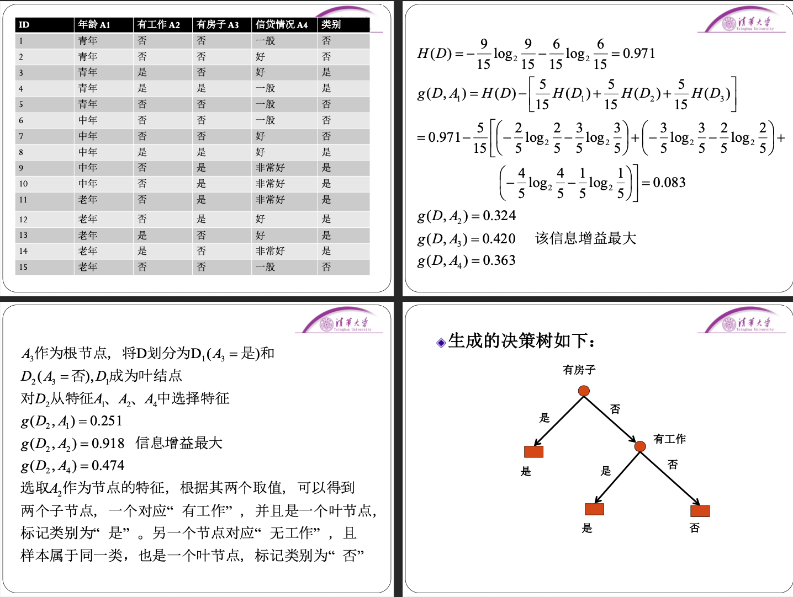
   - 练习题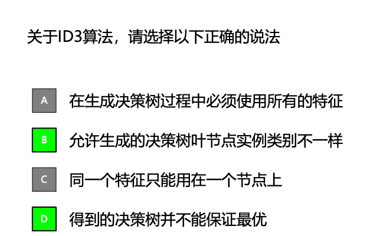
5. C4.5算法：
   1. ID3问题在于信息增益倾向于选择分枝比较多的属性
   2. 定义信息增益比来划分：$g_R(D,A)=\frac{H(D)-H(D|A)}{H_A(D)}$，其中$H_A(D)=-\sum_k^n\frac{|D_k|}{|D|}\log_2\frac{|D_k|}{|D|}$
   3. 其他和ID3基本一样，还增加了连续值的处理
   4. 信息增益比倾向于分割不均匀的特征，可能考虑先选$n$个信息增益大的特征，再从中选信息增益比大的特征
6. 决策树剪枝：防止过拟合
   1. 用训练集训练得到决策树，从下向上逐步剪枝，在验证集上测试性能，直到性能下降为止，最后在测试集上的性能作为系统的性能
   2. 树 $T$ 的叶节点个数为 $|T|$，$t$ 是树 $T$ 的叶节点，该叶节点有 $N_t$ 个样本，其中 $k$ 类的样本点有 $N_{tk}$ 个（$k=1, 2, \dots, K$），$H_t(T)$ 为叶节点 $t$ 上的经验熵，$\alpha \ge 0$ 为参数
   3. $$H_t(T) = -\sum_{k} \frac{N_{tk}}{N_t} \log \frac{N_{tk}}{N_t}$$
   4. $$C(T) = \sum_{i=1}^{|T|} N_t H_t(T) = -\sum_{t=1}^{|T|} \sum_{k=1}^{K} N_{tk} \log \frac{N_{tk}}{N_t}$$
   5. $$C_{\alpha}(T) = C(T) + \alpha |T|$$
   6. $C(T)$表示模型对训练数据的**预测误差**（拟合程度），$|T|$ 表示模型的**复杂程度**（叶节点越多，树越复杂），$\alpha$ 控制两者之间的平衡。**剪枝，就是当 $\alpha$ 确定时，选择损失函数最小的模型。**
   7. 算法步骤：①计算每个节点的经验熵　②递归地从树的叶节点向上回缩：
如果回缩后的损失函数**小于等于**回缩前，则进行**剪枝**，将父节点变为新的叶节点  ③返回步 (2)，直至不能继续为止，得到损失函数最小的子树 $T_{\alpha}$
   8. 练习题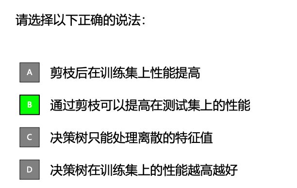
7. 随机森林：多个决策树组成的分类器，通过投票机制改善决策树
