## 《计算机系统概论》期末复习资料
刘青乐，计48

### 一、整数和浮点数的编码
#### （一）预备知识
1. 单位：
   - 1 Byte = 8 bits
   - 1 Word = 2 Bytes (X86架构，若RISC-V架构则为4 Bytes)
   - 1 KB = 1024 Bytes = 2^10 Bytes
   - 1 MB = 1024 KB = 2^20 Bytes
   - 1 GB = 1024 MB = 2^30 Bytes
   - 1 TB = 1024 GB = 2^40 Bytes
   - 1 PB = 1024 TB = 2^50 Bytes
   - 1 EB = 1024 PB = 2^60 Bytes
   - 1 ZB = 1024 EB = 2^70 Bytes
   - 1 YB = 1024 ZB = 2^80 Bytes
2. 机器字：
   - 字是计算机中最小的可寻址单位，即**数据地址长度**
   - 通常分为 32 位和 64 位
   - 32 位字长即可以表示$2^{32}$个Byte，即4GB
   - x86-64 架构为 64 位，实际支持 48 位地址，即256TB
3. 字节序：
   - 大端字节序（Big Endian）：低位存在高地址，如0x12345678的存储为0x12 0x34 0x56 0x78
   - 小端字节序（Little Endian）：高位存在高地址，X86、RISC-V都采用小端序。如0x12345678的存储为0x78 0x56 0x34 0x12
#### （二）整数表示
1. 整数表示：
   
|     | x86-32 | x86-64 |
|:-----:|:--------:|:--------:|
|char | 1      | 1      |
|short| 2      | 2      |
|int  | 4      | 4      |
|long | 4      | 8      |
|long long| 8      | 8      |
|float| 4      | 4      |
|double| 8      | 8      |
|long double| 10/12  | 10/16  |
|pointer| 4      | 8      |
2. 整数的二进制编码：

|       | 无符号整数（unsigned） | 带符号整数（signed） |
|:-------:|:-----------:|:-----------:|
|首位| 正常位 | 符号位（负数为1，非负数为0）|
|编码方式| 原码 | 补码*|
|计算公式|$B2U(X)=\Sigma_{i=0}^{w-1}x_i 2^i$ | $B2T(X)=-x_{w-1}2^{w-1}+\Sigma_{i=0}^{w-2}x_i 2^i$ |
|表示的最小数| $U_{min}=0$，二进制为$000...0$  | $T_{min}=-2^{w-1}$，二进制为$100...0$ |
|表示的最大数| $U_{max}=2^w-1$，二进制为$111...1$ | $T_{max}=2^{w-1}-1$，二进制为$011...1$ |
|表示范围| $[0,2^w)$ | $[-2^{w-1},2^{w-1})$ |

- 二者关系：$
u x =
\begin{cases}
x, & x \ge 0 \\
x + 2^{w}, & x < 0
\end{cases}
$
  该公式直观理解：0开头的编码不变，1开头的编码从$[-2^{w-1},0)$平移到$[2^{w-1},2^w)$
- tips：$-1$在补码表示中为$111...1$，对应无符号中的最大数$2^w-1$
- 注*：**非负数的补码编码 = 原码**，**负数的补码编码 = 其绝对值按位取反（即反码） + 1**；但对于正数和负数都有公式：相反数$-x=\sim x+1$（除$T_{min}$）。
3. 无符号数与带符号数**比较大小**：把带符号数转为无符号数再做比较。例：

| 数1     | 数2         | 比较大小 | 处理方式 |
| :-------------: | :-----------------: | :----: | :-----------: |
| 0             | 0U                | ==   | unsigned    |
| -1            | 0                 | <    | signed      |
| -1            | 0U                | >    | unsigned    |
| 2147483647    | -2147483647-1     | >    | signed      |
| 2147483647U   | -2147483647-1     | <    | unsigned    |
| -1            | -2                | >    | signed      |
| (unsigned) -1 | -2                | >    | unsigned    |
| 2147483647    | 2147483648U       | <    | unsigned    |
| 2147483647    | (int) 2147483648U | >    | signed      |

4. 加减法计算：
    - 补码的优点：用无符号数加法统一带符号数的加减运算
    - 补码加减直接对应二进制的加减
    - 发生溢出时放弃进位即可
    - **减法计算的技巧（常考）**$X-Y$：
      - **法①**把$Y$按位取反再+1得到其相反数，再做加法（利用$-x=\sim x+1$公式）
      - **法②**$X,Y$都转换成十进制做减法再转回`bin`/`hex`
5. 除法计算（与右移的关系）
   - **逻辑右移（shr）**：将操作数的每一位向右移动指定的位数，缺位补0
   - **算术右移（sar）**：将操作数的每一位向右移动指定的位数，缺位补符号位
   - **无符号整数除以$2^k$** ：等价于逻辑右移k位
     - $u/2^k = u\gg k = \lfloor u/2^k \rfloor$
   - **带符号整数除以$2^k$** ：直接算术右移会向下舍入，为了保证向$0$舍入，分类讨论：
     - $t\ge 0$时，$t/2^k = t\gg k =\lfloor t/2^k \rfloor $
     - $t< 0$时，$t/2^k = (t+2^k-1)\gg k = \lfloor(t+2^k-1)/2^k\rfloor$，（引入偏移量$(2^k - 1)$）
6. 一些极端的例子（$x,y$表示32位带符号整数，$ux,uy$表示对应的无符号整数）

| 命题 | 正误 | 反例 |
| ---- | :---: | ---- |
| $$x<0 \Rightarrow (x\cdot 2)<0$$        | X   | $x=T_{\min}$，乘2溢出|
| $$ux \Rightarrow ux\ge 0$$              | O   ||
| $$(x\ \\&\  7)=7 \Rightarrow (x\ll 30)<0$$ | O   ||
| $$ux \Rightarrow ux>-1$$                | X   | 恒错，$-1$会被转换成$U_{max}=2^{32}-1$|
| $$x>y \Rightarrow -x<-y$$               | X   | $x=0,y=T_{\min}$（特殊：$T_{min}$的相反数仍为$T_{min}$）|
| $$x>0且y>0 \Rightarrow x+y>0$$   | X   | $x=T_{\max},y=1$，相加溢出|
| $$x\ge 0 \Rightarrow -x\le 0$$          | O   ||
| $$x\le 0 \Rightarrow -x\ge 0$$          | X   | $x=T_{\min}$，$T_{min}$的相反数仍为$T_{min}$|
| $$((x\mid -x)\gg 31)=-1$$               | X   | $x=0$                                                |
| $$(ux\gg 3)=ux/8$$                      | O   ||
| $$(x\gg 3)=x/8$$                        | X   |负数，左侧向下取整，右侧向$0$取整|
| $$x\ \\&\ (x-1)\ne 0$$                    | X   |任意 $x=2^k$|

#### （三）浮点数表示
1.  浮点数的表示：$(-1)^s\times M\times 2^E$

||s(符号位)|exp(e，用以计算阶码E)|frac(f，用以计算尾数M)|
|:-:|:-:|:----------:|:---------:|
|float(32bit)|1bit|8bit|23bit|
|doublt(64bit)|1bit|11bit|52bit|

2. 浮点数的分类和计算规则

| 分类 | 分类依据 | 由$exp(e)$计算$E$ | 由$f$计算$M$ |
|--|--|--|--|
|规格化浮点数| exp不是全0也不是全1（没那么小也没那么大）| $E=e-Bias$（Bias的定义见表下注）| $M=1+f$（隐含的以1开头，获得了额外1个精度位）|
|非规格化浮点数| exp全0（非常小）| $E=1-Bias$ | $M=f$（不含隐含的开头的1，否则无法表示数值0）|
|特殊值| exp全1（无穷大或NaN） |  | $f$全是0表示无穷大，否则为NaN |

注：$Bias = 2^{k-1}-1$，其中$k$为阶码位宽，对于float为$8$，对于double为$11$。因此，float的$Bias$为$127$，使得指数$E$可以表示$[-126,+127]$；double的$Bias$为$1023$，使得指数$E$可以表示$[-1022,+1023]$.

3. 简化版8位浮点数示例（*CSAPP pp.80*）
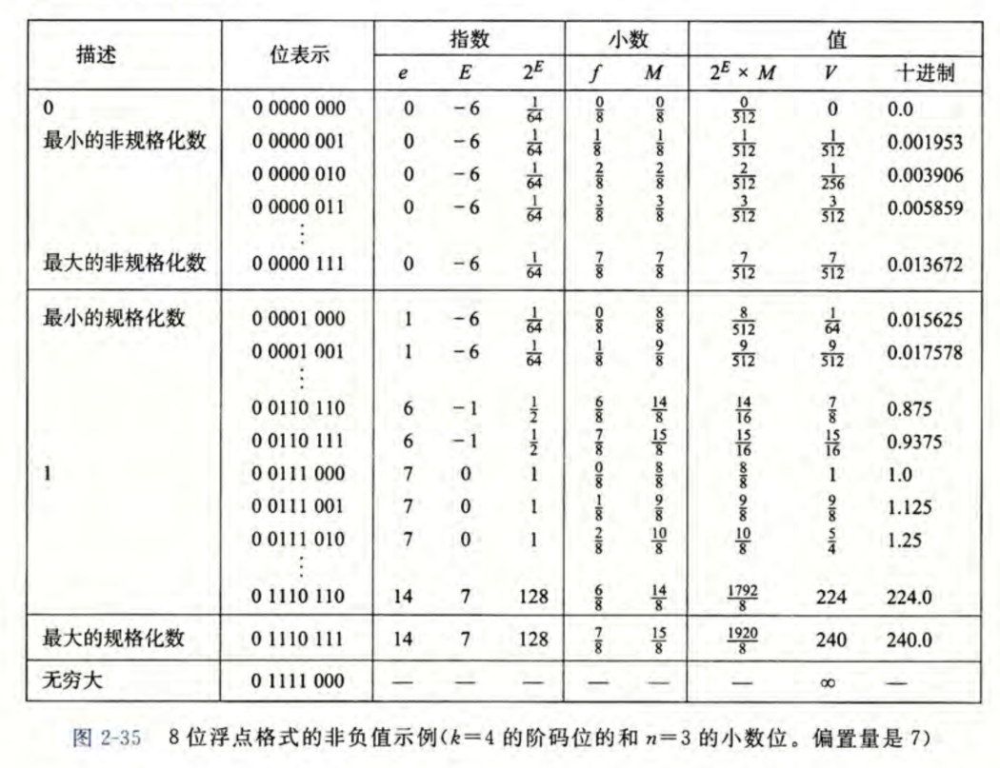

4. 二级结论：float和double
   
|   | float | double |
|:-:|:-----:|:------:|
|e|8bit|11bit|
|f|23bit|52bit|
|Bias|127|1023|
|E|$[-126,+127]$|$[-1022,+1023]$|
|**最小的非规格化数**|$2^{-126}\times \frac{1}{2^{23}}=\frac{1}{2^{149}}$|$2^{-1022}\times \frac{1}{2^{52}}=\frac{1}{2^{1074}}$|
|最大的非规格化数|$2^{-126}\times \frac{2^{23}-1}{2^{23}}=\frac{2^{23}-1}{2^{149}}$|$2^{-1022}\times \frac{2^{52}-1}{2^{52}}=\frac{2^{52}-1}{2^{1074}}$|
|最小的规格化数|$2^{-126}\times 1=\frac{1}{2^{126}}$|$2^{-1022}\times 1=\frac{1}{2^{1022}}$|
|**最大的规格化数**|$2^{127}\times (1+\frac{2^{23}-1}{2^{23}})=2^{128}-2^{104}$|$2^{1023}\times (1+\frac{2^{52}-1}{2^{52}})=2^{1024}-2^{972}$|

5. 舍入规则
   - 向0舍入
   - 向下舍入
   - 向上舍入
   - **向偶数舍入（默认方式，避免统计误差）**：x.5的情况向偶数舍入，如1.5->2，2.5->2，-1.5->-2，-2.5->-2；其他情况四舍六入
6. 向偶数舍入规则：**二进制的尾数原小数点后$(a+b)$位，要求保留到小数点后$a$位**，分类讨论：
   - 若后$b$位小于$1/2$，舍去，不进位
   - 若后$b$位等于$1/2$：
     - 若$a$的最后一位是$0$，舍去，不进位
     - 若$a$的最后一位是$1$，向前进位
   - 若后$b$位大于$1/2$，向前进位
   - 例：$7$位舍入到$3$位，见下表

|原尾数|适用规则|舍入后尾数|
|-----|--------|---------|
|1.111 0100 | 后$4$位小于$1/2$，舍去，不进位 | 1.111 |
|1.000 1000 | 后$4$位等于$1/2$，前$3$位最后一位是$0$，舍去，不进位 | 1.000 |
|1.011 1000 | 后$4$位等于$1/2$，前$3$位最后一位是$1$，向前进位 | 1.100 |
|1.000 1010 | 后$4$位大于$1/2$，向前进位 | 1.001 |

7. 浮点数转换
   - double/float到int：尾数部分截断
   - int到double：精确转换
   - int到float：可能舍入
8. 一些命题的判断

|                 命题               | 正误 |    反例                      |
| :--------------------------------: | :-: | :------------------------------------------: |
|      $$x == (int)(float)x$$      |  X  | $LHS = (1\ll 30) + 1$，$RHS =1\ll 30$  |
|      $$x == (int)(double)x$$     |  O  ||
|     $$f == (float)(double)f$$    |  O  ||
|         $$d == (float)d$$        |  X  |   $d=0.3$ |
|           $$f == -(-f)$$           |  O  |                                            |
|          $$2/3 == 2/3.0$$          |  X  |  $2/3=0$，$2/3.0\approx 0.6667$ |
| $$d<0.0 \Rightarrow d\cdot 2<0.0$$ |  O  ||
|      $$d>f \Rightarrow -f>-d$$     |  O  ||
|        $$d\cdot d \ge 0.0$$        |  O  ||
|          $$(d+f)-d == f$$          |  X  | $d=1\ll 30$，$f=0.1$ |

### 二、汇编语言
#### （一）预备知识
1. 层级图
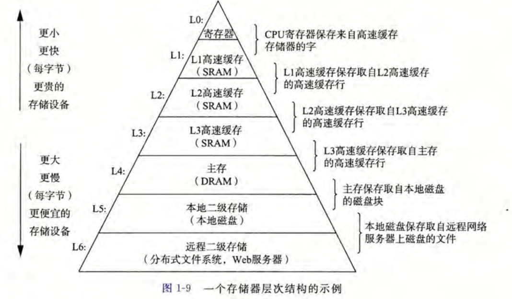

2. 寄存器与内存
**寄存器**：CPU内部、访问快、无地址
**内存**：CPU外部、访问慢、有地址

3. 汇编语言后缀名

|suffix|meaning|size|
|-|-|-|
|B|BYTE|1Byte|
|W|WORD|2Byte|
|L|LONG|4Byte|
|Q|QUADWORD|8Byte|

4. x86-64的16个64位通用寄存器：
`%rax` `%rdx` `%rcx` `%rbx`  `%rsi` `%rdi` `%rsp` `%rbp` `%r8` `%r9` `%r10` `%r11` `%r12` `%r13` `%r14` `%r15`
它们的后32位被称为：
`%eax` `%edx` `%ecx` `%ebx`  `%esi` `%edi` `%esp` `%ebp` `%r8d` `%r9d` `%r10d` `%r11d` `%r12d` `%r13d` `%r14d` `%r15d`
其中，`%eax` `%edx` `%ecx` `%ebx`的后16位被称为：`%ax` `%dx` `%cx` `%bx`，
而`%ax` `%dx` `%cx` `%bx`的前8位、后8位又被称为`%ah` `%al`、`%dh` `%dl`、`%ch` `%cl`、`%bh` `%bl`
*p.s. 这也意味着，对于long，一般用*`???q`*指令搭配*`%r??`*寄存器；对于int，一般用*`???l`*指令搭配*`%e??`*寄存器*

5. 操作数分为**立即数**（如`$0x400`）、**寄存器**（如`%rax`）、**内存**（如`(%rax)` ）*p.s.加括号相当于指针解引用*
6. **相对寻址**：
$$(R)\rightarrow Mem[Reg[R]]$$
$$D(R)\rightarrow Mem[Reg[R]+D]$$
$$D(Rb, Ri, S) \rightarrow Mem[Reg[Rb]+S*Reg[Ri]+D]$$
上式中，不出现$S$默认$S=1$；不出现$D$默认$D=0$
7. **前六个参数的寄存器顺序：**
**rdi rsi rdx rcx r8 r9**
8. 隐式设置的条件码：
   - CF 进位标志（有进位/借位则置1）
   - ZF 零标志（结果为0置1）
   - SF 符号标志（小于0置1）
   - OF 溢出标志（补码运算溢出：**正数的和为负**或**负数的和非负**）
#### （二）常见指令

##### 1. movq Src, Dst
```asmx86
movq $0x4, %rax    # tmp = 0x4;
movq $0x4, (%rax)  # *p = 0x4;
movq %rax, %rdx    # tmp2 = tmp1;
movq %rax, (%rdx)  # *p = tmp
movq (%rax), %rdx  # tmp3 = *p;
# 不存在 movq (%rax), (%rdx) 这类指令

movslq %eax, %rax  # %rax = sign-extend %eax  (sign long to quad)
movzlq %eax, %rax  # %rax = zero-extend %eax  (zero long to quad)
```
##### 2. leaq Src, Dst 地址计算指令
```asmx86
leaq (%rdi, %rsi, 2), %rax  # %rax = %rdi + 2*%rsi
```
可以用来算地址，当然也可以用于整数计算（寄存器里存的是地址就算地址，存的是整数就算整数）

##### 3. 整数计算指令
```asmx86
addq src dest     # dest = dest + src
subq src dest     # dest = dest - src
imulq src dest    # dest = dest * src
salq imm dest     # dest = dest << imm
sarq imm dest     # dest = dest >> imm 算术右移
shrq imm dest     # dest = dest >> imm 逻辑右移
xorq src dest     # dest = dest ^ src
andq src dest     # dest = dest & src
orq src dest      # dest = dest | src
incq dest         # dest = dest + 1
decq dest         # dest = dest - 1
negq dest         # dest = -dest
notq dest         # dest = ~dest
```

##### 4. cmp 和 test
```
cmpq b, a   # 类似计算a-b，设置条件码CF ZF SF OF
testq b, a   # 类似计算a&b，设置条件码CF ZF，常用于自己和自己test判断是否为0
```
##### 5. setX Dst 读取条件码并存入目标字节寄存器

|setX |meaning |status code|
|:---:|:------:|:---------:|
|sete | equal  |  ZF       |
|setne| not equal| ~ZF       |
|sets | negative|  SF       |
|setns| not negative| ~SF      |
|**setg** | greater than(signed)| \~(SF^OF)&\~ZF |
|**setge**| greater than or equal(signed)|   \~(SF^OF)|
|**setl** | less than(signed)  |  **SF^OF**|
|**setle**| less than or equal(signed) |    (SF^OF)\|ZF|
|seta | above(unsigned)         |           \~CF&\~ZF|
|setb | below(unsigned)        |   CF |

- 中间四个不好理解，可以先理解`setl`，然后`setle`就好理解，然后`setge`和`setg`分别是`setl`和`setle`的逆命题
- 设置的Dst往往是字节，如`%al`，于是常搭配`movzbl %al, %eax`对目的寄存器进行零扩展
##### 6. jX 依据条件码跳转
|jX |meaning |status code|
|:---:|:------:|:---------:|
|jmp|unconditional||
|je | equal  |  ZF       |
|jne| not equal| ~ZF       |
|js | negative|  SF       |
|jns| not negative| ~SF      |
|jg | greater than(signed)| \~(SF^OF)&\~ZF |
|jge| greater than or equal(signed)|   \~(SF^OF)|
|jl | less than(signed)  |  SF^OF|
|jle| less than or equal(signed) |    (SF^OF)\|ZF|
|ja | above(unsigned)         |           \~CF&\~ZF|
|jb | below(unsigned)        |   CF |

#### （三）分支结构与循环结构（对应课件3.2 C语言2）
##### 1. 分支结构
```asmx86
    jX .L2
    # 分支1
    ret
.L2
    # 分支2
    ret
```
##### 2. do-while
```asmx86
.Loop
    # 循环结构
    jX .Loop
```
##### 3. while
```asmx86
    jmp .Test
.Loop:
    # 循环结构
.Test:
    jX .Loop
```
##### 4. for (Init + while + Update)
```asmx86
    # Init
    jmp .Test
.Loop:
    # 循环结构
    # Update
.Test:
    jX .Loop
```

##### 5. switch
假设x在%rdi中，switch(x)，x的值为不超过3的正整数
```asmx86
cmpq $3, %rdi
ja .L8             # 超过3，落入default
jmp *.L4(,%rdi,8)  # 间接跳转，跳转到.L4+8*x，跳转表每一表项8字节
```
这里的**间接跳转jmp \*.L4(,%rdi,8)**，表示跳转到 **.L4+%rdi\*8**
跳转表为：
```asmx86
.section .rodata
.align 8
.L4:
    .quad .L8 # x = 0, default
    .quad .L1 # x = 1
    .quad .L2 # x = 2
    .quad .L3 # x = 3
```
注意特别处理case中没有break的情况，需要继续执行下一个case
#### （四）函数调用（对应课件4 C语言3）
##### 0. 函数调用栈与重要寄存器
- %rbp：栈帧指针，存的是**内存地址**，指向当前栈帧的底部
- %rsp：栈顶指针，存的是**内存地址**，指向当前栈帧的顶部
- %rip：指令指针，存的是**指令地址**，指向下一条要执行的指令
##### 1. 压栈和弹栈
**pushq Src**：①从Src中取得操作数 ②%rsp -= 8 ③将操作数存入%rsp指向的位置
**popq Dst**：①读取%rsp指向的位置的操作数 ②%rsp += 8 ③将操作数存入Dst中
##### 2. 调用与返回
**call label**：将**返回地址**（call的下一条指令地址）压入栈，%rip跳转至label
**ret**：从栈中弹出返回地址，%rip跳转至该地址
##### 3. 栈帧
结构
```
高地址
+-----------------------+
|  caller 的更老栈内容   |
+-----------------------+
|  返回地址              |  <-- 8(%rbp)
+-----------------------+
|  保存的旧 %rbp         |  <-- %rbp
+-----------------------+
|  被保存的寄存器        |   <-- 第七个以后的参数，从右往左压入栈
+-----------------------+
|  局部变量              |
+-----------------------+
|  子函数参数            |
+-----------------------+
|  ...                  |
+-----------------------+
|  栈顶(当前)            |  <-- %rsp
+-----------------------+
低地址
```
##### 4. 当foo调用bar时，到底发生了什么？
例如
```asmx86
400000 <foo>:
    ...
    400004: callq 400100<bar>   <- %rip
    400009: ...
400100 <bar>:
    400100: ...
    ...
    400109: retq
```
1. %rip指向0x400004，假设此时%rsp为0x40
2. 执行callq语句：0x400009被压入栈，%rsp -= 8，变为0x38，%rip跳转至0x400100
3. 在bar中通常会建立新栈帧，执行：
   1. push %rbp（这里体现出callee-saved原则）
   2. mov %rsp,%rbp
   3. sub $imm,%rsp
4. 执行bar中指令直至retq前，删除栈帧：
   1. add $imm,%rsp
   2. pop %rbp（这里体现出callee-saved原则）
5. 执行retq语句，返回地址0x400009被弹出栈，%rip跳转至0x400009，%rsp += 8恢复为0x40

##### 5. caller-saved vs callee-saved
- Caller-Saved: Caller 在调用子函数之前将这些寄存器内容保存在它的栈帧内，调用后恢复
    - 包括：%rax, %rcx, %rdx, %rsi, %rdi, %r8, %r9, %r10, %r11
- Callee-Saved: Callee 在使用这些寄存器之前将其原有内容保存在它的栈帧内，退出前恢复
    - 包括：%rbx, %rbp, %r12, %r13, %r14, %r15

##### 6. 递归
```asmx86
Recursive:
    # 递归基判断
    jX .L6

    pushq %rbx       # callee-saved
    ...              # 操作、传参
    callq Recursive  # 递归调用
    popq %rbx        # callee-saved
.L6
    ret
```

#### （五）数组与结构体（对应课件5 C语言4）
##### 1. 数组
- **一维数组**：`a[k]` 表示`*(a + k)`，也即`Mem[a + k*4]`. 若`a`存入`%rdi`，`k`存入`%rsi`，则`a[k]`可以用 **(%rdi, %rsi, 4)** 表示(int)
- **二维数组**：若R行C列，`a[i][j]` 表示`Mem[a + i*C*4 + j*4]`. 
  - 行向量：row[i]的地址为`a + i*C*4`，相隔加`4`
  - 列向量：col[j]的地址为`a + j*4`，相隔加`R*4`
- **多级数组**：`int *u[3] = {p1, p2, p3};`
  - `u[i][j]`表示`Mem[Mem[u+8*i] + j*4]`，至少进行两次内存读取

##### 2. 结构体
- 复习：1byte(char) 2bytes(short) 4bytes(int,float) 8bytes(long,double,pointer) 16bytes(long double)
- 对齐：结构的起始地址和结构长度必须是整数倍的K（对齐要求最高的元素字节数）
- 结构数组 node[i].data 表示 `Mem[node + i*sizeof(node) + offset(data)]`

##### 3. 联合
- union大小由最大的决定，各成员共享同一块内存，一次只能使用一个

##### 4. 几段难懂的汇编代码
- 课件5-P22，*对应CSAPP pp.182*，静态数组访问优化
```c
/* 从二维矩阵中取出一列（而非一行） */
void fix_column (fix_matrix a, int j, int *dest){
    int i;
    for (i = 0; i < N; i++)
        dest[i] = a[i][j];
}
```
```asmx86
fix_column:
    movslq      %esi, %rcx             # rcx = j
    salq        $2, %rcx               # rcx = j*4
    leaq        (%rdi,%rcx), %rax      # rax = a + 4*j
    leaq        1024(%rdi,%rcx),%rsi   # 结尾地址int4字节，一行16个，16行，4*16*16=1024
.L2:
    movl        (%rax), %ecx
    addq        $64, %rax              # rax前往下一列
    addq        $4, %rdx               # dest前往下一个数（下一次要写的位置，所以movl的是-4(%rdx)）
    movl        %ecx, -4(%rdx)
    cmpq        %rsi, %rax
    jne         .L2
    ret
```

- 课件5-P23，动态数组访问优化
```c
void var_column (int n, int a[n][n], int j, int *dest) {
    int i;
    for (i = 0; i < n; i++)
        dest[i] = a[i][j];
}
```
```asmx86
var_column:
    testl       %edi, %edi              # %edi代表n，根据%rdi&%rdi 设置ZF SF
    movslq      %edi, %r8               # r8 = n
    jle         .L1                     # n<=0就不执行了（数组size为负）

    movslq      %edx, %rdx              #rdx = j
    salq        $2, %r8                 # r8 = n*4，存放 “一行有多少字节”
    leaq        (%rsi,%rdx,4), %rax     # rax=a+4*j #&a[0][j] 起始位置
    leal        -1(%rdi), %edx          # rdx现在是n-1（未来会被覆盖）
    leaq        4(%rcx,%rdx,4),%rsi     # dest + 4*(n-1) + 4，rsi放入结束地址dest+4*n
.L3:
    movl        (%rax), %edx            # 读出来a[i][j]
    addq        $4, %rcx                # dest右移指向下一个需要写入的
    addq        %r8, %rax               # rax到下一行（根据前文的r8）
    movl        %edx, -4(%rcx)          # 把edx写入dest-4
    cmpq        %rsi, %rcx              # rsi是结束位置，比较可知是否该停止循环
    jne         .L3
.L1:
    ret
```
- 课件5-P38-39，结构体作为返回值和参数传递
```asmx86
# -----------------------------
# return_struct:
#   用“隐藏的第 1 参数”返回 struct：
#     rdi = 调用者传来的返回值存放地址（sret 指针）
#     esi = n（这里来自调用者）
#   同时会更新全局变量 i
# -----------------------------
return_struct:
    movq    %rdi, %rax             # rax = rdi（同时把“返回地址指针”作为返回值）
    movl    %esi,  0(%rdi)         # age = n
    movl    %esi,  4(%rdi)         # bye = n
    leal    (%rsi,%rsi), %edx      # edx = 2*n  （coo 是 2 倍）
    movl    %edx,  8(%rdi)         # coo = 2*n
    movl    %esi, 12(%rdi)         # ddd = n
    movl    %esi, 16(%rdi)         # eee = n
    addl    %edx, %esi             # esi = n + 2*n = 3*n
    movl    %esi, i(%rip)          # i = 3*n （全局变量 i，RIP 相对寻址）
    ret
# -----------------------------
# function1:
#   在栈上留出一块空间作为 struct 返回值缓冲区
#   然后把它的地址放到 rdi 作为“隐藏返回指针”，调用 return_struct
# -----------------------------
function1:
    subq    $32, %rsp              # rsp 下移，留出返回 struct 的空间（对齐等）
    movl    i(%rip), %esi          # esi = i （作为 n 传给 return_struct）
    movq    %rsp, %rdi             # rdi = 返回值缓冲区地址（隐藏返回指针）
    call    return_struct
    movl    $0, %eax               # function1 自己返回 0（而不是 struct）
    addq    $32, %rsp              # rsp 回去
    ret
```
```x86-64
# -----------------------------
# input_struct:
#   读取“按值传递的 struct 参数”里两个字段并做计算
#   这里 struct 参数是调用者放在栈上的：
#     age 位于  8(%rsp)
#     eee 位于 24(%rsp)
# -----------------------------
input_struct:
    movl    8(%rsp), %eax          # age
    addl    %eax, %eax             # eax = 2*age
    addl    24(%rsp), %eax         # + eee
    ret
# -----------------------------
# function2:
#   在自己的栈帧上构造一个 struct（age/bye/coo/ddd/eee）
#   然后把它“拷贝到 call 之后栈顶附近”，以满足 input_struct 的取参方式
# -----------------------------
function2:
    subq    $56, %rsp              # 分配 56 字节栈空间
    movl    i(%rip), %eax          # eax = i  （RIP 相对寻址的全局变量 i）
    movl    %eax, 24(%rsp)         # age
    movl    %eax, 28(%rsp)         # bye
    leal    (%rax,%rax), %edx      # edx = 2*i  （coo）
    movl    %edx, 32(%rsp)         # coo
    movl    %eax, 36(%rsp)         # ddd
    movl    %eax, 40(%rsp)         # eee
    
    # 拷贝构造“按值传参的 struct” ：把 rsp+24 ~ rsp+40 的内容搬到 rsp ~ rsp+16
    movq    24(%rsp), %rdx         # [age|bye]  两个 4B 字段合在 8B 搬
    movq    %rdx,  0(%rsp)         # 放到 rsp+0
    movq    32(%rsp), %rdx         # [coo|ddd]
    movq    %rdx,  8(%rsp)         # 放到 rsp+8
    movl    %eax, 16(%rsp)         # eee （最后一个 4B 字段）
    
    call    input_struct           # call 时 rsp 减 8，于是 input_struct 里的 age 在 8(%rsp)
    addq    $56, %rsp              # 释放栈空间
    ret
```
#### （六）缓冲区溢出（对应课件6.2 C语言6）
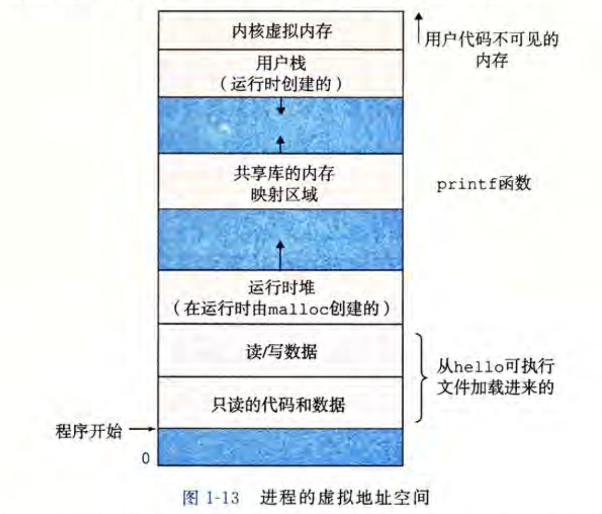
- 通过attacklab已经对此有了深刻的见解……

### 三、链接（课件6.1 C语言5；CSAPP Ch.7）
#### （一）静态链接
1. 静态链接的过程
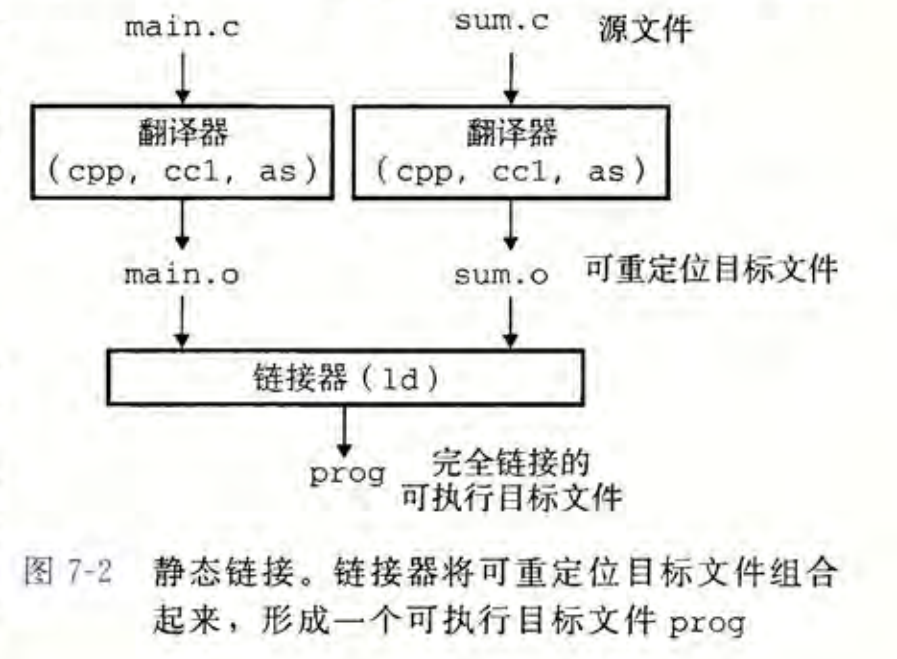
2. 静态链接时**链接器**对.o文件处理的两个主要目标：
   1. 符号解析：编译器已经把符号定义放在.o文件的符号表中，链接器负责把符号引用和符号定义关联起来
   2. 重定位：把多个文件的数据和代码段集中起来，把.o文件的符号定义解析为绝对地址，然后将符号引用更新为这些地址
3. 目标文件的分类：
   1. 可重定位目标文件 .o
   2. 可执行目标文件 prog
   3. 共享目标文件 .so（动态链接相关）
4. 可重定位目标文件的格式
   
| 项 | 内容 |
|-----|------|
| ELF header | 记录机器字长、字节序、文件类型（.o / exec / .so）、机器类型等 |
| Segment header table | 记录页大小、虚拟地址中的内存段、段大小等 |
| .text section | 代码 |
| .rodata section | 只读数据、跳转表等 |
| .data section | **已初始化的全局变量与静态 C 变量** |
| .bss section | **未初始化的静态变量**以及**初始化为0的全局/静态变量**,，这个节实际不占空间 |
| .symtab section | **符号表**，存放程序中定义和引用的函数和全局变量的信息 |
| .rel.text section | .text 的重定位信息：一个.text节中位置的列表，和其他文件组合时链接器修改这些位置 |
| .rel.data section | .data 的重定位信息： |
| .debug section | 调试信息 |
| .line | C源程序行号和.text机器指令之间的映射|
| .strtab | 字符串表|
| pseudosection | 伪节：ABS表示不被重定位的符号，UNDEF表示未定义的符号，COMMON表示**未初始化的全局变量** |
| Section header table | 节头部表（描述本目标文件的节） |


5. 链接符号
   1. 全局符号：某模块定义，可被其他模块引用的变量或函数
      - 非静态函数、非静态全局变量
   2. 外部符号：某模块引用的其他模块定义的全局符号
   3. 局部符号：某模块定义且仅该模块引用的符号
      - 静态函数、静态全局变量（≠局部变量）
6. 局部/全局变量 与 局部/全局符号的关系
    - 局部非静态变量——不在意（在.symtab中不出现）
    - 局部静态变量———局部符号（LOCAL）
    - 全局非静态变量——全局符号（GLOBAL）
    - 全局静态变量———局部符号（LOCAL）
7. **任务一：符号解析**
   1. 强符号：函数和已初始化的全局变量
   2. 弱符号：未初始化的全局变量
   3. 强弱符号的处理规则：
      - 若有多个强符号，链接器报错
      - 若有一个强符号和多个弱符号，选择强符号（对弱符号的引用被解析为强符号）
      - 若有多个弱符号，选择任意一个
   4. 静态库的出现：
      1. 如何打包常用函数？
        ①把整个函数库和自己的程序链接，但太浪费时间空间
        ②有针对地选择对应函数与自己程序链接，但是程序员操作太麻烦
        2. 设计出静态库：
        ①每个函数各自打包成.o，然后合并成一个归档文件.a 
        ②链接器在链接时从对应的归档文件.a 中提取需要的函数.o 文件
    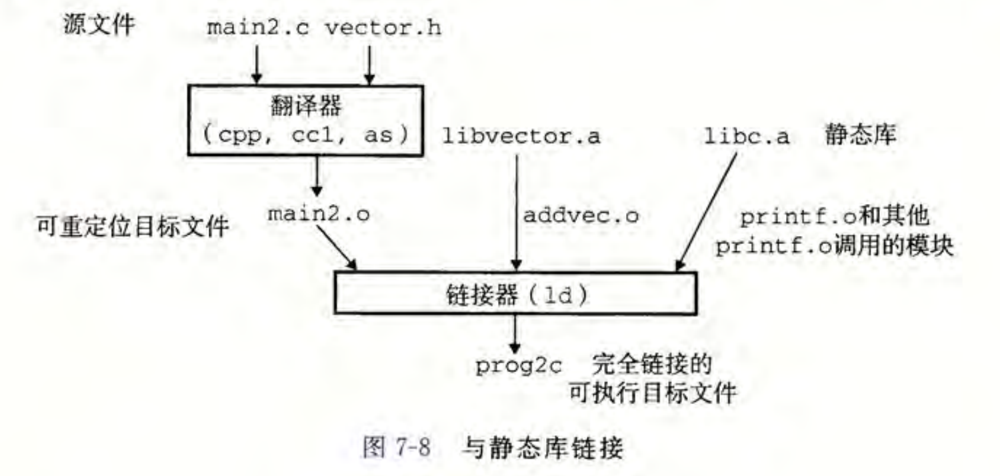
8. **任务二：重定位**
   1. 两步走
      1. 重定位节和符号定义：把所有相同类型的节合并为一个聚合节，然后将运行时内存地址赋给新的聚合节、输入模块定义的每个节和每个符号，从而程序每条指令和全局变量都有唯一的运行时内存地址
      2. 重定位节中的符号引用：修改.text节和.data节中每个符号的引用指向正确的运行时地址，有R_X86_64_PC32（相对寻址）和R_X86_64_32（绝对寻址）两种，伪代码为：*（该部分参见CSAPP pp. 478-480）*
        ```cpp
        if(r.type == R_X86_64_PC32){
            refaddr = ADDR(s) + r.offset;
            *refptr = (unsigned)(ADDR(r.symbol) + r.addend - refaddr);
        }
        /* 对相对寻址的注释：
        refaddr 是重定位所要修补的位置，由该函数起始位置 + 相对该函数偏移确定
        目前 %RIP = refaddr + suffixlength，希望 %RIP 跳到 dstaddr ，
        即 refaddr + suffixlength + offset = dstaddr，
        计算出 offset = dstaddr - suffixlength - refaddr，
        将 *refptr 设为 offset.
        这里 ADDR(r.symbol) 即 dstaddr ，r.addend 设为 suffixlength 的相反数
        */
        if(r.type == R_X86_64_32)
            *refptr = (unsigned)(ADDR(r.symbol) + r.addend);
        /* 对绝对寻址的注释：
        直接修改 *refptr 为 ADDR(r.symbol) + r.addend 即可，
        不再需要考察 refaddr.
        这里 r.addend 通常是 0 
        */
        ```
        
9.  各个元素何时确定地址？小结（课件6.1 P24）
   
| 对象 | 编译 | 链接（静态） | 说明 |
|:---|:---:|:---:|:---|
| 局部变量（非静态） | O |  | 存于栈内 or 寄存器 or 被优化掉 |
| 全局变量 |  | O | 各个模块（.o 文件）的数据段、代码段合并后，才能确定绝对地址 |
| 函数参数 | O |  | 通过指定的寄存器与栈传递 |
| 函数返回值 | O |  | %rax |
| 跳转指令（直接） | O |  | 相对于 PC 的 offset |
| 函数返回地址 | O |  | 存于栈顶 |
| 静态函数入口地址 | O |  | 相对于 PC 的 offset |
| 全局函数入口地址 |  | O | 各个模块（.o 文件）的数据段、代码段合并后，才能确定绝对地址 |


#### （二）动态链接
1. 静态链接库的缺点：
    1. 静态库需要定期维护和更新，要求程序员显式将程序和更新了的库链接
    2. 重复的函数（如标准I/O）会被复制到每一个使用了该函数的模块中，占用了额外的内存空间
2. 发明动态库（.so / .dll）：
    - 所有引用该库的可执行目标文件共享同一个so的代码和数据；内存上so的.text节被不同进程共享
    - 可以被装载入内存后再进行动态链接，即链接在**装载+运行**时完成
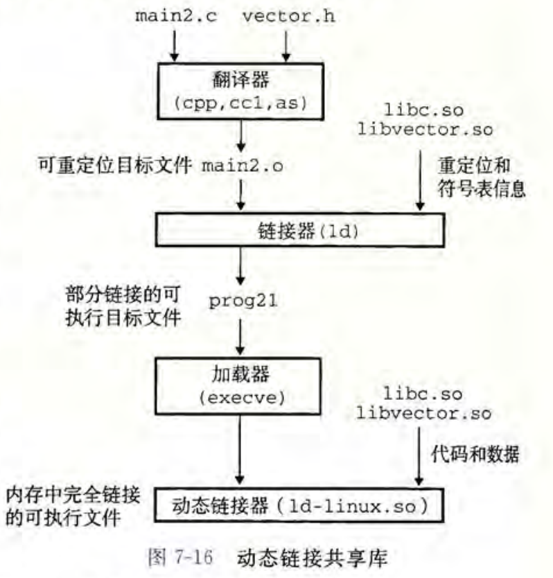

### 四、虚拟内存与内存分配（课件7与8；CSAPP Ch.9）
#### （一）虚拟内存
1. 虚拟内存是什么
   1. 一个概念（而非实体）：一个连续的地址空间，进程的数据、代码、运行栈、堆等存于其中
   2. 硬件异常、硬件地址翻译、主存、磁盘文件、内核软件的完美交互
   3. 把主存看成是一个存储在磁盘上的地址空间的高速缓存，高效使用了主存
   4. 为每个进程提供了一致的地址空间
   5. 保护每个进程的地址空间不被其他进程破坏
2. 虚拟寻址
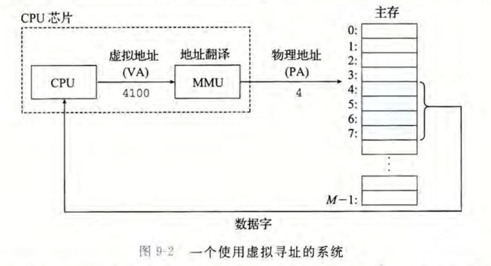
关键词：
- VA 虚拟地址
- MMU 内存管理单元
- PA 物理地址
3. 虚拟地址空间
- VAS 虚拟地址空间：$\{0,1,2,\dots , N-1\}$, $N=2^n$, $n=32,64$
- PAS 物理地址空间：$\{0,1,2,\dots , M-1\}$
- 虚拟内存可以视作存储在**硬盘**上的由N个连续字节构成的数组
- 硬盘上的内容按页被缓存在物理内存中，页被称为虚拟页（VP）和物理页（PP），大小为$P=2^p$
- 虚拟页分为：未分配的、未缓存的、缓存的
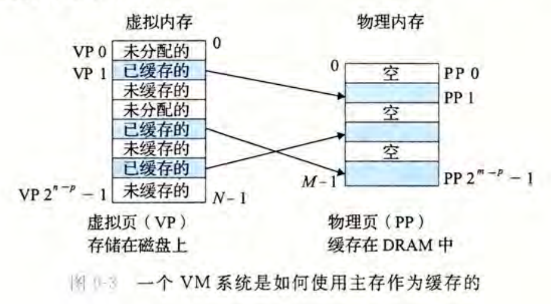
4. 页表（Page Table）
- 将虚拟页映射到物理页的页表项(page table entries, PTE)的数组，起到了映射虚拟地址到物理地址的作用
- 每一个进程拥有这样一个页表，存储于物理内存中
- 页表对于
  - 未分配的：valid=0，ptr=null
  - 未缓存的：valid=0，ptr指向硬盘上的页
  - 缓存的：  valid=1，ptr指向内存中的页
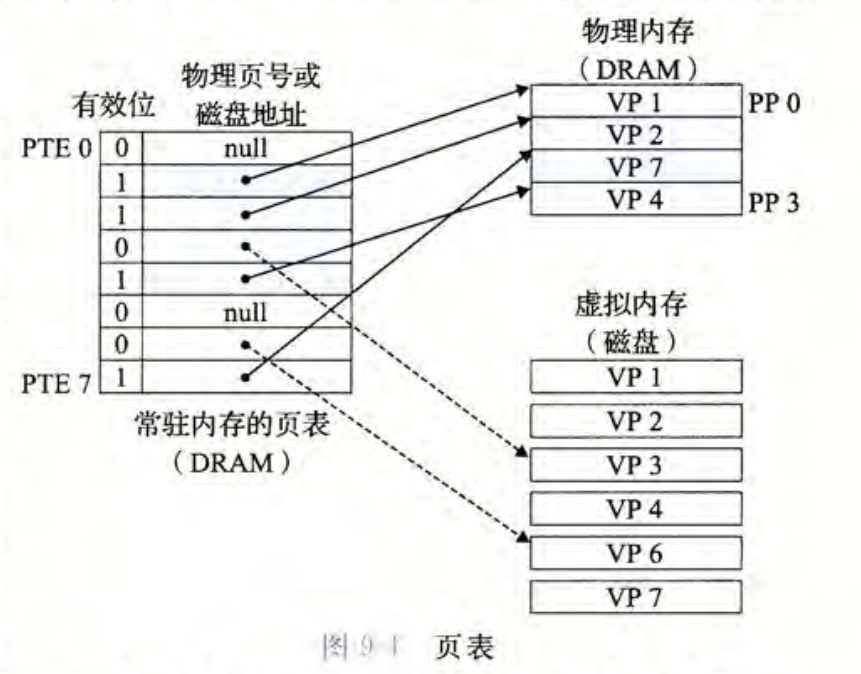
- 于是会出现：
  - 页命中：$PTE[x].valid=1$，访问对应物理内存
  - 页缺失：$PTE[x].valid=0$，触发缺页异常，选择内存中的一页替换成当前查找的页，修改对应PTE（李代桃僵），然后重新查找
5. 空间管理与保护
- 每一个进程都有其私有VAS
- 进程间代码与数据共享：存在多个不同进程的虚拟页映射到相同物理页的情况
- 保护：扩展PTE，增加权限位（SUP READ WRITE），违反触发SIGSEGV
6. 地址翻译
    1. $|VAS|=N=2^n$，$|PAS|=M=2^m$，$|Page|=P=2^p$
    2. $$虚拟地址VA(n位) = 虚拟页号VPN((n-p)位) + 虚拟页偏移量VPO(p位)$$
    3. $$物理地址PA(m位) = 物理页号PPN((m-p)位) + 物理页偏移量PPO(p位)$$
    4. **翻译过程**：根据$VA$的$VPN$选择$PTE[VPN]$，若$valid=1$（命中），该$PTE$的指针存的地址即为$PPN$，且$PPO=VPO$，$PA$构造完成；若不命中，处理缺页
    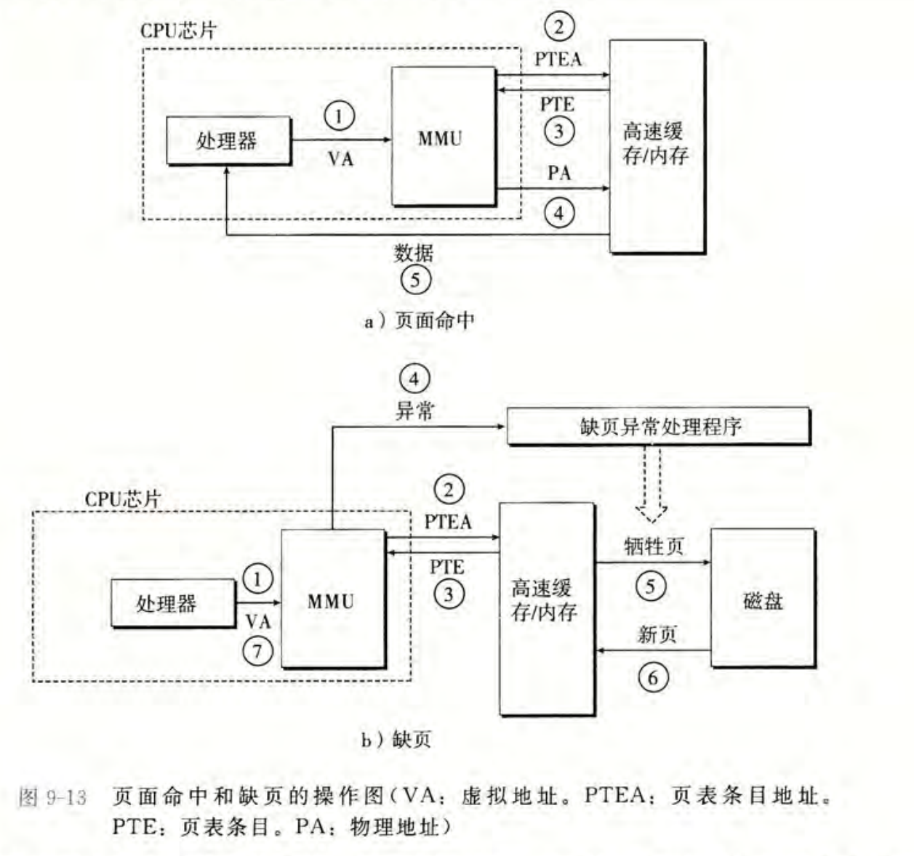
7. **TLB快表加速下的翻译过程**
   1. TLB（translation lookaside buffer）是一个小的虚拟寻址的缓存，将$VPN$映射为$PPN$，从而减少一次内存的访问
   2. $VPN$被分解成$(n-p-t)$位的$TLBT（TLB标记）$和$t$位的$TLBI（TLB索引）$，即$$虚拟地址VA(n位) = TLBT((n-p-t)位) + TLBI(t位) + 虚拟页偏移量VPO(p位)$$其中$t$的含义是TLB有$T=2^t$个组
   3. **翻译过程**：把$VA$解读成$TLBT$、$TLBI$和$VPO$，选择$TLB$中的第$TLBI$组中$TLBT$匹配的那一项，取出其$PPN$，再加上$PPO=VPO$，$PA$构造完成
   4. （本部分在课件中未出现，在CSAPP pp.575讲解了）然后去访问DRAM。DRAM共$2^{m-p}$个页，被组织成$2^{m-p-k}$组，每组有$2^k$块，所以把$t$位的$PPO$拆成$p-k$位的$CI$和$k$位的$CO$，$PA$被解读成$$物理地址PA(m位) = PPN/CT((m-p)位) + CI((p-k)位) + CO(k位)$$于是访问DRAM中$PPN/CT$位置的第$CI$组的第$CO$个块
   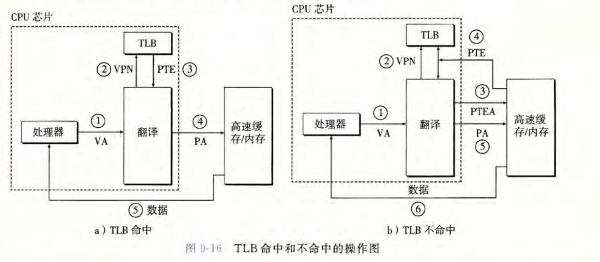
8. 公式总结
   1. $页表的项数 = 虚拟页数量 = 2^{n - p}$，因此$VPN位数 = n - p$
   2. $物理页数量 = 2^{m-p}$，因此$PPN位数 = m - p$
   3. $页表项大小 = 2^p$，因此$VPO位数 = PPO位数 = p$
   4. $VPN = (TLBT\ll t)\ | \ TLBI$，$TLBT位数 = n - p - t$，$TLBI位数 = t$
9. 内存映射
   1.  虚拟内存区域与磁盘上的对象关联起来，因此可以把程序和数据加载到内存中
   2.  共享对象：多个进程映射同一个共享对象，在物理内存中只存一份副本，进程共享同一块物理内存，如库函数、动态链接库等（这里的对象不是OOP中类和对象的对象），修改对所有进程可见
   3.  私有对象：多个进程映射同一个私有对象，标记为私有的写时复制区域，页表项标记为只读，只有当某一进程试图写入私有页时，才触发异常生成新的可读写页面（核心思想：延迟复制：等写的时候再复制一份）
#### （二）内存分配
- 通过malloclab已经对此有了深刻的见解……

### 五、异常控制流与信号（课件9.1与9.2；CSAPP Ch.8）

##### （一）异常控制流
1. 什么是控制流？
   控制流：程序计数器（PC）中指令地址的控制转移序列
2. 如何改变控制流？
   1. 无条件跳转jmp / 条件跳转jX
   2. 过程调用call / 返回ret
   3. 但是还需要对系统状态的变化做出反应，于是引入**异常控制流（ECF）**
3. 异常控制流包括
   1. （低层次）**异常**
   2. （高层次）进程上下文切换、信号量、非局部跳转（setjmp longjmp）

4. **异常**
   1. 将控制转移给操作系统以响应事件如`/0`、`页缺失`、`内存访问违例`、`断点`、`Ctrl+C`等
   2. 每种异常有对应异常号，异常表中存储异常k对应的处理程序的地址，异常表的起始地址是异常表基址寄存器（ETBR）
   3. 异常的分类
   
| 类别 | 原因 | 例子 | 同步/异步 | 返回行为 |
| ---- | --- | --- | :-: | --- |
| 中断 | 来自I/O设备的信号 | 按`Ctrl+C` | 异步 | 总是返回到下一条指令 |
| 陷阱 | 有意的异常 | 系统调用指令 | 同步 | 总是返回到下一条指令 |
| 故障 | 潜在可恢复的错误 | 页缺失 | 同步 | 可能返回到当前指令，或终止 |
| 终止 | 不可恢复的错误 | 无效的内存访问 | 同步 | 不会返回 |

5. **进程**
   1. 进程：程序的运行实例，$进程=控制流+虚存$
   2. 逻辑流：进程的连续的指令流
   3. 各个进程似乎独立占用CPU、独立使用主存，但实则由内核（Kernel）控制多进程之间的上下文切换
   4. 多个逻辑流互相重叠，称作并发
   5. 只有在异常触发时，才能从用户模式切换为内核模式
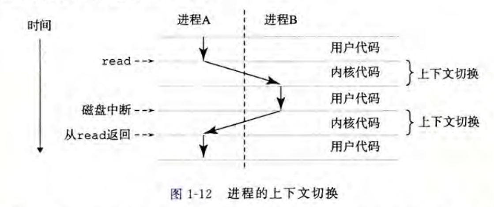
   6. 子进程终止后会处在“僵尸进程”状态，直到它的资源由父进程进行回收（reaping）才真正死亡。如果父进程在没有回收子进程资源的情况下结束，那么子进程将被init进程接管回收。
   7. 每个进程有一个进程号 pid ，属于一个进程组，进程组有一个进程组ID
---
##### 相关的C函数
###### O. pid与pgid
```c
getpid(); // 返回当前进程的进程ID
setpid(pid); // 设置当前进程的进程ID为pid
getpgrp(); // 返回当前进程组的进程组ID
setpgid(pid, pgid); // 设置进程pid的进程组ID为pgid
```
###### I. fork：用以创建新进程，父子进程并发进行
1. 原型：`pid_t fork(void);`
2. 子进程返回0，父进程返回子进程pid
3. 调用一次，返回两次
4. 有相同但是独立的地址空间，共享文件（背后的原理是：内核为新进程创建虚拟内存（原来的副本），两个进程页面都标记为只读，区域结构都标记为私有的写时复制）
```c
pid_t p = fork(); // p == 0说明在子进程，否则说明在父进程
```
###### II. exit：用于终止进程
   1. 原型：`void exit(int status);`
   2. 调用一次，返回零次
```c
exit(0); // 设置退出状态码为0，通常表示正常退出
exit(1); // 设置退出状态码为1
atexit(fun); // 注册一个函数fun，在进程退出时调用
```
###### III. wait：与子进程同步
1. 原型：`pid_t wait(int *status);`
2. 父进程挂起，直到一个子进程终止，并回收资源，避免僵尸进程
3. 若无子进程返回 -1，否则返回子进程 pid
4. status可为NULL，若非NULL则被设置成子进程的退出状态码
5. 配套宏（*CSAPP pp.517*）
    1. `WIFEXITED(status)`：是否正常 exit 返回
    2. `WEXITSTATUS(status)`：正常退出码（需先 WIFEXITED 为真）
    3. `WIFSIGNALED(status)`：是否被信号终止
    4. `WTERMSIG(status)`：终止它的信号编号（需先 WIFSIGNALED 为真）
    5. `WIFSTOPPED(status)`：是否停止   
    6. `WSTOPSIG(status)`：引起停止的信号编号（需先 WIFSTOPPED 为真）
    7. `WIFCONTINUED(status)`：是否收到SIGCONT信号重新启动
```c
int child_status;
if(fork() != 0){
    pid_t w = wait(&child_status);
    if(WIFEXITED(child_status))
        printf("PID=%d exited with exit_status=%d\n", w, WEXITSTATUS(child_status));
}
```
###### IV. waitpid：与子进程同步（进阶）
1. 原型`pid_t waitpid(pid_t pid, int *status, int options);`
2. pid的含义
    1. pid > 0：等待 PID 等于 pid 的那个子进程
    2. pid == -1：等待 任意一个子进程（等价于 wait）
    3. pid == 0：等待 其进程组 ID（PGID）等于调用者 PGID 的任意子进程
    4. pid < -1：等待 PGID 等于 -pid 的任意子进程
3. options 常见宏（*CSAPP pp.517*）
   1. `WNOHANG`：若等待集合任意子进程都没终止，立即返回0
   2. `WUNTRACED`：挂起调用进程，直到等待集合任意一个进程变成已终止或被停止
   3. `WCONTINUED`：挂起调用进程，直到等待集合任意一个正在运行的进程终止或等待集合中一个被停止的进程收到SIGCONT信号重新开始执行变成已继续运行
###### V. execve：加载并运行程序
1. 原型：`int execve(const char *filename, char *const argv[], char *const envp[]);`
2. 加载并运行可执行目标文件filename，带有参数列表argv和环境变量envp
3. 该函数不会返回
4. 保持进程号（pid）、打开的文件描述符和信号上下文不变
5. 背后的步骤涉及到链接、虚存的综合知识：（*CSAPP pp.585*）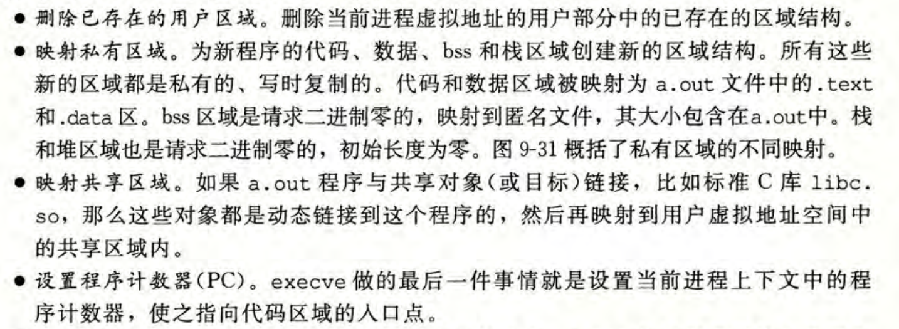
```c
char *const argv[] = {"ls", "-l", NULL};
char *const envp[] = {"PATH=/bin", "TERM=console", NULL};
execve("/bin/ls", argv, envp);

execl("/bin/ls", "ls", "-l", NULL); // 变式，把 argv 逐个写在参数里
```
---
##### （二）信号
1. 信号
   1. 动机：Shell程序可以正确等待回收前台任务，但是后台任务终止时会变成僵尸产生内存泄漏，需要引入“信号”机制提醒Shell
   2. 更高层的软件形式的异常，允许进程和内核中断其它进程
   3. 一条小消息用来通知进程系统中发生了一个某种类型的事件
2. Linux的30种信号

| 序号 | 名称 | 默认行为 | 相应事件 |
|---|---|---|---|
| 1 | SIGHUP | 终止 | 终端线挂断 |
| **2** | **SIGINT** | 终止 | **来自键盘的中断** |
| 3 | SIGQUIT | 终止 | 来自键盘的退出 |
| 4 | SIGILL | 终止 | 非法指令 |
| 5 | SIGTRAP | 终止并转储内存 | 跟踪陷阱 |
| 6 | SIGABRT | 终止并转储内存 | 来自 abort 函数的终止信号 |
| 7 | SIGBUS | 终止 | 总线错误 |
| 8 | SIGFPE | 终止并转储内存 | 浮点异常 |
| **9** | **SIGKILL** | 终止 | **杀死程序** |
| 10 | SIGUSR1 | 终止 | 用户定义的信号 1 |
| **11** | **SIGSEGV** | 终止并转储内存 | **无效的内存引用（段故障）** |
| 12 | SIGUSR2 | 终止 | 用户定义的信号 2 |
| 13 | SIGPIPE | 终止 | 向一个没有读用户的管道做写操作 |
| **14** | **SIGALRM** | 终止 | **来自 alarm 函数的定时器信号** |
| 15 | SIGTERM | 终止 | 软件终止信号 |
| 16 | SIGSTKFLT | 终止 | 协处理器上的栈故障 |
| **17** | **SIGCHLD** | 忽略 | **一个子进程停止或者终止** |
| 18 | SIGCONT | 忽略 | 继续进程如果该进程停止 |
| 19 | SIGSTOP | 停止直到下一个 SIGCONT | 不是来自终端的停止信号 |
| 20 | SIGTSTP | 停止直到下一个 SIGCONT | 来自终端的停止信号 |
| 21 | SIGTTIN | 停止直到下一个 SIGCONT | 后台进程从终端读 |
| 22 | SIGTTOU | 停止直到下一个 SIGCONT | 后台进程向终端写 |
| 23 | SIGURG | 忽略 | 套接字上的紧急情况 |
| 24 | SIGXCPU | 终止 | CPU 时间限制超出 |
| 25 | SIGXFSZ | 终止 | 文件大小限制超出 |
| 26 | SIGVTALRM | 终止 | 虚拟定时器期满 |
| 27 | SIGPROF | 终止 | 剖析定时器期满 |
| 28 | SIGWINCH | 忽略 | 窗口大小变化 |
| 29 | SIGIO | 终止 | 在某个描述符上可执行 I/O 操作 |
| 30 | SIGPWR | 终止 | 电源故障 |

3. **发送信号**：内核通过修改目标进程上下文的某些状态向目标进程发送信号
   1. 法1：`/bin/kill -<信号ID> <目标进程（组）>` 第二个参数为正数时表示进程，为负数时表示进程组
   2. 法2：从键盘发送信号：
      1.  `Ctrl + C`向前台进程组发送`SIGINT`信号：终止每个进程
      2.  `Ctrl + Z`向前台进程组发送`SIGTSTP`信号：停止（挂起）每个进程
   3. 法3：**调用 kill / alarm 函数**（*见后文"相关的c函数VI"*）
4. **接收信号**：目的进程被内核强迫以某种方式对信号做出反应，选择忽略、终止或执行信号处理程序
   1. 内核切回用户态时，检查违背阻塞的挂起信号的集合（`pending & ~ blocked`）
   2. 信号的默认行为：①进程终止 ②进程终止并转储内存 ③进程挂起直到被SIGCONT信号重启 ④忽略信号（同上表）
   3. SIGSTOP和SIGKILL的默认行为不可修改，其余信号的**默认行为可用 signal 函数修改**（*见后文"相关的c函数VII"*）
   4. 信号处理函数可能在任意时刻打断主程序，所以如果 handler 调用了不可重入的库函数（典型就是 printf / malloc 等），可能导致死锁/数据结构损坏/崩溃。POSIX 只保证117个函数是异步信号安全（async-signal-safe），其中 write 是安全的，printf 不是。
5. 挂起和阻塞信号
   1. 一个发出而没有被接收的信号叫挂起信号（pending signal）。任何时刻同类型只有一个挂起信号，后续的该类型信号会被丢弃（没有队列）
   2. 进程可以选择性阻塞接受信号（block）
   3. 内核在进程上下文中维护挂起和阻塞的位向量（pending / blocking）
---
##### 相关的C函数
###### VI. kill / alarm：发送信号
1. 原型：`int kill(pid_t pid, int sig);` 
2. 发送信号 sig 给进程 pid
3. pid的含义
    1. pid > 0：给 **指定 PID** 的进程发信号
    2. pid == 0：给 **调用者所在进程组的所有进程（包括自己）**发信号
    3. pid < -1：给 **进程组 PGID = -pid** 的所有进程发信号
    4. pid == -1：给 **所有“有权限发送该信号”的进程** 发信号，且不包括 PID 1（init/systemd）
```c
kill(getpid(), SIGINT); // 向当前进程发送SIGINT信号，通常导致进程终止

// 函数声明 unsigned int alarm(unsigned int secs);
alarm(5); // 调用后，5秒后向调用进程（即自己）发送SIGALRM信号
```

###### VII. signal：接收信号
1. 原型：`sighandler_t signal(int signum, sighandler_t handler);`
2. 如果 handler 是 SIG_IGN，则忽略该信号；如果 handler 是 SIG_DFL，则恢复该信号的默认行为；其他情况，handler 是用户定义的函数地址——信号处理程序
3. 调用 / 执行 信号处理程序被称为捕获信号 / 处理信号
4. 执行信号处理程序的return时，控制通常传递回控制流中进程被信号接收终端位置处的指令
5. 
```c
// 注册一个信号处理函数，当收到 SIGINT 信号时，调用该函数
signal(SIGINT, sigint_handler);
```
---
##### （三）非局部跳转
1. 将程序跳转到任意位置的强大且危险的机制
2. `int setjmp(jmp_buf j);`
    - 在`longjmp`前调用，用于记录后续`longjmp`的返回地址，一次调用多次返回
    - 在jmp_buf中存储当前处理器状态（包括寄存器、栈指针、PC指针等）
    - 正常调用时返回0
3. `void longjmp(jmp_buf j, int val);`
    - 返回到`setjmp`记录的进程状态，返回值为val，一次调用永不返回
    - 从jmp_buf中恢复处理器状态（包括寄存器、栈指针、PC指针等）
    - 将%eax设置为val，跳转到jmp_buf j的PC指示位置
4. 非本地跳转的特征：
   1. 一个规则：只能跳转到已调用但尚未返回的函数中
   2. 两个应用：①允许从一个深层嵌套的函数调用中立即返回，通常是由检测到某个错误情况引起的；②使一个信号处理程序分支到一个特殊的代码位置，而不是返回到被信号到达中断了的指令的位置
5. 示例
```c
#include <stdio.h>
#include <unistd.h>
#include <signal.h>
#include <setjmp.h>

static sigjmp_buf env;  // 保存“跳回点”的执行现场

static void handler(int sig){
    siglongjmp(env, 1);   // 非本地跳转回 main 里 sigsetjmp 的位置，返回值为1
}

int main(void){
    if (sigsetjmp(env, 1) != 0) { // 从 handler 跳回来了（即按过 Ctrl-C）
        printf("restarting\n");
    } else {  // 第一次正常进入 main
        signal(SIGINT, handler);   // 安装 Ctrl-C 处理函数
        printf("starting\n");
    }
    while (1) { // 主循环：不断处理工作；按 Ctrl-C 会跳回上面的 sigsetjmp 处
        sleep(1);
        printf("processing...\n");
    }
    return 0;  // 实际不会到达
}
```
### 六、I/O（课件10；CSAPP Ch.10）
1. Unix文件基本知识
   1. 是$B_0, B_1, \cdots,B_k, \cdots, B_{m-1}$的$m$字节序列
   2. 分为普通文件（二进制文件、文本文件）、目录（directory）和套接字（socket）
2. **open函数：打开文件**
   1. 原型：`int open(char *filename, int flags, mode_t mode);`
   2. 返回非负整数（文件的**描述符**）
   3. 每个进程开始时都有三个打开的文件：①标准输入（描述符为`STDIN_FILENO = 0`）；②标准输出（描述符为`STDOUT_FILENO = 1`）；③标准错误输出（描述符为`STDERR_FILENO = 2`）
   4. `flags`参数表明如何访问这个文件：
      1. `O_RDONLY`只读
      2. `O_WRONLY`只写
      3. `O_RDWR`读写
      4. `O_CREAT`如果文件不存在则创建
      5. `O_TRUNC`如果文件已经存在就截断它
      6. `O_APPEND`每次写操作前，设置位置到其结尾处
   5. `mode`参数指定新文件的访问权限位
      1. `S_IRUSR`使用者（拥有者）能够读这个文件
      2. `S_IWUSR`使用者（拥有者）能够写这个文件
      3. `S_IXUSR`使用者（拥有者）能够执行这个文件
      4. `S_IRGRP`拥有者所在组的成员能够读这个文件
      5. `S_IWGRP`拥有者所在组的成员能够写这个文件
      6. `S_IXGRP`拥有者所在组的成员能够执行这个文件
      7. `S_IROTH`其他人（任何人）能够读这个文件
      8. `S_IWOTH`其他人（任何人）能够写这个文件
      9. `S_IXOTH`其他人（任何人）能够执行这个文件

3. **close函数：关闭文件**
   1. 原型：`int close(int fd);`
   2. 返回0表示成功，-1表示失败
4. read和write函数：读写文件
   1. 原型：`ssize_t read(int fd, void *buf, size_t n);` `ssize_t write(int fd, const void *buf, size_t n);`
   2. 文件位置：每个打开的文件保持一个文件位置`k`，表示文件开头开始的字节偏移量，初始为0
   3. `read`函数从描述符为fd的当前位置复制最多n个字节到buf，返回值-1表示错误，返回值0表示EOF，否则表示实际传送的字节数量
   4. `write`函数从buf复制最多n个字节到描述符为fd的当前位置，返回值-1表示错误，否则表示实际传送的字节数量
   5. 传送字节数少于要求值成为不足值，可能是因为**读时遇到EOF**、**从终端读文本行**、网络套接字（不做要求），不可能是因为**非EOF时从磁盘读入**、**向磁盘写入**

5. 文件元数据：关于文件的数据
   1. 用stat和fstat函数获取文件元数据，原型为`int stat(const char* filename, struct stat *buf);` `int fstat(int fd, sturct stat *buf);`
   2. stat结构体的内容为
   ```c
   /* Metadata returned by the stat and fstat functions */
    struct stat {
        dev_t           st_dev;     /* Device */
        ino_t           st_ino;     /* inode */
        mode_t          st_mode;    /* Protection and file type */
        nlink_t         st_nlink;   /* Number of hard links */
        uid_t           st_uid;     /* User ID of owner */
        gid_t           st_gid;     /* Group ID of owner */
        dev_t           st_rdev;    /* Device type (if inode device) */
        off_t           st_size;    /* Total size, in bytes */
        unsigned long   st_blksize; /* Block size for filesystem I/O */
        unsigned long   st_blocks;  /* Number of blocks allocated */
        time_t          st_atime;   /* Time of last access */
        time_t          st_mtime;   /* Time of last modification */
        time_t          st_ctime;   /* Time of last change */
    };
    ```
   3. 其中，st_mode成员编码了文件访问许可位（六.2.5 `S_IRUSR`等）
6. 文件目录
   1. 用opendir函数打开目录，原型为`DIR *opendir(const char *name);`
   2. 用readdir函数读取目录内容，原型为`struct dirent *readdir(DIR *dirp);`
   3. 用closedir函数关闭目录，原型为`int closedir(DIR *dirp);`
   4. dirent结构体的内容为：
   ```c
    struct dirent {
        ino_t d_ino;                /* inode number */
        char  d_name[256];          /* Filename */
    };
   ```
7. **三张表**
   1. 文件描述符表（每个进程一个表），其中fd 0为stdin、fd 1为stdout、fd 2为stderr
   2. 打开文件表（所有进程共享）
   3. v-node表（文件所对应的stat结构内容）
8. 文件的共享
   1. **不同**文件描述符可以两个**不同**的打开文件表表项共享**同一个**磁盘文件
   2. 子进程继承父进程打开的文件，描述符表于父表相同，对应文件表的refcnt加1
    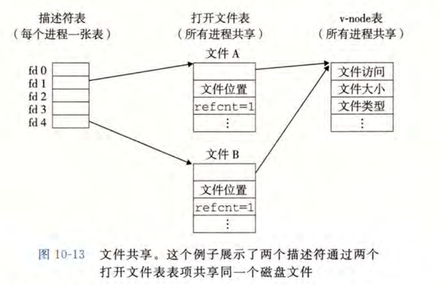
9. I/O重定向
   1. 使用dup2函数，`int dup2(int oldfd, int newfd);`
   2. 复制描述表表项oldfd到描述符表表项newfd，覆盖描述表表项newfd以前的内容。如果newfd已打开，则先关闭newfd
   3. 例如dup2(4,1)可以重定向标准输出到文件描述符4所指向的文件，图示如下：
     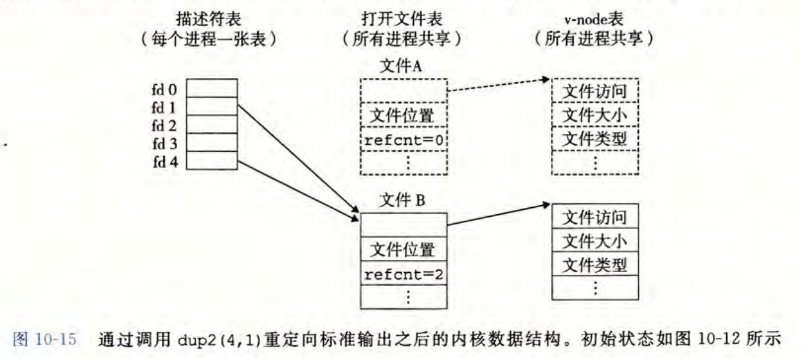
10. 标准I/O函数
    1.  C标准库（libc.so）提供的标准I/O函数，包括fopen, fclose, fread, fwrite, fgets, fputs, fscanf, fprintf等
    2.  标准I/O在实现过程中使用了缓存（如`printf()`函数），直到写入`\n`或显式调用`fflush()`时将缓存内容刷入到输出文件
    3.  fgets, scanf, printf等基于行处理的IO函数不能用在二进制文件
    4.  各种IO关系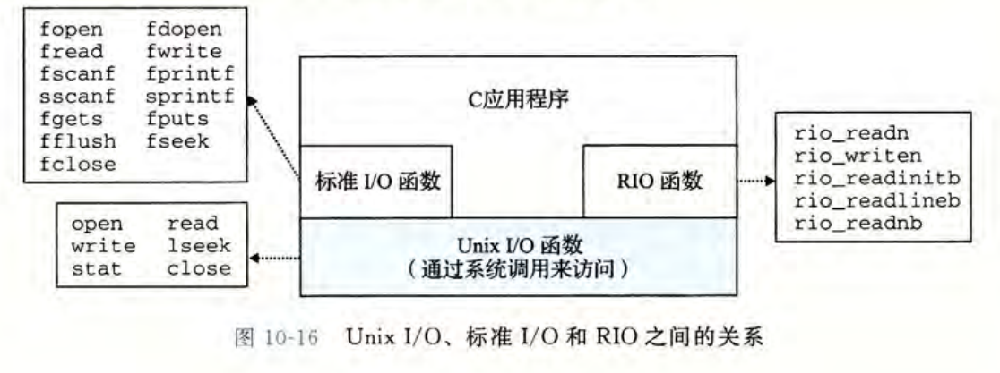
    5.  利弊斟酌

||UNIX I/O| 标准I/O |
|-|--|--|
|优点|通用、额外开销小、更底层、可以访问元数据| 减小read、write数目，缓冲增加效率、不足值自动处理 |
|缺点|不足值处理不够易出错、读取文本行需要缓冲易出错|不能访问元数据、非同步信号安全、不适合处理socket|
|何时选择？|信号处理程序时、需要更高性能时|处理磁盘和终端文件时
### 七、线程（课件11；CSAPP Ch.12.3以降）
1. 进程与线程
    1. 虚拟地址空间（VAS）：包括代码段和数据段、堆、共享库、栈
    2. 处理器上下文：包括通用寄存器、程序计数器PC、栈指针、条件码
    3. 内核上下文：包括页表、文件描述符表、堆指针、信号上下文
    4. $$进程=VAS+处理器上下文+内核上下文$$
    5. $$线程=栈（VAS的一部分）+处理器上下文$$
    6. 于是，$$进程=代码数据段（VAS的剩余部分）+线程+内核上下文$$
    7. **一个进程可以关联多个线程，每个线程有自己的处理器上下文和栈，但共享虚拟地址空间和内核上下文**
    8. 线程资源开销比进程小，形成线程池而非树状结构
    9. 线程的并发编程易于共享数据，更有效率，但可能带来问题（如失败同步、竞争、死锁）
2. 线程相关的C函数
```c
// 0. 获得线程ID
pthread_t pthread_self(void);
```
```c
// 1. 创建线程：调用pthread_create函数
int pthread_create(pthread_t *tid, pthread_attr_t *attr, func *f, void *arg);
/***************************
* 创建一个新的线程，
* 带着一个输入变量arg，
* 在新线程上下文运行例程f，
* 用attr参数改变默认属性
***************************/
```
```c
/***************************
* 顶层线程例程返回时，线程隐式终止
* 调用pthread_exit函数，线程显式终止
* 若主线程调用pthread_exit函数，则等待其他所有peer thread终止再终止主线程和整个进程
***************************/
// 2. 显式终止线程：调用pthread_exit函数
void pthread_exit(void *thread_return);
```
```c
// 3. 回收已终止线程的资源：调用pthread_join函数
int pthread_join(pthread_t tid, void **thread_return);
/***************************
* 阻塞，等待线程tid终止，
* 返回线程tid的退出状态指针thread_return，并回收资源
* 无法像wait函数一样等待任意线程终止，只能等待一个指定线程终止
***************************/
```
```c
/***************************
* 一个可结合的线程可被其他线程回收或杀死，回收前其内存资源不释放
* 一个分离的线程不可被其他线程回收或杀死，终止时系统自动释放内存资源
***************************/
// 4. 分离线程：调用pthread_detach函数
int pthread_detach(pthread_t tid);
/***************************
* 分离线程tid，
* 线程tid终止时，自动释放其资源
* 可以通过调用pthread_self()分离自己
***************************/
```
```c
// 5.初始化线程：调用pthread_once函数（书上说很有用但貌似用得少？）
pthread_once_t once_control = PTHREAD_ONCE_INIT;
int pthread_once(pthread_once_t *once_control, void (*init_routine)(void));
/***************************
* 初始化线程tid，
* 调用init_routine函数
***************************/
```
3. 共享
   1. 多个线程在同一进程中运行，有独立的线程上下文（线程号、栈、栈指针、PC、条件码、通用寄存器）
   2. 所有线程共享其余的进程资源（代码段、数据段、堆、共享库、打开文件表、信号处理函数……）（p.s. *寄存器不共享*）
   3. 全局变量、局部静态变量是共享的，局部非静态变量是不共享的
   4. 共享数据带来了失败同步问题，如案例*badcnt.c*，可以用进度图表示线程的指令执行顺序和切换关系
   5. 案例*badcnt.c*中的L,U,S构成临界区，希望在临界区执行时拥有对共享变量的互斥访问，称为**互斥**
   6. 临界区交集构成了不安全区，绕开不安全区的轨迹线叫安全轨迹线，否则不安全轨迹线
4. 解决方案：信号量
   1. 信号量是非负整数的全局变量，只能用P和V两种操作处理
   2. `P(s)`（测试/上锁）：若`s`非零，`s-=1`并立刻返回，否则挂起这个线程直到`s`非零
   3. `V(s)`（增加/解锁）：`s+=1`，若有线程在`P(s)`中挂起，则唤醒它
   4. 如此操作，在禁止区中`s<0`，确保了临界区的互斥访问
   5. 生产者-消费者问题：
   ```c
    void init(int n){
        Sem_init(&mutex, 0, 1);  // 线程锁
        Sem_init(&slots, 0, n);  // 起初n个空槽
        Sem_init(&items, 0, 0);  // 起初0个物品
    }
    void producer(void){
        P(&slots);  // 等待空槽
        P(&mutex);  // 上锁
        // 生产物品
        V(&mutex);  // 解锁
        V(&items);  // 增加物品数
    }
    void consumer(void){
        P(&items);  // 等待物品
        P(&mutex);  // 上锁
        // 消费物品
        V(&mutex);  // 解锁
        V(&slots);  // 增加空槽数
    }
   ```
5. 其他并发问题（PPT只涉及CSAPP中的竞争和死锁问题）
   1. 竞争：程序的正确性依赖某种顺序（在*race.c*案例中，i自增和i间接引用并赋值谁先谁后）
   2. 竞争的解决方案：避免不需要的共享（在*race.c*案例中，用malloc和free创建独立的内存区域，无需共享）
   3. 死锁：程序员使用多个信号量顺序不当引发的问题，所有线程都被阻塞却等待永远不会到来的V 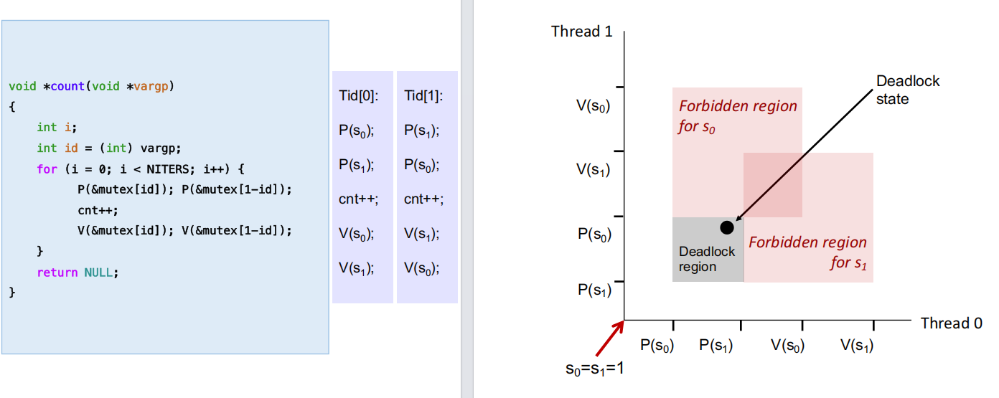
   4. 死锁的解决方案：各个线程加锁的顺序完全一致，释放的顺序相反，则无死锁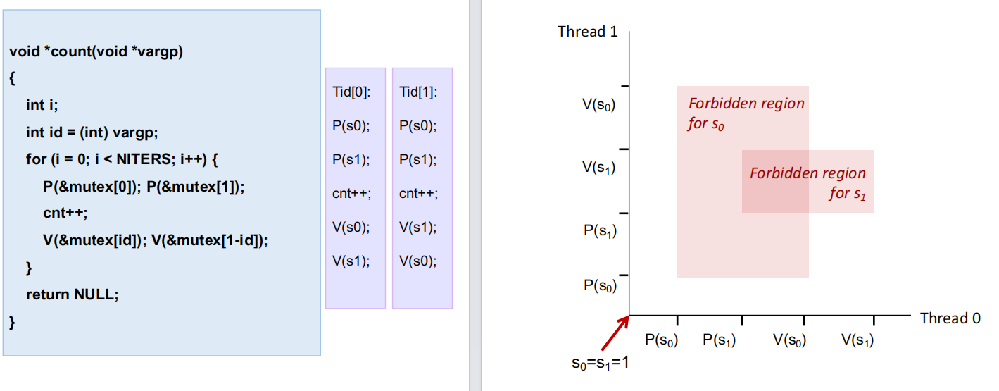