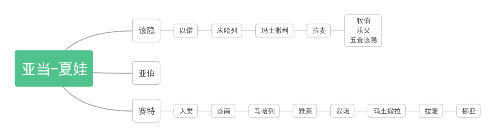
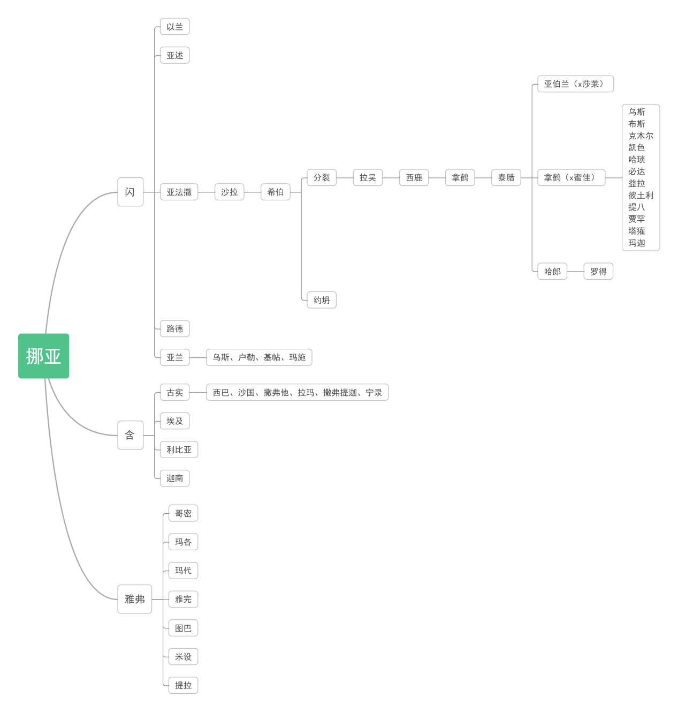
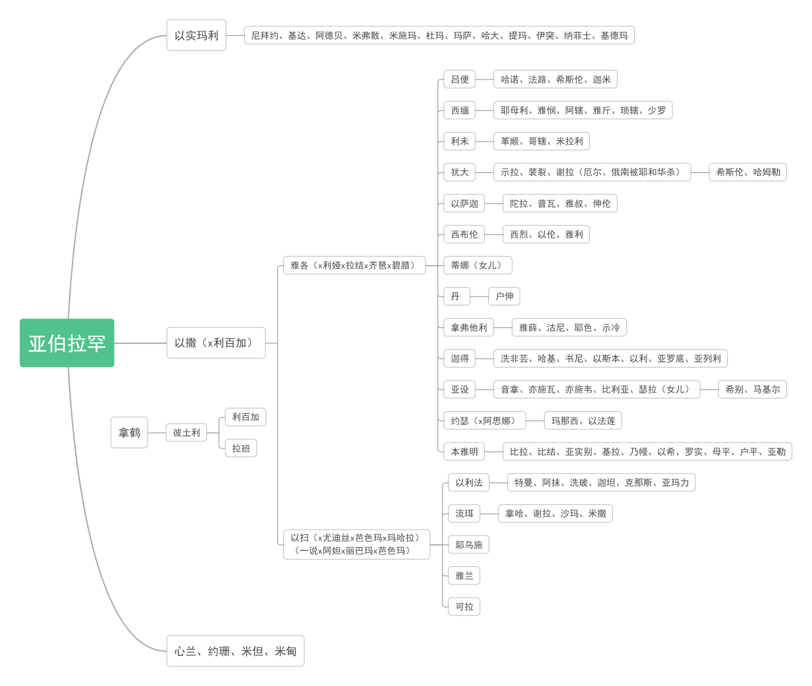

> 《圣经·创世纪》读书报告
> 刘青乐，2024010854

《创世纪》出自《摩西五经》，宏大地叙述了上帝创造世界以及人类文明和犹太文明起源的过程，讲述上帝的若干代子民的生平事迹，反映了早期犹太教对于世界本源以及人类文明发源的世界观。本篇报告将分为分篇内容概述、人物关系图谱、对《创世纪》中诸多理念的探究、提出疑惑四个部分，浅谈笔者对于《圣经·创世纪》的理解。

## 一、分篇内容概述

| 章节号 | 主要内容概述 |
| --- | --- |
| 一 | 上帝在太初用七日完成创世，在六日创造了人类。 |
| 二 | 完成创世后，上帝造伊甸园供新造人居住，创造亚当和夏娃。 |
| 三 | 亚当夏娃偷吃禁果，上帝降下诅咒并将其赶出伊甸园。 |
| 四 | 亚当夏娃生二子，该隐杀死弟弟亚伯后前往流荡。该隐家谱和赛特家谱。 |
| 五 | 亚当家谱。 |
| 六 | 挪亚建造方舟。 |
| 七 | 在上帝旨意下挪亚登上方舟，上帝发洪水毁灭世界。 |
| 八 | 洪水平静后挪亚在上帝旨意下离开方舟，重新在大地上繁殖。 |
| 九 | 挪亚父子和上帝立约，挪亚诅咒迦南（之父含）。 |
| 十 | 万族世系。 |
| 十一 | 上帝拆散巴别塔。闪的家谱。 |
| 十二 | 亚伯兰受昭示离开故土进入迦南，后饥馑时到埃及逃荒，隐瞒莎莱身份后被赶出。 |
| 十三 | 从埃及返回南地，罗得分道，亚伯兰造祭坛。 |
| 十四 | 四大王与五小王开战，亚伯兰救出侄子战胜四大王，所多玛王感谢。 |
| 十五 | 亚伯兰接受耶和华肉块之约，听受后代流落四百年的神谕。 |
| 十六 | 亚伯兰同莎莱婢女夏甲相认，发生矛盾夏甲逃跑又被劝回，生以实玛利。 |
| 十七 | 改名亚伯拉罕、莎拉，与耶和华订割礼之约。 |
| 十八 | 橡树下接见上帝和两位天使，亚伯拉罕求情不要灭城。 |
| 十九 | 带走罗得一家后，天使灭掉所多玛城，罗得女儿怀上父亲的孩子。 |
| 二十 | 亚伯拉罕客居基拉耳，和“我父王”解开误会。 |
| 二十一 | 莎拉受上帝眷顾生以撒，夏甲和以实玛利离家，亚伯拉罕与“我父王”建誓约井。 |
| 二十二 | 上帝考验亚伯拉罕让其献子，亚伯拉罕照做得到了祝福。拿鹤家谱。 |
| 二十三 | 莎拉去世，亚伯拉罕向弗仑买下双洞。 |
| 二十四 | 仆人替亚伯拉罕为以撒找妻，利百加接受神的旨意同意成为新娘，以撒与其完婚。 |
| 二十五 | 亚伯拉罕续弦香娘，圣祖辞世。以实玛利家谱。以撒家二子争斗。 |
| 二十六 | 饥馑时以撒住在基拉耳，隐瞒妻子身份、发生水井纠纷，建誓约井，以扫娶妻。 |
| 二十七 | 雅各夺走以扫应得的祝福，怕被杀离开家去哈兰找拉班。 |
| 二十八 | 雅各前往美索不达米亚，路中梦见天梯，命名“上帝之家”。 |
| 二十九 | 雅各打工14年迎娶利娅和拉结，生下多个儿子。 |
| 三十 | 雅各诸子的记录，向舅舅请求回家，提出获得斑点条纹的山羊绵羊。 |
| 三十一 | 雅各不辞而别，舅舅追上，二人谈判立约，建见证石堆。 |
| 三十二 | 雅各拜见以扫并送礼，雅各见到上帝使者，改名以色列，命名“上帝照面”。 |
| 三十三 | 兄弟二人和解，雅各来到石肩。 |
| 三十四 | 蒂娜被强暴，雅各二子西缅和利未借割礼之计洗劫全城。 |
| 三十五 | 雅各扔异族神像，在迦南命名“上帝之家”，拉结难产死。雅各家谱。以撒逝世。 |
| 三十六 | 以扫家谱。毛嶺家谱。红嶺诸王。续以扫家谱。 |
| 三十七 | 约瑟讲梦被哥哥记恨，被哥哥们卖给以实玛利人，伪造血衣。 |
| 三十八 | 犹大家事：二子被耶和华杀，塔玛伪装身份同犹大相认，犹大看到物品理解过错。 |
| 三十九 | 约瑟拒绝夫人诱惑，被诬陷下狱，耶和华与之同在。 |
| 四十 | 为司酒和司厨解梦，果如其言。 |
| 四十一 | 法老做梦，召约瑟解梦，拜其为相，结婚生子，天下如其预言进入七年饥馑。 |
| 四十二 | 约瑟十哥哥来埃及买粮，约瑟命其找来弟弟，九哥哥请求雅各交出本雅明。 |
| 四十三 | 犹大求父交出本雅明，约瑟和十一个兄弟进午宴。 |
| 四十四 | 约瑟用银杯试图留下本雅明，犹大求情。 |
| 四十五 | 兄弟交代身份，喜讯传到法老和以色列耳中。 |
| 四十六 | 以色列离开誓约井前往埃及，父子团圆。雅各家族。 |
| 四十七 | 以色列一家接受赏赐住在歌珊，约瑟新政让全国人成为法老的农奴，雅各立遗嘱。 |
| 四十八 | 以色列认孙为子，叮嘱要回到自己土地。 |
| 四十九 | 雅各进行临终祝福，对以色列十二子族给予一一祝福。 |
| 五十 | 雅各去世，约瑟扶柩悲伤回到迦南，约瑟宽恕哥哥。约瑟逝世在埃及。 |

## 二、人物关系图谱（自制）

*图 2.1 人物图谱 亚当夏娃后代谱系*

*图 2.2 人物图谱（续） 挪亚后代谱系*

*图 2.3 人物图谱（再续） 亚伯拉罕后代谱系*

## 三、对《创世纪》中诸多理念的探究

（一）《创世纪》文本本身

本节试图回答以下几个问题：《创世纪》有什么地位？《创世纪》连同《摩西五经》是谁写的？犹太教和基督教如何看待《摩西五经》？我们对《创世纪》的阅读心态是如何的。

《创世纪》是《圣经·旧约》的第一卷，叙述了世界的创造、人类的起源和早期文明史，成为犹太教和基督教共同的信仰基础。无论是犹太教还是基督教，都相信其中叙述的上帝创世、人类与上帝缔约、早期的若干代上帝子民的经历。这是宗教经书，也是一门宇宙论和本体论，体现犹太文明早期对宇宙、世界、文明总的看法。此外，《创世纪》对后世的影响是不可估量的。基督教文明下的整个西方都深受其影响，《创世纪》的故事衍生出大量的文学艺术哲学作品，构成了西方文明的重要部分，对《创世纪》的演绎和解读直至今日也颇具生命力。

从宇宙论的角度出发，《创世纪》或许是上帝亲自写的。毕竟第一章讲上帝创世过程，能够记叙世界从无到有、亲历创世过程的并将其叙述出来的，叙述者应当只有上帝了。然而事实上，无论是从宗教的角度讲还是从历史的角度讲，《摩西五经》都不是被上帝创造的。宗教一致认为是先知摩西在上帝的启示下写成的。从历史真实的角度讲，这个问题则难以回答。冯象教授在《谁写了摩西五经——译序》中分析了学者们对于此争议话题的看法。如今主流观点认为《摩西五经》由多种文献底本（J、E、D、P）汇编而成，在大约公元前5世纪至4世纪成书。从文本阅读中，我们也能发现不少断、漏、不一致的现象，这也印证了其来源于残本的汇编。

虽然犹太教和基督教均以其为经典，但二者思想上有一些不同。犹太教称经文为《希伯来圣经》，基督教更倾向于称之为《圣经·旧约》。前者重视经文中体现的人类与上帝的律法，极为重视对律法的遵守，并借经文强调以色列民族与上帝的盟约，是以色列人寻求土地的宗教基础；后者更重视《旧约》铺垫成的《新约》，强调信仰耶稣获得救赎。

阅读文本时，教徒会以心悦诚服的精神状态，持满怀敬意、虔诚聆听的态度去与上帝、先知对话。而普通读者则将其看作普通的卷宗经文，或者将几代上帝子民的故事当成通俗读物、虚构文学作品阅读。做出这种对比绝不是为了批评普通读者，而是借由这种差异提出阅读《圣经》更好的一种心理状态。普通读者不妨假设自己是一个教徒，从一个教徒的视角去读经文，或许可以更好地代入犹太教或基督教的视角，获得对宗教文明更深入的体会。

（二）上帝、神权、神学

本节浅谈上帝耶和华在《创世纪》中体现的形象和发挥的作用，再试比较神权和政权在《创世纪》中的体现，最后提出并试图解决一个神学问题。

上帝显然是作为创世者出现的。在开端，耶和华是全知全能的，可以用神力创造世界，可以因对人们的不满发洪水毁掉整个世界文明，仅留下挪亚的方舟。改变世人的语言、摧毁巴别塔这些更是不在话下。但往后，耶和华的形象似乎并不那么全能了，祂对于信徒所能做的或者说所做到的，也就是在人生黑暗时给予祝福和“上帝与你同在”的鼓舞、对于女性生育能力的限制或解除限制、一些对未来的晓谕，以及在子民在别的政权中遇到危机时也并不直接施以援手。前后的能力形成了强烈的对比。这两个问题引起了我的思考：（1）上帝为什么没有使用神力直接给予子民根本性的帮助？（2）子民为什么愿意一直追循上帝？

对于第一个问题，我们可以像奥古斯丁一样从神学教义的角度去理解：上帝是完全慈悲仁爱的，即使人们犯下了罪也愿意宽恕他们，并给了人们自由意志。如果通过对人间的直接干预，比如在子民遇到困难时直接歼灭敌人、在子民有需求的时候直接给予财富和土地，那就是对自由意志的侵犯了，不符合上帝造人的初衷。

然而，从我个人的阅读体验看有不同的理解：上帝并不是一个完全慈悲仁爱的形象，祂会发怒，坚持神对人的特权（伊甸园的禁果），神子们也会喜欢人类的女儿们，甚至还会杀死自己不喜欢的子民的孩子（犹大的前两个儿子），对子民只提供有限的帮助。之所以这样设计，就要谈到《希伯来圣经》的核心主题：维护上帝律法，遵循人与上帝的约定。这种世界观和价值观，从根本上讲来源于犹太先民在生产生活实践中产生的对自然的敬畏、对秩序的遵循、对自我的约束等意识。

对于第二个问题，笔者的回答有三方面：律法的遵从、人类的原罪、政权下的庇佑。律法的遵从前文已谈到，在此不再赘述。对于第二方面，在宗教设定里，神拥有比人高的权力，原初时不允许人类有辨善恶的能力，即不允许人有完全的道德独立和自由意志，这是神的特权。然而亚当和夏娃偷吃了禁果，违反了上帝的戒律。慈悲的上帝没有杀死他们，将他们赶走并提供衣服，引导他们得到救赎，这是子民追随上帝的渊源。第三方面，是人们不仅受到神权支配，更处在世俗世界的政权支配下，比如以撒住在基拉耳与当地君主发生过纠纷、雅各在见到埃及法老时也要自称仆人。在政治现实下，子民们有必要寻求上帝的庇佑和祝福。

这里引申一个话题，即对于善恶的疑惑。上帝是全知全能全善的，为何会创造出不完美的有贪欲的人类？课上已经讲过奥古斯丁的观点，这里我通过阅读找到了另外两种观点。

普罗提诺认为被创造物存在着“流溢”的次序关系。为何会有恶产生？因为流溢物有向下的趋势，越向下越能触碰到恶，离着上帝（太一）的完满越远。阿奎那提出上帝不是恶的因，恶是善的缺乏。上帝为何允许恶存在？因为世界的完满性要求各种类型存在物存在。被造世界是一个完美的序列，没有存在间隔，被称为存在之链：天使-人-动物-植物-四元素。

（三）文明起源与文明延续

本节探讨《创世纪》体现的文明起源观和文明延续观。

《创世纪》的创世，创造天地日月、飞鸟走兽，更创造了人类，创造了文明。无论哪个民族，在其对自身进行审视和思考，在与周围世界事物打交道的过程中，就不可能不反思文明的起源问题，不可能不给出自己的一套对文明起源的阐释。无论是中国神话的炎黄之争，还是希腊神话的混沌卡俄斯，以及犹太文明《圣经》中的记叙。

文明由上帝带来，又被上帝毁灭。方舟事件后，挪亚的繁衍重新创造了人类文明，这也就意味着所有世人皆是挪亚的后代，也就是上帝子民的后代。子生孙，孙生子，人类文明逐渐根叶繁茂，从此依据血缘地缘等分化出各种部族、各种民族乃至各种文明。

古代人并没有产生文明进步论的思想，也就不可能提出追求经济进步、政治转型、社会形态演替的文明延续观念。而朴素的文明延续观念就是繁衍后代。上帝耶和华曾多次对子民降下祝福，如“我赐给你的后裔”“令你子孙繁衍，多如繁星海沙，你的后裔将占领仇敌的城门”“你腹中孕育了两个国家”。就笔者看来，这种祝福并不是对土地、财产、权力的直接的赏赐，根本上是支持其繁衍后代，提升后代子嗣的出生率。所谓“形成民族”，等同于家庭人口蕃多、子孙兴旺，形成一个部族；所谓“后裔占领仇敌的城门”绝不是上帝帮助其摧毁仇敌，而是子嗣增多带来的必然结果；而对土地、财产、权力的承诺，也不过是众多子孙中能力杰出者达成的事业成就。

于是，我们得出结论：上帝的祝福全在于文明的延续，而文明的延续等价于子孙的繁衍。

（四）对中东诸文明关系的理解

本节对中东历史文明进行浅显的探索。

从一个有趣的话题出发，挪亚之子闪的儿子名字，包括埃及、利比亚、迦南。上帝对利百加的祝福中也说“你要生一对相争的民族”。这些都是现实世界诸多文明复杂关系在经文中的投影。问题复杂而笔者水平有限，姑且从介绍历史出发，试图分析犹太文明、两河文明、埃及文明的关系。

我们重点关注的以色列地区的历史概述如下：

| 早期文明 | BC32C，开始迦南地区有人居住，BC13C，希伯来人迁居 |
| --- | --- |
| 以色列国与亚述巴比伦统治 | 扫罗建以色列国（BC1050-BC930），历经大卫王、所罗门王时代 后分裂为：北以色列王国（BC930-BC722，被亚述征服） 南犹大王国（BC930-BC586，被新巴比伦王国征服） |
| 波斯统治 | BC538，波斯帝国居鲁士大帝允许犹太人返回耶路撒冷重建圣殿 |
| 希腊统治 | BC332-BC63，亚历山大大帝征服了以色列地区 |
| 哈斯蒙尼王朝 | BC166-AD160，犹太人反抗希腊建立哈斯蒙尼王朝 |
| 罗马统治 | BC63-AD70，罗马人占领巴勒斯坦并将其纳入叙利亚省 |
| 拜占庭统治 | 70-638，拜占庭帝国统治 |
| 伊斯兰统治 | 638-1099，穆斯林统治 |
| 十字军统治 | 1099-1291，耶路撒冷被十字军占领，建立耶路撒冷王国 |
| 埃及统治 | 1291-1517，耶路撒冷被埃及马穆鲁克王朝统治 |
| 奥斯曼帝国 | 1517-1917，奥斯曼帝国统治 |
| 英国委任统治 | 1917-1948，第一次世界大战后，巴勒斯坦由英国委任统治 |
| 以色列国 | 1948年5月14日，以色列宣布独立 |

是为以色列地区的历史沿革，可以说是命运多舛，常年被外族统治也是一战后以色列独立运动、五次中东战争的历史积因。以色列人追求自己的土地，不惜与周边国家大打出手，在这里是能找到原因的。即使单从《圣经》记载的公元前时代，也可以充分看出这片圣地与周围文明（亚述、巴比伦、埃及等）的交流和冲突。

类似地，两河文明和埃及文明也历经了复杂的变迁，下为略述：

两河文明：苏美尔城邦时期、阿卡德帝国、乌尔第三王朝、古巴比伦王国、亚述帝国、新巴比伦王国、波斯帝国、希腊化时期、塞琉古帝国、罗马帝国、萨珊王朝、伊斯兰时期、蒙古帝国、奥斯曼帝国、英国委任、现代国家。

埃及文明：前王朝、早王朝、古王国、第一中间期、中王国、第二中间期、新王国时期、第三中间期、晚王国、希腊化时期、罗马统治、伊斯兰时期、奥斯曼帝国、英国殖民、埃及共和国。

可以明显看出，文明内政权更替和文明间征服冲突是人类历史不可避免的话题，而《希伯来圣经》就是中东地区文明大杂烩中的产物。文本虽然没有直接记叙文明的交往或冲突，但其思想内容本就包含着文明交流冲突的结果。

（五）地理文明的探究

本节出示地图资料。

《创世纪》中反复提到“迁移”，笔者因此对地理流动方位感兴趣，故出示查阅到的地图资料。（出自https://www.churchofjesuschrist.org/study/scriptures/bible-maps?lang=zhs）

## 四、提出疑惑

如前文所述，《摩西五经》很有可能来自多个残本的汇编整理，故有错漏的地方在所难免。下面笔者提出一些个人的疑惑，希望将来能够得到解答。

（1）该隐和赛特二人的子嗣出现大量重名，是记载有误还是事实就刻意取同名？

（2）以扫有三个妻子是事实，但为何两种版本记载三个妻子的名字全不一致？造成这种现象的原因是什么？

（3）人类都是挪亚的子嗣，为什么会有非上帝子民的人类出现？

（4）雅各夺福后为何以撒没有怪罪他，在他出走前反而为他祝福？

（5）人们对近亲通婚以及乱伦的观念是如何流变的？

（6）给人“改名”和对地“命名”有哪些寓意？

## 结语

《圣经·创世纪》是西方文明中不可或缺的一部分。本报告总结了书中内容，自主整理了人物关系图谱，搜集历史地理资料，并尝试提出了对犹太文明的思考，探究了文本出处、律法观、原罪论、政治现实以及一些神学观点，并提出了诸多疑惑，值得进一步思考和研究。

姓名：刘青乐

班级：计48经42

学号：2024010854
