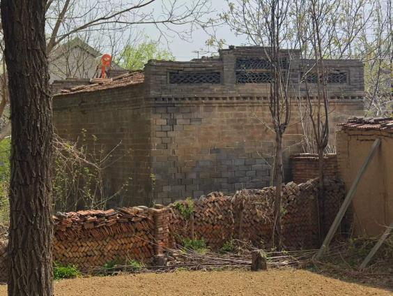
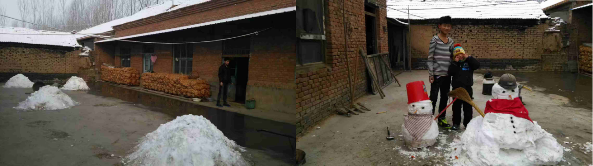
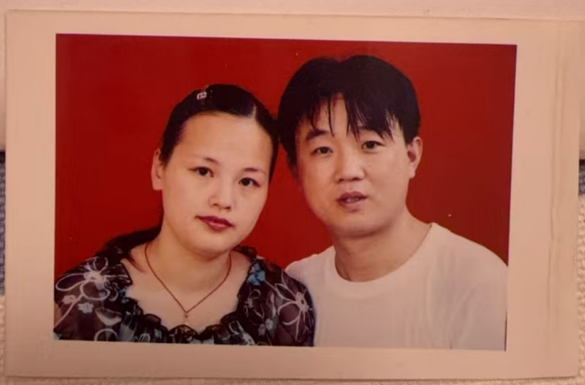
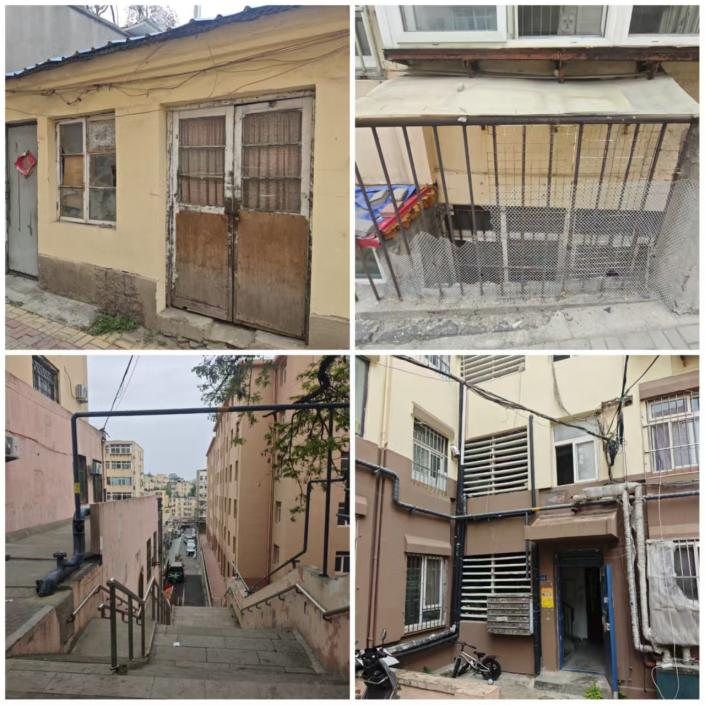

> 刘青乐，计算机系，2024010854，lql24@mails.tsinghua.edu.cn
> 前言

清明时节纷纷的雨，洒在青银高速公路上。雨点的频率，恰好踩着我思索的律动：返乡后要如何向长辈提问是好。

我在青岛市出生长大，但算不上地地道道的青岛土著。在“农民工”一词已经带有明显歧视意味的当代，我十分不愿如此概括我的父母，但似乎又找不到更贴切的词汇。父亲来自淄博农村，母亲来自胶州农村，二人经过在青岛几十年的打拼已经找到了相当体面的工作，也让我一直过着算不上拮据的生活。尽管时常听父母聊起过去，但毕竟只是只言片语，我似乎从未系统地研究过父母的人生轨迹，更别说爷爷奶奶的人生了。

借着习概大作业的机会，我跟父母一起回到我那没怎么回过的老家——淄博高青，与老人们长谈，一览历史的重量和乡土的沧桑，获取一手资料，从而为我的“家族”——齐鲁大地生活的再平常不过的中国农民们——立言著史。

该以什么样的口吻、什么样的立场去写这份家族史呢？就像鲁迅在《阿Q正传》开头面临的那种“名不正则言不顺”的问题，这份家族史算不上正史，更不是野史，那究竟该如何落笔？思来想去，我决定用写自传、写散文的笔法去写这一份家族史，其动因就在我回乡调研时生发的感想。

其一是乡土中国之苦难。历史和文学作品中描摹的苦难在这里得到确证。这些苦难给予我极大的感性冲击，赋予我极强的表达欲。我希望用我的笔讲述出来这些苦难，不是为了忆苦思甜，不是为了控诉历史的不公，也不是为了讴歌祖辈的吃苦耐劳，而只是作为历史的叙事，严肃地铭记。

其二是乡土世界的丰富。历史似乎总是属于王侯将相的宏大，是战争、是改革、是改朝换代，而不是一个农民的生老病死、婚丧嫁娶。但乡土社会很丰富，农民的“不那么波澜壮阔”的一生也充满了值得被史笔记下的故事。通过这种不曾有过的对话和接触，我变得更加了解爷爷奶奶，懂得了他们的性格和为人，更深感普通农民的身上也有无数值得写的故事。

带着一手的史料，怀着深沉的情感，我开始动笔，久违地在AI时代实施“古法写作”。

黄河水载着四代人的故事，澎湃又安静。

2026年5月4日于青岛

## 一 刘家风云

1948年农历腊月十四，淄博市高青县黑里寨镇大圣寺村的村东头刘家新添了一口人——我的爷爷。爷爷在家里男孩排行第四，小名取作“房”，三个哥哥分别叫“金梁”“玉柱”“屋”，未来的一个弟弟叫“楼”，此外还有一个姐姐和一个妹妹。金梁玉柱屋房楼，这种好听又有寓意的名字大抵是村里的文化人帮忙起的，承载着和今日人们盼望子辈成为“栋梁之才”一致的希冀。

若说一家有七个孩子，在当今看来是不可思议的，放在当时的物质条件更加难养活。事实也是如此，“一口人”这个汉语词汇里的量词“口”，具象化地显形了。多一个孩子就多一张嘴吃饭，对于贫农来讲，实在是家里的负担，再加上村西头的另一户刘家没有孩子也就没人干活，因此，爷爷在没满一岁的时候就被送到西头这边寄养了。说是寄养，其实就是彻底撒手，一年到头也就是过年才会回东头看看亲生父母，别的时候基本没有联系。和爷爷一样被东头老刘家送出来的，还有他的大哥、大姐和三哥，各自散到了不同的家庭生活。不过无论哪边都是贫农，物质条件难说存在什么差异。

到了西头，是继父刘学海家。虽是“外来者”，爷爷却是家里的老大，在这边起了大名刘光福，改小名叫“翔”，后来又有了两个弟弟和一个妹妹。两个弟弟大名分别叫刘光禄、刘光寿，小名分别叫“连”、“栓”。这里的小名，也只是根据读音姑且做的表记，没有人知道确切的汉字是什么。

刘家的族谱在文革期间已经被毁，如今就算在某处还存在着副本，也不为我们所接触了，仅仅通过口口相传记得前后十代人的“辈”：振学光（广）兴善，承法照宗修。两句合在一起可以构成一个完整的意思，寄托着先祖对后代的期待。立家谱的先祖那时恐怕是难以想到后代别提振学承法了，就连认字都难以办到。但言归正传，这也是为什么太爷爷是学字辈，爷爷是光字辈（或许原应是广字），爸爸是兴字辈叫刘兴前，大爸爸刘兴国，小爸爸刘兴元。但是到我这一辈取名就没有再按照“祖宗之法”，我和我的堂兄弟三人名字里无一个“善”字。恐怕我们的后代也不会再承法照宗修了罢。

爷爷和几个东头的兄弟长得很像，小脸尖下巴小眼睛薄嘴唇，总是眯眯眼似是在笑。西头的两个兄弟长得相对板正，国字脸大眼睛厚嘴唇，一眼就能看出谁是“同家人”。

在西头这边生活的艰苦，与时代有关，当然也与这种特殊的身份有关。爷爷老实听话，继母有时无理取闹地欺负他，两个弟弟狐假虎威装腔，也随母亲一起参与欺凌。村里的消息可是灵光，消息传到东头的兄弟们耳朵里，他们就一起过来把西头的两个弟弟狠揍一顿。看到亲儿子被打，继母也就自然收敛一些，但保不准过段时间又变得凶起来。就连我的爸爸儿时还目睹过爷爷的两个弟弟合起伙来殴打爷爷和奶奶，不过后来东头的兄弟们也是打回来报仇了。齐鲁大地上二三十岁的青年抄起家伙在村里打架之事频发，大抵是孔孟之道已经不复了吧。

家里住的房子是建国初期从被打倒的地主家里分的，东、北、西各一栋屋子，没有伙房。这栋清朝就存在的地主家的老房子，和农民的房子有明显的差异，用的不是红砖土腻子，而是青砖，房顶侧边还有纹样，只可惜面积不大，爷爷和三个姊妹、加上爷爷的父母及爷爷的奶奶，七口人挤在这样的房子里住：爷爷的父母住在北屋，兄弟姐妹四人分在西屋和北屋住，爷爷的奶奶住在东屋。若是有新的家庭成员加入，这份逼仄将会雪上加霜。

*图 1 从地主家分到的那个房子现在已经被拆了，图为原址旁边相邻的同样式的房子*

爷爷的成分是贫农，到了该结婚的年龄，由村里的媒人介绍和奶奶认识并结了婚。奶奶名邢翠英，小名叫“徐”，1950年生在大圣寺村隔壁的桑家村，家里成分被划成地主。奶奶作为地主子弟，成分差，很难找对象，毕竟要是夫妻双方都成分差，未来的孩子在社会会处处碰壁，不被制度认可，还会受到歧视，所以唯一的出路就是找个成分好的人结婚中和一下。1970年，爷爷22岁，奶奶20岁，二人结婚，逼仄的房子添了一口人。1973年，爷爷25岁，和兄弟分了家，大家都还是住在这个老宅子，但是各自生火做饭，也就是古人讲的异爨。爷爷分到了由3间构成的西厢房，面积只有十来个平方，后来就和媳妇和三个儿子总共五口人住在这小房子里。

和村里的大部分人一样，爷爷不认字，只在本村的小学上了不到一年，就回去给家里干农活了。爷爷如今能认识自己的名字，但是不会写。和七八十年代以后出生的孩子不一样，1974年出生的爸爸小时候可以玩皮球、毽子、玻璃球、丢沙包（被称作打台湾），还会整天和兄弟打架争吵，爷爷的儿时并没有什么娱乐方式，毕竟时间和体力都用来干活了，根本没有力气玩，也没有力气闹。那时，农民的生活应该是相当乏味，构成生活循环的几件事恐怕就是种地、生娃和革命。

## 二 革命年代

土地革命和三大改造时，爷爷还太小，已经不剩什么记忆。从爷爷记事说起，最早的政治运动就是大跃进。先说轰轰烈烈的大炼钢铁运动，家家户户的金属制品都被强行收走，灶上的锅自是不必说，就连门锁上的一点点铁也都被强行收走。要问老百姓怎么看这次运动，没有人不知道这种事很荒唐，也没有人相信自己家的那点破铜烂铁能够给国家炼出来真钢真铁，但毕竟是命令，没有人敢表达反对意见。再说农业的浮夸风，说是亩产万斤，但实际上一个200人的大集体才能种出来1万斤粮食。交够国家的留足集体的，也就剩不下多少了。分的最少的时候，一人一年只能分到7斤粮食。作为对比，八十年代初的好时候可以分到百余斤。

再就是人民公社运动。公社时期，大家都处在大集体，在生产队里干活、吃大锅饭，种的是公家的地，赚的是“工分”而不是工资。公家地，种什么是指标说了算。按照高青县的情况，基本不允许种经济作物，种的都是玉米、麦子、地瓜这类粮食作物。有的村因为是沙土地，因地制宜也可以种棉花。在队里干活，好处一是生产资料都是队里提供，农具、种子、伙食都被队里包了。二是活比较轻松，上午队里开个会喊一喊口号，接着去地里转一圈回来基本就该吃中饭了。下午等太阳不毒了再去地里转一圈随便干点活，一天的活就干完了。这当然就是现在说的生产积极性不高。但生产的积极性也不是完全没有正反馈，干的活多可以按照规定涨工分，懈怠者就扣工分。理论上，到了年底工分可以换成钱。爷爷最老实勤奋，总是有着高高的工分，但却没有成功用工分换过一次钱。原因也很简单，工分换钱的机制是工分少的人罚钱，这些钱再由集体转发给工分多的人。然而工分少的人已经一分钱没有，要罚也没得罚，工分多的人自然也就没得领。不知为何，即使拿不到钱，爷爷也还是好好干活攒工分，或许这是一种本色。

1959-1961三年困难时期，农村的光景自然是相当不好。桑家村奶奶家饿死了100多个人，大圣寺村爷爷家隔壁一家就死了4个人。爷爷回忆说，当时的人肚子里啥都没有，用前胸贴后背来形容都是说轻了，人们的肚子薄到透明的程度，从外面都能看见里面有什么东西。人们疯狂采野菜吃，吃光了野菜就转向野草、野草的种子，接着是树皮，再后来是河底的淤泥。河底的淤泥是细的，滤一滤是能够勉强咽得下去的，带来一点饱腹感来欺骗肚子。桑家村因为榆树多，大家还“幸运地”多了个选项：榆树叶、榆树面子。从村里老人的口中听说，附近没有一个村子是没有饿死人的，真称得上是人间地狱，“从那个时候能活下来真是命大”爷爷如是说。和那时候一比，50年代和70年代吃的地瓜、窝窝头、萝卜都算得上是天堂了。

到了调整时期，刘邓路线落实了，连爷爷这种没文化的普通农民时隔几十年都可以清晰地记起来刘邓路线这个术语。具体而言，就是允许农民有“自留地”，每个人大约1分到2分，自主种植，自留种子。爷爷也自然是选择种麦子和地瓜。这些粮食给家里的生计问题做了不凡的贡献。

爷爷18岁的时候，也就是大约1966年，参加了“上服”（高青话，指挖沟引流，作为一种徭役），推着车子从淄博高青一路走到山东河北交界处去挖河。

十年文革给爷爷奶奶这一辈人留下了最深刻的印象，毕竟贯穿了他们的几乎整个青年时期。和一般认知中的文革大差不差，诸如批斗会、游街、红卫兵、抄家等东西可以说是一样不落，再比如不允许私自养鸡养猪种菜，指控这是资本主义尾巴，也是爷爷奶奶亲眼见证的。红卫兵巡街的重要任务之一就是看着不让大家私自种菜养牲畜。“宁要社会主义的草，不要资本主义的苗”，毕竟口号是这样喊的。红卫兵的另一个重要任务是给“犯人”，也就是地富反坏右，戴上纸帽子，挂上写着名字和“称号”的牌子，押着在村里游街。这些方法都是红卫兵自己发明的，并没有统一的要求，只是本着怎么羞辱性强怎么来的原则。可能唯独缺少的是大圣寺村方圆几里没听说过有下乡的知青，恐怕是齐鲁大地还不算足够值得下的“乡”吧。

总体而言，文革期间的生活水平很低，甚至不如解放前，爷爷直言“文革十年，相当于倒退30年”。70年代开忆苦思甜大会，爷爷的父亲因为曾经是地主家的长工，被邀请上台发言，追述解放前的坏、歌颂新中国的好。搞不清政治要求的太爷爷在台上直言不讳地说了实话，“在地主家我还能吃馒头吃饱呢，现在吃地瓜都吃不饱”，语未毕就被赶下去不让继续说了。

谈到文革，自然离不开阶级斗争，也就不得不从成分不好的奶奶的视角再叙述一遍了。

奶奶的父母在解放前自己经营了一个小油坊，也雇佣了不少人在厂里干活，似乎比起地主更像是资本家。解放后，油厂上交国家，保留一套平房给邢家住，划为地主，不过邢家由于过去为人不错没有遭受什么暴力，在文革最严厉的时候也没有被拉出来游街批斗过。

奶奶儿时作为地主子弟，在各处都会被欺负，成分好的孩子会把各种脏活累活甩给她干。村里开大会时，成分好的坐着听，成分坏的就在旁边站着听，散会后还有单独的小会训斥。有好事通知的时候，也绝不会通知成分差的人家。奶奶的母亲每次开大会前都战战兢兢，害怕得吃不下饭，开完会要是没被严厉训斥就回家吃几口，要是被训了就仍然吃不下。

奶奶的娘家因为是原地主，被红卫兵“整”了好几次，每次都把稍微值钱点的东西都征走，或者给家里的东西打上十字封条。奶奶曾经有件家里人给她过年准备的新棉袄，自己还不曾穿过，就被红卫兵收走了，纵使苦涩万分、不舍万分也不敢表现出半点的不情愿，就算红卫兵走了都不敢偷着骂几句。嫁到大圣寺后，奶奶就不太参与娘家的事了，但听说自己母亲被红卫兵用尖木棍打了。但嫁出去了毕竟就是“泼出去的水”，也只好远远地在夫家观望着。

爷爷这边就幸运很多，因为成分好所以十年里没有被红卫兵找过事，但家里也摆着没有人看得懂的红宝书，贴着毛主席画像。

1976年，毛主席逝世，这对所有从那个时代过来的人都是相当重要的事件。“那一年朱德、周总理、毛主席都去世了，我们印象都可深了，”爷爷这样回忆。毛主席去世的消息是村里开大会通知的，听到通知的大家都嚎啕大哭，哭声可能传遍整个村甚至整个山野。后面，镇上组织活动，所有人都戴着白花，去镇里的公社灵堂参加追悼会。几里长的队伍，大家都哭的稀里哗啦。若要问是不是真的那样的伤心，回答其实也不然，更大的因素是氛围，在周围人都在哭的氛围下很难不留下眼泪。但无论如何，爷爷奶奶这一代人，无论当时的生活多么艰难，也不曾对毛主席有过怨言，一直是把毛主席当作人民的救星、一代伟人。

## 三 农村二三事

不谈宏大的政治事件，这一章谈谈一个山东农村老百姓生活中的衣食住行。

首先是衣。爷爷辈的人穿的也是普通的布做的衣服，区别就是布料差点、衣服薄点，一件衣服要穿得久很多。冬天穿的不是棉袄，而是“套子”——棉花已经冻硬了、起不到保暖功能的破棉袄。棉鞋也不再保暖，里面又硬又凉，人们就在里面放上压碎的麦秆，用来保暖。村里还有流动商贩卖破烂，叫做破烂市，经常会卖一些从路边死人身上扒下来的衣服，大家都抢着买。

接着是食。吃的就是窝窝头、地瓜、萝卜，总之没有细粮吃。就算有面的时候也绝不舍得蒸馒头——馒头耗面太多，只能是过年才有的大餐。表伯造了一个顺口溜，用来形容日复一日的无聊的饭菜，“萝卜菜萝卜汤，萝卜粘粥萝卜糠”。至于油就吃的比较少，偶尔会吃劣质的豆油、棉花籽油，但猪油是买不起的。吃的盐是大块的粗盐，买回来必须得在家里用擀面杖擀碎。

说到食，再说说广义的食，烟酒。爷爷爱抽烟，烟叶都是自己种的，种出来自己做旱烟抽。爷爷爱喝酒，从四五十岁开始就基本每天都要至少半斤酒。时至今日，爷爷也只是用自己买的零散的烟丝自己卷成烟抽，买三四块钱一斤的酒喝，十块一斤的酒已经算得上是好酒。作为参考，红星二锅头也要20元一斤，茅台则要2000元以上才能买一斤。

生活方面，要在供销社买东西得靠钱和票双管齐下。买油、布、粮食都分别需要油票、布票、粮票，酱油、醋、盐则不需要。不过既然干活赚工分不赚钱，那如何获得钱呢？主要的方法是在集市上买卖，比如卖几个鸡蛋，卖一点粮食。农村管卖粮食叫，管买粮食叫。抓得严的时候，买卖粮食是资本主义，人们就退回到前货币经济时代，以物易物，用鸡蛋换点别的物资。

吃的东西相当不干净，卫生条件极差，吃的东西喝的水也常混有虫卵，连家里的腌咸菜缸甚至常有蛆在里面爬。吃的东西不干净，所有人的肚子里都有蛔虫，粪便里常能看到十多厘米长的蠕动的蛔虫。但就算这样，也没什么医生，有的只是偶尔来村里坐诊的流动的郎中。但那时的大家也都不太生病，有病也是主要靠自己扛过去。

住方面就是集体盖的红砖土腻子的平房，行方面就是下步走，倒没什么值得聊的。值得一提的是农村的“用”。村里直到1971年才通上电，在那之后才有广播。1978年左右，家里才有第一盏电灯。90年代，家里慢慢有了自行车、收音机、14寸的大屁股黑白电视。这也是爷爷为什么说“日子是从包产到户开始才开始慢慢好起来的”。进入新世纪，废除了农业税，不用交公粮，铺了硬化道路，农民纳入了医保。新时代全面扶贫，村里也有符合贫困户标准的得到了政府发的补助金，当然据爷爷说也有不符合标准的“骗”到了补助金。

似乎啰啰嗦嗦地讲了太多农村的一般光景，现在还是回归到家族史的范畴，讲一些爷爷奶奶生命中浓墨重彩的故事。

农村人一辈子最大的事大概就是婚丧嫁娶了。1970年，爷爷22岁，奶奶20岁，二人结了婚，这浓墨重彩的婚礼不仅意义重大，而且仪式相当有意思。

最开始，得先找村里大师算好良辰吉日，定下结婚的日子。结婚前3天，街坊亲戚帮忙布置房子，贴喜字，挂红色装饰。结婚前2天，爷爷和新亲戚吃饭，仅限男亲戚也就是奶奶的哥哥等人。结婚前1天，爷爷接着好好准备。

到了结婚当天，爷爷借一匹马，当上了“白马王子”，一路骑到桑家村奶奶家，锣鼓队跟着一路过去。接到新娘后，回程由奶奶来骑马，爷爷在旁边骑自行车。有钱的人家会借来两匹马，夫妻一人一匹骑回来，而爷爷奶奶经济条件受限只好一匹马一辆自行车。回到爷爷家，已接近中午，在家里吃“婚宴”。由于不去饭店，那时不叫吃席，就在天井里摆上几桌菜招待亲戚。婚宴相比平时的饭菜相当丰盛，有地瓜、面馍、白菜、粉条汤、冬瓜、南瓜等各样东西。

结婚3天后，女方要回娘家再呆3天，这也是女人出嫁后最后一次回娘家久居。满3天后，天不亮就要回到夫家。按照农村礼节，这次回夫家一定要早，要表现出“迫不及待回来”的急切感。因此，奶奶天不亮就起来，急头白脸回到夫家，到夫家后还要再好好整理一下裤腰带，毕竟“太急着回来连衣服都还没整理好”。如此，婚礼的流程就算正式结束了。

结婚以后，奶奶一共生了三个儿子，大儿子刘兴国1971生，小名叫国；二儿子刘兴前也就是我的爸爸1974年生，小名叫贵州，但本是俗语“十两银子买碗粥”的“贵粥”，流变成了地名的“贵州”。到怀上第三个儿子的时候，已经是计划生育开始执行的时期了，理论上是不允许再生。奶奶之前的放入的避孕环意外掉出，怀上了小爸爸，害怕被村里罚，跑到嫁到郝家的姐姐家躲了几天。看在情有可原的份上，村里终于同意她生下这个孩子，但条件是爷爷必须去结扎。1978年，三儿子刘兴元出生，小名叫元，含义来自“正在动‘员’计划生育”，但是登户口的时候不会写“员”字，就成了更简单的“元”。到今天，不识字不识数的奶奶能但仅能清楚地记得8个人的生日，“我是50年十一月二十六，你爷爷是48年腊月十四，你大爸爸是71年二月二十八，你爸爸是74年三月二十三，你小爸爸是78年腊月十七，你鑫磊哥（大爸爸的独子）是98年四月二十七，你是05年十月二十七，阳阳（小爸爸的独子）是07年二月十二。”这些内容奶奶背的滚瓜烂熟，但她已经完全记不得父母、两个哥哥和一个姐姐的生日，就连他们的卒日也完全没有印象。“嫁出去的女儿泼出去的水”似乎在这里生动地呈现了。

生了两个儿子后的1974年，三间屋的小房子实在是住不下家里四口人，于是爷爷开始给大队看饲养院，也就是牛棚，一方面可以赚工分，另一方面也可以住在饲养院里从而解决家里的空间不足问题。饲养院里养了十来头牛，这十来头牛后来都因为过度使用而累死了。爷爷白天干农活，晚上就一个人或者带着孩子住在饲养院里。在父亲印象中，小时候总是住在饲养院，每天都伴着牛粪的气味入眠。

在父亲14岁的时候，也就是1988年前后，农历六月，家里终于从队里批下来一块可以盖新房子的地，决定换房。一穷二白的家庭想要建一个房子，只能仰仗八方亲戚支援。古代木兰是东市买骏马、西市买鞍鞯，爷爷奶奶是刘家亲戚送檩条，邢家大舅送大梁、小舅送苇箔，自家再赊钱买来砖、石头、腻子，靠街坊帮着一起盖房子，也不用给工钱，只要管饭就好。就这样，一套南北各5间的新房子盖起来了。

*图 2 这套新盖的房子住到现在，左图拍的是北间，右图是堂哥和堂弟堆雪人后的合照*

农村的大事恐怕还有一件，那就是白事。不过与想象不同，爷爷家的葬礼其实颇简：要是人在晚上“老了”就第二天出丧，要是在早上“老了”就当晚出丧。出丧的乐队也并不复杂，顶多有一两个吹唢呐的，没有扎纸人，男人扎个马，女人扎个牛，没有火葬时就放“生伙”（高青话，指棺材）里埋进去，有火葬后就把骨灰盒埋地里。太爷爷刘学海的墓碑，还是几年前才置办上的。

## 四 到青岛去

历史的接力棒交给了下一代，接下来是父亲这一代人的故事了。

爸爸刘兴前1974年农历三月二十三生人，有一个大3岁的哥哥，和一个小4岁的弟弟。因为家里穷出不起学费，再加上要帮家里干活，直到12岁才开始上小学。尽管如此，也并不完全是好好学习、天天向上，爸爸一年级的期末还因为不及格留过级。就这样马马虎虎地念完了小学、初中，在五五分流的中考中考到了技校去，念电工专业。可技校的教育环境却相当糟糕，学生抽烟喝酒都不算事了，作奸犯科的都不在少数。住在学生宿舍里，半夜还有小混混进屋抢劫。爸爸亲身经历过，在宿舍半夜被混混叫醒，听到“兄弟醒醒，给钱两毛，哥哥买烟抽”的抢劫宣言。由于实在忍受不了这种环境，爸爸选择了辍学，那是在1993年。

爷爷奶奶对子女管得松，也完全不重视子女念书的情况，三个儿子也就没有好好学习。大爸爸小学毕业辍学，小爸爸小学四年级肄业。相比之下，念完小学、初中，考上技校的爸爸还是学习最认真的一个。一家三兄弟也顽皮，仗着兄弟人多的优势，常常在村里耍横，也多少习得了些混混的风气，爸爸年轻时也因此出了不少糗：学校里老师在操场跑步，爸爸装模作样地喊着一二一的号子指挥老师跑步，反过来被老师体罚；出去玩跑到邹平的山上遇到了地痞，丝毫没有收敛嚣张气焰，又被地痞狠狠揍了一顿；跟着朋友出去胡闹，甚至还被条子抓住审了审才放走。

不过年轻时的狂气和锐气，到社会上总是要被磨平的。辍了学，家里也缺钱，大爸爸和小爸爸都在村里的建筑队里干零工，谁家要盖房就帮忙盖一盖，收到的工钱队里分。爸爸辍学后则是去滨州的一家水泥预制件厂打工，在工地上运水泥搬沙子。这里的工钱能开到每天7块钱，若是一个月无休能赚上200多块钱，对于当时的物价水平和消费需求算是不错的工资。

为了故事，或者说历史叙事的推进，这里必须要讲另外两家人的故事：郝家和高家。首先是郝家人。姨奶奶（奶奶的姐姐）嫁到了桑家村相邻的郝家村，丈夫叫郝春叶，在青岛的花边厂做会计。花边厂原是资本家创办的，建国后收归国有。二人生下二子，长子郝光彦1963年出生，在高青上学到14岁（1977）因体质受不了老家不干净的饮用水，来到青岛上学，学习成绩优异考上了青岛一中，后来在1981年考上山东大学，后来进入体制工作。次子郝光伟1972年出生，8岁时（1980）和姨奶奶一起从高青来到青岛，一家人团聚。接着是高家人。奶奶的大哥的小女儿高晓玲（爸爸的表姐）本姓邢，但其父冬天拉马车运煤过桥时因路面打滑马车前翻当场被压死，孩子就过继给姨妈家，跟着姨夫姓，改姓高。后来在青岛双星鞋厂工作，丈夫宋伟善是青岛花边厂的工人。

构成爸爸来青岛的直接契机，却并不来自郝家或高家的关系，而是爸爸的大舅妈的一则消息。偶然的机会，她跑去告诉奶奶，说在青岛找到了份好工作，能赚钱。听罢，奶奶就连忙跑去滨州工地，把这则消息告诉爸爸，希望他能来。一方面是来大城市闯一闯想必有更多可能性，另一方面是可以解决当时游手好闲的小爸爸的就业问题。于是，爸爸带着小爸，兄弟二人买上开往青岛的火车票，随着汽笛一声响，绿皮火车慢慢开到了青岛。生在互联网时代的我实在无法想象没有导航、没有地图、没有带路人，甚至语言还不完全通的情况下，该如何在一个陌生的城市生活。但就是靠走一步路问一步路这样原始的方式，爸爸和小爸成功找到了姨奶奶家，开启了“青岛梦”的故事。

借住在姨奶奶家，靠着花边厂的关系在里面蹭饭，二人努力去寻找大舅妈提到的工作机会。可惜画的饼却没有实现，曾经听说的能对接上的人、能找到工作的地方，怎么也找不到。心灰意冷之下，二人正要打道回府，却得到了姨奶奶的好消息。姨奶奶和光彦大爷帮兄弟俩找工作，终于找到在西镇一家饭店干杂工的工作，每月给150包吃住。尽管挣得不算多甚至还不如滨州的那份工作，但或许是来青巨大的沉没成本所致，抑或是对大城市的钟情所致，二人选择留在了青岛没有回家，也因此，青岛故事并没有夭折在襁褓里。

若说动物的天性是逐水草而居，来城市打拼的人们就是逐工资而作。在西镇的这家饭店干到1995年，爸爸成功跳槽，转到大窑沟的一家能开200块钱包吃住的饭店打杂工，也就从此和小爸爸分开，二人各打各的工。勤快肯吃苦的爸爸在新饭店很快受到了器重，饭店的小领导介绍去她弟弟在胶州开的饭店，开300块包吃住。就这样，1996年，爸爸从青岛市区来到了胶州，从杂工变成了帮厨。饭店的主厨离开后，爸爸又顶上了主厨的位置，也就从此走上了厨师的职业道路。

爸爸的故事在这里暂停，下面的镜头转向妈妈。

妈妈胡兆艳1979年正月十九出生在胶州，小名凤凤，有一个哥哥胡兆亮，爸爸胡建信1951年生人，身体健康欠佳但算是村里的文化青年，妈妈郑守风1956年生人，没上过学。由于都是成分好的贫下中农，家里对择偶的看法似乎就不存在爷爷奶奶当时的那种考量。姥姥和姥爷相恋时，姥姥的娘家看不上姥爷的家境，不同意这门亲事，但姥姥执意要嫁给姥爷，甚至以私奔威胁，几经曲折才终于得到了家里的认可。也正因为已在胶州结婚落地，就没有参与整家的闯关东计划。姥姥是家里长女，但父母、三个弟弟一个妹妹都已搬到了吉林的农村生活。篇幅所限这里没法展开姥姥姥爷家的所有故事，但不得不交代的一点是，姥爷欠佳的身体状况很大程度上导致家里的种地能力和种地效能较低，胶州的丘陵地形又不那么适合大规模种植，家里的经济状况也相对差。

妈妈儿时学习认真，小学和初中成绩都不错，考上了胶州市的重点高中（市实验中学）。念到高二，恶讯传来。姥爷身体欠佳，家里经济运转告急，姥爷就劝说妈妈不再继续上学、回家帮忙干活。妈妈回到家后，高中老师还来家访了若干次，劝说姥姥姥爷，让妈妈继续回去上学。姥爷并没有严格禁止妈妈继续读书，但只是一味诉说家里的困难，最终妈妈还是心疼姥爷，一心软选择了辍学。讲道理，按照当时妈妈的成绩，考一本绝对是手拿把掐的事，努努力考山东大学也不是问题。时至今日，提到没有读完高中参加高考上大学的历史，妈妈仍然会陷入后悔和难过中，这里面大抵有对自己心软的后悔，有对父亲哭惨不重视自己前途的怨恨，或许也有对农村人眼光狭隘的悲哀。我高三的时候，时常会设想高考后的生活，其中最常设想的就是假如我考上清北、被电视台采访，应该怎么回答。当时的我想，如果被提问为什么要努力考清北，我要很帅气地回答“为了实现母亲没有实现的心愿”。但实际上我从没提问过这个问题，构思的这个帅气的答案也就一直只是藏在我的心里。

高二上学期末辍学后，过完春节，妈妈就开始出去打工，那是在1997年。妈妈被介绍到一个远房亲戚（表舅）家开的饭店打杂，也就是爸爸打工的那个饭店。作为主厨的爸爸和作为杂工的妈妈在饭店认识，相处了一年多互相产生了好感，开始了恋爱关系。这中间的恋爱故事恐怕是有不少，但我实在是不好意思向他们开口询问细节，也预料到他们大概不会交代足够详细。好在从平日的生活对话中，我攒下一些情报。一件事情是当时妈妈诉苦自己没有上完学，爸爸直接说要给妈妈500块钱支持她去继续学业，这件事刷高了在妈妈心里的好感度，虽然后面没有实现。另一件事情是交公粮的时候，姥姥家里实在是交不上，姥姥就跑到妈妈打工的地方哭着问她要钱，当时爸爸大抵也帮了一些忙。还有一件最值得讲的事情是，爸爸当时在老家有一个家长给安排的对象，和她也保持着联系。不知是迫于家里的压力还是主观的选择，爸爸曾向妈妈提出过分手，说要回老家结婚，还把《萍聚》的旋律教给妈妈。要强不服输的妈妈硬生生凭着脑海中“黑里寨大圣寺”这个地名，从胶州坐车到淄博高青又一路辗转终于抵达大圣寺村，追到了爸爸的家里，最终才迫使爸爸家里人接受爸爸和妈妈的婚事。倘若真的把父母二人的缱绻往事认真写出来，恐怕也是不输那些著名恋爱小说的一部佳作。

1998年，二人确认恋爱关系，继续在胶州的小饭店干了一年后，二人在1999年一起辞职，二度回到青岛。

*图 3 父母年轻时的合影*

## 五 再来青

1999年12月，风云变幻的新世纪即将到来，中国即将走上经济腾飞的快车道，我的父母二度来青，再次开启了城市里的浮沉漂泊。

虽然持有来过青岛的经验，但重新来到这里依然有着作为异乡人的陌生感和无奈感。在双星鞋厂工作的表姐帮忙在团岛双星农贸市场租好了摊位，父母二人计划就在这里摆个夫妻摊卖菜谋生：在抚顺路批发市场购入，一路拉到市场再售出。为了批发方便，爸妈在抚顺路市场附近租了一个小平房，租期3个月。然而预想跟不上现实，批发来的菜该怎么运到市场呢？开车？开摩托车？骑自行车？二人一不会开车，二不会骑摩托车，三搞不来三轮车，要在青岛这种满是沟沟坡坡的地形也没法骑自行车，好几里的路只好带着菜步行。时节已到寒冬，顶着寒风扛着菜走二十里路，已经来到了不可能的境地。坚持了两天，卖菜的工作就干不下去了。正好快过年了，姨奶奶就建议爸妈先老家回家过年，工作的事来年再议。

春节回来后，光彦大爷把爸爸安排在他同学开的一家叫汉宫姜母鸭酒楼的餐馆工作，月薪600元，把妈妈安排在他朋友开的家具商店卖家具，月薪同是600元，二人在抚顺路租的房子租满3个月后在广饶路附近租了一间私盖的套一小房子，月租150元。光伟大爷一次登门造访，觉得这房子环境实在是太差了，就帮忙在附近又租了一套，月租300元，为了分摊房租，把小爸爸也叫来三人一起合租。

接下来的叙述，恐怕免不了流水账式的铺陈，为了避免这些历史流水账的恼人，在那之前我先整理成一张还算清楚的年表，希望不要让读者过于疲于阅读。接下来的几段文字恐怕都是对这张表格的注释，已经厌倦了我的唠叨的读者大可以跳过这些段落。

|  | 父亲工作 | 母亲工作 | 住所 |
| --- | --- | --- | --- |
| 1999 | 汉宫姜母鸭酒楼 （工资600元） | 立新家私卖家具 （工资600元） | 抚顺路批发市场旁 （租金180元） |
| 2000 | 汉宫姜母鸭酒楼 （工资600元） | 汉宫姜母鸭酒楼服务员 （工资400元） | 广饶路自建房 （租金150元） 广饶路套一公寓 （租金300元） |
| 2001 | 青岛卷烟厂食堂 （工资1000元） | 四处打零工 （工资约500元附近） | 登州路套二公寓 （租金300元） |
| 2002 | 青岛卷烟厂食堂 （工资1000元） | 四处打零工 （工资约500元附近） | 南口路套一公寓 （卷烟厂宿舍无租金） |
| 2003 | 青岛卷烟厂食堂 （工资1000元） | Crowne Plaza Qingdao （初1000元，后逐步加薪到8000元） | 小村庄套二公寓 （卷烟厂宿舍无租金） |
| 2004 | 青岛卷烟厂食堂 （工资1000元） | Crowne Plaza Qingdao （初1000元，后逐步加薪到8000元） | 小村庄套二公寓 （卷烟厂宿舍无租金） |
| 2005★ | 青岛卷烟厂食堂 （工资1000元） | Crowne Plaza Qingdao （初1000元，后逐步加薪到8000元） | 小村庄套二公寓 （卷烟厂宿舍无租金） |
| 2006 | 青岛卷烟厂食堂 （工资1000元） | Crowne Plaza Qingdao （初1000元，后逐步加薪到8000元） | 小村庄套二公寓 （卷烟厂宿舍无租金） |
| 2007 | 青岛卷烟厂食堂 （工资1000元） | Crowne Plaza Qingdao （初1000元，后逐步加薪到8000元） | 小村庄套二公寓 （卷烟厂宿舍无租金） |
| 2008 | 青岛卷烟厂食堂 （工资1000元） | Crowne Plaza Qingdao （初1000元，后逐步加薪到8000元） | 重庆南路合租房 （租金450元） |
| 2009 | 青岛卷烟厂食堂 （工资1000元） | Crowne Plaza Qingdao （初1000元，后逐步加薪到8000元） | 重庆南路套一公寓 （自购） |
| 2010 | 青岛卷烟厂食堂 （工资1000元） | Crowne Plaza Qingdao （初1000元，后逐步加薪到8000元） | 重庆南路套一公寓 （自购） |
| 2011～ 2023 | 包装厂食堂（初2000元，后逐步加薪到5000元） | Crowne Plaza Qingdao （初1000元，后逐步加薪到8000元） | 重庆南路套一公寓 （自购） |
| 2024 | 包装厂食堂（初2000元，后逐步加薪到5000元） | Crowne Plaza Qingdao （初1000元，后逐步加薪到8000元） | 青岛二中旁学区房（3000） |
| 2025至今 | 包装厂食堂（初2000元，后逐步加薪到5000元） | Crowne Plaza Qingdao （初1000元，后逐步加薪到8000元） | 湖清路19号套二公寓 （自购） |

在广饶路租的房子被房东收回去后，父母加上小爸三人就在附近登州路又租了一个房子，租金没变但是条件好了不少。同年，妈妈不再卖家具了，去姜母鸭饭店。在登州路住了快半年，光彦大爷作为烟草的领导，帮忙找了一套闲置的烟厂宿舍不收租金，父母就搬过去了。不久姜母鸭酒楼倒闭，妈妈四处打零工，爸爸被光彦大爷安排到青岛卷烟厂食堂当厨师。

*图 4 2003 年前父母辗转在青岛住过的房子，图为 2026 年 5 月去原址取景拍摄*

2002年12月28日，父母结了婚。前面讲过爷爷奶奶的婚礼，后来大爸大妈、小爸小妈因为都是高青人，他们的婚礼和爷爷奶奶的几乎没有差异，无非是把马换成了汽车、婚宴上吃的东西好了不少。而我的妈妈却不是高青人，由于夫妇两家的距离难以短时间快速互通，婚礼在流程上便发生了一点变化，总的来说确实是简化了。光彦大爷派了一辆轿车把妈妈从青岛送到淄博高青，在老家办了婚宴。爷爷奶奶虽然当时并没有那么支持父母的恋情，但这个场合爷爷也给了妈妈500块钱。结婚后，爸爸妈妈在南口路的公寓置办了几件家具：床、衣橱、梳妆台，但不足以再买台电视机。

2003年，光彦大爷考虑到妈妈结婚了继续打零工不太好，就托关系把妈妈安排在颐中皇冠假日酒店工作，成为正式员工。同年，南口路的“闲置”宿舍变得不再闲置，大爷就又在小村庄找了一套闲置烟厂宿舍，一直住到2008年被收回。当时我已经3岁。

表格里在2005年打了星号，是因为我在这一年出生。在那之后的事，就可以顺理成章从我的视角、我的观察来讲，而不再依赖祖辈父辈的转述。

## 六 我和我的家

构思这一章节，就难免会有一种写自传的感觉，但和一年前填入党申请报告的自传不同，作为家族史的自传，还是应当把自己的事情融入家庭乃至家族。

2005年11月28日，我在青岛市四方区海慈医院出生，住在小村庄。父母需要工作，看照我的工作就只好仰仗家里的老人。奶奶和姥姥为了来照看我，各来了若干次青岛。但单是看孩子这一件事，还闹出过很多故事。

奶奶第一次来青岛，从周村坐火车，车票到青岛是7元。车票虽不贵，但作为一个不认字不认路而且方言不同的农村老太太，要来青岛的难度比我的父辈又高了几个台阶。下火车转坐大巴，说要去“利群”（就在小村庄附近），却被乘务员听成了“李村”，离真正的目的地差得好远，下车后又重新打出租。出租司机看外地人不认路，收了全程的钱却中途就把人放下，最后几公里的路还是奶奶步行走过去的。

奶奶不在的时候，就是姥姥过来看我，但在我的印象中似乎是姥姥陪伴的时间多一些。姥姥的农村传统重男轻女思想影响比较严重，鉴于我是家里第一个男孩，虽然说是外甥不是孙子，也得到了姥姥特别的宠爱，甚至可以说是溺爱。记得小时候姥姥会为我做一切事情，从穿衣服到吃饭喝水，乃至上完厕所擦屁股，姥姥都非要为我做。即使后来长大了，每次会胶州看姥姥时，她也会做上一大桌子荤菜、一个劲地给我夹菜劝我多吃，生怕我吃不饱。虽然姥姥的钱也不多，但是过年总是会给我塞好多好多压岁钱，到现在我20多岁还会给一两千块钱的红包。但其实，姥姥来城里看护我的时间太多，一是姥爷身体不好也需要人照顾，二是家里的农活也仰仗姥姥出力。导致姥爷不甚满意，因此姥姥姥爷之间、妈妈和姥爷之间还发生过几次争吵。

在小村庄的房子住到3岁左右，卷烟厂也差不多该收回这里的宿舍了，爸爸妈妈决定在附近找一个房子租。受家庭经济情况所限，最后姑且在重庆南路和别人合租了一个房子。我还能记得那里的生活环境，我们一家三口就挤在一个小屋里生活，屋里几乎只够放下一张床，没有卫生间。合租的是两个大学生，似乎也不那么容易亲近，小时候的我经常在门口远远地望着他们玩电脑，心生羡慕和不安。

2009年，爸妈用自己的储蓄加上东拼西凑凑齐了首付，决定买一个自己的房子。于是我跟着父母来到了我人生中的第三个住所——一套套一45平米的小公寓。背上了沉重的房贷，再加上我上幼儿园的费用，家里的生活又变得相当困难。爸爸选择在夜间再打一份工，每天晚上去家附近的大巴车停车场做刷车的工作，再加上从大巴车上捡回来的大量空瓶子可以卖钱，又是一笔不小的收入。妈妈在酒店的客房部工作，在2009年从普通服务员升为主管，工资确是涨了一番，但干的活也更多了。我印象中，妈妈常有上夜班的情况，凌晨才下班坐班车回家，幼儿园时候的我总是担心妈妈夜里回来会不会不安全，有时还会缠着爸爸问他要手机给妈妈打电话。后来上小学时有一年，每周有一天爸妈都会上夜班，家里就没有人看我。年纪太小，一个人睡觉特别害怕。开始时，爸妈让我试试开着书桌灯或者开卫生间灯睡觉，但这并不能缓解我的不安，最后的解决方案则是把已经常居在青岛的奶奶叫到家里来哄着我睡。

正如我在前言里说的，我知道我的家庭并不富裕，但是父母一直没有让我的生活很拮据，没有像俗话说的“穷养男”那样做。小的时候，爸妈依靠大爷的帮助，一直给我买的是进口的奶粉，我也因此没有遭受过三鹿的毒害。从幼儿园大班到小学三年级，我在课外班学围棋；从小学一年级到初中三年级，我有英语的课外班；从小学三年级到六年级，还有书法的培训班。四年级的时候，看到好朋友弹钢琴的样子非常羡慕，我就请求爸妈让我去学钢琴，终于得到了他们的同意。起初是跑到琴房里练琴，后来有一段时间在商场里摆卖的电钢琴上练，再后来随着钢琴水平的进步在家里也买了一台钢琴。初一到初三的三年还在外面上过编程班，打过信息学竞赛。此外我还短暂地学过游泳、学过素描、练过篮球，虽然都半途而废了。现在回想看看，得知一些具体的数值才知道我的生活的来之不易。

父母虽然是农村出身，但是他们没有像大多数农村来城市的务工人群一样，而是非常重视子女的教育。2012年，幼儿园要毕业的时候，父母托关系才把我送到家附近相对最好的一所小学。小学期间上过的兴趣班自是不用提。2018年，小学毕业要面临初中择校，必然就要考虑初中的中考升学情况。我家在青岛市北区，过去的四方区，但这里的初中升学情况都非常差，全校普高率可能只有30%，能考上重点高中的也只有区区一两人。作为对比，市南区的好学校可以实现普高率90%+、重点高中人数100+。托了光彦大爷关系，我得以到全市最好的初中之一学习，但这是一所私立初中，收取高昂的学费，一年要三万多。

近期有一段“东亚家长对子女的PUA话术”在网上流行，大抵是讽刺父母在子女小时候说的一些伤人的话，诸如“要不是因为你我和你妈早就离婚了”“要是没有你我现在回过的好得多”“我省吃俭用不都是为了你”……许多网民都对此展现出了强烈的情感认同，大抵是这种精神创伤在中国家庭并不罕见。所幸从小到大我没怎么听过这样的话，或者即使听过也没有走心地记住。但总体来说，我也没有让父母失望，特别是在分数至上的评价体系里。中考我以342.5/360的成绩考上二中，青岛最好的高中；高考又以697分的成绩考上清华。虽然我从未觉得学习是给父母学的，但取得这样的成绩也算是争了一口气，圆了母亲没上过大学的梦，也让父母脸上也都更有光彩。

不过要说干的坏事、挨过的揍也是不在少数。2009年左右换房子，那时我刚认识阿拉伯数字，知道了数字的大小，就滑稽地给客厅墙上画了个7，给卧室墙上画了个6，意味着客厅大值7块钱，卧室小只值6块钱。此事毫无疑问导致被揍了。再就是虽然父母同意了我学琴，但是小有成就后我却在家里不好好练，该练琴的时间偷玩iPad，被妈妈发现了若干次，最后走了一顿。还有一次因为做作业做烦了在家里哇哇大哭，把爸爸惹烦了，被揍了一顿。

爸妈总是把最好的东西留给我。吃的喝的穿的用的且不必说。我曾经问过妈妈，假如现在她彩票中了五百万她会做什么，她的回答却平平淡淡，“就继续上班继续照顾你呗”。妈妈似乎对钱不那么感冒，似乎物欲也不高。妈妈讲，说她还没生孩子的时候，看到同事把发的好吃的揣兜里说带回家给孩子吃，十分不解，不明白有好东西为什么自己不吃，但有了我以后，就不自觉地做这件事。我甚至还提问过妈妈，说给我上这么多兴趣班、让我上私立初中，花这么多钱不心疼吗。她的回答却是，挣了钱不就是该给孩子花的吗。

如果说母爱如海、涛声汹涌的话，那么父亲这边则是如山、肃立无言。2011年的时候，爸爸调职，从卷烟厂食堂调到印刷厂食堂，在新的单位会上更多的夜班和全天班。有一次接我放学的时候，爸爸对我说“乐乐，爸爸以后要换工作了，为了赚钱可能能接你的时间就少了。”不知怎的，2011年，我只有6岁，而这句话让我一直记到现在。爸爸喜欢山海，刚来青岛那些年把青岛的山包都转遍了，炮台山、小鱼山、观象山、观海山、太平山……小时候一到周末，爸爸就经常带我去爬山。如果不去远处的山，就在家里小区后面的小山上转。但后来父亲转职后，能带我来爬山的机会就少了。

父母在青岛的打拼离不开时代的托举，离不开光彦大爷的帮扶，但更离不开自己的奋斗。爸爸的工资从1000，到2000，到现在的5000；妈妈的工资从刚进酒店的1000，后来一步步升主管、升经理、高级经理，来到了8000的水准，这都离不开父母的奋斗。2025年，爸妈把我们住了十六年的45平小房子卖掉，换了一个80多平的大房子，开开心心地搬迁。至于我，从一个名不见经传的普通小学，一路爬到二中、爬到清华，再到未来。可能我和我的下一代不会再书写青岛故事，但是不断努力闯荡，创造美好生活的精神，恐怕是我家族的特质，也必将是家族史未来的走向。

## 后记

初稿到这里已经写完了，本想就此终笔，但回过头一看，整篇文章还是太平铺直叙，缺少一些优美的描写，也缺少一些独特或者说深刻的见解。不知几度修改后还会不会有同样的问题，如果有的话还请读者海涵。

正是因为缺少真实的场景描写，出现的所有人物都难以有血有肉地展开。比如我知道我的爷爷、奶奶、爸爸、妈妈是什么样的人，但是一方面难以像写小说那样把事情讲的充分完满，毕竟作为“史”还要保持基本的客观性和真实性，我会尽可能避免虚构成分；另一方面我又不能直接说“爸爸是一个勤劳肯吃苦的人”这样过于直白的话，没有真实场景支撑的评价恐怕会成为空头支票。这恐怕是这篇家族史面临的两难的境地。倘若未来的改稿能让读者觉察不到这样的突兀，那自然是最好的。

如果要像AI一样给用户一个“一句话总结”，那爷爷奶奶辈就是“在重复的苦难中生存”，爸爸妈妈辈就是“在时代的变迁中打拼”。但是，爸爸妈妈确凿是走出了农村，在城市获得了一席之地。未来的我大概率不会回到青岛，而是去一个更大的平台工作，或许是北上广深、或许是硅谷曼哈顿。但无论如何，我会面临“家乡还是不家乡”的问题，正如我的父亲所面对的某些村人对他“忘本”的评价那样。父亲对于这种中伤还是颇为在意，喝酒以后会展现出面对这个问题的忧郁。他的自我认同或许仍是一个大圣寺人，不愿意成为背井离乡的人，这也是为什么在积分落户到青岛放弃农村户口时父亲迟疑不决。而母亲并没有这种观点，也并没有某种不许离开家乡的传统观念的束缚，毕竟传统观念就是鼓励女人嫁出去就不再回来的。

至于我呢？虽然我不认为离开家乡去追求更高的平台、实现更大的事业是一件值得可惜的事情，但是像父亲面对这种身份的错位时展现出的自我认同感缺失一样，如今的我也算是半个“北漂”，在面对自己的时候，在试图回答自己是谁、寻找自身价值的时候，也会面临同样的自我认同缺失一样。这些问题，恐怕很难被“发展才是硬道理”解决。或许，这篇家族史也应当成为我人生的一部分、我的精神世界的一部分，随着我的实践的展开，让我给我的身份一个更明确的答案。毕竟，所谓的“哲学三问”我已经回答一个了：我从这篇短文记录的家族史而来。

2026年5月17日于清华紫荆宿舍
