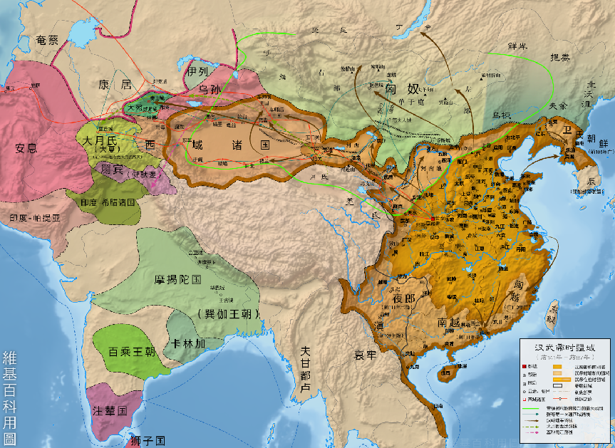
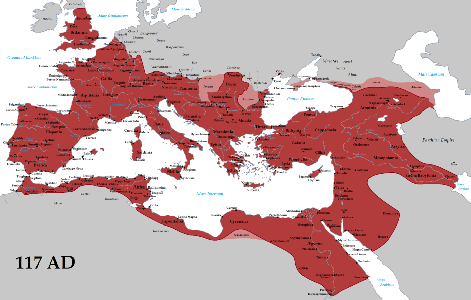

> 刘青乐，计48经42，2024010854

## 一、前言

在世界历史的长河中，秦汉帝国和罗马帝国都曾是辉煌的大一统帝国，一个位于东方，一个位于西方。然而，在它们之后的历史进程中，“大一统性”却呈现出截然不同的面貌。在“后秦汉时代”，中国虽然也经历过若干次分裂，如三国两晋南北朝、五代十国，但总体上中国仍保持大一统的态势，“分久必合”而不是“合久必分”、形成统一多民族国家是历史发展的主流。再观欧洲，在“后罗马时代”，西方世界长期处于分裂状态，未能再次实现大一统。这种巨大的差异背后的原因与政治、文化、经济、地理、民族等多方面都有关系，值得对其进行深入探究。

若要研究“后时代”的差异何以产生，我们必须首先回到“时代中”，甚至是“前时代”来考察。因此，本文将首先回顾秦汉帝国、罗马帝国如何建立政权、统一政权与巩固政权，从中探索多种影响大一统方面的因素，再分别从政治、文化、地理、军事、民族五个方面分析东西方在大一统帝国后一方仍然有统一趋势另一方却不曾再统一过的原因。

## 二、秦汉与罗马建立、统一、巩固政权历程的简单回顾

（一）秦汉和罗马之建立与统一政权：大事年表的进程

中国的秦汉帝国和西方的罗马帝国都建立于长期战乱和区域分裂的基础之上，并通过大规模的军事行动统一了区域内的政权。

春秋战国时期（公元前770年-公元前221年），诸侯割据，征伐战争不断。战国末期，秦国凭借商鞅变法（公元前356年）一跃成为最强的诸侯国，实现了富国强兵的目标，为统一六国奠定了强大的国力基础。“奋六世之余烈”，嬴政在公元前230年至公元前221年间，先后灭韩、赵、魏、楚、燕、齐六国，建立了中国首个中央集权王朝，实现了中国历史上的第一次大一统。秦亡后，汉朝如何维持国家的统一的方法，简单概括就是“汉承秦制”。黄仁宇在《中国大历史》中说：“汉朝的组织者承袭了秦朝所遗下宽阔而又均匀的基层，而且以灵活的手腕避免前代的过于极端。他们所采取的政策，基本上是‘进三步，退两步’。以几十年的经营，构成一个中央集权的官僚制度，而成为中国整个帝制时期的楷模。”

*图 1 汉朝统治范围地图（汉武帝时）*

罗马的政权建立则源自由城市国家向地中海霸权的逐步扩张。在罗马共和国（公元前509年-公元前27年）建立后，经过三次布匿战争（公元前264年-公元前146年），罗马击败迦太基获得了地中海西部的霸权；经过高卢战争（公元前58年-公元前50年），罗马共和国的国土扩张到高卢全境。总之经历数百年的征战，罗马几乎统一了整个地中海地区，成为横跨亚欧非三大洲的庞大势力。在内战和共和体制崩溃的背景下，屋大维在公元27年建立罗马帝国（公元前27年-公元476年），其疆域在极盛时期达到了500万平方公里（见下图）。直到3世纪危机后，罗马帝国分裂为西罗马（灭亡于476年）与东罗马（延续至1453年），大一统的局面不复存在。

*图 2 罗马帝国统治范围地图（公元 117 年）*

（二）秦汉和罗马之巩固政权：制度体系的分析

笔者认为，任何一个政权建政后，若没有一套完整的“巩固政权”的措施，则无法长久地维持政权。历史中的所有长期存在的有一定规模的政权，无一不是在建政后发展了一系列巩固政权的措施。秦汉和罗马也不例外。

秦帝国统一六国后采取的巩固政权的措施尽人皆知，这种措施主要体现为“彻底的中央集权化”。秦始皇推行三公九卿制、地方郡县制，破除了一切形式的封建割据，让中央的命令可以直达地方。此外，“书同文、车同轨、行同伦”，让文字、度量衡、道路宽窄、货币、法律等诸多方面在全国范围步调一致。汉初的“巩固政权”措施有所缺乏，并且郡国并行制赋予地方过大权力，致使政权未完全稳定，爆发了“七国之乱”。可以认为，汉朝的巩固政权是在汉武帝时期完成的。“推恩令”与削藩，确立儒学为官方意识形态，建立都护府制度对边疆进行有效控制。其中，笔者认为意义最显著的一方面就是对孔子学说进行“创造性转化”，确立官方意识形态，这确认了政权在道义上的合法性，这一点在后文探索“多重影响因素”时还会进一步提及。

而罗马帝国的政权巩固主要依赖军事征服、罗马法的普及和“公民权”的推广。军事方面，军队不仅是扩张的工具，也可以用来整合地方、维持内部秩序，扩张的前哨站后来发展成城市。罗马法方面，从《十二铜表法》到《查士丁尼法典》，罗马法做到了维护个人权利，调节社会关系，稳定地方秩序，服务于统治。公民权方面，最典型的事件是公元212年卡拉卡拉皇帝颁布《安东尼努斯敕令》，将罗马公民权扩展至除奴隶外的所有自由人，以增强民众的政治归属感。

然而，若与秦汉相比较，罗马对政权的巩固程度则显相形见绌。在中央体系上，罗马帝国一定程度上是对共和制度的“旧瓶装新酒”，皇帝还需要进行与元老院和行省进行协调，并未完全走向君主集权。在地方制度上，罗马未能建立控制力强大的郡县制行政体系，其行省由总督管理，权力来源随意性较强、制度性较弱，中央对地方的控制力不够强，自然在帝国晚期产生地方割据等现象。在文化上，罗马帝国早期并没有确立官方的意识形态，并且保留地方文化的多元化，这使得罗马帝国各地之间的统一较为松散。基督教本可以成为文化统一的工具，但却在前期遭到打压，直到君士坦丁皈依基督，基督教才在公元313年成为国教。然而这时政治上的分裂已难掩颓势。这种政治上的分裂与宗教上的统一进行复合，便产生了政教分离、双权争斗的现象。

## 三、“大一统能否延续”在东西方存在差异的多重因素分析

从上述比较分析中可以看出，秦汉与罗马虽都是统一，但统一的力度和形式存在较大差异，这从某种程度上已经可以说明问题了：更高强度和完成度的统一必然带来更成熟的大一统方案、更强的大一统意识、更高的大一统认可度，这已经为后世的状态埋下了伏笔。但是，从更广泛的维度上讲，这之外还存在另外几方面维度。因此，本节着重探讨关于大一统能否延续在东西方存在差异这一问题的多种原因，将分别从政治、文化、地理、军事、民族五方面来阐述。

（一）政治维度

大一统性能否延续这一问题，最直观也是最首要的影响因素就是政治因素。政治制度（而非政策）具有很强的延续性，如果创造了一套完备的权力运作机制，这种机制很有可能会在很长一段时间延续下去。因此，笔者认为，中西在权力运作逻辑上存在根本的差异，这也导致后面的历史走向迥异。

先看西方，笔者用“契约型分权”来概括西方传统政治的特征。这即是说，罗马帝国晚期及其衰亡后的中世纪欧洲，政治权力整体上呈碎片化趋势，而且这种碎片化是基于契约的。从前文所述的行省制度就可以管中窥豹，行省长官享有很大的权力，虽然形式上是中央任命，但行省总督基本上在本地有极大的自治权、接近于“准王”，即使在奥古斯都改革后也并不能完全阻止总督的做大。

而“契约性”很大程度上通过封君封臣的政治文化体现。日耳曼人素有“私人效忠”的政治文化，封君封臣制的私人契约也形成了中世纪的封建结构。这种结构决定了总体是分而建国的，地方领主而不是国家中央控制土地，大一统性何由成立？

土地是这样，军队也不例外。罗马帝国盛行雇佣兵制度，把大量边防事务外包给雇佣兵，特别是承包给蛮族军团，如哥特人、汪达尔人。这种雇佣兵制度在短期看来能够缓解军事上的压力，但是必然容易带来权力分散、军力割据的乱象。

此外，还有一些政治的因素也对中央集权造成了挑战。大量城市购买特许状实现城市自治，如1183年的《康斯坦茨和约》，意大利诸城市获得高度自治地位，自主进行税收、司法与军事安排。再比如财政方面，实物经济与地方铸币盛行，中央无法控制货币和税收，加剧了权力的分散化。

对比而言，我称中国自秦汉以来的政治制度为“垂直型集权”。简单看来，就是秦汉帝国通过郡县制建立了一套自上而下、政令直达基层的中央集权体系，有效地建立起一套垂直地对基层控制的方式。这种制度很大程度保障了政权的统一和延续。

不同于封君封臣制度，中国的制度自秦汉以来一贯以来都是“普天之下莫非王土，率土之滨莫非王臣”，皇帝拥有全国的土地、掌管全国的官民。不同于罗马的雇佣兵制度，汉代确立了中央掌军体制，打破了将领拥兵自重的传统，设立“南北军”实现对中央的绝对控制。此后唐代府兵制、宋代禁军制等等，虽各自有所创新和变化，但军权统归中央的思路是不变的。

此外，还有一些有利于巩固中央集权的制度。比如从察举制到科举制的选官制度形成了一套有高度社会基础的官僚体系，也实现了官僚体系对基层的进一步渗透。财政方面，秦汉时期实行“编户齐民”制度，把人口和土地纳入国家财政的严格控制。汉武帝实行盐铁官营是加强中央对经济管辖的又一例证。此外，中国古代还实现了对赋税物资流通的统一调度，这为帝国提供了坚实的物质保障。

（二）文化维度

政治因素虽然最直观也最主要，但是并不是最深层的因素。而文化正是这一更深层的维度，它深深地植根于上到国君下到黎民的精神世界。

中国自秦汉以来发展出一套以儒学为官方意识形态的礼教文化，具有同构、稳定的特征。自汉武帝“罢黜百家，独尊儒术”以来，儒学成为中国帝制时代治国的官方指导思想。“君臣父子”的等级观念维持了中央集权秩序的稳定。此外，儒家思想强大的自适应能力使得它能兼容佛教、道教，让中国的多种宗教矛盾在儒家治国的调和下并不过于尖锐。其次，汉字体系自秦朝以来在全国范围内保持一致，形成了强有力的文化纽带与高度的文化认同。即使存在方言，唐朝《切韵》等规定的标准读音也使得不同地区人同讲“正音”成为可能。此外，中国修正史的传统形成了一个完整的历史叙事脉络，“正统性”与“合法性”进一步强化了天下大一统的观念。

而西方的文化则较为破碎，如同一块多样的拼图。东西教会分裂后，欧洲宗教思想存在严重割裂，不同教派存在严重分歧，在宗教改革后这种宗教的撕裂愈演愈烈。其次，欧洲语言存在进一步分化。罗马帝国解体后，作为官方语言的拉丁语也分化成为罗曼语族的诸语言，如法语、西班牙语、意大利语等。罗曼语族又不同于日耳曼语族，使得欧洲语言的书写与发音存在巨大差异。第三，罗马所引以为傲的罗马法体系也并没有持续地统一整个欧洲。残存的古罗马法、日耳曼习惯法、教会法三者同时存在，甚至有时相互冲突，这也造成了对大一统的冲击。

事实上，西方文化对“大一统”并没有认同，甚至是有些许反对。汤比因在《历史研究》中说：“大一统国家一经建立，就表现出一个最显著的特征：挣扎求生。我们不能把这种特性误认作真正的活力，确切地说，它就像不轻言生死的老年人萦绕心头的长寿欲望。事实上，大一统国家虽然显著表现出本身就是目的的倾向，实际不过是社会解体过程的一个阶段。”“关于大一统国家永恒性的执着信念，还有一个更有力的证据，那就是在大一统国家的覆灭已经证明其并非永恒之后，⼈们还在召唤它们的幽灵。”

我们常说，西方是“法”制社会，而中国是“礼”制社会。“礼”的最大特征就是它是遵从圣人之言，永远绝对正确，不会随时间发生变化，有很强的稳定性，朴素的善恶观念与等级观念也容易深入人心。黄仁宇说的“它的核⼼观念是天⼈合一、阴阳之交替既及于⼈事，也见于自然现象。由于自然现象与⼈事变化都是根据相同的内在律动，所以两者是同一的。既然是天⼈合一，那么宗教与政治间便不再是对立，而神圣与世俗间也不再有所区别”，同样一针见血地说明了同样的道理。再有政治因素的加持，礼教遂成为中国的“国教”，“政教合一”地统一了中国。而与之相比，“法”更多基于统治者的意志，因此常常随时间变化，并不稳定，很难取得非常广泛且深入的认可度，于是单靠“法”很难作为纽带把西方统一在一起。“宗教”教义具有的某种稳定性和易接受性使得它几乎统一了西方，但由于政教分离，宗教仅局限于在思想上统一了西方却没有在政治上统一西方。所以笔者得出一个结论：某种文化具有稳定性、易于接受且有政治对其的加持，才能够成为为政治带来统一的纽带。

（三）地理维度

地理维度似是比文化维度更加深层的，因为其样貌甚至先于人类的存在，“地理决定论”也成为对大量现象可行的解释方案。但由于这部分内容比较老生常谈，笔者姑且简略述之。

欧洲大陆山系纵横、河流割裂，使得整体格局“山河破碎”。横亘的阿尔卑斯山将亚平宁半岛与中欧阻隔；彼此隔断的三大半岛（伊比利亚、亚平宁、巴尔干）形成天然的割据单元，使得统一秩序难以长久。

相较之下，中国地形有“自闭合”的结构，西有高原、北有沙漠、东临大海、南有茂林，形成对外敌的天然抵御。而内部又有连贯的开阔平原，特别是黄淮海、长江中下游部分。此外，秦汉以降的交通工程（如驰道、大运河）进一步打破区域分割，为政治统一提供交通基础。

（四）军事维度

军事维度与地理维度强相关，实际上是地理维度的扩展。

由于中国的地形，中国面对的军事压力基本是单一方向、持续性的北方威胁（匈奴、突厥、蒙古的“威胁链”），而这种单向的正压力反而促进了内部的团结和整合。面对共同外患，中原政权形成了强烈的向心力。中国面临的威胁不仅由于单向促成内部团结，还会主动接受汉化，如北魏孝文帝的改革，这种文化上的强大张力进一步削弱了外敌对中华文明的威胁性。

而欧洲面临的是多方向、异质性的蛮族冲击，四面八方的压力对其构成了撕裂性的力量。且不说日耳曼人、斯拉夫人等对罗马的进攻。欧洲之外的维京人（8 - 11世纪）、马扎尔人（9世纪）、穆斯林（8世纪）也从各个方向入侵，使得西方世界难以保持稳定。然而，蛮族的文化异质性（不会主动寻求同化）、雇佣兵制度造成的军事实力羸弱更进一步加剧了被入侵的威胁性。

（五）民族维度

最后，我想简单谈一下民族的维度。这里我提出两个问题：

为什么中国文明能够建立完备的中央集权制度，而西方没有？

为什么中国的统治者比西方统治者更加青睐中央集权制度？

对于第一个问题，我的答案是：中国文明发源更早，而正是更早的政治发源让中国的政治制度探索有了更多的试错机会。分封制造成了春秋战国的混乱局面，这促使随后的统治者毅然建立了完全不同于分封的制度，选择了严格的中央集权制，形成了一套完整的集权体系。

对于第二个问题，我的答案是：国家君主是否选择集权制度取决于“集权”对其本身是否有更大益处，而这又取决于民众是否容易统治，民众是否容易统治又与民族性密切相关。爱德华·吉本在《罗马帝国衰亡史》中说道：“……以上就是古代日耳曼人的生活状况和风俗习惯。他们生活地的气候，他们的缺乏学识、技艺和法律，他们的荣誉感、侠义心和宗教观以及那自由意识、崇尚武力和渴望冒险进取的精神，全都有助于形成一个产生军事英雄的民族。”或许日耳曼人具有的民族性使得他们并不容易被统治，较难服从于中央统一管辖，也不会给君主提供足够多的利益。然而中华民族素来是“温良”的民族，使得更易管理、更易统治。但倘若进一步发问民族性从何而来，可能又要回归地理因素。

## 四、结语

综上所述，秦汉与罗马虽同为古代世界的大一统帝国，却在政权的延续性与统一性的历史进程上走向了完全不同的轨迹。通过对两大帝国政权的建立、统一与巩固过程的梳理，以及从政治、文化、地理、军事、民族五个维度的深入比较，我们发现：中国自秦汉以来形成了一整套高度集中、可复制、可延续的“大一统机制”，而西方则在多元结构与分权文化的主导下，逐渐演化为区域分裂、权力分散的格局。

这背后不仅是制度设计的差异，更是文化观念、地理条件、民族特性等诸多深层因素共同作用的结果。若说秦汉为中国之后两千年的大一统传统立下了根基，那么罗马的解体则反映了西方世界内在结构与统一之间的张力。历史无法重演，但对制度与文化差异的比较，可以使我们更加深刻地理解何为“大一统”，又如何才能真正维持统一。

参考文献

汤比因：《历史研究》，上海：上海人民出版社，2009年。

黄仁宇：《中国大历史》，北京：三联书店，2007年。

爱德华·吉本：《罗马帝国衰亡史》，杭州：浙江大学出版社，2018年。

斯宾格勒：《西方的没落（第一卷）》，上海：上海三联书店，2006年。
