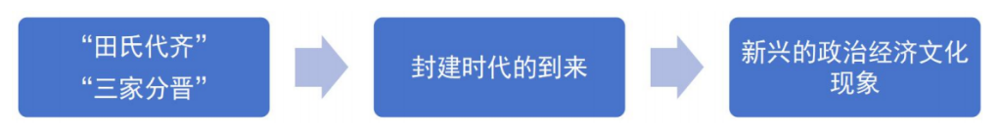

> 秩序的崩坏与新阶段的开启
> ——浅谈“田氏代齐”“三家分晋”的历史意义
> 刘青乐，计48-经42，学号2024010854，邮箱lql24@mails.tsinghua.edu.cn
> 一、“田氏代齐”与“三家分晋”的历史概述

“田氏代齐”和“三家分晋”都是东周重要的历史事件，分别标志着春秋时代政治格局的瓦解与战国时代的到来，史家常视之为春秋时代和战国时代的分界。本部分通过引述史料，简要概述这两个事件的历史过程。

（一）田氏代齐

田氏家族取代姜姓吕氏掌握齐国政权经历了漫长的历史过程，《史记·田敬仲完世家》对这一过程进行了详尽的记述。这一切可以追溯到田氏第一任创始人陈完（后改氏田）——躲避内乱逃亡齐国的陈厉公之子。《史记》记载了陈完早年的一次占卜，暗示了他的后代将篡姜夺齐：

是为观国之光，利用宾于王。此其代陈有国乎？不在此而在异国乎？非此其身也，在其子孙。若在异国，必姜姓。姜姓，四岳之后。物莫能两大，陈衰，此其昌乎？

其后代逐渐在齐国取得权势，辅佐齐国君主，直至最终篡夺齐国政权。下面我用表格整理了《史记》中的相关记载。

| 代 | 氏名（谥号） | 主要事件 |
| --- | --- | --- |
| 2 | 田完（田敬仲） | 桓公使为工正。齐懿仲欲妻完，卜之。 |
| 3 | 田稚（田孟夷） | 未详述。 |
| 4 | 田暋（田孟庄） | 未详述。 |
| 5 | 田须无（田文子） | 田文子事齐庄公。 |
| 6 | 田无宇（田桓子） | 桓子无宇有力，事齐庄公，甚有宠。 |
| 7 | 田乞（田厘子） | 田厘子乞事齐景公为大夫，其收赋税于民以小斗受之，其禀予民以大斗，行阴德于民，而景公弗禁。由此田氏得齐众心，宗族益强，民思田氏。 景公卒，两相高、国立荼，是为晏孺子。田乞不说，欲立景公他子阳生……田乞、鲍牧与大夫以兵入公室，攻高昭子。 悼公既立，田乞为相，专齐政。 |
| 8 | 田常（田成子） | 田氏之徒恐简公复立而诛己，遂杀简公……平公即位，田常为相。 |
| 9 | 田盘（田襄子） | 相齐宣公。 |
| 10 | 田白（田庄子） | 相齐宣公。 |
| 11 | 田和（齐太公） | 贷立十四年，淫于酒妇人，不听政。太公乃迁康公于海上，食一城，以奉其先祀。 三年，太公与魏文侯会浊泽，求为诸侯。魏文侯乃使使言周天子及诸侯，请立齐相田和为诸侯。周天子许之。康公之十九年，田和立为齐侯，列于周室，纪元年。 |

## 表 1 田氏家谱与相关事件

其中，最重要的时间节点，一是公元前481年田成子发动政变杀死齐简公立齐平公：此事亦标志着田成子盗国，史称“田成子取齐”；二是公元前386年田和放逐齐康公于海岛，自立为齐国国君；三是公元前386年田和正式被周天子封为诸侯，标志着“田氏代齐”的正式完成。

司马迁在“太史公曰”里对这一过程有着精炼而又诗性的概括：

田完避难，奔于大姜；始辞羁旅，终然凤皇。物莫两盛，代五其昌。二君比犯，三晋争强。和始擅命，威遂称王。祭急燕、赵，弟列康、庄。秦假东帝，莒立法章。王建失国，松柏苍苍。

（二）三家分晋

该历史事件即人尽皆知的“韩赵魏三家分晋”，《左传》《史记》《资治通鉴》对此均有记述。《左传·哀公二十七年》中提到了智伯与赵襄子的交恶：

知伯不悛，赵襄子由是惎知伯，遂丧之。知伯贪而愎，故韩、魏反而丧之。

《史记·晋世家》对韩赵魏三君取得诸侯地位的过程有比较完整的记述：

哀公四年，赵襄子、韩康子、魏桓子共杀知伯，尽并其地……幽公之时，晋畏，反朝韩、赵、魏之君。独有绛、曲沃，余皆入三晋……烈公十九年，周威烈王赐赵、韩、魏皆命为诸侯……静公二年，魏武侯、韩哀侯、赵敬侯灭晋后而三分其地。静公迁为家人，晋绝不祀。

《资治通鉴·周纪一》是全书的第一篇，开头即写到“二十三年初命晋大夫魏斯、赵籍、韩虔为诸侯。”随后对智伯联合魏桓子、韩康子围攻晋阳城进攻赵襄子、引水淹晋阳城以及赵襄子派使者策反魏、韩两家，三家杀智伯、分晋土地、成为诸侯有着非常详细的记述。出于篇幅所限，这里且不出示原文。

## 二、从礼制文化的角度看“田氏代齐”与“三家分晋”

周礼是研究春秋战国历史永远无法绕过的话题。“田氏代齐”“三家分晋”都是“礼崩乐坏”的典型代表，反映了东周的周王室衰微，礼制崩溃。司马迁在《晋世家》中的“太史公曰”中对三家分晋事件有着十分简要的评价：

四卿侵侮。晋祚遽亡。

这指出了知韩赵魏四卿的行径是越级和失范的，不符合礼制。司马光在《资治通鉴》里同样就“礼”的问题进行了评论：

幽、厉失德，周道日衰，纲纪散坏，下陵上替，诸侯专征，大夫擅政。礼之大体，什丧七八矣……今请于天子而天子许之，是受天子之命而为诸侯也，谁得而讨之！故三晋之列于诸侯，非三晋之坏礼，乃天子自坏之也。

尽管《资治通鉴》更多侧重阐明古代君主的得失以达成对君上劝谏的目的，我们从中仍然能够读出司马光对东周礼崩乐坏的评价：三晋之行径、周王之默许，都造成了礼制的崩坏。

周朝的礼制，是将分封制、宗法制、世卿世禄制等制度与“五礼”等形式融合在一起的统一体，前者强调天子、诸侯、卿大夫、士四个层级严格的等级秩序与贵族世代为官的权力体系，后者强调各种具体的礼仪规范。王明德指出：“分封制是适应父权家族制扩大化的需要，把宗法血缘关系与政治关系紧密结合起来的政治体制，是由血缘政治向地缘政治过渡的必然而又合理的制度安排。”这里，我们主要探讨田氏代齐和三家分晋对分封制的冲击作用。这表现在如下几方面；

（一）卿大夫对诸侯不再敬重，甚至可以决定其荣辱生死

田氏作为卿大夫，本应该听命于齐国国君，辅佐其处理政务，然而从史实中我们发现，田氏势力膨胀后反而成为国君的主宰。田乞不愿立晏孺子，于是带兵攻打高昭子；田成子甚至弑君，杀死了齐简公；齐太公田和也将国君流放到小岛上。可见，国君的荣辱生死被卿大夫所决定。徐志超在《三家分晋考》中进一步指出：“晋国最终‘绝无后’，使晋国宗庙不祀，这严重违背了周初以来‘兴灭国，继绝世’的宗法道德。”

（二）卿大夫可经授命而越级成为诸侯，诸侯头衔成为地位正当化的工具

分封制初期稳定的核心原因就是各安其位、不可越级。然而，韩赵魏三家分晋后，前往都城要求周天子赐予他们“诸侯”的地位。齐太公紧随其后，也受到周天子册封成为诸侯。这说明“礼节”之“名分”仍在，韩赵魏齐国国君必须拥有“名分”为他们“正名”，同时确证他们权力地位的合法性，另一方面却又说明“名分”只是徒有其名，实质上“权力与地位”先于“诸侯的名分”，四国国君是凭借既有的权力地位才获得了“诸侯”这样一个头衔，而非因为被册封“诸侯”才拥有了权力。这种先后逻辑的逆转，体现了分封制的名存实亡。

（三）权力的获取不再依赖世系，而是靠军事、政治手段

世卿世禄制说明了所有官位的获得依赖于血脉，来源于亲缘的继承。然而，田氏依靠其政治手腕夺得了齐国政权；晋三家依靠长久以来积攒的势力以及其军事力量瓜分了晋国，这是对血缘继承的冲击，说明只要拥有足够的力量，权力可以通过非血缘关系的手段获得。此外，田氏和晋三家都开始实行了军功制，使平民拥有了进入权力体系的机会。

（四）此后，礼乐征伐自诸侯而出，周天子成为摆设

分封制下，天子拥有“礼乐征伐自天子出”的绝对权威。在田氏代齐和三家分晋后，周王室进一步衰微，诸侯国的独立性增强（进一步完全独立化），从此诸侯们成为实际上最高的统治者。这也就是孔子所说的“天下有道，则礼乐征伐自天子出；天下无道，则礼乐征伐自诸侯出。”也即“当王室衰微之时，各诸侯国便成为一种离心力量，出现不服之势，甚至与王室分庭抗礼，整个社会呈现出无序状态。”

## 三、从阶级史观的角度看“田氏代齐”与“三家分晋”

阶级史观是唯物史观的重要组成部分，强调从人类社会的基本矛盾和阶级斗争的视角来解读历史事件。学者们认为，“田氏代齐”和“三家分晋”标志着新兴地主阶级登上历史舞台，中国历史由奴隶社会向封建社会转变。这一转变带来了政治、经济和文化等多方面的深刻变革。

（一）新兴的政治现象

前文有所提到，旧贵族固有的特权受到冲击：“诸侯”之位可能被人夺走、权力获取不仅依赖血缘。周天子在战国时代基本被完全架空，不再拥有实权。而一些新兴地主阶级，如前文提到的卿大夫，权力越来越大，打破了旧贵族的束缚成为新的统治阶级。学者齐光指出：“伴随着井田、分封、宗法等几大制度的破坏，使得周天子的权力下移至诸侯，继而下移至卿大夫。”从阶级史观的角度看，这就是新兴地主阶级逐步取代奴隶主阶级的过程。

新兴地主阶级取得权力后，为了巩固自身地位，推举了一系列封建化政治改革，比如推行军功制、建立县制，进一步则“官僚取代贵族，官僚政治取代贵族政治”，县制与官制也成为中国封建政治制度的雏形。“那种宗法血缘与政治关系互补型的国家形态———分封制已失去了存在的根据，必须对此进行改革，使之向纯粹的以地缘关系为基础的政治社会过渡。”这是对这一时期政治转型的优秀概括。

（二）新兴的经济现象

从中学历史中，我们了解战国时代生产力发展，铁制农具和牛耕得到更多的使用，农业大幅进步。除农业外，手工业、商业也蓬勃发展。“战国时期手工业的发展主要表现在：手工工具的变革、手工业经营行业的增多；战国商业发展可以从以下两点反映出来：城市的兴盛、货币经济的发展。”

最为重要的经济现象是：土地领主制的瓦解与地主阶级土地私有制的兴起与确立。新兴地主阶级推行了土地制度改革，废除井田制、土地领主制，确立地主阶级的土地私有制，改变了领主统治下农奴完全被束缚的状态，形成了新的相对自由的农民阶级，地主于是通过土地兼并和土地租佃确立了对农民的剥削。土地所有制的嬗变进一步带来“地主制经济的形成，统一封建国家的建立。”

（三）新兴的文化现象

封建时代的到来给社会带来了巨大的变迁，社会存在决定社会意识，由此带来了思想文化的百家争鸣与繁荣发展。法家思想成为新兴地主阶级利益的代表。

此外，各诸侯国为了招贤纳士，推行文化的多元化。兼容并包、融合发展，成为战国时期文化的主要特征。

综上所述，“田氏代齐”和“三家分晋”带来了封建化的转型，进而衍生了许多新的政治经济文化现象。这些现象虽然不是这两大事件的直接造成的，却间接地获得了它们的影响。用一张图总结如下：

## 表 2 事件直接/间接影响图示

## 四、从政权变迁的角度看“田氏代齐”与“三家分晋”

我个人看待历史事件，特别是历史上的政治事件，总是习惯用“政权变迁”的视角去进行再解读。从本质上讲，无论是田氏代齐还是三家分晋，都是政权的转移，是一个政治权力中心的衰弱与另一个政治权力中心的扩张。齐王室的衰微与田氏势力的扩张带来了田氏代齐；晋王室的衰微与大夫势力的扩张带来了三家分晋。由此便产生了两方面讨论：（1）现任统治者如何维持自己的统治地位不被篡夺；（2）新兴势力如何取得权力。

由此，司马光在《资治通鉴》里写到君主正确的做法：

夫礼，辨贵贱，序亲疏，裁群物，制庶事。非名不著，非器不形。名以命之，器以别之，然后上下粲然有伦，此礼之大经也。名器既亡，则礼安得独在哉？昔仲叔于奚有功于卫，辞邑而请繁缨，孔子以为不如多与之邑。惟名与器，不可以假人，君之所司也。政亡，则国家从之。卫君待孔子而为政，孔子欲先正名，以为名不正则民无所措手足。夫繁缨，小物也，而孔子惜之；正名，细务也，而孔子先之。诚以名器既乱，则上下无以相保故也。夫事未有不生于微而成于著。圣人之虑远，故能谨其微而治之；众人之识近，故必待其著而后救之。治其微，则用力寡而功多；救其著，则竭力而不能及也。《易》曰：“履霜，坚冰至”，《书》曰：“一日二日万几”，谓此类也。故曰：分莫大于名也。

司马光反思了战国的政治过失，总结了经验教训，在这一段内容中强调君主应该重视礼制、维护名分，警惕僭越、防止失权，防微杜渐、注意细节。这自然是以三家分晋为例，回答了前面提到的问题（1），帮君主思量如何避免丢掉权力、维持统治。王磊在《在书写中“儒家化”的中国》中也表达了类似的观点：“解决方案似乎是唯一的，也就是依靠儒家传统‘以礼为之纲纪’，维护‘礼’与‘名’，这也成为整部《资治通鉴》的重要宗旨。”

对于问题（2），中国古籍自然不会公然教人如何逆反弑君，因而少见对该问题的回答。然而西方的马基雅维利在其经典著作《君主论》中明确阐明了作为“新君主”应该如何获取政权并加以稳固之。这些做法包括但不限于建立自己的强大的军事力量、灵活运用残忍和仁慈、避免遭受民众的憎恨和蔑视、防范奸佞谄媚臣子听取谏言等。总之，从“田氏代齐”“三家分晋”的历史事件，加之政治学上的思考，我们能得到正反两方面的历史经验，这或许也是这两个事件留下的另一种形式的历史意义——历史经验与启示。

这些经验和启示实际上对我们党和国家今日之治国理政也有莫大的启示。从“田氏代齐”“三家分晋”的整个历史过程来看，姜齐王室和晋王室的失势，是因为长久以来对大夫势力扩张的纵容；齐桓公之后，齐国内部的田氏家族逐渐崛起，通过积累财富和笼络人心，最终取代了姜姓国君；晋国的智伯则因为用人不当，且没有处理好与盟友的关系，最终导致盟友叛变，智氏家族被灭。这些历史事件表明，无论是内部的权力失衡，还是外部的盟友关系，都对国家的稳定和长治久安有着深远的影响。今日的政治，同样面临着国际关系的处理，也面临着国内各种不同群体的利益诉求，其中也存在一些敌对的势力。因此，我们必须从历史中汲取经验教训，正确处理国际关系、建立科学完善德才兼重的人才选拔机制、强化内部治理全面从严治党、注重大局稳定保证国家安全。

## 五、结语

总结起来，“田氏代齐”与“三家分晋”两个重要的历史事件，可以从不同的角度进行解读。从周制的角度看，它们都是“君不君、臣不臣”的体现，颠覆了周礼，加剧了东周“礼崩乐坏”的局面。从阶级史观的角度看，这两个事件开启了中国的封建社会时代，带来了新兴的社会关系与社会制度。最后，这两个事件的历史意义还在于留下的政治智慧和政治启示。

参考文献

[1] 司马迁：《史记》，北京：中华书局，1982年。

[2] 左丘明：《左传》，北京：中华书局，2018年。

[3] 司马光：《资治通鉴》，北京：中华书局，1956年。

[4] 简洪玲：《春秋战国之际（前481-前386）的社会变迁——学术史视野下的新考察》，苏州大学硕士学位论文，2014年。

[5] 王明德：《论春秋战国时期贵族政治向官僚政治的转变》，《理论导刊》2009年第03期。

[6] 徐志超：《三家分晋考》，《中国典籍与文化》2020年第02期。

[7] 齐光：《论三家分晋与田氏代齐之异同》，《时代报告》2020年第02期。

[8] 汪元欢：《战国时期土地所有制嬗变研究》，《理论观察》2021年第02期。

[9] 战化军：《孟子民贵君轻思想与田氏代齐》《山东理工大学学报（社会科学版）》，2005年第05期。

[10] 王磊：《在书写中“儒家化”的中国——“三家分晋”在&lt;史记&gt;与&lt;资治通鉴&gt;中的比较研究》，《内蒙古大学学报（哲学社会科学版）》2013年第45卷第02期。
