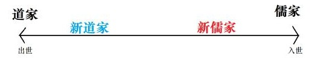

## 一、万古江河

（浅谈中国历史，2022.9.11）

要讲中国史，是一件极其困难的事情。既要全面，又要有所见解，还要有所新意，不能光讲那些老生常谈的内容，这就要求广泛阅读、踏实治学，在掌握基础史实的基础上，博览众家史论开拓眼界发展自己见解。

如果在这里复述“夏商与西周，东周分两段，春秋和战国，一统秦两汉，三分魏蜀吴，二晋前后延，南北朝并立，隋唐五代传，宋元明清后，皇朝至此完”就过于没劲，所以这一篇小论，我就先简要介绍一下几部中国史经典著作并简要分享，在最后集中阐发一下对中国史的观点。

第一是钱穆先生的《国史大纲》。这本书是经典中的经典，可以被理解为一本正史书，是史学家钱穆先生在抗战中国战况不佳，面临亡国危险时，为了保存中国文化中国精神好在将来教育国民复国用的参考教材，也因此作者为止倾注了心血。虽然繁体竖排半文言读来费劲，但若真的啃下来，其史实详度、史论深度于我也会帮助极大。

第二是吕思勉先生的经典著作《中国通史》，分为上编中国文化史和下编中国政治史。

下编的中国政治史就是比较中规中矩的中国通史写法了，详细程度大致与《中国历史（七八年级）》和《中外历史纲要（上）》相当，而我心目中更高的成就则出现在上编，即中国文化史，分为18章，如下：婚姻、族制、政体、阶级、财产、官制、选举、赋税、兵制、刑法、实业、货币、衣食、住行、教育、语文、学术、宗教。下面，我将对其中几个比较重要的方面简要概述，大致也和《国家制度与社会治理》《经济与社会生活》《文化交流与传播》中的中国部分相对应。

| 时代 | 央地制 | 中央官制 | 选拔制 | 法律 | 赋税制 |
| --- | --- | --- | --- | --- | --- |
| 先秦 | 分封制 | 分封制 | 世卿世禄制 | 道法之辩 | 土地人头税 |
| 秦 | 郡县制 | 三公九卿 | 军功爵制 | 法家 | 泰半之赋 |
| 西汉 | 郡国并行 | 中外朝 | 察举制 | 《九章律》 | 十五税一 |
| 东汉 | 郡县制 | 尚书台 | 察举制 | 《九章律》 | 十五税一 |
| 魏 | 州郡县 | 三省制 | 九品中正制 | 《曹魏律》 | 租调制 |
| 西晋 | 州郡县 | 三省制 | 九品中正制 | 《晋律》 | 租调制 |
| 东晋 | 州郡县 | 三省制 | 九品中正制 | 《晋律》 | 租调制 |
| 隋 | 州县 | 三省六部 | 科举制 | 《开皇律》 | 租调制 |
| 唐 | 道州县 | 三省六部 | 科举制 | 《唐律疏议》 | 租庸调制 |
| 北宋 | 路州县 | 二府三司 | 科举制 | 《宋刑统》 | 两税制 |
| 南宋 | 路州县 | 二府三司 | 科举制 | 《宋刑统》 | 两税制 |
| 元 | 行中书省 | 中书省 | 科举制 | 《大元通制》 | 两税制 |
| 明 | 三司巡抚 | 废丞相中书 | 科举制 | 《大明律》 | 一条鞭法 |
| 清 | 省府县 | 军机处 | 科举制 | 《大清律例》 | 摊丁入亩 |
| ROC | 省道县 | 总统制 | 文官考试 | 《临时约法》 | 仿西方税制 |
| PRC | 省县乡 | 人代会 | 公务员考试 | 《八二宪法》 | 个人所得税 |

对我震撼最大的，还是许倬云先生的《万古江河》。历史这条河，生生不息，中华文明，也正是这样一条万古的江河，从高山上发源，困难地流到山下，一路经历各种地形，汇入各种支流，奔腾不息，有一个入海的目标和方向，不断地流着。这本书并不侧重政治史，而着眼于中国圈发展的脉络，从中原的中国，到大陆的中国，到东亚的中国、亚洲的中国、世界的中国，文化圈体系在整合拓展，物质文明在发展，经济社会百姓生活各有各的形态。这是一本中国历史书，却不仅仅是一部中国历史。这本书贯彻了新历史观、大历史观，前者提倡不止写王侯将相贵族史，而要大力写百姓生活、民族关系、生产力状态、工业农业、思想学术、宗教文化等等；后者起源于斯塔夫里阿诺斯，以一种更高的视角、全球的联系的观点看整合历史。我看到了中国历史中，民族交融过程的中华多民族大统合、经济发展中的东亚经济圈大统合、思想碰撞中的学派的东亚大统合。不论政治经济文化社会民族哪方面，这种发展的统合力、凝聚力、包容力，大抵也是中华文明传承发展的秘诀了。由于内容实在精妙，我将其目录附在这里，如下。

《万古江河》的目录大致如下：

- 第一章 古代以前：中国地区考古略说
  - 孕育出中国文化的自然地理
  - 旧石器时代的的人类活动
  - 农业与聚落
  - 新石器文化的区系类型及聚合过程
  - 古代传说与族群分合
  - 复杂社会的出现
  - 中国古代文化与两河古代文化发展的比较
  - 民族关系
  - 中国对外关系
  - 唐帝国与伊斯兰帝国的比较
- 第二章 中国文化的黎明（BC16C-BC3C）
  - 进入青铜时代
  - 古代文化核心的商文化
  - 华夏文明体系——西周封建与“三代”观念
  - 中国秩序的发展与重组——地方文化与融合
  - 中国思想体系的核心成形——孔子学说及诸子百家的辨证发展
  - 南方的兴起——长江流域的发展及其与中原的融合
  - 编户齐民：国家组织与人民生活
  - 生活资源与生活方式
  - 中国古代文化发展的特色
- 第三章 中国的中国（BC3C-2C）
  - 普世国家体制
  - 精耕农业与市场网络
  - 中国文化体系的整合
  - 民间的信仰
  - 北疆游牧文化与中国文化的接触
  - 走向南方
  - 佛教传入中国与道教的形成
  - 秦汉中国人的日常生活
  - 秦汉帝国与罗马帝国的比较
- 第四章 东亚的中国（2C-10C）
  - 秦汉帝国的崩解
  - 中国与周边民族
  - 佛教的影响
  - 文学与艺术
  - 天文、数学与医药
  - 中古的衣食住行
  - 经济形态的转变
  - 中国与西方的文化接触
  - 通俗文化
  - 当时的欧洲
- 第五章 亚洲多元体系的中国（10C-15C）
  - 中古后期的中国与列国体制
  - 北族政权与汉人世界
  - 东亚经济圈的形成
  - 经济与多元网络
  - 宋代以来的知识阶层
  - 思想的多元与整合
  - 近古科学与技术的发展
  - 近古中国人的日常生活
  - 近古中国与东亚转型的特色
- 第六章 进入世界体系的中国 上（15C-17C）
  - 明代中国文化体系的僵化
  - 人口与生活资源
  - 大海波涛
  - 第一波西潮
  - 明代的工业
  - 明代的市场经济
  - 南北经济社会的差异
  - 明代思想的转变
  - 明代中国与哈布斯堡王朝的西班牙
  - 明朝时的台湾
- 第七章 进入世界体系的中国 下（17C-19C中叶）
  - 清帝国的性质
  - 台湾的开发
  - 清初民族与文化冲突问题
  - 清代学术风气
  - 民间社会组织
  - 中国与西方国家的关系
  - 清代的商业活动
  - 中国与西方的文化接触
  - 通俗文化
  - 当时的欧洲
- 第八章 百年蹒跚（19C中叶-20C中叶）
  - 内乱与外患
  - 中国近代经济的改变
  - 教育制度的改变
  - 近代中国的武化现象
  - 都会文化的勃兴
  - 时代思想与文化变迁
  - 中国近代革命与俄国革命的比较
  - 中国维新运动与日本明治维新的比较
  - 台湾百年的变化

对于拓展读物，《哈佛中国史》也是极好的，其分为《早期中华帝国：秦与汉》《分裂的帝国：南北朝》《世界性的帝国：唐朝》《儒家统治的时代：宋的转型》《挣扎的帝国：元与明》《最后的中华帝国：大清》六册，装帧漂亮，内容也都是新历史的内容，对于《万古江河》也是很好的补充。

关于中国历史，这里就要简要集中阐述我的一些观点了。这里的见解，要除去文学艺术哲学这些部分的，毕竟后文还要介绍。对于中国历史，我就简明发表一下议论。

这里的议论，我想以史观为抓手去一一梳理。这些史观包括传统史观、地缘史观、唯物史观和阶级史观、民族史观和文明史观、现代化史观。

传统史观。“王侯将相宁有种乎”，自古中国人便相信“皇帝轮流做、明年到我家”，也就因此不像日本那样对万世一系的天皇有足够的敬畏之心。中国古代靠起义或政变而篡权的皇帝，总会试图给自己找各种合理合法化的理由正名。这种朝代更迭、顺天改朝，甚至五行相克的朝代更替史观是很传统的。这种史观的解释方式，非常具有文学性和传奇色彩，读来也会让人“肾上腺素飙升”，但终归只是人们的臆想，毫无科学依据，况且一到近代便全然失效。其次，古来便说“话说天下大势，分久必合合久必分。”我们中国古代史的教科书也说，统一是大势所趋。如果说中国历史的总趋势是统一，那么印度古代史的总趋势便是分裂。

中国古代大部分时间是统一的，只有少部分时间如春秋战国（BC770-BC221）、三国两晋南北朝（220-589）、五代十国（907-960）这些时间是分裂的，辽宋夏金元毕竟汉民族主体统一姑且不算作分裂，而更多的时间，秦汉隋唐元明清都是大一统盛世；而印度却只有孔雀王朝（BC324-BC187）、笈多王朝（320-540）这些短暂的时间是统一的。中国的近代是割据分裂的，我们说统一是大势所趋，新中国成立；印度的近代被英国统一殖民，但印巴分治获得独立后，我们是否说统一或是分裂是历史的趋向呢？即使刨除掉西方严重参与的近代史部分，只看古代史，统一是大势所趋、民心所向的道理是否说得通呢？这就不得不说到地缘史观。

地缘史观。地缘史观和地缘政治学一样，都用地理视角来考察世界解释问题。欧洲之所以长期分裂，中华帝国之所以长期统一，大抵都可以通过地缘观来解释。欧罗巴大陆中部平原面积大，地形不受阻隔，因而想建立一个统一的大的帝国并不容易，战争十分容易爆发。

中国东南两面临海，西部有天堑青藏高原，北部有荒漠，这种天然屏障可谓极好的农耕文化帝国的摇篮，也正是因此，游牧民族对汉族的侵扰也得到了合理的解释——毕竟只有北面荒漠一条通路。同样的道理，也可以解释两河平原的历史征战，喜马拉雅山脉和开伯尔山口下印度半岛的分分合合，甚至可以来解释现代国家的战略布局，乃至各国民族文化传统的来由。

这种地缘史观，本质上是一种物质决定论的观点。在这个意义上，中国史的发展潮流就是由这片大陆的地理条件先天决定的了，也正是因为“地缘”，中国历史的主流是统一这一观点才有了科学道理。

唯物史观和阶级史观。这是当代中国官方意识形态提倡的史观。按照传统马哲历史唯物主义的观点，人类社会发展的根本动力就是生产力和生产关系、经济基础和上层建筑的矛盾运动。生产力决定生产关系，生产关系要符合生产力并反作用于生产力；生产关系即经济基础决定上层建筑，上层建筑要符合经济基础并反作用于经济基础。这一套理论，从形而上的角度有效地解释了整个人类社会历史的发展进程，从原始社会，到奴隶社会，再到封建社会。

随着私有制和阶级的出现，原始社会解体，奴隶社会诞生，而随着地主这一新兴阶级的诞生并进行改革运动，封建社会诞生。具体到中国，战国时期就进入了封建社会，但是秦朝以来的中国却并不是封建制的国家，因为封建制和中央大一统制还是有巨大区别的。之所以把秦至清的超长历史称为封建社会，只是因为这一时期的生产关系、上层建筑符合封建社会的特征，社会矛盾体现在农民和地主，但农民和地主的具体关系与古代西欧、古代日本也是有天壤之别的。在此基础上，我们说中国封建社会演化的总特征是君权不断加强、中央权力不断加强，而中央权力不断发展的同时也能从各种经济制度看出封建制度的人身依附关系不断解体，正是在专制主义中央集权发展到顶峰的清朝，赋税上采取纯粹地产税而不是人头税的措施。这也为封建制度的解体做了伏笔。到了中国的半殖民地半封建社会时期、新民主主义时期、社会主义时期、中国特色社会主义时期，这一套生产力生产关系经济基础上层建筑的规律依然适用。可以说，这一套支配人类社会的规律，是科学的成功的，用在世界各国各地区也都是合理不违和的。这套理论还强调阶级斗争在阶级社会的作用。中国长久的封建时期，有着无数的农民起义，都属于阶级斗争。这些阶级斗争的被压迫阶级虽然具有反抗性，但因为阶级不够具有先进性，时代生产力问题，都没有实现推动社会进入新形态的作用，成功者也都是再建立新的帝制国家。不过，宏观整体地看，整个社会的生产力和生产关系还是在一个又一个王朝的更迭中不断运动，规律依然支配着中国社会走向新的社会形态。

民族史观和文明史观。有历史学家指出，中国的历史就是一部民族不断“统合”的过程。

春秋战国时期，汉民族主体周围的少数民族戎狄蛮夷，也都开始有了华夏认同概念。传统的“中国”，指的无非就是河南一带的中原地区，其民族自然是炎黄子孙——汉民族。然而，随着历史的发展，汉族文明产生了强大的内吸力，逐渐将西南地区、西域地区、青藏地区、东北地区、东南沿海的少数民族都并入中华民族的范畴，纳入中央政府的管辖。其中最值得一提的就是匈奴、突厥、蒙古。汉朝时汉人击退了匈奴，唐朝时汉人击退了突厥，然而三国两晋南北朝却常有五胡乱华和蛮族入侵，或者美称为“民族交融”，宋朝时也有政权分立，宋人也未曾把辽人、金人、西夏人、蒙古人视作“一体的中华民族”，全当外国人入侵来看。

当然今天，我们看辽金夏元还有清朝的历史，都是算作中国历史的，其主体也都是中华民族的一部分。中华民族就从单一的民族扩展到56个民族的大家庭。但是，民族主义的思潮是常有的，民族国家的思想也是长存的，正是如此，我们现在才在提倡中华民族共同体的概念。

现代化史观。这种史观，用在欧美历史是自然而然的，而用在其他亚非拉地区的历史，现代化的历史就不得不是“向西方学习的历史”。从1840年以来，中国经历了向西方学器物、学制度、学思想的“师夷长技”“中体西用”的历史进程。直到现在，世界的主流主导依然是西方。我们不禁发问，难道只有科学和理性才是人类正确的武器吗？只有西方的自由平等思想才是人类正确的思想吗？所有西方现代历史进化涌现的东西都是进步的先进的吗？对于第一个问题，我想现代的实践证明答案是肯定的。而对于后两个问题，暂时还是无解。政治课本上津津乐道的中国新型政党制、中国特色民主制、中国式现代化、中国的制度优势等等，虽是施政工具，但细细想来，难道不无道理吗？不论如何，人类都在不断现代化、后现代化的进程中。只要认可现代化史观，所有的“历史终结论”便都是虚妄的言论罢了。21世纪远远不是人类的尽头，各种意识形态提出了不同的目标理想。而不论是美好的乌托邦构想，还是富国强国的现代化目标，都坚信，人类社会还在前进。

## 二、日升海上

（浅谈日本历史，2022.10.2）

日本，作为一东方古国，有着悠久的历史。然而国人却对这个近邻的历史知之甚少，关于日本史可能只从历史教科书听过“大化改新”“明治维新”，以及近代以来和中国有关的事件如甲午战争、侵华战争（即抗日战争，属于二战）。了解稍微多一点的人，可能听说过奈良平安、三大幕府、织田信长、丰臣秀吉、大正昭和这些词汇。换言之，我们学“东方历史”，只注重了本国史本民族史，强调古代中国在东亚的至高地位，关注了汉族及各少数民族的历史，而对整个东亚圈的发展状态不太了解。整个东亚圈，不仅是自古以来的天朝上国，还有朝鲜、日本、越南、南洋这些地方。这个小册子“东之话”，本就是想围绕着东亚文明展开，一方面是为着反驳西方中心论，另一方面也是为着突破中华至上论。东之话的内核，就是打破“西方文明才是优秀文明”这种偏见，考察东亚文化圈、儒家文化圈的文明；超越民族主义壁垒，不仅仅看到中国，采取东亚整体的视角。上一节已经简述过中国历史，这节我们便来看一看日本历史。

本节的参考资料有井上清著《日本历史》，坂本太郎著《日本史》，张宏杰著《简读日本史》，陈勤著《简明日本史》。

日本历史也可以按照经典三分法来分，古代（明治维新前）、近代（二战前）、现代（二战后）；也可以按照经典的社会形态来分，奴隶社会（大化改新前）、封建社会（明治维新前）、资本社会（明治维新后）。不过最好还是用日本本土化的分类方式，以诸时代来划分，原始时代的绳文时代、弥生时代，早期国家有邪马台、古坟、飞鸟、奈良、平安，幕府时期的镰仓、南北朝、室町、战国、安土桃山、江户，以及幕府终结近代的明治、大正、昭和，现代的平成和令和。

日本人种的起源还有待进一步考究，但较为靠谱的说法便是数万年前从欧亚大陆迁过去的突厥人种。大约1万年前，日本诞生原始文明，是为绳文时代，其后进入了进步一些高级一些的弥生时代。再过后，日本建立了一些早期国家，从中国的史书中能看到，汉代时有乐浪郡，晋代时有邪马台国，刘宋时日本有五王国。日本这时的早期国家，首领称大王，采取氏姓制度、部民之、屯田田庄制，总之可以说是集团奴隶制。其后的一个重要事件是苏我氏执政。在苏我马子和圣德太子执政时期，天皇称呼被创立，有了遣隋使。圣德太子改革后，便在646年进行了熟知的大化改新。这一改革实行了中央集权制，废除部民制度，实行租庸调制、班田收授制。

日本的政治进入了封建时代，当时的飞鸟时代（694-710）是以藤原京为都城，随着换都城，时代名也跟着改变，随后是定都平城京的奈良时代（710-784）、定都平安京（京都）

的平安时代（794-1185）。平安时代，藤原氏政治势力强大，藤原氏摄政，其后也有了摄政、院政的天皇被架空时期，也为后来的幕府时期做好了政治铺垫。

大化改新以来的土地制度并没有很好地起到加强中央集权的作用。随着压迫的严峻，农民逃跑，公田被荒弃，大量土地很快被富农大地主兼并。地方的大地主庄园逐渐发展。这些大地主称为名主、地头，拥有半独立的权力，其中最大的就是源氏和平氏。1156-1159年的保元、平治之乱后，源氏势力下降，平氏取代藤原氏建立了六波罗政权。而1180 年的源平两家战争源赖朝战胜了平清盛，源赖朝建立了镰仓幕府，成为了征夷大将军。随后，源氏的镰仓政权却被北条氏家族掌握。

镰仓时代的重要事件，包括1274年的反元战争，以及幕府下的家族集团的武士发展。

经济上，随着总领制崩溃，各种反抗起义兴起，1338 年镰仓灭亡。后醍醐天皇采取改革实现建武中兴，随后足利尊氏，代表北朝灭掉了南朝的天皇代表的“正统政权”，结束了南北朝，在1338年在京都建立室町幕府，日本进入室町时代。室町幕府本就不稳定，因为室町幕府采取守护大名制，依靠守护和大名的势力，但守护和大名本就跟中央权有矛盾，公家和武家的权力难以平衡。这一时期，村民自治组织“惣”和反幕府反守护大名反庄园领主的国人联盟“土一揆”发展，进行了大型战乱“应仁文明之乱”， “下剋上”活动频繁，资本主义萌芽产生，工商业和地方町发展，重要的自治城市堺也兴起。随后，大名进入割据时期，日本进入大名割据的战国时代。

织田信长战胜了他的三大敌人（神社、诸大名、土一揆），统一大业即将完成，却在本能寺之变被叛变的家臣逼迫自杀。这家臣的一个武士名羽柴秀吉，他凭借手腕登上高位，统一了全国，使日本首次统治了北海道和琉球，改姓丰臣，是为丰臣秀吉。统一后实行集权统治，实施太阁检地、灭天主教、统一度量衡和驰道。织田信长和丰臣秀吉堪称日本的秦始皇，他们的时代也被称为安土桃山时代。

丰臣秀吉死后，德川家康掌权并将丰臣家族的人“团灭”，在1603年建立江户幕府。江户幕府采取严格的中央集权，封建制这一时代最终完成，并严格锁国，平定各种叛乱如岛原天草之乱。然而盛筵必散，盛极必衰，封建体制也走向了濒临崩溃的地步，资本主义的萌芽持续发展，大的城下町如江户京都大阪也大大发展，享保改革失败后的宝历明和事件、田沼改革、宽政改革、蛮社之狱、天保改革也都没起到拯救封建制的作用。加之外界的资本主义世界征服，日本签了《安政条约》不得不开口通商。

民众尊王攘夷情绪高涨，但随后攘夷派都变成了倒幕派，日本开始浩浩荡荡的倒幕运动，1868推翻德川幕府实现王政复古，明治天皇也开始了明治维新。

明治维新的内容我们是熟悉的，在五条誓文发布后，诸如废藩置县、殖产兴业、文明开化、征兵制建新式军队等措施也都被采取。这是一场自上而下的现代化运动，日本收回了与欧美的不平等条约，瓦解了封建领主制，从被压迫国成为了压迫国，这一时期的政治家木户孝允、大久宝利通、西乡隆盛产生了“征韩论之辩”，后来与朝鲜缔结了“友好条约”。

明治维新到二战前的这一段日本历史是大家比较陌生的，正如光荣革命、拿破仑战争后到一战前的英法两国一样令人陌生。这一时期的时代潮流是“自由民权运动”。从各种民权革命权理论家提出理论开始，日本开始了各种运动，起义运动如伊势暴动、西南战争、炮兵兵变，党派运动如爱国社、国会同盟、请愿设立国会、自由党改进党建立。在两党矛盾、通货紧缩、阶级矛盾的背景下，日本爆发了群马加波山事件，随后自由党解散，之后的秩父饭田事件后，改进党也解散。紧接着，朝鲜爆发改革运动、甲申政变，两党被沙文主义利用复活，并在井上馨外相修订条约斗争后，自由民权运动最后一次兴起，后面的“反动”活动被伊藤博文颁布的《保安条例》禁绝了。更值得记录的事件是日本在1889年颁布《大日本帝国宪法》完成了天皇专制，将天皇完全地神格化，极端地集权化，伊藤博文出任第一任首相，日本也产生了日本式的国会。第二届国会上，民党（前身即为自由党和改进党）似战胜了政府党，但在第四届国会上民党屈服了。自由民权的思想还在燃烧，在伊藤博文、黑田清隆、山县有朋、松方正义、西园寺公望内阁期间，自由进步宪政思想、社会主义思想也在民间传播扎根。

随后的事件为我们所知，如1894的中日甲午战争、1904的日俄战争、1910年吞并朝鲜与设置军部。值得一提的事，1905 年日俄战争胜利后东京群众被军国主义势力煽动爆发了轰烈的群众暴动。日本进入了和寄生地主制相结合的垄断资本主义阶段，日本也从原来的英日同盟转变为与英美等国有矛盾。明治天皇死后，日本在1912年进入大正时期，桂太郎组阁后被暴动逼迫辞职的事件史称大正政变，随后山本权兵卫、大卫重信、寺内正毅依次上台组阁。随着一战结束、欧洲帝国主义力量被冲击、资本主义经济走低，日本民本主义、社会主义、个人自由主义思想潮流一时兴起，1918 年爆发因米价过高导致的米骚动，随后原敬上台组阁。后面的日本政治时代依次经历了：高桥（是清）内阁、加藤（友三郎）内阁、山本（权兵卫）内阁、清浦（圭吾）内阁、加藤（高明）内阁、若槻（礼次郎）内阁。其中，清浦内阁时期，日本有著名的“三派联合内阁”现象，左劳动农民党、中日本劳农党、右社会民主党三派联合内阁试图颁布法律规定普选、改革贵族院，效果并不显著。

1926 年日本进入昭和时期，其自由民权运动暂时不再是时代中心，军国主义色彩在日益浓厚。外相币原喜重郎实行的外交政策协调英美以维护日本既得利益，后面田中义一首相干涉中国内政。面对经济大危机，日本发动侵华战争，1931年发动九一八事变，1932的五一五事件首相犬养毅被暗杀后军部马首是瞻，1936 二二六事件两位首相斋藤实、冈田启介遇刺，军部的权力进一步增长。1936广田弘毅上台组阁，1937年七七事变发动全面侵华战争，中日进行了四次大规模会战（淞沪、太原、徐州、武汉），后面的首相林铣十郎、近卫文麿、平沼骐一郎、阿部信行、米内光政、东条英机、小矶国昭，再包括日本第124任天皇裕仁（昭和天皇）也都是臭名昭著的战犯。日本发动全面太平洋战争、日美战争，偷袭珍珠港、中途岛海战。最终日本面临中国战场抗日民族统一战线、东南亚人民的斗争、美苏的进攻以及小男孩和胖子，与1945年8月15日宣布无条件投降，9月2日签投降书。

战后，日本被盟国管制，战犯被审判，唯独天皇被免除了审判，天皇制得到保留，昭和时代持续到1989年，明仁天皇与1989改年号平成（2019年德仁天皇改年令和）。盟国占领时期，日本被实行非军事化和民主化改革，在美国的参与下制定新宪法、镇压1947年的二一罢工，通过土地改革彻底消除封建残余，签订《日美安全保障条约》，日本进入现代。

最后谈到日本和周边的关系。日本与中国的关系自古以来无法分割，中国似是日本的老师，日本却在学习的同时大量保留了其本土的民族特征，表面畏古代强大的中国，却一直觊觎中国的资源。其与朝鲜也难以割舍。朝鲜半岛历史从三国时代（新罗百济高句丽），到新罗时代，到高丽时代，到李朝朝鲜，再到日本殖民地、朝鲜战争后的分裂，一直与日本一衣带水。

日本史梳理到这大抵可以告一段落，不过考虑到本文前面都侧重政治经济史，后文对文艺的介绍也都以中国为主，这里还是要简要梳理一下日本的文化发展史，考察一下文学绘画通俗文化这些内容的发展。这些内容，还是以坂本太郎的《日本史》为主要参考。

## 三、东南西北

（浅谈亚洲史，2022.2.14）

历史在某些人的印象中是一门死记硬背、枯燥乏味的学问；而事实上，当我们真正走进历史这本大书中，我们会发现它的有趣。

国内中学历史教材往往把中国历史放在一个比较重要的位置，甚至比世界历史还要重要。

在我看来，这其实是不正确的。对于对历史还不甚了解的初中生而言，先细致学习中国史还是可以接受的，毕竟学习中国史的难度远远低于学习世界史，因此学习中国史对培养学生对历史的兴趣和历史学科的方法是重要的。而到了高中、大学，树立一种全球意识应该是更重要的。在当今一个全球化的时代，民族主义不能解决任何全球性问题，只有敞开心扉和世界接轨，才能共商共议解决全球性难题。因此，本着各民族、各国文化平等的观点是很重要的。

我一直崇尚的是，我对中国史了解多少，就应该对欧洲史了解多少、对中东史了解多少、对美国或日本史了解多少，而不是像今日割裂成《中国历史》《世界历史》两个部分，甚至世界史的厚度还不如中国史、高考命题重点放到中国史上。因此，各种历史理应平等，以供学生平等学习。现代社会里，这种全球性意识更加重要。

这就不得不谈到“大历史”和“小历史”的区别。过去我们常常学的是小历史：中国历史的夏商周秦汉隋唐宋元明清，或者欧洲历史的希腊罗马法兰克拜占庭。而斯塔夫里阿诺斯开创的全球化历史观念，尤其在他的作品《全球通史》中得到体现。作者是秉持着全球化历史观念，以去中心化为指导，并不是像传统历史以欧洲为中心，或是我们的历史以中国为中心，而是以时代为依据地，写了远古、中古、近古、近现代的欧洲、亚洲、非洲、美洲全球的历史，不仅是作者所生活的西方世界，对于中国文明、日本文明、印度文明、阿拉伯文明，甚至中亚的游牧民族文明都有细致的介绍。文明中，我们能看到早期文明的埃及、巴比伦、印度、长江黄河文明，文明拓展时期的亚述、赫梯、波斯（阿契美尼德，波一）、希腊、亚历山大、罗马等。我们还能看到中东的安息、萨珊（波二）、伊斯兰文明的阿拉伯帝国（四大哈里发、倭马亚、阿拔斯）、伊利汗国帖木儿帝国、萨非（波三），能看到拜占庭、奥斯曼，能看到穆斯林文明的三大帝国奥斯曼、萨非、莫卧儿，能看到孔雀、笈多、德里苏丹、莫卧儿，更能看到中亚游牧民族匈奴、突厥、蒙古对世界历史的作用。上下部以1500年为界限，分别是走向融合的世界和全球化加速的世界，让我能够看到全球多文化之间历史发展的互动与联系。这真的可谓是一位伟大史家，以全球化意识书写历史，也是我前文所说的“历史文化平等说”和“去中心化说”。事实上，马克思主义所坚持的历史唯物主义，也是这种大历史的思想，从唯物史观的角度解释了人类历史发展的一般进程——生产力与生产关系、经济基础与上层建筑的矛盾运动。

比《全球通史》的视野更大的是美国历史学家大卫·克里斯蒂安的《极简人类史：从大爆炸到21世纪》以及以色列历史学家尤瓦尔·赫拉利的《人类简史》三部曲。先说前者。

以前的人们书写历史常常秉持着薄古厚今的观点，讲古代史略写，近现代史详写。而这位作者突破了传统观点，全书分为四部分：第一部分讲述宇宙的演化，第二部分为“开端：采集狩猎时代”，第三部分为“加速：农耕时代”，第四部分“我们的世界：近现代”。读完这本书，我的第一感觉便是视野被打开，我能够跳出某些史实、事件、朝代，也跳出古代、近代、现代这种人为分期，站在宏观的角度，俯察人类的发展，受益匪浅。

再说《人类简史》。与其说这是一部历史书，更可以说这是一本多学科杂糅的解释人类的专著，所提出的不少论点和《今日简史》《未来简史》有相似之处。《人类简史》中第一部分认知革命，讲述了人类的起源：人类只是普通的一种生物，来源于自然选择。第二部分农业革命，讲述了农业的产生导致智人数量大增，人类成为自然主宰，出现阶级。第三部分人类的融合统一讲述了金钱的产生，帝国的影响和宗教的本质。第四部分科学革命讲述了科学的重要性：大大加速了人类前进的速度，未来的发展也极快。本书以精炼的语言，讲解了从石器时代到21世纪的整个人类史，以极宏观的世界历史观点，从多学科的角度解释了人类的来龙去脉，作出科学的考察与预测。这系列书的最重要的观点是“虚构与意义”，用虚构的故事说来解释人类整个历史的发展，是颇有新意且具有科学性的。

再谈一谈“旧历史”和“新历史”的区别。以前的历史书，往往是以时间为线索，以重要事件为章节来写的。这一部分的代表有钱乘旦《英国通史》、吕一民《法国通史》、丁建弘《德国通史》、闻一《俄国通史》、吕思勉《中国通史》。而新历史往往是通过各领域全方位还原这段历史的原貌，例如宗教、社会、文化、经济、政治等多个领域，常常不再聚焦于上层人物，而以底层普通人的话为史料来完整表现历史。这方面主要代表书有《企鹅欧洲史》和《哈佛中国史》等。总的来说，旧历史有助于更好了解历史大事，新历史有助于更好理解历史大势。

对于历史的一般规律，在这里不想再赘述。或许可以用唯物史观来解释，或许可以用“精英创造历史”的观点来解释，或许可以用现代化观点解释，或许可以用“虚构说”来解释历史，在这里我无法提出一种更合理的，便不想费笔。

## 四、儒道精神

（浅谈中国哲学，2022.8.28）

东亚被称为儒家文化圈，从古代以来一直受着中华思想的熏陶。不过说中华文化可以，中华思想也不成问题，但要扯到中国“哲学”，就有点困难。毕竟哲学这一西方概念内容是西方思辨理性的严谨理论体系，而非中国思想冗散且语录式的著作。把中国思想整合起来呈现出有哲学性样貌可以冠以哲学史之名走向世界的，功在冯友兰先生。一本大《中国哲学史》，一本小《中国哲学简史》，把中国的散装有智慧的语录打包成了成体系有进程讲思辨的哲学史，推广到了世界。我们要讲的包括儒道精神的中华哲学，大抵追溯到先秦的百家争鸣。

诸子百家被司马谈拣出六个派别“儒、墨、道、名、阴阳、法”，这六家也是我们要谈及的。

儒家源于孔子。圣人孔子已成中国文化的标志，他的学说也早已根植到中国人乃至整个东亚文化圈人的脑髓里。孔子的“正名”“仁义”“忠恕”“知命”，孟子的“行王道”“性善论”“吾养吾之浩然之气”，荀子的“性恶论”“重礼教”都是我们知识范围中的。这里还想讲儒家的几部经典著作。《易经》（合《易传》）构成了儒家的形而上学，讲道的存在，讲事物的变化，讲卦学。《中庸》和《大学》构成了方法论，前者强调中和、庸常、明诚，后者强调三纲领八条目，格物致知、诚意正心、修身齐家治国平天下。

墨家前期的墨子讲兼爱非攻，后期的墨家走上了边沁功利主义的道路，强调“义，利也”。

道家的一阶段杨朱讲“为我，轻物重生”，二阶段老子讲“道无名”“道生万物”“反者道之动”“无为”他的理论体系有一种黑格尔正反合辩证法之感觉，三阶段庄子讲“逍遥自由”“顺天幸福”。名家就类似于唯名论者，代表人物有咬文嚼字的邓析、倡相对主义的惠施、倡白马非马共相论的公孙龙。阴阳家好似迷信，相信五行八卦的世界观，代表人物邹衍。法家有集大成者韩非子，强调极权重法。

法家思想成为秦朝的官方意识形态，而到了汉朝，董仲舒改造了儒学，让其复兴。董仲舒的学说，包含宇宙发生论、社会伦理观，提倡天人合一，与斯宾诺莎的泛神论有异曲同工之妙。汉代还有今文学派（代表人物董仲舒）和古文学派（代表人物扬雄、王充）的争辩，汉晋时期也有了道教的产生、道家的复兴、佛家的传入和本土化。于是，后面我们要谈到的就是六朝的新道家（玄学）和佛学。

值得一提的是，道家和道教不一样。道教是东汉末年诞生的本土宗教，一定程度上是受到了外来宗教佛教传入的刺激而诞生的本土宗教，本质上是宗教。而道家一直是一种理论主张一种思想流派。

新道家的主理派代表人物有向秀、郭象，他们认为外界条件造成事物，宇宙和社会都在变化，这就有些唯物辩证法的意思，他们还坚持“无为”“任我”和“齐物”，任理性而生活。

新道家的另一派主情派代表人物有嵇康、阮籍、王弼，他们提出要风流地生活，任冲动而生活。大概在公元1世纪，东汉明帝时期，佛教传入中国。中国佛学的一般概念，包括业因报果、生死轮回、涅槃、俗谛和真谛的二谛义。这个时期的佛学大师有僧肇、道生，他们都对二谛义进行了扩充解释，在真谛的第三层次，任何话也不能说。下一个时代是禅宗的哲学。

禅宗二祖有北神秀和南慧能。神秀说“身如菩提树，心如明镜台。时时勤拂拭，勿使惹尘埃。”而慧能说“菩提本无树，明镜亦非台，本来无一物，何处惹尘埃。”这就奠定了慧能是后来禅宗的主流。慧能提出了“第一义不可说”，讲求不修之修，以无心做事，通过顿悟成佛，获得无得之得。

但是禅宗也有没解决的问题。新儒家承接了它。道家复兴，佛教传入，深深影响了中国儒学的发展。自隋唐以来，便有三教合流三教合一的趋势。如果说道家在出世的一轴，儒家在入世的一轴，那么新道家便是向儒轴移了一步，新儒家向道轴移动了一步。

新儒家分为三阶段。第一阶段是宇宙发生论者，其前期包括唐朝的韩愈、李翱，后来有主张太极和静虚的周敦颐、主张太极循环的邵雍、主张“气”的张载。第二阶段是程朱理学。

程颐程颢兄弟二人提出“理”作为柏拉图式的理念，提出圣人虽有情感但廓然大公，在名教中寻求快乐。朱熹提出理是形而上者，气是形而下者，理是永恒的，理的终极是太极，性即理，格物致知。第三阶段是陆王心学。陆九渊说心即理，王守仁说致良知，心外无物，另外他关于“敬”的学说沿袭了新儒家的理论，修养需用敬。

清儒为了巩固统治，反宋学倡汉学。而到了清末，有了西方思想的传入，也有了康有为、谭嗣同、严复这些新思想的倡导者。民国时期，也有杜威、罗素两位大哲学家来到中国讲学传播思想，胡适之深受杜威实用哲学影响。中国传统哲学也就已经结束了。如果要说下一个中国哲学的高峰，就得是毛主席了。

我们看到，中国哲学的进程中，在子学时代，百家中有六大家，而六大家又尤以儒家道家两家思想为深刻影响为持久地位为重要，到了后面的经学时代，又有了像儒方向靠拢的新道家，以及向道方向靠拢的新儒家，再加上外来传入并加以改造本土化了的释家思想，这就构成了中华哲学儒释道的精神。

中国的哲学，大抵都是本体论、宇宙论、人性论的内容，对认识论和方法论没有涉及，这也是中国人的思想和西方哲学的思辨性的区别吧。中国人的性格，往往愿意用一种玄之又玄、深之又深的方式来表达思想，总是在某种神秘主义或者泛神论的视角中追求天和人的合一，物与我的同一，进而要求人的“气”和人的道德。这种思维方式影响了整个东亚文化圈，凝聚在日本美学中的“物哀”“侘寂”“幽玄”的概念也与之意境类似。这种对大道对圣人对穷究天人真理的理想追求，似乎确凿是儒道精神的体现。

## 五、生命之河

（浅谈中国古诗词，2022.8.27）

中国文学，不得不从古代诗经楚辞汉赋唐诗宋词元曲明清小说谈起。对这部分有所感触，主要是由于叶嘉莹先生的《古诗词课》和余秋雨老师的《中国文脉》，再加上刘经庵《中国纯文学史》这本学术级别的参考书，浅谈中国古代文坛流淌着的生命之诗。

叶嘉莹先生说，古典诗歌里有美好高洁的世界，伟大诗人的心灵、智慧、品格、襟抱和修养，传达她所体悟道德诗歌中的生命、一种生生不已的敢发的力量。

中国诗词里，流淌着中华文明血脉的活泼的生命之流。这条长流，还要追溯到先秦的《诗经》和楚辞。《诗经》的风雅颂赋比兴六义，常迂回抒情、反复咏唱的手法，无论是爱情诗、劳动史、讽喻“键政”诗，都传达给我们一种感发的力量。楚辞的高峰是屈原的《离骚》，这一浪漫主义诗歌源头，给我们传达了屈子面对现实苦闷时上下求索、殉身无悔的态度。

秦朝无文学，直奔汉代。《古诗十九首》这组奇怪的组诗，也充满了对世界的思考、对人生的感悟、对政治的探寻、对历史文化的传承，以及真挚的情感。下一个时代就是魏晋了。

这时期，我们知道哲学进入了一个玄学阶段，文学也进入了一个骈文时代。这时代的诗歌，有建安时期英雄失意的曹操、浓郁感情的曹丕、文人气骨的曹植，正始时期（曹芳）写作自由联想的阮籍、不矫揉却俊杰的嵇康、直接感发的乐府诗人傅玄，太康时期（晋武帝）深沉悲哀的陆机、才情自信的左思，永嘉时期（晋怀帝）高俊清刚的刘琨郭璞。晋朝雅士，我们还要谈到谢灵运和陶渊明。“自康乐以来，未复有能与其奇者”的谢灵运能把景物情意典故哲理融为一体，表达失意寂寞追寻的那些情感；陶渊明则是以真淳著称，他的田园诗自然纯朴。

唐诗乃诗歌文化的高峰。初唐诗歌，有陈子昂，有初唐四杰，有张若虚的《春江花月夜》。

后面，我们还有山水田园诗的王位孟浩然，有边塞诗岑参高适王昌龄，有盛唐诗人飘逸的李白、忠仁的杜甫，有中唐诗人韩愈白居易刘禹锡李贺韦应物柳宗元，有晚唐诗人缠绵悱恻的李商隐。他们的名篇，我们从小便开始背诵。这种诗文感发的力量，也早已深深烙入中国人的灵魂。

下面我们来看看词。词，长短句，产生于唐朝，在五代发展，鼎盛于两宋。晚唐《花间集》的作家多写美女和爱情，温庭筠词秾丽，韦庄词清简。不属于花间词派的冯延巳和温韦二人鼎立晚唐，其词郁结。南唐后主李煜的文学造诣斐然，他的词以纯真自然本性为特点，讲帝王的放纵欢乐，讲亡国的血与痛。到了宋朝词人，晏殊词圆融温润，欧阳修词豪宕沉挚，柳永词纵情淫靡。后面的苏东坡豁达从容融儒释道三家超然高阔，秦观词细致幽微，周邦彦词集北宋成开南宋声、自然混成，李清照词或写闺阁之秀、或写满满愁绪，爱国词人陆游却也写了许多“红酥手”般的情诗。辛稼轩之词慷慨奋发力图收中原光复河山。南宋后期词人姜夔(kuí)，炼字炼句清新奇峭，吴文英词充满着美丽辞藻因而晦涩，王沂孙的咏物词咏出了自己的飘零。

这里，宋诗和元明清三朝的诗和词我就姑且不提。像欧阳修王安石苏轼黄庭坚、南宋四大家（陆游、范成大、杨万里、尤袤）、永嘉四灵、元代杨维桢、明代复古派前后七子、清代康乾时期诗，抑或是宋朝以后元明词衰微和满清词的再兴，不能否认他们的成就，但终归不在我们文化长河的主线上。

仅是出列这些伟大诗人词人的名字和形容他们的词汇，就已经能窥见一些他们诗歌中生命的力量。倘若有足够的篇幅可以引出他们的作品并加以分析，流淌着的生生不息的力量就更溢于言表了。

我绝不敢说我已经懂了中国的诗词文化。只是姑且背过几首课本上和三百首中的选诗选词，看了本诗词的讲解书，离着诗词入门还远着。但我能从中感受到这种生命的感发力，也时常自己写些诗词表达自己，阐发生活经历感受。诗词中，是有灵魂的。后面的时代，这灵魂就不在诗词中了，而转移进了剧本的起承转合，或是小说的跌宕情节。

元朝的戏曲走上了文化主线。之前的时代，诗赋才是与科举官仕有关的，而毕竟这个时期科举衰微，市民文化发展，艺术家们在戏曲上投入了更多的精力。如关汉卿《窦娥冤》、王实甫《西厢记》、马致远《汉宫秋》、郑光祖《倩女离魂》、白朴《梧桐雨》。明清时期戏曲持续发展。明代有四大传奇“荆刘拜杀”、《琵琶记》《牡丹亭》《燕子笺》，清代有《桃花扇》《长生殿》、昆曲、京剧。

对于明清通俗小说，则是更加知名不再用说。元末《水浒传》《三国演义》，明代《西游记》《金瓶梅》《三言二拍》，清代《儒林外史》《镜花缘》《官场现形记》，还有中国文学的巅峰《红楼梦》。

《红楼梦》及后面的文学，我们下回分解。不过，中国长长文脉中流出的生命之力，也足够我们终生去品鉴。语文课的背诵，我尤厌背诵古文，却喜爱背诵古诗词。因为我从中能感受到文字美、文学美，更有灵魂美、文化美。

## 六、悲哀激昂

（浅谈中国近现代文学，2021.8.25）

中国文学，且不谈古代诗经楚辞汉赋唐诗宋词元曲明清小说，这些辉煌的文明成果处于一种无可指摘、登峰造极的巅峰。这里的悲哀激昂，我想从清代水平最高之小说《红楼梦》开始说起。

《红楼梦》说来话长，两个月前我看完了87版红楼梦电视剧，产生了强大悲壮的共鸣，便又粗略阅读了一遍原著。总体来说能记住简单情节，能浅层分析人物性格，能背会其中一两首诗词，也能浅层次地理解其思想内涵和文学手法。从《红楼梦》开始到新中国成立前，我国的文学大都是哀封建之恨，谈国事之艰。

《红楼梦》如果作为最表层来读，可以看做是贾宝玉和林黛玉的一个悲剧的爱情故事。

向下一层，则是家长怎样为德、怎样行为、怎样治理一个家府。再向下一层，就是整个封建时代的悲哀。这是一个充满仁义道德，似乎富丽堂皇的太平盛世，却从社会制度的根源就有巨大的裂痕，致使无论是贵家子弟，还是平民百姓，无一有好下场、无一有好的结局。这是《红楼梦》每个人物的悲剧所要体现给我们的——封建时代是一个害人的时代。

鲁迅先生的《呐喊》《彷徨》《野草》都是在对封建、旧道德进行鞭挞。的确，当我们翻开封建这本大书，写满了荒唐的仁义道德，写满了“吃人”两个大字。封建时代是一个吃人的时代，即使不从马克思主义来讲，国人也能意识到吃人的社会有多恐怖。《狂人日记》能够给《红楼梦》悲剧提供理论解释。

民国的文学巨匠，人用“鲁郭巴茅老曹”六字来指代，分别为鲁迅、郭沫若、巴金、茅盾、老舍、曹禺。以下，将对近代著名文学作品进行简要介绍。

郭沫若的《女神》是新诗倡导的重要作品，郭沫若先生也是是新文化和五四运动在文学领域的先锋。《女神》诗集巧妙运用神话题材，富有浪漫主义气息地映照现实。女神的形象，反映了一种强烈的反抗的、叛逆的精神，追求光明的理想主义精神；诗集一上来诗人就自称天狗，更是体现诗人要求冲破旧时代的束缚，强烈要求得到个性解放。《立在地球边上放号》更是被选入了高中语文教科书，书写着动乱时的时代最强音！这是激昂的文学。

巴金的激流三部曲《家》《春》《秋》又颇具古典文学《红楼梦》之魂，同时塑造了民国时期的一个大家庭的故事，体现了巴金对自由、民主、解放的呼吁。一家三个青年，分别是高觉新、高觉民、高觉慧。高觉新与梅表姐相爱，却被迫和瑞钰结婚。觉民和觉慧都是新文化主义的倡导者，号召反对旧道德。觉民爱着琴表妹，觉慧爱着自己的丫环鸣凤。鸣凤被嫁给一老头，投湖自尽。觉慧离家出走；觉新表妹蕙被许配后死去；觉新儿子病死；三房淑英被觉民觉慧鼓励冲破拘束，到上海获得了自由和幸福。最终，高家四分五裂，觉民和琴结婚生活下去。

茅盾的《子夜》讲述了这样一个故事：

丝厂老板W带太爷来到上海，太爷受刺激猝死。W府办丧事，富商们齐聚。资本家Z企图与 W 和他的姐夫 D 联合资金，投机结成 “多头”，牟取暴利。W 和 D 决定合作，小有成效。后来W接受推举成立了益中公司。

工人罢工、农民反抗发生。W任用T。T收买领头女工Y，瓦解工潮。Y被工人看作资本家的走狗，工潮复起，W假令开除Y恢复其威信，效果不显。于是W准女工一天假来安抚，平息了罢工。

W与Z的联合转为对抗。Z的“多头”和W的益中公司对抗，益中亏损，W日益加大剥削工人，工人又罢工。W情况危急，最终D倒向Z，吴荪甫破产。

（W吴荪甫，Z赵伯韬，D杜竹斋，T屠维岳，Y姚金凤）

曹禺先生是中国最优秀的剧作家之一，被誉为东方的莎士比亚，所创作的最著名四大剧本是《雷雨》《北京人》《原野》《日出》。

《雷雨》：三十年前，当周朴园爱上了侍萍，和她生了两个儿子。但门不当户不对，周家逼侍萍和儿子大海投河自尽，被人救起活了下来，替人做佣。大儿子周萍留在周家。侍萍嫁给鲁贵，生女四凤。周朴园娶蘩漪，生子周冲。

蘩漪和周萍私通乱伦，周萍爱上四凤。周冲也爱四凤。四风爱周萍。蘩漪令侍萍带走女儿。大海给周家的矿业做工，与周朴园交涉时，和周萍争执，被周萍殴打。

鲁家一家回家。夜晚，周萍前往鲁家与四凤相见，大海把周萍赶出，四凤出走。雷电交加之夜，周朴园宣布了真相，周萍意识到了四凤是自己的妹妹，大海是自己的亲弟弟。四凤羞愧逃出，触电而死，周冲出来寻找也触电死，周萍开枪自杀，大海出走，侍萍和蘩漪发疯，周朴园深深忏悔。

作者将剧本的矛盾设计得十分优秀，尤其是主人公侍萍知道事情真相却不能说出，真相在读者面前也是慢慢揭晓，令人感兴趣又感动。

《北京人》写的是北平曾家三代的故事，《原野》写的是仇氏向焦家复仇的故事，《日出》写的是抗战时期交际花陈白露等上层社会的故事。每部剧的矛盾都设计得极好，反映时代，渴望进步。

老舍更是我们耳熟能详的伟大作家，《四世同堂》《茶馆》《龙须沟》《骆驼祥子》等作品深入人心。

《四世同堂》也是家族故事，写的是抗战期间北平羊圈胡同里祁家的故事，以三个孙子祁瑞轩、祁瑞丰、祁瑞全为主人公，描绘了北平那个时代各个阶层面对日本侵略的反应。众多人里，有人坚决反抗日本，有人事不关己高高挂起，有人当了汉奸还被日本人残忍杀死，深入剖析了人性面对国难家仇危机的不同表现。

话剧《茶馆》写的是戊戌变法到新中国这半个世纪的历史，裕泰茶馆见证了中国社会的的变迁和众生。小说《龙须沟》描写的是建国前后人们的变化，主人公程疯子在旧社会是疯子，到了新社会成为艺人，歌颂了社会主义新中国。小说《骆驼祥子》写了祥子来到北平城拉洋车创业，但是却从一个勤劳能干的劳动者变成了麻木潦倒的行尸走肉。

同样是创业，新中国成立后柳青的《创业史》围绕土地改革与三大改造的历史进程，描写了梁生宝的努力创业、支持合作化运动，以及梁生宝和郭振山（不思进取的书记）的矛盾冲突。

改革开放后的伟大小说《平凡的世界》真实地描绘了改革开放初期普通人们的生活状态，有开砖窑厂的孙少安，有踏实进取的孙少平，有优秀上进的田晓霞，有美好善良的田润叶……有美好的爱情，有奋进的经历，有朴素的婚姻，有失败的痛苦，有奋发的意志，有振作的坚强。这是一部小说，更是一部历史，在我心中是唯一媲美《红楼梦》的中国著作。

到了现代，我姑且只介绍两位——莫言和余华。

莫言最优秀的作品之一《丰乳肥臀》历来因题目饱受争议，但这本书描绘的是一个封建时代的无比伟大的母亲。她嫁到上官家保守丈夫和婆婆虐待，还因为丈夫无生育能力被屡次殴打，只好出去“接种”，悲惨不堪。她连生了八个女儿：来弟、招弟、领弟、想弟、盼弟、念弟、求弟和玉女，其中八女儿玉女和男孩金童是龙凤胎，可算得到一个儿子。这八个女儿分别是和亲姑父、亲姑父、外乡人、江湖郎中、光棍汉、和尚、败兵（强奸）、瑞典传教士生的，而唯一的儿子却是个“恋乳癖”，只知吃奶，却深深爱着自己的母亲。八个女儿下场不好，老大到老六分别嫁给了土匪、国民党、共产党、窑子、共产党和美国人，老七在农场吃生豆被撑死，老八投河自尽。这个故事长河从清朝末到改革开放初，时间跨越久。最后是金童亲自给母亲送了葬，自己创建了乳罩公司。这本书反映了20世纪女性的不易和种种艰辛。莫言在开头写道：“献给全天下的母亲”。

余华的小说《活着》堪称“比惨第一名”，同样是大历史长河，从清朝末期写到文化大革命，写了主人公福贵少年是少爷赌光家业，被国民党掳走当壮丁，后被解放军俘虏放回。

回家后发现母亲已死，女儿成聋哑人，不久难产而死。妻子家珍也因软骨病而死，女婿二喜是搬运工被水泥板夹死，连外孙也因豆子吃多了撑死。最终，福贵老人和一头老牛继续活着。

展现了人物的苦难与坚强。

这样，我就把中国文学，从悲哀时代，到激昂时代写完了，又顺笔写了现代文学，这一长河，还有待新时代的文学家们续写。

## 七、追逐本质

（浅谈日本文学，2021.8.25）

两个月前，我和表哥对日本文学做了简单的评论，那时候我的观点是“日本文学很奇怪，乱七八糟，而且总是一堆性的描写”。而在我又一次粗浅地阅读了日本文学大家的作品之后，我的感觉就是：这是一个渴求本质的民族。笔者才疏学浅，没有能力和资格对日本文化进行褒贬评价，只能姑且谈几点个人阅读感受。

首先聊一聊古代文学。日本文学的开端，还要从紫式部的《源氏物语》讲起。很遗憾我尚未对这本复杂的被称为“日本的《红楼梦》”的巨著进行仔细的阅读，只是不求甚解地浏览，便只好乱谈一通。这部小说通过描绘封建日本平安时代的宫廷生活，尤其是主人公源氏的爱情生活与官僚生活，来刻画了一个日本文化全景。这部书文笔优美，故事情节复杂，但更为重要的是它细致地体现了日本人自古以来求本质的思想。这本书表现的主要是追求美的本质。

日本传统美学包括“物哀”“侘寂”“幽玄”的理念。《源》一书可谓是开了日本文学的先河、日本文学中美学的先河。

作为在中华文化陶冶下长大的中国人，我们所感受的中国传统文化便是宏大的，充满仁义、德政、刚直、壮美这种充满光芒的词汇。可是反观日本文学，是不是所谓“小家子气”的“丧”文化呢？我认为这种评判是不够理智的，我们应该尊重每一个文明的文化传统，从迷惑中去寻找认同与理解，即使不能理解也不应该抨击辱骂。还是扣住主题来说，日本人对于日式的本质有着特殊的追求。

从古代跳出，我们来观察一下日本近代文学。被称为日本近代文学三驾马车的便是夏目漱石、森鸥外和芥川龙之介。我将会对每位作家的一至两篇作品进行讨论。

夏目漱石在中国以《我是猫》这部角度奇特的长篇小说而被熟知。《我是猫》讲述了主人公“我”是一只学识广博、道德高尚的猫，用猫的视角观察了人类拜金主义、见利忘义、奸诈可憎的丑恶嘴脸，反映了日本明治维新后资本主义时代小资产阶级家庭的尖锐矛盾。回归本质的主题，这本书所求的本质什么？在一个刚刚结束封建时代，金玉横流开启了的时代，主人公猫象征了善与理性，去俯察粗鄙的人类社会。人类应该怎样生活、怎样面对权力和金钱才是这部幽默诙谐小说的所求的本质。再看《心》。《心》讲述的故事是主人公“我”认识的先生寄来信的故事。信中说先生和K同时爱上了一位女孩，先生设计使K自杀，最终不安良心谴责也自杀了。这又是什么本质？这难道不是对人性本质——善恶的考察吗？

森鸥外的《舞女》描绘青年官员丰太郎留学德国，爱上了舞女爱丽斯，因谗言被免职，与爱丽丝在贫困中享受自由爱情，最终选择回归仕途、抛弃爱丽丝的悲惨故事。这一篇与《我是猫》一样，反映的同样是人们面对封建与资本主义转型时期的矛盾背景；又和《心》一样，反映知识分子面对人善恶的抉择。

芥川龙之介的短篇小说《罗生门》可谓家喻户晓，文章讲述了一个家奴在茫然时刻遇到一老妪，邪恶大发，弃苦从恶，逃离罗生门的故事。这一短篇小说对于人性恶的揭露就比较明显了，反映恶的无可回避、人性自私邪恶的丑陋，表现了作者对人的无奈与绝望。

如果说近代三位文豪对本质的追求还不够强烈的话，现代日本文学的三驾马车对于本质的追求就更加强烈了。

川端康成，日本唯二诺贝尔文学奖获奖者，以代表作《雪国》著称于世。当你坐在驶向雪国的列车中，看到岛村和驹子、叶子的纷飞故事，你会强烈的感受到这是怎样的一种美——景致之美、静谧之美、消逝之美、悲哀之美、虚无之美、白茫茫一片真干净之美。显然，川端康成对于美的本质符合日本一贯的风格，有着微妙、精妙、绝妙的理解。

三岛由纪夫，我非常喜欢的作家。和川端康成同样，三岛由纪夫也信奉唯美主义和艺术至上主义。《金阁寺》这部脍炙人口的小说体现的是主人公将美丽无比、精妙绝伦的金阁寺焚烧毁灭的毁灭之美，揭示出一种幽暗的、幽灵般的心理。与之对照的是《潮骚》，讴歌了一个静美的小岛上，一对青年男女纯真追求爱情的生存之美。这些都是三岛反社会、反进步、反潮流的代表。

太宰治的一句“生而为人，我很抱歉”在网上广为流传。《人间失格》讲述叶藏高中受到堀木的影响酗酒嫖妓，退出左翼组织的秘密聚会后跳海自杀未遂，没有经济来源后，靠低俗漫画赚酒钱，后来与芳子结婚。不幸芳子被诱奸，他又一次自杀未遂，染上毒瘾，最终进入精神病院彻底丧失做人的资格，即为人间失格。《斜阳》讲述贵族母女静静生活，不料入伍的弟弟直治回家打破宁静，酗酒、变卖、花天酒地。姐姐和子一日发现弟弟日记中的颓废，后来在母亲病逝后被迫与直治的好友上原二郎发生关系，弟弟自杀了，和子无奈，悲痛生下上原的孩子。这两部小说，都体现的是人生意义的本质。人生是否真的有意义？为何人会有失格？太宰治痛切地发问，无望地慨叹。

到了当代，村上春树的小说最为出彩。《挪威的森林》主要讲述主人公与精神疾病直子和活泼开朗绿子之间的复杂缠绕的爱情故事。读下来，窃以为与《人间失格》有很大的相似性，都讲述了孤独、飘零、落寞的悲剧，一种虚无本质之美映入眼帘。

此外，日本著名的文学体裁——侦探推理小说，从近代的江户川乱步到当代的东野圭吾，都是日本对于真相、本质的强烈渴求、之所以日本侦探小说盛行，还是在于求本质的传统思想。

在日本唯美主义文学，体现美、毁灭、死亡的著作中，很难找到政治现实的影子。并不是文豪们不关心时事政治，而是把政治融入到对人生、死亡、毁灭等哲理的思考。可以说，日本的死亡文化很符合它的哲学思想。日本哲学曾受到佛教影响很大，便历来向往“空”“寂”“静”的高远境界。同时许多日本作家都在中年或者中年以前就自杀了，原因是他们已经深深陷入这种哲学文化无法自拔，认为死亡是美的、是永恒的、是静谧的，而尘世是污浊不堪的、背弃了美的。正如《挪威的森林》里说的，“死是构成生的无数之一而已”。这是一种生死观，日本人似乎在此思想下，不惧怕死亡，反而渴望死亡、热爱死亡。我们或许无法理解日本的观念，但我们起码能够看到生命和生活的本质，将生与死看懂、看透、看淡，不拘于生的过度喜悦，也不拘于死的过度悲伤。自然如此，生命复归。

日本文学充斥着性描写，而这种性描写与欧美文学的所带来的感觉是不相同的。或许是习惯了欧美奔放的感觉罢，对一个东亚国家的此类描写还是有所抵触。或许，日本人对于性的细致的描写，也正是他们对于爱欲、性欲本质的思考和渴望。

当我们阅读欧美20世纪以前的小说时我们会发现主线明显，情节易懂，也兼有思想性。

可是日本文学读来似乎是漫无目的地瞎谈，这就是日本文学的独特风格，在优美典雅的语言、形散而神不散的语言、纵横交错的语言中，体现他们对本质的追求，格外是对美的追求。或许我们不理解一篇文章，但我们可以设想，如果我是作者我会怎么写。诚然，如果我来写《金阁寺》或者《挪威的森林》，一定写出的不是今日这般，一定没有日本文豪的文笔，更没有他们的思想。所以不理解或迷惑时，将自己代入，便有了启发，会理解一些。例如备受批评的2020东京奥运会开幕式，如果我们仔细考虑，就会发现这的确是日本文化，对世界本源的探索，对本质的渴求，日本元素颇丰。

对于日本文学的浅谈，姑且到这里搁笔吧，对日本文学的探索没有停，对文学的探索更没有停。

## 八、山月素晴

（浅谈中国美术，2022.9.4）

我很想说中国美术里也是有生命在流淌的。既然生命这一概念已经被前面的诗歌用去了，本篇遂用“素晴”一词来描述中国美术的美学精神。

什么是素晴？素者，淡雅也，不过分秾丽，宣纸墨色即成画作；晴者，光美也，浅雅而不暗淡，有一种亮的萌动的生机勃勃的美感和生命力。无论山水画的“山”，还是花鸟画的“月”，抑或是神话画、人物画、风俗画，也都展示着这种“素晴”的美学。

中国美术，若要详说，便必从原始陶器玉器、商周青铜、秦兵马俑讲起。不过在这里，为了更好地展示素晴的美学，我们不妨直接从魏晋时代的艺术唠起。

如果把中国艺术史比作人的一生，魏晋南北朝就是处在青春期的阶段。六朝虽乱世，却诞生了伟大的艺术作品。有我们熟悉的竹林七贤嵇康阮籍、书圣王羲之、“六朝三杰”顾恺之、陆探微、张僧繇。书圣王羲之一《兰亭集序》天下第一行书，画绝顾恺之之《女史箴图》《洛神赋图》“翩若惊鸿，婉若游龙”。本时代，敦煌壁画也在徐徐展开…到了壮年期隋唐，我们有稳重之阎立本和轻扬之吴道子，前者留下《步辇图》，后者留下《送子天王图》。绘画开始成为文人士大夫抒发内心的方式，花鸟画独立出来，山水画诞生，我们有画《游春图》的展子虔，此外的青绿山水代表还有李思训、李昭道，水墨山水则开创于“诗中有画，画中有诗”的王维。至于书法，人曰“晋尚韵，唐尚法，宋尚意，元明尚态”。书法家怀素的《自叙帖》、张旭的《肚痛帖》、颜真卿的《多宝塔碑》《祭侄文稿》（后者被称为天下第二行书），以及还有李白的《上阳台贴》。韩滉的《五牛图》也是一幅著名佳作。此外，唐朝还有佛画和唐三彩，都是绝品。

五代和宋朝艺术更加蓬勃发展，五代画家顾闳中《韩熙载夜宴图》留名千古，宋代风俗画诞生，有李嵩《货郎图》、张择端《清明上河图》。人物画继续发展，有梁楷用山水技法画出的《泼墨仙人图》《李白行吟图》。山水画和花鸟画也走向巅峰时代。青绿山水有王希孟《千里江山图》、赵伯驹，水墨山水有五代荆关董巨四位大师，荆浩《匡庐图》，关仝《关山行旅图》，董源《潇湘图》，巨然《秋山问道图》。到了宋朝，郭熙《早春图》，米友仁《潇湘奇观图》，李唐《万壑松风图》，马远《踏歌图》，夏圭《溪山清远图》都是具有新技法开创性意义的优秀画作。范宽的一幅《溪山行旅图》更可谓山水画高峰中的高峰。花鸟画，则有五代的徐熙《蓉雀图》、黄荃《写生珍禽图》，宋代的崔白《双喜图》、宋徽宗《芙蓉锦鸡图》。不知“唯美主义”形容宋徽宗的作品是否合适，这位皇帝的《瑞鹤图》充满着神性光辉和帝王华贵，他的书法瘦金体也被评称“天骨遒美，逸趣霭然”。文人们为了表达内心，抒发志向和情感，还开创了文人画，如赵孟坚《墨兰图卷》、苏轼《枯木怪石图》。宋朝的书法，有苏黄米蔡四大家，苏轼的《黄州寒食帖》成功拿下天下第三行书。

元代文人画达到巅峰。四大家善工花木的吴镇、《水阁清幽图》《富春山居图》的黄公望、《六君子图》的倪瓒、《具区林屋图》的王蒙。赵孟頫是一位艺术全才，他的书法上承晋唐宋，下启元明清，他的画作如《鹊华秋色图》《秀石疏林图》《水村图》也都有文人画的自然美。这些画作里，我们看到的是意境。一种淡雅清幽的已经，未画河而水文已在，几皴山而山石凛然，墨点叶而立木坚拔。

明清艺术则是中国古典艺术最后的辉煌了。这一时代有保守也有创新，有中西结合的郎世宁，有吴门四家（《庐山高图》的沈周，《秋风纨扇图》《王蜀宫妓图》《落霞孤鹜图》《春山伴侣图》的唐寅，《古木寒泉图》的文征明，《汉宫春晓图》的仇英），这四位也就是所谓明四家。他们继承了元文人画的传统，而另一种绘画风格有泼墨写意的留下《黄甲图》《墨葡萄图》的徐渭，以及划分南北画宗的董其昌。董其昌给后世影响较大，有清六家（王时敏、王鉴、王翚、王原祁、吴历、恽寿平，即四王吴恽），清初四僧石涛、朱耷、石溪、健江，还有扬州八怪的郑板桥。其中，朱耷即八大山人，留下《孤禽图》《花鸟图》《墨兰图》等画作，作为明朝遗民，他画中的动物都翻着白眼。郑板桥是一位清官，用竹子来抒发志向，留下了若干《竹石图》。

清末受到工商业发展与中西交流影响，海上画派形成，海派四杰任伯年、吴昌硕、虚谷、蒲华。清朝结束以后，近代艺术面临中西之争。国画中，有京津派的陈师曾、齐白石、李苦禅，海派的潘天寿、吴昌硕，岭南画派的高剑父、关山月，此外还有没派派的黄宾虹、张大千、傅抱石。在留法留日学习西方绘画的画家中，我们熟知的便有林风眠、潘玉良、徐悲鸿、李叔同、刘海粟。

这大抵就是中国艺术的发展史。纵向看，从晋朝的《洛神赋图》，到近代的《墨虾图》，中国艺术这种宣纸淡墨，主体外留白营意境，素的美学精神一以贯之；横向看，不管是山川流水、木林怀石、风月花鸟、仙人凡人，这种追求似与不似之美、追求独立自由美学精神的生命之晴坚守如一。是乃中国美术之山月素晴。

## 九、何谓民族

（浅谈中日民族性，2022.2.14）

《乡土中国》中，作者深入考察乡土社会，分别写了《乡土本色》《文字下乡》《再论文字下乡》《差序格局》《系维着私人的道德》《家族》《男女有别》《礼治秩序》《无讼》《无为政治》《长老统治》《血缘和地缘》《名实的分离》《从欲望到需要》十四篇短文。这里，笔者简要概括几句。首先，乡土社会是个安稳的社会，这是一切理论的基础。于是衍生出文字没有必要性、人与人关系为“涟漪”式的、道德在私人间发生作用、阿波罗式社会、同性力量稳定、不求诉讼、横暴权力和同意权利皆弱、教化权力主导、血缘社会为主、时势权力缺乏、按照欲望行事等主要观点。

日本社会的特征、日本人的性格较为怪异。要说怪，他们最怪的一点便是对性毫不避讳，有一种本能的生殖崇拜。日本人毫不避讳性爱的内容，并将其视作正常，他们的信仰中，世界便是由性爱产生的。正因为这种性观念，日本人没有什么贞操的观念，对乱伦并不敏感，对性工作者没有歧视，也没有以性为基础的脏话。此外，日本人还有诸多特征。他们集体主义、规矩意识特别强，发自内心地热爱集体为集体考虑，生怕自己与集体格格不入。放在古代，就是匠人精神和武士道精神，放在现代，就是社畜加班狗的日常。武士道精神，便是重视礼节、坚忍勇敢、忠于主公、毫不畏死，这种对死的崇尚，也跟日本化的佛教思想有关。

其认为，人人死后都会成佛，死也意味着超脱干净。至于匠人精神和社畜的爱单位精神，顾名思义故不必细说。更重要的是，我们常认为日本在古代就是中国的属国，而日本从未这样认为，他们始终认为自己和中国平起平坐，也因此会有白江口之战的挑战中国、“东天皇敬白西皇帝”的傲慢、丰臣秀吉的侵华战争。虽然有这种自大，但日本还是善于向强者学习，如大化改新的学习中国、明治维新的学习欧美，但无论怎么学习，都不会动摇日本文化根基。

这种自大发展到极点，便有了近代的日本军国主义。这种极端的天皇崇拜、军国主义思想，也在二战后被美国进行的文化改造强行扭转禁绝。

《美国人的性格》等三本小册子对美国社会做了初步的考察。美国是一个新的国家、摩登的国家，其社会也必定和乡土社会大相径庭。美国人有一种攀登上进的精神，并且代代有着更加美国化的渴望，也因此是一个竞争的社会、争强的社会，但也是昧了良心的，选择了种族偏见一条路（即使如此信仰上帝）。美国是新大陆，便不接受桎梏，作为年轻文化，全力发展，走向全面工业化。有意思的是，作者评价美国像是欧洲怄了气离家出走的逆子，有所叛逆，但不可避免地有相似点。美国人或者说工业社会人的情感似乎是麻木的，可以不赡养老人，可以有新奇的爱情，可以有轻狂的少年。总之，科学、民主、理想造就了进步与美国化浪潮。

在东之话里，之所以要提到美国，毕竟是因为东西的差异。在《乡土中国》里，费孝通先生常使用“乡土社会”和“西洋社会”两个概念加以区分。我认为，乡土社会更像是历史还没有进入现代化阶段、较为静止和缓慢的社会，而所谓的西洋社会就是进入现代化阶段以后、加速发展持续变迁的社会。所以我们可以简单地将社会分为乡土社会和摩登社会。乡土社会不仅仅出现在中国的旧时候，依我看来，东南亚、印度、乃至欧洲中世纪、印加或阿兹特克，都有这个乡土社会的阶段。而进入了近代，世界联系日益加强，发展速度加快，欧洲、美国、日本就可以说是摩登社会了。

中国社会参考：《乡土中国》《中国文化的精神》《中国人的精神》；美国社会参考：《美国人的性格》《初访美国》《访美掠影》；日本社会参考：《简读日本史》《日本论》《日本与日本人》《菊与刀》。

## 十、人格探索

（浅谈日本ACGN文化，待）
