# *The Basis of Western Culture*

青岛二中 赤之  
2022 年 8 月第一版

*Dedicated to Goddess*

## 目录

- 导言：创作者的本色

- 第一部分 西方哲学简史

  - §1.1 希腊哲学

    - 1.1.1 苏格拉底的前辈
    - 1.1.2 苏格拉底
    - 1.1.3 柏拉图
    - 1.1.4 亚里士多德

  - §1.2 希腊化时期和中世纪的哲学

    - 1.2.1 亚里士多德以后的古代哲学
    - 1.2.2 奥古斯丁
    - 1.2.3 中世纪早期的哲学
    - 1.2.4 阿奎那和中世纪晚期哲学

  - §1.3 近代早期的哲学

    - 1.3.1 文艺复兴时期的哲学
    - 1.3.2 大陆理性主义
    - 1.3.3 英国经验主义
    - 1.3.4 启蒙哲学

  - §1.4 近代晚期和 19 世纪哲学

    - 1.4.1 康德
    - 1.4.2 德国唯心主义
    - 1.4.3 功利主义和实证主义
    - 1.4.4 唯心主义哲学的批判者

  - §1.5 20 世纪和当代哲学

    - 1.5.1 实用主义和过程哲学
    - 1.5.2 分析哲学
    - 1.5.3 现象学和存在主义
    - 1.5.4 晚近的哲学

- 第二部分 西方政治简史

  - §2.1 希腊和罗马
    - 2.1.1 古希腊
    - 2.1.2 古罗马

  - §2.2 英法德三国的封建王朝
    - 2.2.1 从诺曼底征服到金雀花王朝
    - 2.2.2 英法百年战争和红白玫瑰战争
    - 2.2.3 法兰克王国和法兰西的王系
    - 2.2.4 神圣罗马帝国

  - §2.3 中世纪的欧陆
    - 2.3.1 民族：日耳曼人、阿拉伯人、维京人、蒙古人、奥斯曼人
    - 2.3.2 宗教：君权、神权、十字军东征
    - 2.3.3 封建：封建制度、城镇和大学

  - §2.4 资本主义近代
    - 2.4.1 英国的革命和改革
    - 2.4.2 法国大革命，共和国与帝国
    - 2.4.3 德意志的崛起
    - 2.4.4 欧陆其他地区步入近代：西班牙、俄罗斯、意大利

  - §2.5 现代西方
    - 2.5.1 德法英三国的现代政治
    - 2.5.2 美利坚的成功之路
    - 2.5.3 从弗拉基米尔到弗拉基米尔

- 第三部分 西方文艺简史

  - §3.1 浅谈西方文学
    - 3.1.1 神性：古代文学
    - 3.1.2 人性：近代文学
    - 3.1.3 个性：现代文学
    - 3.1.4 魔性：拉美文学

  - §3.2 艺术简史
    - 3.2.1 从古希腊到文艺复兴
    - 3.2.2 巴洛克、洛可可、古典主义、浪漫主义、现实主义
    - 3.2.3 印象派、后印象派、现代艺术
    - 3.2.4 再谈另一艺术：音乐史

- 第四部分 简明西方社会科学

  - §4.1 政治思想史和政治常识
    - 4.1.1 政治意识形态史
    - 4.1.2 国家政治的不同形态
    - 4.1.3 政治哲学的诸议题
    - 4.1.4 国际政治与国家利益

  - §4.2 微观与宏观经济理论
    - 4.2.1 经济学基本概念与微观市场
    - 4.2.2 个人和企业的决策
    - 4.2.3 宏观经济的众多变量

  - §4.3 社会与法律体系
    - 4.3.1 社会学的研究
    - 4.3.2 社会公平正义

- 后记与致谢

## 导言：创作者的本色

一直以来，我都对一个问题十分好奇——是什么激励着创作者们创作的呢？最简单的答案无非是金钱和名誉。但细心一想，答案显然不是金钱，毕竟我们能够轻易举出终其一生为艺术奉献却穷困潦倒的大师们。答案也显然不是名誉，毕竟也存在无数已经在别的领域相当成功的人士，在艺术上也孜孜不倦地留下了伟大的作品。那么，答案究竟是什么呢？

我们暂时得不到一个合适的答案，且不妨先搁置一下，追忆一下我的过往。

大概是初三时候，我与书海结缘。那时偶然在互联网上看到樊登和邓晓芒老师座谈聊新书《哲学起步》，便买了回来开始阅读。起劲了，从此便一发不可收拾，找来了一堆哲学史的入门读物，就硬啃着去读。那段时间，热情的确高涨，周六常常跑到市图书馆借书看，甚至有一次为了找一本美学读物找遍了图书馆的每一间屋，最后虽没找到，却在图书馆顶楼阅览室找到了一本名叫《韦布西方哲学简史》的小书，一口气将它看完了。

正好是初三，历史课在学世界历史，道法课也开始接触一些经济、政治的主题，还有些马原常识，我便对这些领域也产生了兴趣，也自顾自地买来了不少历史书、经济书、政治书、马克思主义的书来看。由于那时候对于系统学习一个新领域很狂热，看了不少入门的百科全书，又看了些教科书级别的著作，一些我在这个领域看过的很推荐的书，也会在后面的每一个章节把参考书目和推荐书目标记上。

一年多的学习，我对哲学和社科产生了浓厚的兴趣，也大体懂了点基本道理。不幸的是，那时的我无比自大，自以为已经洞悉了世界真谛，便打算开始构思我的“宏伟巨著”。当时写了三篇大的文章，分别是《历史化的政治观》《论核心未来观》《论“四首”远景目标》，沾沾自喜，觉得已经把整个人类历史、世界现状、中国与世界的未来全都交代清楚了。这种骄傲的毛病所幸在上了高中读了更多的书以后改掉了，但是这种对写作的热情还在燃烧着。

不知怎得，我和写作就这样结了缘——以几篇自大的文章为契机。不过，这种自大还有一点好处。我有了一种使命感，给世界留下优秀的作品的使命感。说起来很“中二”，但当我考虑生死问题或是压力太大萌生 suicide 念头时，我都会立马想到：我还没为这个世界留下我珍贵的作品，我还不能死。带着这种念头，我高一上学期又认真重读了西方哲学史，写成了长达三万余字的19篇《哲学小解》，再合上我写过的几篇社论、文学短评，我整理出了一本算是像模像样的书，起名叫《远近简史》。现在看来，水平也很一般了，不过我依然想继续创作，倘若我把我学到的历史、懂的一点哲学、品味过的文艺作品、感兴趣的政经话题简要地写出来，虽然没能力大众看到，但是能孤芳自赏，也能和身边的同志者一同探讨，我的愿望也就满足了。

持着这种使命感和愿望，我开始了这本《西方文化基础》的创作。如今我的心态，就谨慎敬畏起来了，不敢再有以前那种孤高傲视的心态，谨慎地构思这部浅薄的小册子。由于一直身处东方，我对全然不知的西方一直带有极大的兴趣，也因此阅读介绍西方的书远多于本土的，因此打算把自己浅薄的大脑展示出来，冠以“文化基础”的名字。倘若以后要继续创作一本《东方文化基础》的书，难度就要急剧上升，毕竟写自己的环境，没有深度没有实学洞见是绝对不足以写好的。我就姑且把自己在各种教科书百科全书中学到的西方知识，在这本书中介绍一下吧，似有百年前《瀛寰志略》之景。

这本书将会分成这样几个部分：①西方哲学简史 ②西方政治简史 ③西方文艺简史 ④简明西方社会科学。由于笔者了解完全不深入，谈不上什么深入浅出，只能是把自己好奇的东西粗浅展示，以便丰盈自己、与友交流罢了。

这样，我对文章开头问题的回复就是这样：用使命感去写作。或许历史上的大家也有这种使命感，认为自己这一生一定要完成这项神圣的使命，或许根本没有只是我在乱猜。但无论如何，这是我的答案。我坚守我的使命，我热爱不像考场八股文那样写作，我乐于把自己的想法抒写出来。

正是夏日里，蝉鸣嚷嚷，我在热浪里创作。

2022年7月24日于青岛

## 第一部分 西方哲学简史

### §1.0 前言

哲学是什么？这很难下定义，且绝不仅仅是课本上“世界观和方法论的统一”那样简单。

目前学术上对这个问题的共识，还是最朴素的那种——爱（philo）智慧（sophy）。在漫漫历史中，哲学长期是人类最重要的学科，因为它在开始，就是知识和学问的代名词，是一切对这个世界好奇的人所好奇的内容，一切领域的知识都可以被称为哲学的分支。在中世纪，唯一能和哲学分庭抗礼的“学科”，也不过只有神学而已。但近代以来，随着牛顿《自然哲学的数学原理》的落地，近代科学逐渐建立，科学渐与哲学分道扬镳，人类按照科学与理性的指引，建立起了庞大而伟大的“现代机器”。走到如今，哲学更早已被边缘化了。哲学中有诸多领域，但本体论和自然哲学可以被物理学和化学取代、认识论和人性论可以被生物学和心理学取代、道德哲学可以被现代法学取代、政治哲学更是可以被如今趋向量化的成熟的社会科学取代……似乎哲学老生常谈的三论“本体论”“认识论”“方法论”，也只有方法论还能发挥作用，在中国更是以马克思主义哲学的唯物辩证法去作为方法论的指引，传统的话题似乎已经被扔到历史的书斋里了。那在这种条件下，我们为什么还要了解哲学和哲学史呢？

黑格尔说“哲学史就是哲学”，这是强调哲学史的整个发展过程，和人对世界的认识历程本质上是一致的，哲学史就是人类对于世界认识的进程，也就是哲学。后人为他补充“哲学就是哲学史”。的确，在所有的哲学专业、哲学考试中，学的考的都是哲学史内容，而不是所谓的“哲学”。哲学史的确比哲学本身重要得多，我们认识伟大的哲学家，去了解他们的哲思，或许不认可他们的理论内容，但也会不禁慨叹于他们在当时那个时代的创举。他们在当时的历史条件，创造性地提出各种理论，其中的方法和态度是值得我们学习的。带着这种敬畏的心态，我们开始第一部分西方哲学史的阅读。

首先我不得不对几个名词进行介绍。刚开始读哲学书的朋友会经常不懂这些词的意思，而入门书籍却也不会做简介，就让人看的一头雾水，反复地看到不懂的词，久而久之勉强理解。为了避免这种情况，我打算在第一讲之前，介绍几个名词。

【形而上学】本词出自易经“形而上者谓之道，形而下者谓之器”，也就是说本词指的是关于非实体知识的学问，是实物知识之上的学问，涉及思维、存在、宇宙、规律等诸多内容，译自英文metaphysics（超物理），是哲学的一大分支且最重要的分支。而政治课本中所提及的“形而上学”特指另一种意思，指“孤立地片面地看问题的方式”，与唯物辩证法对立，这不是哲学史中讨论的形而上学。

【本体论（存在论）】两词同义，是探讨事物存在的学问。

【认识论】是探讨人如何认识事物的学问。

【方法论】狭义上，在马哲里指人们认识世界、改造世界的方法的理论。广义上，还包括人们构建理论、思考思想的方法。

【唯物主义 / 唯心主义】同样是在马哲里才特别强调的二元对立，马哲中，唯物主义认为物质先于意识、唯心主义认为意识先于物质。而在真正的哲学史中，少见这种二元对立，也十分不建议先入为主地给某某哲学家扣上“唯心主义”的帽子就不屑一顾。事实上，哲学家的理论绝不能通过这种简单粗暴的方式一刀切。

【一元论 / 二元论】认为事物的存在形式或是一切存在的本源是唯一的或是唯二的。

例如，世界是由一神创造的，是一元论；世界的本原是善和恶，是二元论；存在的形式是思维和广延，是二元论；存在的形式只有单子，是一元论。类似地，还又多元论的说法。

【泛神论】将神和整个自然世界和宇宙视为一体，万物中都有神的意志，神就是万物的本体。

不解释这些基础名词而直接使用是一般哲学书存在的重要问题，在这里我试着去克服，愿开启我们的哲学简史之旅。

### §1.1 希腊哲学

#### 1.1.1 苏格拉底的前辈

**一、什么东西是永恒存在的？**

古希腊的先哲们被这个世界所困扰。他们常常发问：“事物实际上是什么样子？”“我们如何解释事物中的变化过程？”哲学就这样诞生了。下面的三位哲学家分别在哲学道路上迈出了一步。

泰勒斯被誉为西方文明“第一个哲学家”。他和克洛索斯、梭伦是同时代人，解决了希波战争的一个难题，还能测量金字塔高度、发明仪器测量海上船只距离。他认为，世界的多种事物，通过“一”来关联。而这种“一”的物质，就是水。理由就是他观察到万物都以湿的东西为养料，水是潮湿本性的来源。

阿那克西曼德是泰勒斯的学生，但他认为基本的物质不是水，因为水只是很多元素中一个特殊的东西。所有的特殊物质都来自一个原初物质，这种原初物质是不确定的、无限制的，被他称为“不确定的无限制者”。他还认为，这种原初物质不断运动，各种特殊的元素由于运动分离出来，冷和热分离出来，产生了潮湿，又由此产生了土和气。

对于人类起源，他认为所有生命来自海洋，人类由一种生物进化而来。对于宇宙，他认为宇宙体之间的创生和毁灭之间有一种不断的交替。这个循环过程有严格的必然性，自然中相互对立的力冲突着，导致最终的毁灭。他说：“万物由之所生的东西，万物毁灭后由于必然性复归于它。”米力都学派的第三位哲学家是阿那克西米尼。他认为不确定的无限制没有任何意义，他倾向选择一种确定的物质——气。事物的样子取决于气如何凝聚和扩张。而且，气膨胀致热，热极致火；气凝聚致冷，进而成风、产生水、产生土，最致密成为石头。

米力都学派的哲学家将哲学初步成形，但他们的理论是独断的，也还未谈及人类知识本性等问题。他们的贡献在于第一次提出了事物最终本性问题。

**二、万物的数学基础**

毕达哥拉斯致力于数学研究，他相信，事物是由数构成的。他相信数学是净化灵魂的最佳方式。他区分了灵魂的三级：最低是为牟利、其次是为荣誉、最高是为思考分析。在思考与分析中，人们达到了与神的统一，分享了神的不朽。

音乐可以由数字表达，长度和数量也都可以由数字表达。数字不仅是抽象的东西，更是特殊的实体。毕达哥拉斯学派最早形成了这种形式的概念。形式被限定而达到某种程度的和谐，进而被理解成平衡。这种概念对柏拉图产生了重要影响，它关系到“理念”的概念。

**三、尝试变化的解释**

赫拉克利特将哲学引入“变化”的领域，他的主要思想是“一切都处于流变之中”。火是万物的基本元素，因为火体现了变化的过程。火是一个转化的过程，其中有灰烬和热之间的平衡、燃烧与熄灭之间的分寸，体现了有序和平衡。正是由于这种平衡，世界的总量是不变的。

“火生于土之死，气生于火之死，水生于气之死，土生于水之死。”对于赫拉克利特，变化的过程是神的普遍理性。他将火等同于一或者神，因此他不可避免地是一个泛神论者。我将其用公式表述，如下：

> Changing = Fire = God = One = Spirit = Everything[^1]

因此，我们的理性、我们的思想都是神的思想，多和一、神和人之间存在统一。这个观念成为斯多葛学派的思想渊源。在他看来，斗争是变化的本质，多可以在一中找到自己的同一性。火就是这种冲突：多在一中出现。一切都是一。没有什么会消失，它只是改变了自己的形态。

巴门尼德不相信变化，宇宙是一，但他是不变的。他的证明逻辑很简单：要么存在者存在，要么存在者不存在。由于人类只能形成存在的形象，无法形成不存在的形象，所以必须拒斥存在者不存在的观点。类比到变化，也就从未有过变化，也就是说世界是由一个不可分的东西构成的，必定是不动的。常识告诉我们世界是变化的，但他说世界的变化和多样性混淆了表象和实在，表象只能产生意见，而实在是真理的基础。因此理性必须代替感性。

芝诺是巴门尼德的学生。芝诺继承了巴门尼德的思想，认为感官欺骗了我们，思想之路比感觉更可靠。

芝诺提出了四个悖论来证明自己的观点。首先他暂时接受（1）变化在时间中发生（2）不同的事物在空间中延伸这两个观点，从中引出悖论，进而得到这两个观点是错误的。

第一个悖论是运动场悖论。奔跑者要从起点跑到终点，就必须经过其全程的1/2点，然后1/4点、1/8点、1/16点、1/32点……1/∞点，这是无穷的过程，他无法在有限的时间穿过无限的点，因此不存在运动。第二个悖论是乌龟和运动员的悖论[^2]。运动员想要追上乌龟，就要先到达乌龟已经到了的点，这中间的距离总是可分的，于是他无法追上乌龟。第三个悖论是飞矢悖论。射出去的飞矢由于总是在空间中占一定的长度位置，因此它必定是处于静止状态。运动是一个错觉。最后一个悖论是运动的相对性悖论。前提是三车各有8扇窗，车A不动，车B在A左四个窗的位置，车C在A右四个窗的位置。假设一扇窗代表1单位时间，

则B和A重合需要4单位时间，C和A重合也需要4单位时间，而B和C重合经历了8单位时间。4单位时间=8单位时间，这是荒唐的。

恩培多克勒认为存在是永生的，而不同意实存之物仅仅为“一”，因为“一”就代表着否定运动，所以他认为存在不是“一”，而是“多”。构成事物的微粒是不变的，这四种微粒是土、气、火、水。致使四种元素混合、分离的力是“爱”与“恨”，爱导致吸引，恨导致解体。所以元素集合或分离，取决于爱恨的多少。爱和恨的交替作用，使事物不断地循环，永无止境。

阿那克萨戈拉将实在的本质理解为心灵和物质构成的。实在的每个部分和全体的实在有相同的成分，只不过居于主导地位的元素不同。心灵产生漩涡运动，卷入原初物质，又使物质分离出去。事物是持续地混合着的。物质是永恒的，心灵不是物质的创造者，只有推动作用。他的哲学思想最重要的部分，便是区分了心灵和物质，对后世产生了重要影响。

**四、原子论者**

留基波和德谟克利特是两位重要的原子论者。他们肯定空间的实在性，将空间描述为一种容器。事物的本质在于无限的微粒或单元，即原子。这些原子是无限多的、致密的、不可入不可分的。因此自然只包含两种东西——空间和原子。原子一开始就存在于空间之中，每个原子就像巴门尼德的“一”，土、气、火、水都是原子不同运动、聚集的结果。所有事物都是空间中原子相互碰撞的结果。

德谟克利特还是个唯物主义者，区分了不同的知觉形式——感性和知性，还区分了两种形式的知识——真实的知识和暗昧的知识。例如，两人同意吃的是苹果是真实的知识，而对苹果的味道意见是暗昧的知识。对于伦理学，他还提出生活向往目标是快乐。

[^1]: 并非严谨的公式，仅供理解使用，后文的“公式”亦如此。
[^2]: 原表述为“阿基里斯追龟的悖论”。

#### 1.1.2 苏格拉底

**一、智者派**

前面的哲学家更多关注自然，而智者派和苏格拉底更多地关注人类。智者派包括的人物有普罗泰戈拉、高尔吉亚和色拉叙马霍斯。他们善于语法、写作、公开辩说，在雅典的民主环境里教授修辞术和令人信服的演说。智者派认为真理是相对的东西，下面对每个人进行简单介绍。

普罗泰戈拉。他的名言是“人是万物的尺度，是存在着存在的尺度，也是不存在者不存在的尺度”。这句话说明每个人是自己做出判断最终的标准，也就是说我们的知识被自己的知觉所限制，例如风吹的时候，有的人感觉凉，有的人感觉热。知识对于每个人而言是相对的。对于伦理，他认为道德也是相对的，且法律道德不是基于自然，而是基于习俗。城邦制定法律，每个人都应该接受。因为它是能制定出的最好的。他的这种相对主义遭到苏格拉底严厉的批判。

高尔吉亚。他拒绝承认任何真理的存在。他做出了几个判断：（1）无物存在（2）存在也无法被认识（3）即使被认识也无法传达。因此不存在真理，知识更无法被传达，正因此他放弃了哲学，转向了修辞学，发展了欺骗术。

色拉叙马霍斯。他认为不正义比正义更可取，只有傻子才追求正义。正义是强者的利益，有力即有理，合理就是正当，就是强大集团的利益。

**二、苏格拉底**

他决不是智者，反而是智者派最尖锐的批判者。他生活在雅典的黄金时代，没有留下文字作品，大部分由柏拉图留下。他像一只自负的水鸟，能高度集中注意力，思考人的本性、善与恶。他想客服智者的相对主义、怀疑主义，发现了实践活动中的灵魂。灵魂非幽灵实体，而是人格结构。所以灵魂被照料好的人采取道德活动——善的追求。

他讲知与行联系起来，认识善即行善，知识即美德。他认为得到知识最好方式便是系统问答，他称其为辩证法。其次，他求知的方法还体现在寻求定义。他认为名词术语都有确定的意义。定义包含特殊（一朵花）和普遍（美）的概念。同时，正义、法律都可以被定义，否则就会导向相对和怀疑。万物都有一个目的：善。宇宙就有这样一个秩序目的、整体安排。

美、直线、三角形、人类这些概念是实在的吗？苏格拉底是这种理念论的创造者。但唯名论和唯实论的争论还在将来。

在道德层面，他认为知识与德性是一个东西。认识善等价于行善；知识等于德性。因此，恶行乃是知识的缺乏，所以当人们做坏事时，总是认为某种程度上是好事。这就要求我们的知识能区分什么只能表面幸福，什么能真正幸福。

人的本性是追求好的生活，所以即使人选择了痛苦，也是因为希望痛苦能带来美好。

在雅典与斯巴达交战时，他的系统发问却不承担责任被认为是反动思想，因此被判死刑。

他坚信自己无罪，且相信这个教导是有意义的，但他不愿意逃跑，那样就是违抗雅典的法制。

他服从了，以表示尊重法制。

#### 1.1.3 柏拉图

**一、简介**

柏拉图看到了民主制的失败和老师的死亡，对民主产生了绝望，在《理想国》中论述了他的政治思想。

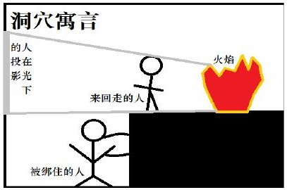

**二、知识理论**

他的哲学理论基础是知识理论，存在着人类理性能把握的真理。在《理想国》中他这样描述——洞穴寓言。

在洞穴里，被绑住的人认为所有的实体均为墙上的影子，声音也只来自影子。如果他被带出洞穴，他要先认出影子，并且更易看到夜晚的天体。后来他会慢慢明白，曾经以为的智慧是多么愚蠢。每个人都在洞穴中，而教育就是引导人走出洞穴。也就是说，教育达成了从表象到真实的转变。他的第二个隐喻是线段，中轴是y轴，从下到上依次增加。

| 世界 | 对象 | 认识方式 | 认识结果 |
| --- | --- | --- | --- |
| 理智世界 | 善理念 | 理智 | 知识 |
| 理智世界 | 数学对象 | 思想 | 知识 |
| 可见世界 | 事物 | 信念 | 意见 |
| 可见世界 | 影像 | 想象 | 意见 |

其中，意见包括想象和信念。想象是最低级的，它来自感觉经验，是幻象。信念具有了一定的确定性。从可见到理智，就包括了思想和理智。思想已经脱离了本身，例如“人”这一理念，它是确定不变的真理。理智已经是完善的了，它把握了所有事物之间的关系。

接下来我们重点谈论一下柏拉图的理念论。

理念是永恒的模型，特殊的事物具有相似性而被抽象为概念。他说“真正的哲学家想知道事物的本质。”理念就导致了双重的世界。理念存在于何处？这是一个重要的问题。它是真实存在的吗？柏拉图的解释是，理念与实物分离，理念没有空间维度。在心灵与身体结合之前，灵魂在一个精神领域已经存在。神用理念创造特殊的事物，理念先于特殊。理念存在于神心灵或理性最高原则。他得出了一个结论，“善理念”有最完美的实在。

接下来我们谈论关于理念的三个问题。

（一）理念与事物的关系？①理念是事物本质的原因。②事物分有理念。③事物模仿理念。（二）理念之间的关系？它们存在共相。作为种和属，诸理念各自具有统一性，也互相结合。理念等级代表结构层次。所以层次越高，理念越抽象。例如我们有动物的理念，也有其次一级的理念：人和马等。（三）如何认识理念？①回忆。灵魂以前就已熟悉，所以教育让我们回忆。②辩证法：本质抽象，获得关系。③欲求：美的事物→美的思想→美本身。

总之，理念论创造了两个世界，使科学知识成为可能。

**三、道德哲学**

我们从理念论到伦理学说。洞穴寓言告诉我们，我们被自然欺骗，也可能被道德领域欺骗。他承接苏格拉底的知识即美德，提出灵魂的三个成分：理性、精神、欲望。理性是目的、价值觉知，精神是行动驱动力，欲望是对身体东西的欲望。他用两匹马来解释观点。驭手左边有一匹黑马，它代表欲望、身体欲望；右边有一匹白马，它代表精神、崇高精神。两匹马分别朝着两个方向奔去，驭手来引导控制马，这里驭手就代表的是理性。理性有权衡能力，可以作用于精神和欲望，精神和欲望也推动影响着理性。理性引导人们向真正的幸福与爱。

欲望压倒理性时，人们得到错误的知识，统一的灵魂受到有害的影响。例如，情欲是一时的愉快，无法维持持久时间的愉快。

人们恶的原因是什么？灵魂分为理性的和非理性的两部分，非理性的部分是天神造的、不完善的。这两部分和谐地组合在一起。恶不是实在，但是它是灵魂的特性，使灵魂会遗忘。

灵魂进入身体后，体验了欲望、愉快、痛苦、恐惧、愤怒，这暗示身体是灵魂的累赘。非理性被欲望吸引，控制精神和理性堕落，先前的和谐被破坏，知识被遗忘，身体惰性又阻碍了知识恢复。道德在于恢复失去的内在和谐，知识深藏于心灵的记忆，回忆开始于心灵，超越事物通向理念。我们还需要一位老师，将我们从黑暗的洞穴唤醒，得到善——内心和谐、健康幸福生活。欲望、精神、理性三者加上度，就得到了我们的三种德性：节制之德、勇敢之德、智慧之德，这三者组成了正义之德。

**四、政治哲学**

理解什么是正义的人，最好分析国家的本质。国家从个人本性发展出来，个人先于国家。

欲望会耗尽社会资源，所以产生了保卫者和普通人，保卫者中选出统治者。国家的三个等级：

劳动者、保卫者、统治者分别对应了欲望、精神和理性。欲望（劳动者）是最低级的，理性（统治者）是最高级的。同时，柏拉图理论意味着一些人是天生的统治者，一些人是天生的工匠，导致了等级分化。他相信，能力是当权的资格证明。所以统治者应受到全面教育，理解可见世界、理智世界，是哲学王。总之，王=哲学王。王应该进行辩证法和道德哲学的训练。要么哲学家获得权力当王，要么统治者成为哲学家。

他认为，国家正义等同于个人正义，正义包含节制勇敢和智慧。《理想国》认为，五种政体（贵族政体、荣誉政体、寡头政体、民主政体、专制政体）每况日下。贵族政体有哲学王和意义目标，是模范政体。荣誉政体有野心的成员，爱荣誉胜过爱公共的善，非理性。寡头政体的权利在关心财富的人手里。民主政体的人类品质退化，一切欲望都是追求。专制政体是绝对权力，便是绝对欲望。

**五、宇宙观**

世界充满了变化，是不完善的。世界也是一个灵魂。心灵安排每一个事物，他不同于唯物主义的原初物质说，他认为理念存在，事物产生于受容体。受容体约等于空间的永恒存在，是事物出现和消亡的地方。物质只是体现某种更基本东西的表象，具体事物世界是现象，活动由视界灵魂完成，世界灵魂是永恒的。宇宙形成是必然性和理性，现象产生，时间才产生。

德穆革产生世界灵魂，创造了实体成为有形物。

#### 1.1.4 亚里士多德

**一、简介**

亚里士多德进入柏拉图学院学习。他受到了柏拉图深深地影响，但是最终与柏拉图分道扬镳。他肯定了柏拉图思想核心的理念论，但是后来严厉的批评了。亚里士多德后来给亚历山大，一个未来的统治者做私人教师。

**二、逻辑学**

亚里士多德发明了形式逻辑，提出了逻辑学在证明的时候需要一个清晰的起点。首先我们需要确定对象，然后需要加上该种事物的属性或原因。我们想到一个特殊的对象，我们就想到它的谓语，即实体和它的偶性，偶性包括量、质、关系、处所、时间、状态、所有、活动、遭受。这些范畴不是心灵做出的人为创造，而是有实际的存在。有了主体（主词），也就是它的范畴。这是这个事物的固有属性。

亚里士多德的逻辑系统是以三段论为基础的。经典例子：大前提、小前提、结论。例如，所有人都是要死的，苏格拉底是人，所以苏格拉底是要死的。他用三段论的理论强调了逻辑与形而上学之间的关系，认为语词与命题互相关联，是因为语言所反映的事物也是互相关联的。亚里士多德还区分了三种推理，得到了三种不同的结果，分别是：（1）辩证的推理，也就是从普遍接受的一件出发进行推理；（2）诡辩的推理，从看起来像被普遍接受的，但实际并非如此的前提出发；（3）演证的推理，前提是真的，初始的。演证的推理必须抓住可靠的前提，亚里士多德称之为第一原理。如何达到第一原理呢？通过观察和归纳。我们在归纳过程中，在特殊发现了普遍。但是并非所有知识都有都是演证性的，相反，对于直接前提的知识，就不依赖于演证。

还记得柏拉图对于认识使用的词语是回忆，而亚里士多德提出的词是认出。我们通过认出来认识到真理。科学建基于初始前提。我们把握住初始前提，才能进行演证的推理。

**三、形而上学**

形而上学被他称之为第一哲学。形而上学被他称作作为智慧的知识。

形而上学的核心问题，就是对存在及其原则和原因的研究。简而言之，什么是存在，什么是“是”。亚里士多德认为 “是”总是意味着是某个东西，都有特定的本质范畴，因此预设了被它运用于其上的主词，这个主词就被称为实体。形而上学思考的就是存在（存在着的实体）和他的原因。

实体的性质被亚里士多德分为本然性质和偶然性质。比如，一个人有红头发就是偶然性质，而人会死是本然性质。虽然存在一些特殊的性质，但这些性质并不是形而上学讨论的核心对象。形而上学的核心问题是对实体本然性质的研究。例如我们研究桌子，研究个别的桌子，能发现这个桌子其中的本质。至于本质，毕竟独立于它的特殊性质，独立于该本体。

亚里士多德区分了质料和形式，但在自然中没有无形式的质料或无质料的形式。每一个事物都是质料与形式的统一——质料与形式的合成物。亚里士多德批评柏拉图的论点（理念脱离了个别的事物还有其独立的存在），但是承认共相的存在和它的重要意义。下一个问题是一个东西是如何成为另一个东西的，或者说变化的本质是什么。对于任何事物，我们都会问四个问题：它是什么，它是由什么做成的，它是通过什么方式被做成的，它是为什么目的而做成的。对于这四个问题的回答，亚里士多德提出了四种原因，分别是（1）形式因：仅规定的事物是什么；（2）质料因：规定的事物是由什么构成的；（3）动力因：一个事物是被什么造成的；（4）目的因：为了什么目的而构成。变化总是发生在质料和形式已经结合在一起的事物中，正在成为新的或不同的东西。每一个事物都处于变化的过程中，都有一种力量使他的形式去达到他们的目的。亚里士多德在这里考虑了潜能和现实。例如种子潜在地成为一棵树，而不是现实地就是一棵树。所以变化的基本类型是从潜能到现实的变化，所以所有的事物都具有潜能，但是要具有某种潜能，潜在的东西就必须要有某种现实的东西。但是一切都在变化那么所有事物都具有潜能。为了解释，亚里士多德设定某种高于潜在的或可毁灭的事物的现实性，这种存在不具有任何潜在性，处于存在的最高形式。

所有事物都在运动，而运动需要被某种东西推动。亚里士多德认为存在一个不被推动的推动者，它是所有变化的最终原因。这不是后来的造物主，而是逻辑先于任何潜在的东西、先于所有现实性的东西。所有的实体都处于一个变化的过程中，其不被推动的推动者就是目的因，像成人的形式指引孩子朝着目标变化。因此不被推动的推动者这一目的因同时也成为动力。

**四、人的地位：物理学、生物学和心理学**

物理学上，他不认可纯粹的原初质料，而是认为世界由简单物体气火水土互相结合形成。

这些简单物质内在运动，加上其他事物的推动，持续不断地转化为各种事物。

生物学上，他认为灵魂是一个自然有机体最起码的现实性，是决定一个事物本质的结构。

如一个事物一旦成为了有机的，就会设定自己的运动，有了自己的目的因和动力因。因此他说：“存在，灵魂就存在。”他区分了三种灵魂，分别是（1）营养灵魂：仅具有生存活动能力；（2）感觉灵魂：既有生存能力又有感知能力；（3）理性灵魂：兼具生存感知和思想能力。

心理学上，他认为动物这一层次存在着感觉灵魂，它具有潜能去适合感知的性质，例如眼睛潜在地能成为蓝色的因而能感知到蓝色。这种灵魂还通过记忆和想象来解释现象，最终产生了更高级的灵魂，即人的灵魂（理性灵魂）。灵魂是身体的确定形式，使身体和灵魂共同构成了一个实体。人的理性灵魂也是具有潜能为特征的，具有理解事物的潜能。

亚里士多德谈到了积极理智。人的理智是潜能，所以是断断续续的，而积极理智就像不被推动的推动者，它是世界的心灵（奴斯），有连续的知识且不朽。这个意义上，人的理智是消极的、潜在的。

**五、伦理学**

他提出一切技艺、研究、行动和追求，都以某种善为目标。柏拉图说的人人追求的是善的理念的知识，而亚里士多德正好相反，他认为善的原则根植于每一个人的内心。为了证明他的伦理理论，他区分两种主要的目的：一是工具性目的（作为达到其他目的的手段）；二是内在目的（以行动自身为目的）。要实现善，就必须发现人类本性的各种功能，也就是说善的人，应该是实现作为一个人的功能的人。

人的功能是什么？人的目的、人的本性、人的存在不仅仅是生存，而且还有进行感觉。

人类的善就是与德性相一致的灵魂活动。一个人作为人的功能，就是灵魂的正当运作。

灵魂有两个部分：理性的部分和非理性的部分，后者包括营养的部分和欲望的部分。理性和非理性的冲突，导致了道德的问题。道德必然涉及行动，人类行动应当指向正当、值得欲求的、必须能够被人们追求到的目标。幸福就是这个目标。

如何获得幸福？根据正当的理性去行动。灵魂的理性部分应控制非理性部分。人的激情可以导致从不足到过度的各种行动，而德性应该是在过度和不足之间的中间方式，类似于中庸思想，这就是中道的德性。每一个人的中道不一样，但每个人符合比例的中道就是节制的德性。亚里士多德也认可柏拉图提出的四种德性：勇敢、节制、正义和智慧。但是，有一些行动没有任何的中道可言，比如轻侮、嫉妒、通奸、盗窃、谋杀，这些本质就是坏的。

在理性灵魂中存在两种理性，理论理性和实践理性。他认为除了有知识，人们还必须要有深思熟虑的选择。他最后讨论了哲学智慧与沉思的关系。我们在沉思时才是最幸福的。

**六、政治学**

亚里士多德认为人是天生的政治动物，国家为了善、人民最高利益而建立。他提出了三种政体：君主政体（一人统治）贵族政体（少数人统治）和共和政体（许多人统治），它们对应的变态政体是僭主政体、寡头政体和民主政体。亚里士多德自己最推崇的是贵族政体。

亚里士多德认为奴隶制是自然的产物，是合意的适当的。他接受天生就是奴隶的人，但不接受由于军事征服而成为奴隶的人。他反对通过征服使别人成为奴隶，因为征服了别人并不意味着本性上就比他们高一等。他还相信公民权是不平等的，认为劳动者不能公民，因为他们没有有充足的时间、适当的性情和品行。

好的统治者为所有人谋利益，而变态政体的统治者是为自己谋私利。不论政府采取哪种形式，都会建立一种某种正义的观念和相称的平等的观念。而这些概念不符合原来设想时，就会激起革命。政府可采取一些预防步骤，比如君主避免独断专行、贵族避免由少数富人为了富裕阶级的利益统治、共和政府让那些更能干的成员参与统治等。

**七、艺术哲学**

亚里士多德认为艺术是对自然的模仿，与真理相差甚远，所以他对艺术很轻视。但他相信普遍的形式只存在于具体的事物中，从而他肯定了艺术的认知价值，因为艺术模仿自然时也传达了关于自然的信息。他比较诗歌和历史：历史学家只关心特定的人或事，诗人却关心的是人性普遍的经验，所以诗歌比历史更富哲学性，比历史更高。因为诗歌表现普遍的东西，历史表现的是特殊的东西。艺术还有心理意义，它反映了人类的模仿本能，也带来愉悦。他还强调悲剧的作用。悲剧的核心是净化，能够引起怜悯和恐惧，来完成对不愉快感情的净化。

### §1.2 希腊化时期和中世纪的哲学

#### 1.2.1 亚里士多德以后的古代哲学

**一、伊壁鸠鲁主义**

受德谟克利特影响，他把哲学看作灵魂的良药，没有探讨世界由什么构成的问题。他和德谟克利特一样，认为原子构成了世界。人生的目的就是快乐。快乐原则是他的行为基础。

物理学与伦理学都强调原子。如果上帝存在，上帝也是由原子构成的。存在无限多个原子，就有无限多个世界，人类不是神造的，而是原子碰撞的偶然产物。死亡不会使人烦恼，因为只有活人才会烦恼。所以我们的注意直接转移到肉体、精神快乐的直接渴望。

快乐原则是伊壁鸠鲁重要的概念。快乐是令人称心如意的。各种快乐也有区别。快乐分为自然且必要的、自然但不必要的、不自然且不必要的。某些快乐是不自然的，也会导致不幸和痛苦。人类的终极快乐就是宁静。从个人快乐推广到社会交往、社会正义，友谊也是快乐。总之，趋乐避苦是自然正义的基础。

**二、斯多葛主义**

他的哲学涉及逻辑学、物理学、伦理学。

他的目标同样是幸福，但是他想通过智慧来达到幸福。例如，我们不能躲避死，却能避免恐惧死亡。除了害怕本身，没有什么是可怕的。

他的唯物理论这样理解观念起源：语词表达思想，思想也是对象影响心灵的结果。心灵起源于空白，是观念的存储器。世界事物增加记忆，是思想与感觉像联系的结果。一切都是无知的能动的、变化的、结构的、有序的。类似于赫拉克利特，火推出神，从而推出合理性。

神在每一事物中，神的物质性实体和不会运动的物质混合，即物质以这种方式活动，其中存在理性原则。所以事物以其应有方式发生。世界秩序是所有部分的统一，也就是说，神是世界灵魂，人的灵魂分有了神的一部分。人的理性使人的本性参与到理性结构和自然秩序。所以作为人，不能因扮演小角色而闷闷不乐，应该宁静幸福了解自己，欣然接受。自然被上帝理性固定安排，但我们能控制的是态度。接受既幸福。

**三、怀疑主义**

怀疑主义不相信柏拉图、亚里士多德，同样不相信伊壁鸠鲁和斯多葛。塞克斯都认为我们对精神的平和和宁静有期望，但是真理不同甚至对立。怀疑主义认为人们有三种态度：发现了真理、未发现真理声称不可能发现、坚持探求真理。怀疑主义采取的是第三种：持续研究。他们通过“悬置”判断来达到无干扰宁静的境地。

他们拒绝独断承认现实，但他们不质疑表象，质疑的是表象的解释。他注重四方面问题：

本性的引导、感觉的制约、法和习惯的传统、记忆的教育。他区分了两种研究：涉及明显事情的和理智上争论的。前者是正确的，而后者会陷入错误。因此采取了双重态度。

总之，怀疑主义认为没有真理标准。因为感官是欺惑的，道德法则产生怀疑（一种意见无论证据多强硬都还只是意见），没有理智确定性，知道的是可能的（我们需要可靠的观念，冷静下来，避免独断或狂信）。

**四、普罗提诺**

他选择了柏拉图主义，提出了宗教理论。普罗提诺说，灵魂是主要的。神是太一，不是物质、灵魂、心灵，不存在任何复合、单一的，不是特殊的总汇，不会变化。神=太一，所以神存在且超越于世界之上。神是太一，不可能创造，如果创造，就发生了变化，就不是太一了。所以神是通过“流溢”，就像太阳射出光线，泉眼流水。第一流溢出的就是心灵（奴斯），它也是最像太一的。流溢物离太一越远，完满性力量越低。第二流溢的是灵魂，每次进一步流溢，这就从世界灵魂到了人的灵魂。人的灵魂先于肉体，且死后依然存在。观念在灵魂后流溢，反映的是物质世界。而最低的是物质本性。

恶的原因是什么？既然是太一来流溢，为何会有恶产生？因为流溢物有向下的惰性，向下的趋势，物质是边缘，向下能触碰到恶。恶是完满性的缺乏，所以道德斗争非与外部斗争，而是反对内部的腐败。救赎是什么？就是灵魂的上升，与神合一，是困难痛苦的使命。让灵魂上升至理性活动，从迷狂到与太一合一。

#### 1.2.2 奥古斯丁

**一、简介**

他的内心对智慧和精神宁静进行了毕生的追求。上帝是全善的，如何产生恶？他采取了二元论，即有两个本源：光明源和黑暗源。他对新柏拉图主义烂熟于心，同时采纳异于自己的理论来修正自己。

**二、人类知识**

哲学宗教都建立在信仰上还是理性上还是结合起来的？奥古斯丁相信信仰先于理性，信仰照耀理性。他曾相信怀疑论，但后来反驳了。因为矛盾是确定的，相反的事物不可能同时为真，而且怀疑本身也是确定的。奥古斯丁认为我总是存在的，因为如果我怀疑，我一定存在。17世纪的笛卡尔的“我思故我在”与这个观点类似。但奥古斯丁只用它来反驳怀疑论。

对于知识与感觉。他认为感受给了我们最低的知识，它最不确定，因为感觉对象和感觉器官都在变化。所以为了避免错误，我们只关注表象，不要赞美更多。感觉的时候发生了什么？它采用柏拉图方法：人是灵魂与肉体结合。但是与柏拉图不同的是，他不用回忆，而是只用灵魂自身的活动。心灵本身产生一个图像，感觉给我们知识，但它指向感觉对象之外的

东西。例如从漂亮的人到美，从特殊到本性。感觉有四种要素：①被感觉的对象②感觉依靠的身体器官③形成物体图像心灵活动④非物质对象。用心灵我们能把握永恒真理，不依赖感官而沉思，只是更加可靠。我们从外在向内在，从低级向高级走向上帝。

光照论是他的重要理论。我们心灵何以作出涉及永恒必然真理的判断？只是所有要素都可变，是不完满的，那如何产生一个完美之物？柏拉图通过回忆，亚里士多德通过理智抽象。

奥古斯丁认为是人本身构造的方式。在光下，人们看物体形成图像，在适宜的光照下，心灵也可以看到永恒的对象。存在永恒的理性之光，它来自上帝。

**三、上帝**

他对上帝存在的单纯思辨不感兴趣。他反思上帝是“追求智慧与精神宁静”。依然是那个问题“人不完满如何获得完满知识”？必然是这只是不是他自己产生的，而是由上帝起源。上帝等于真理，上帝等于永恒，上帝等于最高存在（不同于普罗提诺的太一，太一高于存在）。

所以上帝是单纯的完满的，知识智慧善皆为一。上帝自有永有，由于上帝，心灵得到启迪。

上帝是真理的标准，上帝与世界密切相连。

对上帝知之最多的人可以最为深刻地理解世界的真实本性，特别是人的本性和人的命运。

**四、被造世界**

万物没有创造自身，是永生的他创造了我们。上帝从无中创造万物。柏拉图认为，造物主将理念和受容者结合在一起，这两个东西本身就永恒独立存在。他也离开了普罗提诺的新柏拉图主义。奥古斯丁认为，世界是上帝自由行为的产物，万物存在归因于上帝，每一事物皆为上帝所造。

他提出“种质”的概念。父母是子女的原因，老花是新花的原因，万物背后原因是上帝的理智。创世时，上帝把种质植于物质中，把所有潜能安排在自然之中。胚芽是潜在性的本源。

**五、道德哲学**

追求幸福是人类的必由之路。真正幸福要求超越自然，达到超自然，在上帝中找到安宁，找到幸福。爱的作用？爱分为对物理对象的、对他人的、对自己的。但是我们爱却痛苦，这是因为失序的爱。失序的爱就是爱的量大于了应有的量，或是我们没有最终爱上帝。人有爱上帝的精神需要。虽然每个事物都是爱的正当对象，但我们不一定要从它那得到更多东西。

我们相信爱物、他人、自己就能幸福，就是失序的爱。我们背弃上帝，有限的存在去满足无限的需要，也会导致失序的爱。重构与得救只能通过爱来拨乱反正。柏拉图认为恶乃无知，奥古斯丁认为恶或罪都是意志的产物，是自由意志的产物。（p.s.德性是上帝恩的产物，而不是意志的产物。律法是为了让人追求神恩，有了神恩，律法可以实现）

**六、正义**

对于公共道德法则，他主张自然法和永恒法。自然法是自然正义，是人的理智对上帝真理的分有；永恒法是人格化的上帝的理性和意志。国家需要遵循正义，正义是灵魂的习惯，将每个人的尊严给予每个人。正义与道德法则有重要联系。正义中首要的就是人与上帝，其次是人与人。全部伦理就是基于爱上帝和爱他人。

另外，宗教地位要高于政治机构。爱是普遍力量，虽然国家的力量小于爱的力量，但国家能够减轻某些恶。

**七、历史和两座城**

人们爱上帝，就到了上帝之城；爱自己和万物就到了世俗之城。奥古斯丁认为，人类历史是最伟大的戏剧。历史有现实意义，因为人类命运与这两座城和上帝活动有联系。它赋予历史的意义，是历史哲学。

#### 1.2.3 中世纪早期的哲学

**一、波爱修斯**

他曾了解各种主义，并希望调和其表面的差异。他对哲学做了一个描绘：哲学现身为一位贵妇，带着尖锐的眼睛，穿着带有Φ和θ的长袍。（Φ代表实践哲学，θ代表理论哲学。）

世俗爱和快乐没有真正的幸福，他对哲学定义为对智慧的爱。

共相的问题。我们看的是人，但思考的是普遍，“类”仅仅是观念吗？他认为此问题比较复杂，认为形成概念需要组合与抽象。类是从个别抽象出来的，因此是真实的。个别通过思考成为共相，对象因存在共相而作为个体被认识。所以既从具体存在于物中，也抽象存在于心灵中。既在物中，也分离而在我们心中。

**二、伪狄奥尼修斯**

他对上帝和世界关系给出一个说明：流溢和创世结合。世界是上帝天意的产物，在人类和自己有一个阶梯：天使。我们大道上地址是通过肯定的方式（赋予）和否定的方式（更加重要，排除）。排除的否定方法仅仅将我们引向无知的黑暗，但能确保我们知道上帝不是什么样子。依据新柏拉图主义，他否定恶的积极存在。存在等价于善。

**三、爱留根纳**

他认为自然是存在的一切，包括上帝和被造物，在《自然的区分》表述了这些。如何理解？我们需要区分和分析，即拆与合。所有自然有四重区分。创造的而非被造的（上帝）、

被造的而且创造的（神圣的观念）、被造的而非创造的（事物世界）、既非创造也非被造的（还是上帝，指作为被造物秩序或目的的）。

**四、共相问题新方法**

奥多和威廉姆主张极端实在论，共相实际存在。有人批评如果“人”的概念真实存在于许多人之中，那么人既在雅典，又在罗马，则苏格拉底既在雅典又在罗马。于是被迫更改为不区分轮：个体之所以同种，不是因为共同本质，而是因为某些方面无区别，不显区分。洛色林主张唯名论，共相只是词而已。

阿伯拉尔主张概念论，也可以说是温和实在论。他避免极端，相似性不代表存在本质的实体，而只是一致的。所以人类形成个别事物的概念，共相和个体可感物分离存在。

共相是一个语词、概念，代表了某种为该概念提供依据的实在。

**五、安瑟伦的本体论证明**

他确信，理性和信仰能推出相同结论，有着一致性。他希望用理性理解他一直相信的东西。他的实在论给出了是三个论证。1.人们力图享有他们认为是善的东西，即存在同一个善、最高的善，存在着最善和最伟大。2.某物存在，要么因某物存在，要么因无存在。因为不能由无而存在，所以一定有先前事物。先前事物有先前事物，所以存在唯一来自自身的事物也就是上帝。3.有等级层级存在，人高于动物高于植物，所以有物高于人，有最完美的存在。

综上，他认为上帝是无法设想最伟大的存在的存在。例如，这句话愚人并不知道，但是这个道理存在于他的理智中。

对于本体论，他说，某物甚至能够在我们知道它实际存在之前就存在于我们理智中。其次，对于任何给定的存在，实在的存在，都存在更伟大的想象的存在。高尼罗反驳他，认为推导这些不行是因为愚人没有理智，如果有理智，就没有必要证明。而且，能设想一个巨大无与伦比的海岛，但不存在。他的回答是，愚人也可以形成完满的观念，岛概念本身是限定了的，不可能无限。

**六、穆斯林和犹太思想中的信仰和理性**

众所周知，穆罕默德修建过智慧宫。穆斯林存在着相当的智慧。

阿维森纳提出创世说。凡是开始之物必有一因，所以必然有第一原因。上帝是于存在的顶峰，没有开端。是以创世为必然且永恒。上帝创造最大理智（天使），依次下降创造九层理智。第十层也是最后一次是主动理智，即创造世界的四元素、人的个体灵魂。理性有认知的能力，全体人中有一个主动理智，他被全体人分有。每个灵魂都由主动理智生，也回到那里去。是主动理智而不是上帝给人类理智光照。

阿威罗伊认为亚里士多德是最伟大的，从未全然否认创世这一宗教信条。人类知识就在普遍的主动理智中。有三种人为哲学和神学服务，分别是被激动观念支配而不是被理性支配的人、神学家、哲学家。哲学家是最高的。

摩西和迈蒙尼德认为：1.哲学、神学和科学没有根本冲突；2.创世说是宗教信仰问题，哲学上反对它是有力的；3.信仰和理性冲突的原因是宗教拟人化语言和思想糊涂的人用来讨论信仰问题的混乱方法；4.同意阿维森纳“人的本性”，每人又能动理智，来自主动理智；5.

上帝存在，是第一推动者、必然存在者、第一原因；6.人生的目标是人类完满性：占有完满性，身体结构形状完满性，道德德性完满性，最高完满性。

#### 1.2.4 阿奎那和中世纪晚期哲学

**一、简介**

阿奎那将古典哲学和基督教哲学结合起来。可以说，奥古斯丁是柏拉图主义者，阿奎那是亚里士多德主义者。他是一位伟大的学者。

**二、哲学与神学**

作为基督徒，他首先看到了哲学与神学。哲学开始与感觉经验直接对象，把握第一原因和最高原则，从而引出上帝概念。知识由理性还是启示得知？哲学与神学有重叠，理性能人士的无需信仰，反之亦然。两者都包含上帝。

**三、上帝存在证明**

对于上帝存在，阿奎那给出了五种证明方法。

（一）运动。物体运动，是被他物推动。静止是潜在的运动，所以运动是潜在箱现实转化。因为潜在性是无，所以潜在运动物体无法自己推动自己，所以存在第一推动者。

（二）致动因。原因先于结果，万物都需要一个原因，所以存在第一致动因。

（三）必然存在一棵树从不存在到存在再到不存在，所有事物都曾不存在。若一个时刻什么都不存在就不可能由它产生存在。所以有一个必然存在。

（四）完满性。有些更善更真，这种对事物的比较是因为以不同的方式相似于极限的东西。所以必定存在最真、最高贵、最善。

（五）世界秩序。事物缺乏理智，除非有理智的东西指导，否则不可能完成功能。所以有某种理智指导万物，它就是上帝。

**四、对上帝本性的知识**

上帝是不会变化的，是永恒的、非物质的，单纯无复合的，上帝不同于被造物。人类获取上帝的知识，不是单义地（那样上帝和人类就相同了），也不是多义地（那样就完全不相同了，人是被造物，有上帝本性在），所以是类比地，不是完全相同也不是不相同。既存在于人类，又存在于上帝。例如，人有某种存在推出上帝就是存在。而且这种类比就意味着我们知道上帝所知道的东西，但并非是上帝所知道的一切东西，也不是以上帝知道的方式知道。

所以人类既像上帝，又不像上帝。

**五、创世**

创世发生在某一时间点。世界是被造的，上帝愿意创造。阿奎那认为上帝从无中创造，创世前只有上帝存在，上帝不基于任何原初物质。这是最好的可能世界吗？阿奎那说，世界在这种安排下是最好的。

恶是如何发生的？类似于奥古斯丁，阿奎那提出上帝不是恶的因，恶不是一种事物，而是一种善的缺乏。上帝为何允许恶存在？因为世界的完满性要求各种类型存在物存在。被造世界是一个完美的序列，没有存在间隔，被称为存在之链，如下：

天使 人 动物 植物 四种元素动物中最低的与植物最高的重叠，人中最高的与天使也有重叠。

**六、道德和自然法**

建立在亚里士多德上，伦理学是对幸福的追求。人的本性在上帝中有起源，有归宿。为了完满的幸福，仅作为人是不够的。恶欲、爱欲、支配是动物行为，而人的意志要与理智共同作用，使人倾向于善，导之以理智，要求神恩以及启示的真理。理智是人的最高能力，完全的真理是上帝，最高最善。他还认为，一个行为只有是自由时才是人的行为。因为人有了意志能力，才做出正确的选择，倾向于善。

人的本性与自然法最好理解为上帝智慧或理性的产物。他给出了四种法：永恒法是上帝支配事物中的本质；自然法是永恒法专属于人的那一部分；人为法是政府法令统治者颁布的；

神法是指导人达到恰当目的——永恒幸福（上帝神恩、善）的。

**七、国家**

国家是自然机构，是人的本性，人天生是社会的动物。国家是上帝意愿的，有上帝赋予的功能，人应生活在社会中。国家从属于教会，国家有合法性，在其领域内也有自由性。只是为了保证精神目的，应服从教会。国家立法不应是任意的行为，应在自然法（人对永恒法分有的）影响下进行，应该对上帝负责，共同按照神的正义而规定。

**八、人的本性和知识**

人的本性是有形实体。灵魂对肉体依赖程度等于肉体对灵魂依赖程度。人由灵魂和肉体组合而成，灵魂给我们理智、意志，最高能力在理智。

他调和了柏拉图（观念存在于上帝心灵中，观念通过圣光照亮心灵）和亚里士多德（人的心灵知道在做什么，能把握可感中不变的和稳定的东西）的观点。他否认共相与特殊分离存在，他是温和实在论者，指出共相在于（1）事物外、上帝心灵中；（2）事物中，个别的本质存在于种的所有成员中；（3）心灵中，从个别中抽象的普遍观念。

**九、司各脱、奥卡姆、艾克哈特**

他们大体同意，每个人各自提出了批评，并使哲学与神学出现裂隙。

唯意志论。意志服从理智，上帝也会受限，所以有绝对自由意志，所以非理性存在，所以道德成了上帝任意选择的结果。得出结论：不可能有自然神学。

唯智主义：理性之道，道德体现善的原则，宇宙反映上帝理性心灵。

唯名论：共相问题。我们用的概念只不过是一个名称。剃刀原则（若无必要勿增实体）

存在于两个领域（1）个别事物（2）语言表达的思想概念。人对词的运用超过实在知识，这理论进而分离了哲学与神学。

神秘主义：人们超越感性知识，与上帝结合不可能通过人努力达到。只有上帝神恩光照才能实现，在灵魂最深处才能与上帝合二为一，只能用旷野、黑暗来表达神秘的结合。

### §1.3 近代早期的哲学

#### 1.3.1 文艺复兴时期的哲学

**一、中世纪的结束**

在中世纪，哲学是神学的“婢女”。在文艺复兴时期，两者出现了决定性的分裂。15 世纪和16世纪，哲学家们倡导古希腊学术的复兴。后来近代的哲学家用自己民族的语言来撰写论著，如洛克和休谟使用英语、伏尔泰和卢梭使用法语、康德使用德语。

**二、人文主义和意大利文艺复兴运动**

人文主义代表人物有文学三杰[^3]、艺术三杰[^4]。下面介绍几位哲学领域的代表人物。

皮科是人文主义特色最鲜明的人物之一。他认为，人性之所以特殊，是因为上帝将人类安排在了存在之链中特殊的位置——天使之下、动物之上。人可以堕落到低等动物中，也可以通过灵魂的理性攀升到神圣的本性上去。

马基雅维利在《论李维的前十书》中赞扬了罗马共和制，在《君主论》中却肯定了绝对权力的君主。他认为当时的意大利在道德上的腐化不允许罗马共和国那种政府的出现，便相信君主专制是最好的统治。他设想了一种“双标”——对统治者的和对民众的。君主应该掌握欺诈之术，不受任何客观的道德法则的束缚。当且仅当到底能实现统治者的最大利益时，统治者才应该讲道德。马基雅维利主义后来成为政治学术语之一，可简记为：

为政，无德。

**三、宗教改革**

马丁·路德在1517年发动了宗教改革运动，该运动后来成为欧洲社会很长一段时间的政治运动。路德认为，信仰的特性就是遏制理性；理性的困难在于它是有限的。他在政治上的思想认为，政府是由上帝设立的，因此政府的何种命令个人都必须服从。

伊拉斯谟也是一位重要的人文主义人物。他对文艺复兴做出了巨大贡献。他所著的《愚人颂》表达了他不是宗教怀疑论者，也不是路德派，只是希望教会的教义能和他的人文主义学说相一致。他指责神父、神学家们的斗争使人们偏离了基督教的核心目的，因此对经院的吹毛求疵十分不满。伊拉斯谟是一位批判者、一位文艺复兴的伟大倡导者。

**四、怀疑论和信仰**

这段时间里，古希腊的怀疑主义复兴了。

蒙田认为，怀疑主义是一种解放的力量，使他摆脱了其他哲学体系的僵硬理论。对他而言，怀疑论使他摆脱怀疑论本身！通过怀疑主义，残酷的行为可以被避免，人们可以开始反思、认识到自己——做人意味着什么。这种人类的批判性判断能力应当被褒奖，因此他说，智慧就在于接受生活的本来面貌并认识到确切地认识任何事物使何等困难。

帕斯卡是一位数学家和自然科学家。他将科学和宗教看作相辅相成的工作。他有一句名言：“心具有理性并不理解的道理”。这表明，真理的导向是心（感性的）。我们不仅通过理性，也通过心认识真理。对于上帝，他通过设想赌徒来看待上帝的存在：

我们相信上帝。 我们不相信上帝。

[^3]: 但丁、彼得拉克、薄伽丘。

[^4]: 达·芬奇、拉斐尔、米开朗琪罗。

如果上帝存在？ 无限大的回报。 全部损失。

如果上帝不存在？ 无得失。 无得失。

因此，相信上帝能获得较大的奖赏，我们应该相信上帝。

**五、科学革命**

文艺复兴开始了科学革命，这里简单罗列几位诸领域的科学家：托里拆利、居里克、伽利略、列文虎克、哥白尼、开普勒、第谷、培根、牛顿。原子论作为重要理论也重新兴起。

其中，最为重要的哲学家便是培根和霍布斯。

**六、培根**

培根希望推倒人类的知识，建立一种新的方法。

过去的学术有“病状”，分别是异想天开、好争辩、脆弱不堪。这三种弊病需要得到治疗。

人的思维同样被败坏，其败因是四种假相：种族假相、洞穴假相、市场假相、剧场假相。种族假相是“人的感觉是事物尺度”等错误论断；洞穴假相取自柏拉图的寓言，反映一个人被自己知识习惯背景局限在洞穴中；市场假相反映交际中的货币——语词的不紧密准确；剧场假相反应庞大的系统化的冗长的哲学信条。

培根所希望建立的新的认识方法便是归纳法。亚里士多德的三段论推出的结论不过是包含在前提中的错误的永恒持续下去，归纳法才是认识世界的科学方法。应用归纳法的一个例

例子是发现热的本质：

1.例证表：太阳的光；2.差异表：月亮和星星的光；3.比较表：烧红的铁比酒精燃烧热；

4.归纳：热的本质不是光，因为月亮不热。最终的结论：热的本质是运动。

**七、霍布斯**

霍布斯的《利维坦》是一本政治和社会学著作。作为政治学家，他认为如果政治理论能通过严密的逻辑来阐述，人们就能达成一致意见，就能达到和平与秩序。政治理论的哲学基础是运动——物体的原因和特性就是运动。可知的实在全部由物质构成，物质和心理也只不过是运动中的物体。

自然状态是存在于任何国家或公民社会之前的人的状态。这一时期是一切人反对一切人的战争的无政府状态。我们从根本上是利己的。这时，人想要生存的准则便是寻求和平与满足他人。如果我追求和平，便有更多生存机会；如果我为和平，我愿意放弃对一切的权利，并使我和他人拥有同样的权利。我们通过放弃利益，进入到一种社会契约中，就创造了一种人造的人——利维坦（公民社会或国家）。

通过社会契约，公民的权利转移到主权者手中。如果没有主权者，人们就退回到自然状态的无政府状态。有了主权者，一种法律秩序形成。他主张，没有不公正的法律。原因如下：

（1）正义意味着遵守法律，所以正义只在法律制定以后才存在；（2）主权者制定法律相当于民众自己在制定法律，群众统一的东西不可能是不正义的；（3）争议的基础就是人们履行订立的契约。由于对无政府状态的恐惧，高度独裁的主权观念形成。

#### 1.3.2 大陆理性主义

**一、笛卡尔**

笛卡尔最关心的问题是理智的确定性问题，这种对确定性的追求使他转向“世界这本大书”。他确信，真知识的体系只应构建在人的理性能力上。他的第一个任务就是制定“理性的规划”——方法论。

笛卡尔将数学看作最清楚精密的思维的最好例证（确定性）。在几何中，我们从基础的概念去发现了更复杂的概念。这种推理方法也应被用于其他领域。这就应该是直观和演绎的有序运用。

直观给了我们基本的概念，而演绎从直观引出了更多信息。直观和演绎的过程，构成了“连续而不间断的心灵活动”，最终到达真理。笛卡尔认为，演绎法不同于亚里士多德的三段论。三段论是概念间的相互关系；而演绎法是真理间的相互关系。同时，他为推理创造了一套有序的步骤，其中最重要的四条准则：（1）只接受绝对为真的东西作为基础；（2）把难题分解为多的部分；（3）按照次序逐步上升；（4）尽量列举出一切情况。因此，他几乎总是依靠包含于心灵中的真理。这种对真理的追求，使笛卡尔怀疑，他怀疑许多看来明显不过的事情的知识都是不可靠的，或许经验的每件事都是上帝在欺骗他。他怀疑一切都是幻觉或者假象，但是有一件事根本不可能被怀疑，就是我存在。我存在，是因为我在说服我自己相信，

使我不可能什么都不是。他用一句话来表达：

我思，故我在。

他肯定了思维的存在，由于思维必须有一个思维者，所以我也存在。在这种基础上，他展开了对上帝和外部事物的存在的阐述。他认为：（1）观念是有原因的；（2）原因是有客观实在性的；（3）我是有限的和不完满的。由此推出：存在一个完满的和无限的存在着。

笛卡尔现在推翻了自己的怀疑，使他相信自己、事物、上帝的存在。他又做出结论：存在着思维的东西和有广延、有维度的东西。这是一种二元论——思维和广延、精神和物质、

心灵和身体。每一个实体都是完全独立于另一个实体的，因此思维和广延是分离的。既然分离，何以成生命之物？生命体具有广延，是物质世界的一部分，被机械和数学规律来活动。

人的身体的许多活动都是机械的，且人的运动不来自灵魂。因此，笛卡尔的机械的解释：身体可以由心灵支配，但身体是由纯粹的机械力推动的。笛卡尔的二元论，实现了思维和广延的分裂，留下了相互作用的难题。

**二、斯宾诺莎**

斯宾诺莎受笛卡尔的理性主义影响较大。他的方法论与笛卡尔一样，认为遵循几何学的方法就能获得实在的精确知识。从一套完备的公理，能推出一整个几何学体系。因此他认为，我们关于实在的本性的理论也能被推演出来。他认为，哲学必须首先阐述上帝的观念。

他是一种泛神论，他的著名公式是“上帝或自然”：

> God = Nature

上帝是一种无限的存在、永恒的实体。他拒斥了笛卡尔的二元论，认为思维和广延两种属性是单一实体活动的两种不同方式，他走向了一元论。斯宾诺莎为了表述自然，说“创造自然的自然”和“被自然创造的自然”。世界是由上帝属性的诸样式组成的，世界体现上帝本性必然性的一切东西。任何事物都是紧密相关的，无限实体规定了贯穿万物的连续性。由于每件事物都永远是他必然是的那个样子，所以不存在事物运动趋向的方向。总之，真相是：一切事情都是单纯存在着的永恒实体的各种变形的连续的和必然的系列。

对于认识的过程，他提出我们从想象到推理再到直观。在想象，我们的观念还是特殊的、不充分的。在推理，我们达到了理智，这个层面的知识是真的。在直观，我们可以把握自然的整个体系。笛卡尔之前留下的问题：心灵和身体如何相互作用。在斯宾诺莎这里，这个问题不攻自破，因为他把心灵和身体看做单一实体的两个属性。

斯宾诺莎几乎最重要的著作是《伦理学》。他主张全部自然的统一性，发展了自然主义的伦理学。所有人都有继续和保持自己生存的动力，这叫做自然倾向。当自然倾向涉及心灵和身体时，叫做欲望。当欲望被意识到时，叫做愿望。当我们意识到更高的完善性，我们感到愉快。而痛苦正是因为完善性的减少。善和恶是我们的主观评价，而我们的愿望是被决定了的，因此我们的判断也是被决定了的。

正因为一切事物都是被决定了的，我们不能支配事件，但是我们可以支配我们的态度。

通过支配态度，我们能朝第三层次的知识改进，通过知识达到幸福。我们从永恒的角度看我们，从上帝的观念来看待世界，才能达到完善性。因此，我们理解到上帝是永恒的，我们有了对上帝的理智之爱。

**三、莱布尼茨**

莱布尼茨13岁就轻松阅读艰深的论文，还提出了微积分算法，是一位伟大的数学家、哲学家。

他不同意笛卡尔的二元论，也不同意斯宾诺莎的一元论。对于广延，他认为一切事物都是复合的或聚合的，因此必定由单纯的实体，叫做单子。他否认了广延，承认了单子。而单子不同于原子，单子构成了事物的本质性实体。单子是无广延的，是作为一的，只是一个点。

而单子如何组成宇宙？这种关系体现在前定和谐。

前定和谐是指每个单子都按照它被造的目的二行动，互相孤立的单子通过目的从而形成了与大规模的和谐。这种和谐不可能是单子的偶然产物，一定是上帝活动的结果。

类似于阿奎那的观点，任何事件都有其援引在先的原因，这就是充足理由律。有一个必然的存在不需要原因，即为上帝。莱布尼茨的论证不仅证明了上帝存在，还证明了上帝创造是创造了一切可能中最好的世界。他还说，恶是缺乏。

上帝将目的注入到单子而形成了秩序，但是事物是自由的，并不是说有意志自决力，而是自身的发展。“我在多大程度上知道为什么我做我所做的事，我就在多大程度上是自由的。”这样，他调和了单子论和自由论。

对于知识论，他认为一个主词存在，谓词就已经包含在主词中了。他区分了推理的真理和事实的真理。检验推理的真理靠逻辑、矛盾律，检验事实的真理靠经验、充足理由律。数学就是一个推理真理的典型范例，数学的伟大基础是矛盾原则。实施真理是通过经验知道的，因此不是必然的，它成为真理是偶然的。

我们的所致不过是可能的东西的集合，而要认识真理，就要发现实体和它的谓词，以及存在的充足理由。对世界的最终解释是：A 而不是 B 是 C 存在的真正理由，是来自神圣意志的天命。只有天命能够导向任何实体的一切谓词。

他还认为，逻辑是形而上学的一把钥匙。他还把连续律应用于实体概念。按照连续律，静止和运动通过无限小的变化融入对方，所以静止的法则是运动的特例。单子包含着未来的一切活动，每个单子都是这样，因此所有事物的联合可能性包含了这个世界的整个未来。人类具有天赋的观念，能从天赋的自明的真理中推出可观的知识。

#### 1.3.3 英国经验主义

**一、洛克**

洛克首先探讨了知识的起源问题。他认为，知识被限定在观念里，是由我们所经验的对象所产生出来的观念。就好比每个人的心灵开始都像白纸，只有经验能走在上面写下知识。

他认为一切观念都来自经验，就必须驳倒理性主义者的天赋理论。天赋意味着事物是已知的，但没有什么可以被说是已经存在于心灵的，所以天赋观念是多余的。

我们的心灵像是白纸，获得的理性和知识全部从经验中来。经验为我们提供两个来源：

感觉和反省。感觉指我们的知觉，而反省指感知、思考、怀疑、信念、推理、认识等心理活动。我们反省的观念分为两种：简单观念和复杂观念。简单观念是心灵通过我们的感官被动接受下来的，例如白色的百合花有白色和香的性质。复杂观念不是被动接受的，而是我们心灵作为简单观念的复合而集合到一起的。心灵通过（1）联结观念（2）把观念放到一起但保持分离状态（3）抽象，来形成观念。例如我们说“草比树更绿”。

他还区分了两种性质：第一性的质和第二性的质。第一性的质是真正存在于物体本身的质，而第二性的质是我们心中产生的观念但没有精确的对应物。第一性的质有坚固性、广延、形状、运动静止、数量等。第二性的质包括颜色、声音、气味、味道。他对实体的定义就出发于此。实体就是某种固体的和有广延的东西。他坚持，实体构成了感性知识的对象。我们的知识有三种知觉：直观的、推演的、感性的。直观的知识是直接性的不会让人怀疑的；推演的知识是通过唤起另一些观念形成的知识；感性的知识不是严格意义上的知识，它并不能保证那些看起来相关的性质实际上必然关联着。

洛克的道德理论认为，道德的善或恶知识我们自愿的行为和某种法则的一致和不一致。

这某种法则分为三种：意见的法则、国民的法则、神的法则。通过理性，我们能够发现符合上帝法则的道德规则。意见的法则是一个社会对什么样的行动将导致幸福的判断。善就叫做对这条法则的符合。国民的法则由全体国民建立，由法庭强制实行，倾向于意见的法则。

他的政治理论从自然状态出发。自然状态是人们互相按照理性生活，没有一个共同主宰进行裁判。这种道德法则意味着每个人都有相应责任的自然权利。他特别强调私有财产的重要性。而国民政府正因为人们为最大地保护财产而联合产生。他强调人权是不可剥夺的性质，任何人都不能被剥夺财产、被迫屈从与他人的政治权利，所以法律的制定是为了保障人们生而具有的权利。洛克与霍布斯的不同，他承认必须有一个至高无上的权力。他将其置于立法机关手中，也等于是大多数人手中。并且，人民起义的权利是保留的。

**二、贝克莱**

贝克莱最著名的公式是：存在就是被感知。这是出于他的经验主义，观念的存在都是因为我在感知他们或思考它们。除非他们与心灵发生关系，否则对任何思考都是不可能的。由

此推出他对物质和实体的观念：实体是无，一个事物就是他的被感知的性质的总和。物质是一个无意义的术语，感性事物只有被感知时才存在。当时的科学，尤其是物理学侧重物质概念，如Force,Gravity，这些术语好像都是实在的实体，自然和贝克莱的存在理论相冲突。贝克莱不想摧毁科学，也不想否认事物本性，只是想澄清科学语言。

既然贝克莱没有否认事物本性的存在，那他就要解释事物如何在我们的心灵之外存在。

在我没有感知一个物体时，它存在于另外的心灵——永恒的心灵：上帝。上帝的观念构成了有规则的秩序。

**三、休谟**

休谟吸取了洛克和贝克莱哲学中的经验主义要素，想用物理方法建立人性科学却失败了。

他发现了人的思维范围多么有限，也导致了他的怀疑主义。

他说，人的思维似乎无拘无束，但是它实际上被限制在非常狭窄的界限之内。他将心灵的知觉分为“印象”和“观念”。印象是思想的原始素材，观念是印象的摹本。有一个观念，就必须有一个在先的印象。我们的想象力结合了两个观念。观念是有某种结合的纽带、联想的性质。这并不是心灵联结观念的特殊机能，而是因为只要观念具有确定的性质，他们就是互相被联想的。

休谟最具影响力的思想就是因果律。休谟认为，整个因果性的概念都是可疑的。根据前面所说的观念论和观念结合论，因果性观念是我们经验到对象时一定的关系产生出来的。这种关系有两种：接近的关系或时间中的在先性。

他的极端经验论认为，物体或思维在我们之外具有连续的和独立的存在是没有理性合法性的。换言之，不存在我们之外的存在。我们只有狭窄的直觉，没有构想出的任何别的存在，只有一个想象的宇宙，除了这个宇宙产生的观念，我们再没有任何别的观念。人类相信事物在我们之外存在，是因为人们的想象力具有恒定性和一贯性。即使事物发生变化，我们的想象仍然是不变的。休谟还否认自我的观念，因为没有任何一种印象能够产生这个观念。因为在这个观念形成之前，我们必须抓住一个没有知觉的我自己，这显然是不可能的。推而广之，休谟否定任何实体的存在。对于上帝，他认为所有的论证都是超出人类经验范围的，因此是不可靠的。

最后，对于伦理学，休谟认为伦理学的核心事实是道德判断不仅通过理性形成，而且通过情感。道德评价是情感反应。例如，美是圆的性质吗？因此，道德评价涉及我们观察到某个人的行为的后果时经验道德与快和痛苦的同情感。我们会被什么触发道德赞同的同情感呢？

德性。包括判断力、谨慎、进取心、勤劳、节俭、机智、精明、洞察力等等。这里的方法是

彻底经验主义的，道德评价涉及情感而不是理性判断；又用经验告诉我们，我们有面对道德品质的愉快或痛苦感；最后告诉我们道德品质的共同点是使人感到有用或惬意。这种“效用”的思想为边沁的功利主义作了铺垫。

#### 1.3.4 启蒙哲学

**一、自然神论和无神论**

自然神论认为，上帝创造了世界，其后就听其自然了。大不列颠自然神论之父是赫伯特，他用五个观念构成了宗教基础：（1）有一个最高的神（2）我们应当崇拜他（3）敬神的最好形式是正当的道德行为（4）我们应该为不道德行为而忏悔（5）来世我们将因此生的行为受赏或受罚。这五条原则是真正的宗教的唯一基础，超出其范围都是教主为谋取私利而编造的东西。无论是欧洲的基督教还是阿拉伯的伊斯兰教，都符合这五条定律。

法国哲人派承接了英国自然神论。他们想编著一部《百科全书》来表达思想。其中一位撰稿人就是伏尔泰。伏尔泰批评了无神论，相信上帝确实存在且对人类社会至关重要，伏尔泰是一位自然神论者。霍尔巴赫否认上帝存在，因为自然体系和宗教迷信毫无瓜葛，我们的身体和心理都是自然的产物，我们的行动都是被决定的，遵循不可更易的规律。

**二、卢梭**

卢梭认为人的本性是善的，只是社会体制败坏了它。其中，艺术和科学的进步会使道德败坏、社会腐朽。他举了埃及被波斯征服，相继又臣服于希腊人、罗马人、阿拉伯人、土耳其人的例子。他的《社会契约论》解答了这样一个问题：为什么人们应该遵守政府的法律。

问题就是，人类要找到一种联合的方式，既能保卫每个成员的利益，又能使每个人在联合时只服从于他自己。方法就是，每个成员把联通自己的一切权利交给社会全体，这是通向自由之路。法律归根到底是“公意”的产物。主权者的公意反映了所有个体公民的意志之和的单一的意志。在公意的指引下，每个个体的一致都与其他个体一致同一，每个个体实际上都是法律的制定者。每个人服从法律就是服从自己。他还区分了公意和众意。公意是公共利益，而众意的“众”指的是某个群体的选民是，它追求的目标往往会和公意不同。卢梭的道德领域对后世产生了深远影响，影响了法国革命，以及伟大哲学家康德。

**三、里德**

里德批判了笛卡尔的“我思故我在”，因为笛卡尔不可能当真怀疑他自己，因此他的论证都是站不住脚的。他也批判了洛克、贝克莱和休谟。里德认为，近代以来的哲学家都采取了

观念论，而观念论导致了怀疑主义。他们违背了由人性所决定的常识信念所指示的真理。常识在许多方面都对我们的信念加以指导。语言常识彼此之间是相容的，总不是矛盾的。这种知觉理论，被称作直接实在论。

### §1.4 近代晚期和 19 世纪哲学

#### 1.4.1 康德

**一、康德的生平**

康德沿着莱布尼茨理性主义和形而上学的道路发展出一个包罗万象的哲学体系。他的三大批判《纯粹理性批判》《实践理性批判》《判断力批判》成为不朽巨著。

**二、康德问题的形成**

康德造成了近代哲学的一次巨大革命。他提出的两大问题，分别是“头顶的星空”和“心中的道德法则”。头顶的星空告诉我们物理规律——运动中的物体的系统有必然性；心中的道德法则告诉我们道德责任感——人类行为存在自由。当时两个哲学传统是大陆理性主义和英国经验主义，而牛顿物理学独立于两个哲学体系。康德崇尚科学，对理性主义的独断论和经验主义的怀疑论发出批判。

**三、康德的批判哲学和他的哥白尼革命**

康德拒绝全盘接受休谟的道路，不仅因为它将导致怀疑论，而且因为它没有解释我们如何获得知识。康德决定吸收理性主义和经验主义中有意义的东西，开启了批判哲学。他的批判哲学包括对人类理性构成要素的分析，根据独立于经验而可以到达的知识，对理性能力进行的批判性的探究。

他说，我们的知识开始于经验，但并不是都来源于经验。我们拥有不来源于经验的知识，即使它也是开始于经验的。例如我们并没有感受和经验到因果性，但我们拥有因果性的知识，因为我们不是从感性经验中而是从理性判断的能力获得的，因此是先天获得的知识。先天知识不能由经验推导出来，因此经验不能给予我们关于必然性或普遍性的知识。我们拥有这种知识是因为我们有先天综合判断。

分析判断中，谓词包含在主词的概念中，例如“所有三角形都有三个角”，他不能给予我

们关于这个主词的任何新知识。由于主词和谓词的关系，否认分析判断将陷入逻辑矛盾。综合判断中，谓词没有包含在主词中，例如“所有物体都是有重量的”。

所有分析判断都是先天的（即先天分析判断），它不依赖于我们的经验；综合判断绝大多数都是后天的（即后天综合判断），它们是在经验观察后产生的，例如“二中所有男生身高都是180cm”。在此之外，还有一种先天综合判断。这种判断何以产生？例如，2+58=60。这是先天的，因为它包含必然性和普遍性，即 2+58 必定等于 60；这也是综合的，因为 2 和58单纯的两个数字并不能得到60。因此，几何命题既是先天的又是综合的。类似地，一些物理学命题、形而上学命题也是先天综合的。

休谟的理论只对我们经验到的、即后天的判断有效，而一个先天综合判断不能被经验证明。例如：“平面内三角形内角和为π”，这个概念不能被经验证明。

关于心灵和对象，如果按照休谟的理论，心灵仅仅被动接收对象，那么心灵只会拥有关于那个特定对象的信息，但是心灵做出的判断是所有对象的，甚至那些还没经验的对象，这就形成了冲突。康德提出新的假说，并不是心灵符合对象，而是对象符合心灵的运作，心灵是一种主动的力量，出于其本质主动整理经验。

**四、理性思想的结构**

人类知识有两个来源：感性和知性。人们的心灵通过空间和时间，经验到对象。还存在一些思想范畴，专门的处理心灵统一或综合我们经验的方式。例如“量”让我们想到一和多、“质”让我们想到肯定和否定、关系判断让我们想到因果等等。

是什么使我们对周围世界有了一个统一的把握？是我们经验的统一暗示了自我的统一。

完成这个统一活动的单一主体就是“统觉的先验统一”，即自我。在统一经验的所有要素这个活动中，我们意识到自己的统一，统一经验世界的意识和我们自己的自我意识同时发生。

人的知识被限制于经验世界，而且被限制于我们的知觉能力和思想方式。我们面前的世界不是最终的实在，现象实在和本体实在是有区别的。我们不能拥有非感性的知觉经验，心灵把从它的观念加在源于物自体世界的经验，因此存在一个外在于我们且不依赖于我们的实在，我们只知道它向我们呈现的而且是被我们整理过后的样子。

有三个重要的调节性的概念“自我”“宇宙”“上帝”，它们是由纯粹理性产生的。“自我”被仅仅看作思考着的本质或灵魂，纯粹理性将我们各种心理活动综合成统一体，通过形成自我观念来达到这一点。“宇宙”是一般的世界观念，“上帝”是宇宙中所有序列唯一充足的原因存在着的假定。但是这三个观念并不能给予我们关于这些理念的实在的理论知识，它超出人类经验。

先天的科学知识和思辨的形而上学存在一个区别，我们能拥有关于现象的科学知识，却不能拥有本体领域的科学知识，因此我们想要完善形而上学的科学的企图是不可能的。他提出一些二律背反，例如“世界在时间和空间是有限的或者是无限的”，“存在自由或不存在自由”。这些二律背反反映了独断论的形而上学的不一致。

康德不可避免地拒斥传统的对上帝存在的证明（本体论的、目的论的、宇宙论的）。本体论的证明是在操弄语词，宇宙论的以经验为立足点但它超越了经验，目的论无法证明没有一个安排者世界秩序就不存在。他的答案是，我们不能证明上帝存在，同理无法证明不存在。

**五、实践理性**

“心中的道德律”是人的实践行为——道德行为。人类如果由机械规律支配，就是不自由的，但人的灵魂是自由的，这就构成二律背反。康德的回答避免了这个矛盾，一个人既作为主体存在又作为客体存在，作为主体时不遵从自然律，是自由的；作为客体时符合自然律，是不自由的。

道德哲学的任务是发现那些约束人行为的原则，但康德确信仅研究人的行为无法发现这些原则。道德判断也基于先天判断，探究导致“善”的原则。善良意志之所以是善的，不是因为它的效用，而是因为它本身就是善的。他这样说是为了强调意志在道德的支配地位。善良意志是出于责任意识而行动的意志，责任又暗示我们处于义务中。义务通过命令的形式让我们意识到它。例如技巧的命令“我们要造一座桥”、审慎的命令“如果我想受欢迎就要说或者做一些事情”。还有一个定言命令，也称为绝对命令，它适用于所有人，要求一个客观必然的行动。定言命令是人的行为的自然律的设想，它可以表述为“这样行动，意志可以将自身当做同时在以它自己为准则制定着普遍的法律。”康德认为我们的自由是“因为我必须，所以我能够”。第一个道德悬设是自由，第二个是不朽。对至善的追求，造就了不朽。第三个悬设是上帝的存在，它是德性和幸福之间的基础，幸福暗示了个人意志和物理自然的和谐。通过至善理念这一纯粹实践理性的最终目标，道德律通向了宗教。

**六、美学：美**

对于美学问题，康德说不存在任何规则让某个人根据它而必然地将一个东西认作美的。

表达一个对象是美的是主观的，它归于愉悦或不愉悦的感受，不以理论知识或实践知识为基础。如果一个对象是美的这个判断无关任何个人偏好，这个判断就是自由的，也就是说这会达到同样的美的判断，美就是普遍的了。但是对于鉴赏，有可能不同的人在同一个东西的鉴赏意见并不一致。这就导致，每个人都有自己独特的鉴赏，也就是说，不存在任何鉴赏。

有两种美的形式：自由的美和仅仅是依存的美。“一朵花是美的”是自由美，它无需要求更多知识。而“一个教堂是美的”是目的的美，它是一个概念知识的综合。

一些美的东西导致它和愉悦有某种必然联系，快乐被包含在美的经验中的必然性是一种特殊的必然性。因此，美是没有概念而被认作一个必然愉悦的对象的东西。

#### 1.4.2 德国唯心主义

**一、康德对德国思想的影响**

紧随康德批判哲学是19世纪德国唯心主义思潮。唯心主义的观点主要是宇宙仅由心灵和精神构成，不存在物质的东西。费希特认为，康德的论点存在明显的矛盾，某个东西存在，而我们对之一无所知是不可能的。费希特提出针锋相对的命题，任何东西都是可知的。他运用康德的方法去掉了不可知的物自体的概念，将康德的批判唯心主义转化成形而上学的唯心主义。

**二、黑格尔**

黑格尔出色地完成了被康德宣称是不可能完成的事情，康德说，形而上学是不可能的，而黑格尔说，凡是合理的都是实在的，凡是实在的都合理的，由此得到结论，一切东西都是可知的。黑格尔哲学建立起一个庞大的大厦，它的衰落并不是遭到了抨击，而是说被抛弃了，像是放弃了这座大厦，而不是攻克了。

实在合理，合理实在，但是哪一种心灵产生了我们的知识？黑格尔下结论说，知识的所有对象，所有对象甚至整个宇宙，都是一个绝对的主体、一个绝对精神的产物。

康德看来，心灵的诸范畴使知识成为可能，而对黑格尔而言，范畴是在人心灵中的概念，心灵通过它们才能够理解经验世界。这个概念不同于柏拉图从事物中分离出理念。他说范畴不依赖于个人的心灵或思想而有其实存，不仅是人们心灵的主观概念，实在就是理性和思想。

例如椅子的存在，当我们说椅子是硬的，褐色的，圆的，小的，都是普遍的观念，但他们互相关联时，就是一把特定的椅子。说范畴和普遍的东西有客观的状态，就是说他们独立于认知主体而有其存在。认识和存在之间有统一性，只是同一枚硬币的两个面。他形成了这样一个思想，我们意识的对象，我们经验和思想的事物，自身就是思想。

总结起来，他的两个主要观点：（1）我们必须拒斥一个不可知的物自体的概念；（2）实在的本质是思想理性，最终的实在是绝对理念。

黑格尔将世界看作一个有机的过程，认为现象就是实在，他反对唯物主义，他将绝对描

述为一个动态的过程——统一进行的复杂系统的有机体，而且他相信绝对的内在本质是人类理性可以达到的。他非常强调逻辑。黑格尔的逻辑辩证法展示了一个三段式的运动辩证法的三段式，被描述为正题到反题，最后到合题。他的第一个三段式是存在无和变易。心灵形成的最普遍概念使他们存在，纯存在是纯粹的抽象，因此它是绝对的否定。意思是只要我们思考，没有任何特殊性质的存在，心灵就从存在过渡到非存在，存在和无是统一的。因此，这个运动产生了第三个进城就是变易，变易是存在和无的统一，也就是合题。他运用逻辑学的辩证方法，建立起整个庞大，错综复杂的体系。

人类心灵辩证的运动着持续的容纳，不断增加的实在领域，只有在发现一个事物与整体的关系，才发现了这个事物的真理。从主观性，我们可以推演出，他的对立面即客观性。到了自然哲学，从理性理念（正题）到非理性自然（反题），到了自然概念的辩证运动（合题）。

他表明自由与必然的关系，说自由是必然的王国而精神是自由的，存在一个辩证的对立。他的第三部分就是精神和心灵哲学。主观精神是正题，客观精神是反题，绝对精神就是合题。

对于法学和伦理学，他提出，法（正题）、道德（反题）、社会伦理（合题）。黑格尔将意志和理性看作同义的，作为思想着的理智，意志才是自由意志。个体中，个体意志和普遍意志和谐，而在人们中诸意志就是不和谐的，存在法的对立面的可能性。法与不法之间的张力或冲突产生了道德。道德源于使个人意志与普遍意志相同一这一要求。

家庭是客观意志的第一阶段，它的反题就是市民社会，而合题是国家。国家是绝对的理性、实体性的意志。他赞美国家的话似乎像是拥护极权主义国家，但他坚持国家保护个体自由。同时他强调，每个国家有自治和绝对的主权。他的辩证法运动到下一阶段，就是个别国家联结成国家共同体。世界历史是民族国家的历史，同时也是辩证的逻辑过程。

最终，黑格尔经过艺术到宗教到哲学三个阶段，达到了绝对精神的意识。艺术中心灵绝对把握为美；宗教是一个思想的活动，是表层的思想；哲学是一个辩证的过程，而哲学史的体系就是前进展开必然的思想演进，他说，哲学史就是哲学。

**三、叔本华**

叔本华非常瞧不上黑格尔。《作为意志和表象的世界》包含了叔本华完整的哲学体系。

他有充足理由律，即没有什么东西是没有理由的。充足理由律有四种基本形式：（1）物理对象：在时空发生因果关系；（2）抽象概念：我们从其他概念抽取出来的结论的方式；（3）

数学的对象：算术或几何学的科学；（4）自我：自我意识。这四种充足理由让我们遇到了物理必然、逻辑必然、数学必然和道德必然，必然性使我们受到支配，也因此造就了叔本华的悲观主义。

“作为意志和表象的世界”中每一个词都需要解释。（1）世界：整个宇宙。存在就是被感知，因此世界都是感知者的感知，都只是表象。（2）作为表象的世界：表象是摆在面前的显现之物，没有人对世界的表象是完善的，你有你的表象，我有我的，所以可以说世界是我的表象。（3）作为意志的世界：意志是有意识地选择某种行为方式，意志受到理性影响。康德说我们永远不可能知道物自体。叔本华认为自己发现了唯一通向真理的窄门，说我们自己就是物自体，这个物自体就是意志。所以我们必须将世界看做意志。

这里就看到了他悲观主义的理由：意志概念将整个自然系统描绘城所有事物中的驱动力的作用下不断运动的状态。理智是被普遍意志造成的，理智是意志的一种属性，意志就有一种悲观意味。

个体的人对于自然而言没有任何价值，因为自然关心的不是个体而是类。努力的目的就是维持转瞬即逝又痛苦不堪的个体生存。生命为没有任何价值的东西耗尽了全部力量。

有可能摆脱意志吗？有两条出路，一是伦理学，一是美学。生存意志使人生命复杂且痛苦，生存意志以无限的欲望表达自身——侵略、争斗、毁坏。当欲望被满足，人就会从强烈欲望转向对全人类的同情。美也可以使我们摆脱生存意志，集中于静观的对象——美。尽管如此，叔本华没有找到真正自由的个体意志，他写道：“我们个体的行动绝不是自由的。”

#### 1.4.3 功利主义和实证主义

19 世纪的欧洲哲学，除了康德、黑格尔和叔本华等人的唯心主义哲学，还有一种不取

唯心主义路线的哲学思路。领军人物就是功利主义的边沁、密尔，还有实证主义的孔德。

**一、边沁**

边沁是一个哲学家、文学家、改革家，他最著名的理论就是功利原则。

类似于古代伊壁鸠鲁的趋乐避苦思想，他的功利原则认为：“这样一条原则，所依据的是行为表现的幸福的倾向。”无论是道德感、知性、理性、上帝原则还是契约论，都符合功利原则。边沁区分了快乐和痛苦产生的四个根源：约束——（1）物理约束的惩罚（2）

政治约束的惩罚（3）道德约束的惩罚（4）宗教约束的惩罚。边沁认为，道德性直接依赖于结果：是否造成了快乐。

他对快乐提出了定量计算。一个人行动之前应计算快乐份额，它取决于快乐的强烈性、持久性、可靠性、邻近性、多产性、纯粹性、广泛性。多产性指更多快乐伴随而来的机会，纯粹性指会有痛苦伴随而来的机会，广泛性指该行为影响到的人数。我们计算快乐总值，也

计算痛苦总值，如果 $Q_{happy} > Q_{pain}$，我们说快乐有结余，会带来好的趋向。

他将功利主义原则应用于法律和惩罚等方面。所有政治议题的正确答案都是功利评估。

社会契约中的国王应该以快乐为目标，制定的法律也应维护快乐。边沁拥护权利，认为合法的权利是法律为自己创造的权利，政府制定的法律和权利是唯一的有效法律和权利。因此，他反对天赋自然权利论。法律的目的也是增进社会总体幸福。犯罪行为的定义就是有害于社会幸福的行为。同时，他认为一切惩罚都是危害，但要从功利的角度证明惩罚是合理的，就是惩罚招致的痛苦能防止更大的痛苦，也就是说会增进总体幸福。但是在下列情况下，惩罚不应被施行：（1）惩罚是无根据的（2）惩罚是无效的（3）惩罚无益或花费过大（4）惩罚是不必要的。而且，惩罚必须足够重，超过罪犯从罪行中获得的好处。罪行越大，惩罚越重。

惩罚应当有可变性和适应性。惩罚力度应小于等于使之生效的最小量。罪犯越不容易被抓住，惩罚就应越大。惯犯的惩罚应当是所有罪行所获的惩罚。

他谴责当时的贵族败坏了功利原则，提倡民主制，因为其最容易得到最大的幸福。

**二、密尔**

密尔是功利主义的最强有力的提倡者，支持边沁哲学。他特别地提出了如下理论：（1）

幸福和快乐是联系在一起的。（2）善的标准除了快乐的量，还有快乐的质。快乐与快乐有质的不同，他认为“当一个不满足的人要胜于当一头满足的猪”。道德不应从量来估价，而应从质来估价。这就是从量的享乐主义到质的享乐主义。（3）密尔认为快乐的量或质是无法量度的，我们无法进行计算，只是一种偏好。（4）对待利己心，我们可以通过各种社会机构来促进我们对他人的关心。

他相信：“每个人只要相信幸福是可以得到的，就会欲求他自己的幸福。”在社会问题方面，他虽然承认民主制是最好的政府形式，但他揭示了民主制中固有的某些危险。他特别关注对政府设立限制以保护自由。当个人能做得更好，或个人做有利于个人的教育和发展，或政府的权力可能过多增长时，政府不应该干预。他因此对集权主义政府深恶痛绝

**三、孔德**

孔德是实证主义哲学的创立者，他的目标是社会整体型的改组，他试图建立社会科学即实证主义来改革社会和哲学。

实证主义在消极方面，拒绝假定自然的终极目的，放弃揭示事物的本质，而在积极方面，观察事物之间的恒常联系，把科学规律当做事物间的恒常联系确立起来。他引用了诸位物理学家、化学家、生物学家，相信这种精神也能被用于社会领域。

发现真理的三阶段是从神学，到形而上学，到实证主义（科学）。这种法则在哲学、科

学、政治领域都适用。他开创了社会学理论，描述了思想运动是普遍性的减少到复杂性的增加，从抽象到具体。科学的产生顺序是数学、天文学、物理学、化学、生物学，进而是社会学。物理起源于牛顿，化学为拉瓦锡，生物为比沙，社会学就该孔德自己了。

他参照科学和历史建立社会学理论，提出静力学部分（家庭、私有财产、语言、宗教）

和动力学部分（进步的力量）。他认为中世纪时代，静力学和动力学成分达到最充分的相互协调，家庭财产政府等所有要素达到了一套共同的信仰。19 世纪时代的无政府状态，很大程度源于科学兴起和神学瓦解。他要建立新的宗教实现人们思想和生活的统一——人道教。

他用人性代替上帝，将人性称为Grandêtre。之所以建立宗教，是因为他相信宗教优于道德，因为宗教有一种至上的情感。他还提出公民秩序说，促进和平内部秩序和文明。妇女是道德的天命，教士是理智的天命，资本家是物质的天命，工人是普遍的天命。

孔德的新宗教并不与实证主义原则背道而驰。虽然他的理论面对马克思就相形见绌了，他也不失为继培根、霍布斯、洛克、贝克莱、休谟的一位伟大的思想家了。

#### 1.4.4 唯心主义哲学的批判者

19世纪的唯心主义哲学遭到了三位哲学家的批判，他们是克尔凯郭尔、马克思和尼采。

**一、克尔凯郭尔**

克尔凯郭尔一生都在反抗抽象思想，像费尔巴哈的忠告那样：“不要希望成为一位哲学家而不是一个人，不要像思想家那样思想，要像一个活生生的真实的存在着那样思想。”克尔凯郭尔认为，存在必须是指个体有意识的参与到行动中。就例如四轮马车中的两个人，一个握着缰绳在睡觉，另一个完全清醒驾驭马，在这种情况下，只有那个清醒的人是存在着的。他还批评古代的理性知识，认为他们只是绕了一个更大的弯子而没有解决实际问题。

他认为，真理就是主观性。对于人类境况，他区分了“我们现在是”和“我们应该是”，认为我们固有的人类本性包含与上帝的关系。我们真正的出路是与上帝联系起来，经历生命的三阶段：（1）美学阶段：在这一阶段我们按照冲动和情感行事，我们的精神能力建立在感性能力之上，我们通过意志行动来做出转变，到达（2）伦理阶段：我们能够接受理性制定的行为准则，是理性的表达，我们通过信仰飞跃道德（3）宗教阶段：我们不能客观地揭示上帝，因为上帝是主体，我们只能通过自我异化，领悟到上帝的存在，通过信仰跨越人类与上帝之间的距离。

**二、马克思**

马克思是19世纪最伟大的哲学家之一，他的经济理论来源于李嘉图等英国古典经济学家；历史观点来源于圣西门等空想社会主义者；哲学思想来源于黑格尔等德国古典哲学家。

他的哲学思想从黑格尔的唯心哲学，到费尔巴哈的唯物主义，即认为基本的实在是物质。

他接受了黑格尔辩证的历史观和费尔巴哈对物质第一性的强调。变化是从量变到质变，例如水从液体到气体、社会从资本主义到社会主义。五个历史时期的辩证发展，到了最后共产主义的实现就是历史的终结。马克思不接受古希腊的原子论，认为物质世界有广泛的多样性。

物质需求由生产要素和生产关系决定。他解释了剩余价值理论，并说明了人在劳动中异化——（1）从自然中异化（2）从我们自己异化（3）从我们的类存在中异化（4）从他人中异化。我们创造的越多，我们能占有的就越少。我们被我们自己异化了，因为劳动是外在于我们的，并不是我们本性的一部分，不是我们自愿的而是强加给我们的。动物仅为生理需要而生产，人类在不为生理需要时生产最独特的产品——艺术、科学、文学。我们的劳动被异化，这一人类独有特征就丧失了。我们与他人异化，不将他人看作工人，而只是劳动买卖的对象。

无产阶级的阶级斗争理论随之产生。物质秩序是唯一的实在，它决定了意识，观念就是物质秩序的反应，但观念不能决定历史方向，它仅仅由社会规律产生。

**三、尼采**

尼采发表了“上帝死了”的断言，进行了一场反道德的战斗。他的超人哲学铿锵有力，用权力意志的名义要求充分表达人的生命力。

他写作哲学著作，更多想激发严肃的思想，他没有构造形式上的体系，认为哲学家应该少一点自命不凡，多关注人的价值问题而不是抽象体系。“上帝死了”表达的是他看到现代人所信守的传统价值支撑即将倒塌，一个虚无主义的时代正在到来。上帝之死所造成的虚无主义后果让他胆寒。在宗教崩塌之际，美学最有希望成为新的价值基础。他提出美学价值的两种原则：阿波罗精神和狄俄尼索斯精神。阿波罗精神是秩序、节制和形式的象征，而狄俄尼索斯精神是不受约束的、陷入迷狂的象征。后者是人性与生命的统一，而前者是个性化的原则，控制和约束生命一遍创造出艺术作品得到控制的人格特征。后者代表否定的和毁灭的力量，而前者能驾驭毁灭性的力量，转化成创造性的行动。古希腊悲剧是最伟大的艺术，因为它表现了阿波罗征服了狄俄尼索斯。他重视悲剧的诞生，强调生命是更高和更具决定性的力量。

他还提出两种双重善恶标准的道德：主人道德和奴隶道德。主人道德里善意味着高贵，恶意味着粗鄙和下等，高贵者把自己看作价值的创造者和决定者。这种道德是一种自我尊崇的道德，出于一种充溢而出的权力感。奴隶道德的善意味着那些能减轻受害者痛苦的品质：

同情、善良援助、热心肠、耐心等。这些是功利性的道德。弱者道德希望削弱强者权力，因此奴隶道德是一种否定生命的意志，是导致解体和衰朽的意志。

他认为剥削是生物本性的根本机能，因此赞扬权力意志，权力意志就是生命意志。他同意虚弱的人群有自己的道德，但他要成为一种更高类型的人——超人。所有残忍之类的词汇都是基本的权力意志。于是他重估了一切道德，不用什么东西来取代传统道德，而是去除虚伪道德。世界就是权力意志，超人就是历史的目标。超人能达到自由精神的高度，将身体智力和情感发展到最高水平，同时达到阿波罗和狄俄尼索斯的和谐统一（即能控制其激情而充满激情的人）。

### §1.5 20 世纪和当代哲学

#### 1.5.1 实用主义和过程哲学

19世纪的哲学普遍关注变化。到了20世纪早期，有两种哲学思潮特别关注变化，他们就是实用主义和过程哲学。

**一、实用主义**

实用主义的建立是为了沟通19世纪思想中的经验主义、功利主义以及理性主义、唯心主义这两大思潮，起中介作用。实用主义者认为我们通过多元的方法求得知识。

**二、皮尔士**

皮尔士创造了实用主义一词，他强调词是从某种行为里得到意义的。我们对任何事物的观念就是我们对于它们的可感效果的观念。如果一个词指向没有实际效果的对象，它就是没有意义的。

他认为信念介于思想和行动之间，信念指引我们的欲望，也决定我们的行动。坚定信念的方法可以是（1）固执的（2）权威的（3）形而上学和哲学家的方法。他认为这几种方法都不能达成目的，于是提出了（4）科学的：建立在真实事物上的信念是可以被证实的。前三种方法不指向任何结果可以被证实的东西，固执的是不理性的；权威的是排除争论的；第三种是与事实隔绝的。科学的方法，要求我们说出真理并说出如何达到真理，并且有很强的自我批判性和合作性。这种科学的结论必然是所有人都能得到的相同的结论。

**三、詹姆斯**

詹姆斯是哈佛哲学系的成员，重视实用主义的思想。他说：“实用主义本身不包含任何的实质性的东西或内容，实用主义没有他自己的教条，不给人们提供关于世界的公式。”他同样认为，必须找出一个词的现实意义，否则一个词、理论就是没有意义的。

他说确立一个概念的意义是一回事，而确立它的真理性是另外一回事。检验真理性时，它拒绝标准的真理理论。那他的真理理论是什么？对于一个时钟，他的表盘和表针都是观念摹本（现象），而并不对应真正钟表的实在。我们将一个概念当做钟表来使用，这说明我们相信“钟表”这个概念。因此，真理依靠信用系统而存在。没有绝对的真理，知识成功的经验制造了真理。

对于自由意志，他认为我们不能证明人的意志是自由的还是被决定的。综合起来，我们不仅是一台巨大机器的零件，我们的意识是不同于机器零件的。我们能产生后悔、喜悦等情感判断，也能产生赞同、反对等道德判断。这说明自由意志的问题有现实意义，根据实用主义观点，他倾向于我们有自由意志。

在相信的问题上，他提出，如果理性不支持我们相信，我们有权根据感觉来相信。因为信念是一个活的选择，它是我们心理能够相信的观念。而且这种选择是不得不做的、很重要的。我们在理性中立的情况下可以依靠感情来选择。我们应该主动相信不能被理性证明的东西，这被我概括为“积极预设，否则无法实现”。一个男青年在不表白的情况下永远无法知道那位女青年是否爱他，这就失去了真相。

**四、杜威**

杜威是一位伟大的实用主义者。他的影响超越了美国，影响了中国和日本。他认为以前的哲学混淆了知识的真正性质和功能，他们的理论过于静态和机械。他认为的最高概念就是经验，因为经验是动态的。他称他的理论为工具主义，强调思维永远是解决问题的工具。他还是一位教育家，运用工具主义理论提倡教育来改变社会。

他的价值理论遵循了他关于知识的理论。认为发现价值和事实一样都是通过经验。最能成功达到目的的行为就是最有价值的行为，而对价值的探寻要依靠科学的方法，明智地选出达到目的的最佳手段。但是我们无法发明一种公式来确定什么是达到目的的最佳方法。与功利主义者类似，他认为最好的价值就是产生了相对于我们想达到的目标来说令人满意的结果的价值。

**五、过程哲学**

20 世纪初期，科学的假设是自然是由位于空间中的物质客体组成的，一切事物是由物

质材料构成的，人性也是物质的、机械的。过程哲学的两位哲学家怀疑自然界是不是真的由物质客体组成，认为科学和形而上学应该互相补充。

**六、柏格森**

柏格森哲学认为有两种认识事物的方式——绕行和进入内部。绕行所得到的知识取决于观察者的视角，因此是相对的；而进入内部就是绝对的了。例如，观察物体在空间中的运动，从外部来说随着参考系不同运动和精致不同；而进入其中，他就是绝对运动的了。因此，进入事物其中，才能绝对地认知他。

他认为，科学是以分析为基础的，而分析是通过摧毁本质来获得的。例如我们分析玫瑰是通过拔下来、找到组成成分，但它已不是原来或者的玫瑰；医学是通过解剖人体来获得人的知识。事物的本质是绵延的、动态发展的，分析打断了绵延。所以分析是静态和分离的。

但是有一种认识的方式不通过分析，而是通过直觉从内部来把握。他说：“直觉的思维在绵延中思维。”也就是说，分析从静态开始，而直觉从动态开始。他的绵延学说还回答了芝诺的悖论，时间分析是将连续的时间分割成若干部分，我们的理智能理解静态的时间，却不能把握运动或绵延。只有直觉才能把握绵延。他因此反对达尔文的进化论，因为它和绵延是冲突的。他用生命冲动来解释进化，生命冲动使有机体不断朝更复杂的有机结构发展。理智只能把握静态东西，所以无法把握生命运动。所以认识是第二性的活动，生命是第一性的活动。

只有直觉才能把握它。生命冲动造就了理智和物质，生命冲动本身是类似于意识的，它才是创造性的。

对于宗教，他同样分为静态的和动态的。充斥宗教仪式和戒律的宗教是静态的，而动态的宗教有神秘主义的本质，是一种直觉的，更能发现一个活生生的上帝。

**七、怀特海**

怀特海的中心观点是联系性是所有事物的本质。他是一位数学家、哲学家、逻辑学家、科学家。他认为牛顿物理学建立在谬误之上：事物的本质是存在与空间的个体物质微粒。怀特海反对这种观点，将其称之为“误置具体性的谬误”，即把从环境中抽取的抽象的东西当做具体的东西。他提出新型的原子论，他用“现实实有”或“现实机缘”来代替原子一词，让我们把自然看成一个活的有机体。

单纯的存在意味着不变化，而发生则意味动态的变更。宇宙是一个走向新的质的创造过程。我们经验的不是单个的孤立的现实实有，而是它们的集合，这个集合被称为联合体。繁多的统一体构成了一个联成一体的宇宙。他用“把握”一词描述现实实有的要素如何彼此关联起来。每一个现实机缘联系着整个宇宙，创造性将现实实有汇集起来组成集合，就是在这一

过程中现实实有是通过把握形成的。每一次把握都有把握的主体、材料、主观形式。把握分为肯定的把握（感触）和否定的把握。感触有分为物理感触和概念感触。

身与心问题在怀特海这里不会引向笛卡尔的问题，他认为身与心都是抽象的东西，都是现实实有的联合体。最终，所有的实有都在经验之流中彼此联系起来。

现实实有是如何被创造的？他说现实实有之所以是这样，是因为它被“永恒客体”打上了特征的印记。永恒客体类似于柏拉图的理念，是永恒的模式和性质，例如圆和方、绿和蓝、勇敢或胆怯。现实机缘选择某些永恒客体而不是别的，因此形成了现实实有。

永恒客体是可能性。如果现实实有选择了永恒客体，永恒客体就会进入，把自己的特性印在现实实有上。而有一个现实实有是没有时间性的，就是上帝。上帝的本性是把握构成永恒客体领域的所有可能性，但上帝并不把永恒客体强加于现实实有。上帝并不创造世界，而是耐心地拯救它、协调它，用耐心和真善美的洞察来引导世界。

这个世界之所以有秩序和目的性，就是因为有永恒客体和可能性。

#### 1.5.2 分析哲学

**一、罗素**

罗素哲学的起点是逻辑单子主义。他认为，世界上的事物具有各种属性，处于各种各样的相互联系之中。他们具有这些属性和关系就是事实，事实构成事物的相互关系的复合体。

因此，事实是复合的，必然是可以分析的。

语言是由语词的独特排列构成的。当一个事实属于最简单的事实，它就称为原子事实。

陈述原子事实的命题叫做原子命题。两个原子命题p和q表达成p且q，它们就构成分子命题。但是，当提到“所有人都有课本”时，逻辑原子主义就不起效了，因为不存在“所有人”这个原子事实。另一个问题是，逻辑原子主义不可能充分地说明自己的理论，因为只有当命题以原子事实为基础时才能有意义地陈述命题，但是还有一些“关于事实”而不是“陈述事实”的事情，于是逻辑原子主义就是无意义的了。

**二、逻辑实证主义**

逻辑实证主义的代表维也纳学派受到休谟经验主义、孔德实证主义影响。他们指责所有形而上学陈述都是无意义的。他们对陈述是否为真的判断标准是（1）分析的，即定义中的（2）经验的。分析的是谓词包含在主词中，如“所有单身汉都是没结婚的男人”。经验的例如“明天太阳会升起”。另外，当一个陈述在经验上能被证实是真假的，它就是可证实的。例

如，“冥王星上有植物。”卡尔纳普就是一位著名的实证主义者。他认为证明命题的方法要么是直接的，要么是间接的，预测性的陈述只是假说。如果把逻辑分析用于形而上学，形而上学命题都是不可证实的。伦理学和价值判断都属于形而上学领域。心理学命题、生物学命题、化学命题都是科学领域，都是物理总理论的部分。用科学语言表述“LQL感觉疼痛”就是“LQL感觉疼痛，当且仅当LQL处于状态S。若S得到满足，LQL感觉疼痛和LQL处于状态S有意义。”他还要避免使用“事物”一词，而使用术语“事物-标记”。

实证主义也有疑难问题。证实原则本身不可证实；科学陈述是否真的有意义；我们不知道什么构成了证实；证实原则过于重视感觉经验。

**三、维特根斯坦**

维特根斯坦从分析哲学转向对语言用法的研究。他的核心概念是“遵守规则”，即遣词造句的时候遵守具体的语法规则。哲学问题从语言产生，因此有必要熟悉语言用法。

他没有像实证主义者一样拒斥形而上学的陈述。他认为形而上学家像是病人，而哲学就是药。哲学并不给我们提供新的或更多的信息，知识通过语言的仔细描述增加清晰性。哲学就是揭示这样或那样的胡言乱语。真正的哲学明不是对问题作出干脆的抽象回答，而是像迷路的人需要地图一样，需要找到我们的道路。而这个道路，就将我们的注意力转移到语词的实际用法上。

**四、奥斯汀**

奥斯汀认为语言分析、分析哲学、日常语言可能造成哲学仅关注语词的误解。他称自己的语言哲学为语言现象学。他钟爱“辩解”一词，因为它能揭示诸多近义词的程度差别。“辩解”和“辩护”“违抗”“抗辩”都不同。“辩解”另外的功能是揭示人的行为。“做某个行为”其实是很抽象的说法。“呼吸”、“看到一朵花”是“做某个行为”吗？辩解意味着一件事做的不当，因此要求澄清正当。因此我们能够确定什么是可辩解的行为，也就确定什么是真正的行为。

他还提出，日常语言的词汇非常精妙，要把日常语言当做分析的基础。分析一个词汇可以通过词典、法学案例、心理学案例。

#### 1.5.3 现象学与存在主义

**一、胡塞尔**

首先，什么是现象学？胡塞尔要充分发展人类理性的能力，将当时的危机描述为理性主

义正走向瓦解。因此，现象学的目标就是拯救人类的理性。他希望将哲学发展为一门严格的科学。他建构了他的先验现象学，作为把握精神的本质而克服自然主义客观主义的方式。

他将笛卡尔看做现象学的创始人。此外，洛克、休谟、康德、詹姆斯都对胡塞尔产生巨大影响。哲学之所以存在不同理论，是因为他们都处于不同的预设。于是胡塞尔想建立不带任何预设的理论。胡塞尔和笛卡尔一样，认为一切认识的来源是自我。对经验的表述是“我思某物”，即意识是对某物的认识（意向性）。意向性是我建构的东西，是意识本身的结构，也是存在的基本范畴。意向性通常不是有意的过程，而是自动的过程。因此世界的自我建构是被动的创生。

现象学使胡塞尔认为，意识和现象不存在区别。认识某物不是用相机给某物拍照，而是通过关注意识可及的某物的现象，我们拥有对其的扩展的描述。也就是说，对象在意识中被意向到，在意识中作为感觉而出现。意识在现象中有能动作用。因此，胡塞尔拒绝断言外在事物的设想，将他们“悬搁”起来，即打上括号。我们放弃对世界的意见判断和价值观念。例如，（世界是否存在）（客体是否自由）（他人是否独立作用）。加上括号，我们的思想返回到实在的核心——有意识的自我。客观世界通过意识而存在，思想本身结构决定一切对象的显现。通过加括号的现象学，他同时为生活世界提供了新的领域。

**二、海德格尔**

海德格尔没有建立一套哲学体系，而是更对思想的种种问题感兴趣。他在《存在与时间》中首先理解人的存在。人并不是一个客体，不能通过对象来定义，他选择将人定义成“此在”（being there）。也就是人（实体）叫做此在。我们基本的人生状态就是“在世界中存在”，也就是“此在在世”。这并不是空间关系，而是存在的类型。我们在世的核心特征就是我们把物当做“工具”。我们把物当做工具，就不会把它当做客体。我们有一种特殊的洞察叫做“审慎”，它显示了一个东西的目的。任何东西只有当其与其他目的相联系时才有意义。这种意义的网络关系使我们理解作为工具而存在的东西。

此在有三重结构：（1）理解，我们用理解筹划物的目的，使物有意义；（2）情绪或态度，这决定了我们的存在方式和世界对我们的存在方式；（3）话语，话语表达的东西才能被理解。

“此在在世”是我们对事物最基本的观点。而我们和与之打交道的事物之间的关系，有一种实践的操心。操心就是我们的根本属性。操心有三种成分：（1）实际性：我们没有要求出生却被抛入世界；（2）生存性：我们有选择的自由；（3）沉沦：在丧失我们的真实性后，我们沉沦了。实际性是过去，生存性是将来，沉沦就是当下处境。我陷入非本真的生存，也就意味着我托庇与某个共我。也就是说，我成为一个非个人的“常人”，逃避自我，不是一个具

体的“我”。于是，我们从闲谈（消遣自我丧失目的）到焦虑，最终指向了虚无。时间是我们焦虑的一个因素，我们将死，我们想否认自己的暂时性，逃避有限的必然。在非本真的生存中，我们试图做不可能的事，掩盖自己的有限性和暂时性。

**三、宗教存在主义**

哲学神学家看到对人的本性的生存性描述与关于神性实在的宗教观念有相似。

雅思贝尔斯探求人的生活之基础的实在。我们通过哲学而不是科学来发现我们生存的成分。他的生存哲学主要研究生存，通过它是我们努力成为我们自己。人的处境包括三阶段：

（1）获得对象的知识；（2）在自身中发现生存的基础；（3）意识到自己在成为真实的自我。

马塞尔的存在主义认为“我”永远不可能成为一个对象，人的生存是“存在和拥有”。人生存的最终意义是主观对真实存在的承认。人的本质必须在某种处境中。

**四、萨特**

萨特的名字似乎成了存在主义的代名词。他的哲学经典表述是存在先于本质。

一把刀的制造者是首先想到如何刀做什么用、怎么造出刀，然后才有这把刀，所以刀的本质先于存在。如果把上帝看做天工，人是他的造物的话，似乎也是本质先于存在了。但是萨特的无神论将其扭转过来。

如果没有上帝，就没有事先给定的人的本性，即人不能被预先构想出来，人本身仅仅存在着，然后才成为我们本质的自我。存在先于本质，就是人首先存在，遭遇了自身，然后规定自己。

我们创造了自己的价值，创造了我们自己，并按照我们相信它应当是的样子创造我们作为人的本性。他接受尼采的“上帝死了”，认为我们的心理状态就是“被抛”。我们的生存先于我们的本质，除了我们的生存就仅剩虚无。没有上帝，没有既定本质，没有决定论，个人是自由的——一个人格就是自由。

人的存在有一种绝望的因素，我们的绝望是因为我们认识到我们被我们意志范围内的东西所限制。我们从生存中所期待的东西不能超过生存拥有的有限的可能性。萨特认同海德格尔的观点，虚无像蠕虫一样盘绕在存在的中心，畏（焦虑）的原因是我们对有限性的领悟，一切存在和虚无都有这种关系。

萨特说，我必须造就我的本质，创造我的价值。创造价值在行动之前没有意义，生活的价值就是每个人在生活中创造的意义。他区分了不同的生存方式：（1）自在的存在：being there；

（2）自为的存在：being for itself。人作为一个意志主体而存在。他同意胡塞尔的观点：一切意识都是对某物的意识，世界就此存在着，本身没有任何意义，意识建立起世界中事物的

意义。意识还让我们从自在的存在变为自为的存在，将世界上的诸对象和作为主体的有意识的自我明确地区分开了。意识界定了世界上的特殊的事务并赋予它们意义，而且意识使自身和对象拉开了距离，让这些对象获得了自由。

他发现自己的存在主义和马克思主义的唯物辩证法有明显矛盾。萨特认为人类的意识创造历史，因此他从未成为一名共产党员。他始终信奉人的自由。

**五、梅洛-庞蒂**

梅洛-庞蒂和萨特曾是伙伴关系，都曾支持马克思主义，又再后来放弃了共产主义。因为二人的思想冲突，他们的友谊在1952年终结。在他的《知觉现象学》中，他反对二元论和实在论，认为一切意识都是知觉的，对自我的意识也是如此。他的理论总是强调知觉的第一性。他的立场浓缩为一个观点：“我就是我的身体”。我的精神层面根植于我的身体中，我是一个身体主体，不是一个无思想的和机械的身体。

我所看到的事物对我来说都只是处在这样的状况下的，因为我看不到它的全部侧面。他得到结论：我们从对世界的知觉中得到的最多的就是一种逐渐自我校正与自己同他者对话而继续下去的经验。就此看来，每个人的知觉都是相对的吗？这似乎就回到了智者派的问题。

他用“类的先天”的概念解决了这个问题：作为类的每个成员，每个人以一种相似的方式感知某些形式。也就是说，我看到的就是你看到的。

存在主义认为不存在任何本质的、永恒的价值。梅洛-庞蒂否定了抽象的政治、正义、道德理论做出的断言。他在马克思主义中发现了一些相同的观点。他认为，价值可以与其它层面一样具体地被知觉。知觉与实际生活相遇后，产生背景意义，并解释了历史的方向。这也是为什么他被共产主义所吸引。他将知觉看做政治认识唯一可靠的源泉，也从这里发现了无产阶级的普遍性。

他在现实社会中知觉到工人阶级的发展的意识，形成了历史方向。如果无产阶级不能战胜资本主义，马克思主义就会被驳倒，就会没有历史。

#### 1.5.4 晚近的哲学

**一、心-身问题**

从柏拉图开始，哲学已经习惯把人的灵魂和身体分开。笛卡尔更是提出了身心二元论加剧了这种观点。20世纪随着生物科学的进步，人们对这个问题的见解逐渐转为唯物主义的。

赖尔用“范畴错误”描述前人混淆心灵概念的现象，前人就如进入牛津大学看了一圈却不

知道自己看的是“大学”，假定“大学”是另外一个机构一般。把心灵从身体里孤立出来的这种观点，赖尔反对并称之为“机器中的幽灵的教条”。赖尔提出，要理解心灵，并不是去理解内部模糊的意识流等等，而是通过动作、表情、声调等方式，这也就是逻辑行为主义。

同一论哲学家认为人的意识和大脑活动是同一的，也有批评指出大脑的位置是确定的而大脑产生的观念没有确定的位置。功能主义哲学家放宽了心理活动的标准，对于AI产生的表现也当作心理活动。

塞尔对功能主义展开了批判。他用的类比是，如果他面对一大批汉字、一篇故事、关于故事的问题，并掌握了联系这三套汉字的英文规则，那么他就能答对问题，却不能理解故事的内容。AI 就是这样，仅能对信息进行组合，却没有理解的能力。产生认知心理，只有生物学的有机的大脑才具备。这种观点被称为生物学的自然主义，是身心二元论和同一论的中间立场。

**二、罗蒂**

这位哲学家认为分析哲学没有偏离哲学一直以来的路线，只是笛卡尔、康德做法的变种，只是在为知识寻找基础。他后来走向了杜威的实用主义，认为哲学不是对终极意义的追寻，而是始于当下的生活体验，并通过达尔文主义客观评价什么是有利的什么是有害的。他相信多元化的真理，没有永恒本质的观点，我们所发现的都是由于偶然性和机缘造成的。自我同样具有偶然性，不存在真正的自我，正像尼采所言人通过写自己的语言描述自己的目标来赋予生活意义，也认可弗洛伊德的“本我自我超我”理论。对于人类社会的共同体，他也不同意“能够绝对到达某种未来的理论”，也不尽认可“自由平等的价值观”。他提出社会的最大凝聚力，就在于共识。

**三、复盘德性论**

前段时间，关于道德性的讨论，一方功利主义者（边沁）认为通过行动产生的结果定量评判善恶，另一方理性主义者（康德）认为行为符合理性地道德直觉就是善的。

安斯康姆提问，现代道德已经没有所谓的神谕，那道德的立法者是谁？如果还保留道德律的概念，就如同刑法和法庭被废除而罪犯的概念还保留着一样。尽管如此，道德律依然是伦理学的核心，在道德律上，他认为不能完全看行为结果，而要考虑目的和内在的善，例如偷一块面包给快饿死的家人吃。

女性哲学家诺丁斯哲学中表达了对女性思维方式：关爱他人和照料的赞美。她提出要解决男性主导的伦理学问题可以采取女性主导的伦理学理论，提倡关爱，正好契合德性论。

另一种理论德性认识论把伦理学和认识论联系起来，提出良好的品德是能获得知识、理

智方面的，例如求知欲、思维彻底、头脑开放、干劲持久、考虑细致。

**四、大陆哲学**

与英美哲学不同，大陆哲学沿着现象学和存在主义的传统继续走下去。

结构主义起源于语言学家索绪尔。他认为语言是一个封闭的系统，要理解语言要放到语言背景中。这一概念被列维-斯特劳斯推广。他提出任何文化的对象或概念都是从其背景文化结构中获得意义的，并且其背景含有两极对立，两极对立使系统有一个稳定的逻辑结构。

结构主义者认为，考察事物要脱离文化外的事物而孤立地去考察其内在结构。

后结构主义的代表人物德里达提倡解构主义。他把结构主义思想拓展到哲学领域，正如他把胡塞尔意向哲学中“在场”和“不在场”这一对两极对立解构了一样，他能用解构的方法解构哲学中所有标准的两极对立，因此他提出哲学体系的内在逻辑是有缺陷的。

后现代主义不是一种单一的哲学理论，而是一种运动的总称，覆盖了哲学、文学、音乐、美术、戏剧、电影、建筑等各种领域。

**五、政治哲学**

罗尔斯的《正义论》提出一种作为公平的正义。公平的合理来源就是“无知之幕”。所有人都不知道自己的身份属性（如金钱、权力、知识等）而站在无知之幕后商讨社会规则。在这种原初状态下，由于不知道自己的具体情况，所有人都会选择制定公平的规则从而最大限度地保障最多数人的利益。这种理论下的政治中，富人应当给予穷人帮助从而使整个社会获益。

诺齐克的《无政府、国家和乌托邦》认为政府仅当有着最小责任时才是正当的。在自然状态下，人们会形成原始社团，在社团冲突中会有最小国家的产生。这种国家是最具职能的。

回到现代社会，政府应当惩罚犯罪分子，而收取人们的金钱而去支付项目如福利计划则是不合理的，因为这侵犯了人们的权利。财富分配应当考虑人们的资历，也就是人们如何获得这些财产的，这也是对罗尔斯观点的批评。

#### 1.6 本部分参考书目

《哲学小解（1-20）》，刘青乐《西方哲学史》，北京联合出版公司，美，斯通普夫

《西方哲学史》，商务印书馆，美，梯利《西方哲学史》，商务印书馆，英，罗素《哲学起步》，商务印书馆，邓晓芒《古希腊罗马哲学讲演录》，北京联合出版公司，邓晓芒《德国古典哲学讲演录》，湖南文艺出版社，邓晓芒《现代西方哲学十五讲》，中信出版集团，张汝伦《苏菲的世界》，作家出版社，挪威，乔斯坦·贾德《哲学这么好》，南海出版公司，日，田中正人

## 第二部分 西方政治简史

### §2.0 前言

到历史这里，我想就不必要去下定义了。这里的政治史，是为了和其它板块作一区分，其实侧重的点就是历史教科书上的内容，包括各种改革、战争、运动、社会状态等。

但我们面临的更严峻的问题是，“历史有什么用？”我个人无数次地听到过“了解过去人做了什么事是毫无用处的”这类说法。听到这些言论，我无法反驳，因为我无法举出学历史的意义。如果说以史为鉴，那么为什么历史的错误、历史的愚蠢在一次次上演？如果说把握人类发展的一般规律，那么我们为什么无法用这些所谓的“规律”去精确了解未来会怎么样？即使可以，那了解这种不为人意志而转移的铁律有什么意义？

历史事件不可能原封不动地再次上演，时时都有新的情况，这时再说“去参考历史经验”也是不现实的了，历史上的人没经历现在的问题，现在的人也没经历过历史上的问题。因此，我对“为什么要学历史”的答案，就是历史本身。历史本就是文化的一部分。人要学习文化已经是一个无可争辩的事实，那我们之所以要学历史，就是因为历史是历史，是文化的一部分。我并不认为懂了历史就懂了什么大智慧，更厌恶把其当作酒后狂言的谈资。学历史，就可以了解历史，了解各个地区民族的文化，了解文化背景和文化渊源，懂了文化底蕴。

所以我要在《文化基础》里讲历史。但是我不认可高中历史（必修下）教科书的讲法，它似乎搭建起了一整套宏大的历史框架并把它扔给学生，冠以“唯物史观学习历史规律”的名头，让学生自以为是地认为懂了这一个个大条就能驾驭世界历史。无数意义重大的历史事件，例如英法百年战争、三十年战争、普鲁士战争等，因为“不能体现历史大趋势”而没有

被讲解。事实上，了解这些内容对了解历史是绝对不可或缺的。

个人而言，我希望尽可能多地去了解各个历史事件，不以西方文明论更不以中国文明论的态度去全面地了解历史。因此，这部分历史，我的讲法就绝不是课本那样的逻辑去漫谈一通，我希望我的简史，能在兼顾欧洲历史整体的同时，描述出几个重要国家（英法德）的历史事件，充满着重要事件的干货。这是很难做到的，毕竟能看到的通史书，要么是叫“欧洲通史”去描绘整个欧洲历史的进程，要么是具体到国家如“英国通史”去单独讲解这个民族国家的历史。而要把欧洲和各个国别打通起来讲，十分困难，且需要极高的学术水平。就像斯塔夫里阿诺斯的《全球通史》开创了全球史观，把世界历史和各个大陆的历史融会起来一样，这件事也会是具有革命性的。笔者水平有限，作此大胆尝试，漏洞较多望包涵。

### §2.1 希腊与罗马

#### 2.1.1 古希腊

希腊历史，堪称欧洲历史的开端。对于希腊的地理环境和历史渊源，我不再赘述。我们不妨直接从它的传说时代看起。

《荷马史诗》中记载的特洛伊战争（BC1194-BC1184）是传说中斯巴达和特洛伊的一次重要战争。战争起源于斯巴达国王的妻子海伦被拐，最终以斯巴达的胜利告终。战争中，诞生了一些英雄的名字，如阿伽门农、阿喀琉斯、奥德修斯，还有著名战役“木马计”。

希腊半岛逐渐繁荣，走向了两个时代：殖民时代（BC750-BC600）和僭主时代（BC650-BC500），这中间就不得不提及三场响当当的民主改革——梭伦改革（BC594）、克里斯提尼改革（BC508）、伯里克利改革（BC451）。这三场改革，使雅典民主确立并巩固，大大加强了希腊的实力。

接下来要讲的是希腊参加的诸多战争。其一为希波战争（BC500-BC479）。波斯国王大流士一世在 BC492 远征希腊，BC409 爆发马拉松战役，波斯大败。大流士一世之子薛西斯再次入侵希腊，在温泉关战役战胜了希腊。但是，随着后期萨拉米斯海战（BC480）、普拉提亚战役（BC479）等战役的进行，希腊走向胜利。战争后，雅典帝国走向强大。

下一场战争为伯罗奔尼撒战争（BC431-BC404），发生在雅典和斯巴达之间，以斯巴达胜利告终。这场战争充分暴露了雅典民主中隐藏的危机，斯巴达走向崛起，雅典走向衰落。

斯巴达的霸权没能巩稳，在BC371留克特拉战役后，底比斯取代斯巴达获得霸权。

接下来要讲到马其顿国王亚历山大了。他年少接过父亲腓力二世的帝国，通过格拉尼库斯战役（BC334）、伊苏斯战役（BC333）、阿贝拉战役（BC331）等战役，击败了波斯、巴比伦，疆域直抵印度，建立起庞大的亚历山大帝国。

以上，就为希腊简明的政治史。

#### 2.1.2 古罗马

罗马，同样要从传说时代（BC753-BC509）说起，其后罗马进入了共和国时代。

罗马建立了共和国，建立了包含公民大会、元老院、保民官的政治制度，颁布了《十二铜表法》，通过若干场战争统一了意大利。

共和国时期不得不讲的大事，必然是罗马与迦太基的三次布匿战争了。第一次布匿战争（BC264-BC241）迦太基大败。战败后，迦太基又发动了第二次布匿战争（又称汉尼拔战争，BC208-BC201），迦太基的汉尼拔将军在坎尼会战（BC216）中取得胜利，然而在梅陶罗河战役（BC207）和扎马战役（BC202）中失败，罗马取得了最后胜利。第三次布匿战争（BC149-BC146）同样是罗马取胜。三次布匿战争后，迦太基被灭，罗马取得了地中海西部的霸权。

然而在共和国的最后一百年里，动荡频繁，有西西里农民起义（BC135-132）、格拉古兄弟改革（BC134-BC133）、同盟者战争（BC91-BC89）、马略和苏拉对军事权的争夺（BC88）、斯巴达克斯战争（BC73-71）、海盗战争（BC78-BC76）等一系列混乱事件，其后又有凯撒、克拉苏、庞培三位大人物的竞争。凯撒征服高卢后，战胜庞培，取得主宰地位，却因为其强权统治在BC44遇刺。

BC27，屋大维上台，罗马进入了帝国时代。接下来，就是一些无聊的皇位更替，用表格的形式呈现：

| 皇帝/时期 | 皇帝/时期 | 皇帝/时期 | 皇帝/时期 | 时期 |
| --- | --- | --- | --- | --- |
| 提比略 14-37 | 尼禄 54-68 | 韦帕芗 69-79 | 提图斯 79-81 | 五贤帝时期 |
| 暴政之君 | 凶恶之君 | 繁荣之君 | 行善之君 | 贤能之君 |
| 图拉真 98-117 | 哈德良 117-138 | 安敦尼 138-161 | 奥勒留 161-180 | 百年混乱期 |
| 军事家之君 | 雄才之君 | 英明之君 | 英明之君 | 192-284 |

这些皇帝之后，是两位雄才大略之君。戴克里先（284-305）通过政治改革和迫害基督教的方式巩固了帝国，其中政治改革内容包括细分行省加强管理、军政分开、增加官员、设置职业等级等。君士坦丁大帝（306-337）确立了十字标志以及基督教的国教地位，在 330 年迁都拜占庭。

帝国的最后一百年同样不好过。狄多奥西大帝虽战胜了哥特人的进攻，却在395年死后使帝国分割。哥特人、汪达尔人、法兰克人、匈奴人的不断进攻下，西罗马帝国终于在476年灭亡。

以上，为罗马简明的政治史。

### §2.2 英法德三国的封建王朝

希腊罗马之后，欧洲理所当然地进入了中世纪。比起课本般平铺直叙中世纪的种种，我更喜欢拎出来英法德三国的封建王朝来叙述重要事件。

#### 2.2.1 从诺曼底征服到金雀花王朝

不列颠，经历了罗马占领，又被昂格鲁撒克逊人（Anglo-Saxon）征服。昂撒人在不列颠岛建立了诸多国家，英国历史也就有了所谓的“七国时代”。七国慢慢演化为三大霸主：

诺森伯里亚、麦西亚、威塞克斯。威塞克斯国王阿尔弗雷德（871-899在位）是一位强大的君主。他死后，王位传给其子“长者爱德华”（899-924 在位），其子埃塞斯坦（925-939 在位）和后面几代君主共同为英格兰的统一打下基础。

但是后来，丹麦人克努特成为了统一英格兰的国王，他还同时继承了丹麦王位和挪威王位，建立了一个庞大的克努特帝国。他死后，英格兰由哈罗德继承，丹麦由哈萨继承。哈罗德死后，哈萨接管了英格兰，而哈萨死后，有英王血统的“忏悔者爱德华”在1043年回归。

而威廉公爵在1066年从诺曼底渡过海峡，通过黑斯廷斯战役战胜了英王哈罗德，在忏悔者爱德华死后无嗣的情况下即位。史称诺曼底征服。

威廉成为英王后，英国进入了诺曼王朝（1066-1154），威廉被称为威廉一世，也称“征服者威廉”。他在征服后颁布《末日审判书》勘察国情。几任君主后，王位由安茹家族的人继承了，王朝名也就改为安茹王朝，也称金雀花王朝，金雀花王朝后是兰开斯特王朝。紧接着，又是喜闻乐见的世系表了。

| 王朝名 | 君王名 | 在位时间 | 别称 | 重要事件 |
| --- | --- | --- | --- | --- |
| 诺曼王朝（1066-1154） | William I | 1066-1087 | 征服者威廉 | 诺曼底征服 |
| 诺曼王朝（1066-1154） | William II | 1087-1100 | 红脸威廉 |  |
| 诺曼王朝（1066-1154） | Henry I | 1100-1135 | 贤明者亨利 |  |
| 诺曼王朝（1066-1154） | Stephen | 1135-1154 |  |  |
| 金雀花王朝（1154-1399） | Henry II | 1154-1189 | 短斗篷亨利 |  |
| 金雀花王朝（1154-1399） | Richard I | 1189-1199 | 狮心王理查 |  |
| 金雀花王朝（1154-1399） | John I | 1199-1216 | 失地者约翰 | 1215 贵族反叛，《大宪章》颁布 |
| 金雀花王朝（1154-1399） | Henry III | 1216-1272 | 无地王亨利 | 颁布成文法 |
| 金雀花王朝（1154-1399） | Edward I | 1272-1307 | 长腿爱德华 | 征服威尔士 |
| 金雀花王朝（1154-1399） | Edward II | 1307-1327 |  | 对苏格兰战 |
| 金雀花王朝（1154-1399） | Edward III | 1327-1377 |  | 开启百年战争 |
| 金雀花王朝（1154-1399） | Richard II | 1377-1399 |  |  |

#### 2.2.2 英法百年战争和红白玫瑰战争

英法百年战争（1337-1453）是英国和法国历史上极其重要的事件，其起因复杂，英国方面开展原因包括加斯科尼领土问题、法苏结盟政治问题，而直接导火索则是法国卡佩王朝菲利普六世即位。

战争细节这里笔者认为没有必要细说，且说说英法两方的君主。大战持续时间长，英国王位更迭如下：爱德华三世→理查德二世→亨利四世→亨利五世→亨利六世，法国王位更迭如下：菲利普六世→约翰二世→查理五世→查理六世→查理七世。战争分为前半段（1337-1415）和后半段（1415-1453），起初英国实力强大，转折点在1428-1429的奥尔良之围，这场战役后，法国民族英雄圣女贞德被抓烧死，法兰西走向反攻，最终战胜。这场战争对两方均有很大创伤，也使两国的民族观念得到加强。

兰开斯特家族和约克家族均为金雀花的两支后裔，为争夺王位在1455年开启战争。红

玫瑰是兰开斯特家族的代表，白玫瑰是约克家族的代表，因此这场战争史称红白玫瑰战争（1455-1485）。战争过程中，爱德华四世建立了约克王朝。战争最终以两家族联姻结束，亨利七世即位标志都铎王朝建立与红白玫瑰战争的结束。

接下来是喜闻乐见的兰开斯特、约克、都铎三个王朝的世系表。

| 王朝名 | 君王名 | 在位时间 | 重要事件 |
| --- | --- | --- | --- |
| 兰开斯特王朝（1399-1461） | Henry IV | 1399-1413 | 百年战争 |
| 兰开斯特王朝（1399-1461） | Henry V | 1413-1422 | 百年战争 |
| 兰开斯特王朝（1399-1461） | Henry VI | 1422-1461 | 百年战争 |
| 约克王朝（1461-1485） | Edward IV | 1461-1483 | 红白玫瑰战争 |
| 约克王朝（1461-1485） | Edward V | 1483 | 红白玫瑰战争 |
| 约克王朝（1461-1485） | Richard III | 1483-1485 | 红白玫瑰战争 |
| 都铎王朝（1485-1603） | Henry VII | 1485-1509 | 杀死理查德三世，开启新王朝，贤君 |
| 都铎王朝（1485-1603） | Henry VIII | 1509-1547 | 宗教改革 |
| 都铎王朝（1485-1603） | Edward VI | 1547-1553 |  |
| 都铎王朝（1485-1603） | Mary I（血腥玛丽） | 1553-1558 | 酷刑处置新教徒 |
| 都铎王朝（1485-1603） | Elizabeth I（伊丽莎白女王） | 1558-1603 | 巩固政权宗教、击败西班牙、发展经济 |

#### 2.2.3 法兰克王国和法兰西的王系

时针拨回西罗马被灭时期。蛮族人克洛维建立起了庞大的法兰克王国，其分为墨洛温王朝（481-751）和加洛林王朝（751-843）。

且不必说墨洛温王朝中克罗泰尔一世、克罗泰尔二世、达戈贝尔特一世、懒王时代的王位继承，我们直接看掌权的宫相查理马特，其子矮子丕平开启了加洛林王朝的时代。接下来就是我们熟知的查理曼大帝了，他在800年被加冕为罗马皇帝。814年查理曼死后，皇位被其子路易一世（虔诚者路易）继承。843年，随着《凡尔登条约》的签订，西法兰克、东法兰克、中法兰克分别被查理、路易、洛泰尔继承。

西法兰克王国（843-987）的历史是我们在此需要关注的。西法兰克王国的王位继承情况如下：查理二世（秃头查理，843）→路易二世（结巴路易，877）→路易三世（879）→

胖子查理（884）→厄德（888）→查理三世（天真汉查理，898）→罗贝尔一世（922）→拉乌尔一世（923）→路易四世（936）→洛泰尔（954）→路易五世（986）。后来，王位被雨果·卡佩夺走，他在987年建立了卡佩王朝。法国走向了王权时代，从卡佩王朝，到后来的瓦卢瓦王朝、波旁王朝（含复辟王朝）、奥尔良王朝（七月王朝）。接下来，依然是喜闻乐见的王位世系表。

| 王朝 | 君王名 | 在位时间 | 别称 / 重要事件 |
| --- | --- | --- | --- |
| 卡佩王朝（987-1328） | Hugues I | 987-996 |  |
| 卡佩王朝（987-1328） | Robert II | 996-1031 |  |
| 卡佩王朝（987-1328） | Henri I | 1031-1059 |  |
| 卡佩王朝（987-1328） | Philippe I | 1059-1108 |  |
| 卡佩王朝（987-1328） | Louis VI | 1108-1137 | 胖子路易，支持城市 |
| 卡佩王朝（987-1328） | Louis VII | 1137-1179 | 年轻者路易，十字军东征 |
| 卡佩王朝（987-1328） | Philippe II | 1179-1223 | 奥古斯都 |
| 卡佩王朝（987-1328） | Louis VIII | 1223-1226 |  |
| 卡佩王朝（987-1328） | Louis IX | 1226-1270 | 圣路易 |
| 卡佩王朝（987-1328） | Philippe III | 1270-1285 | 勇敢者腓力 |
| 卡佩王朝（987-1328） | Philippe IV | 1285-1314 | 美男子腓力，1st 三级会议 |
| 卡佩王朝（987-1328） | Louis X | 1314-1316 |  |
| 卡佩王朝（987-1328） | Philippe V | 1316-1322 |  |
| 卡佩王朝（987-1328） | Charles IV | 1322-1328 | 英俊者查理 |
| 瓦卢瓦王朝（1328-1589） | Philippe VI | 1328-1350 | 瓦卢瓦腓力，百年战争 |
| 瓦卢瓦王朝（1328-1589） | Jean II | 1350-1364 | 好人约翰 |
| 瓦卢瓦王朝（1328-1589） | Charles V | 1364-1380 | 英明者查理 |
| 瓦卢瓦王朝（1328-1589） | Charles VI | 1380-1422 | 可爱者查理 |
| 瓦卢瓦王朝（1328-1589） | Charles VII | 1422-1461 | 胜利者查理 |
| 瓦卢瓦王朝（1328-1589） | Louis XI | 1461-1483 | 市民式国王 |
| 瓦卢瓦王朝（1328-1589） | Charles VIII | 1483-1498 | 骑士式国王，远征意大利 |
| 瓦卢瓦王朝（1328-1589） | Louis XII | 1498-1515 |  |
| 瓦卢瓦王朝（1328-1589） | François I | 1515-1547 | 后期与神罗战 |
| 瓦卢瓦王朝（1328-1589） | Henry II | 1547-1559 |  |
| 瓦卢瓦王朝（1328-1589） | François II | 1559-1560 |  |
| 瓦卢瓦王朝（1328-1589） | Charles IX | 1560-1574 | 胡格诺战争 |
| 瓦卢瓦王朝（1328-1589） | Henri III | 1574-1589 |  |
| 波旁王朝（1589-1792） | Henri IV | 1589-1610 | 贤明王亨利，休战固王权 |
| 波旁王朝（1589-1792） | Louis XIII | 1610-1643 | 正义者路易，三十年战争 |
| 波旁王朝（1589-1792） | Louis XIV | 1643-1715 | 太阳王 |
| 波旁王朝（1589-1792） | Louis XV | 1715-1774 | 被喜爱者 |
| 波旁王朝（1589-1792） | Louis XVI | 1774-1792 |  |

不得不提及的几件事，一是胡格诺战争，二是三十年战争，三是路易十四时代先说胡格诺战争（1562-1594）。宗教改革后，16 世纪 40 年代，加尔文教在法国传播。

这场战争就成为新教和天主教的对抗。查理九世采取宗教迫害的方式血洗胡格诺，后来亨利三世为了夺权，向胡格诺妥协了。其过程较为复杂，在此无法展开。

三十年战争我将在§2.2.4阐述，在这里简要提一提法兰西从中获益颇丰。

路易十四被称为太阳王，他使法兰西王权到达顶峰，修建了凡尔赛宫，与西班牙和荷兰战争获得胜利并签订《尼姆维根条约》，而在西班牙王位继承战争（1701-1714）失败，法兰西不得与西班牙合并。而后继者路易十五是个淫奢的国王，他包养情妇，引发财政危机，参加由前两次西里西亚战争构成的奥地利王位继承战争（1740-1748）和第三次西里西亚战争（七年战争，1756-1763），耗费国力。剩下的烂摊子就留给可怜的路易十六了。

#### 2.2.4 神圣罗马帝国

919年，亨利一世将东法兰克王国改为德意志王国，后来奥托一世在962年加冕神圣罗马帝国皇帝，建立起了从962年持续到1806年的神罗帝国。

11 世纪以后，教权和皇权起了冲突，爆发了克吕尼派运动，教皇格里高利七世争夺教权地位，战胜了皇帝亨利七世，亨利七世被迫向教皇赎罪，史称卡诺莎事件。后来亨利七世二次进攻教皇，二者在1122年和解，教权和皇权形成均势。

接下来要提到神圣罗马帝国的皇权。在霍亨斯陶芬王朝的统治下，红胡子腓特烈一世使皇权增强。腓特烈二世之后，神罗进入了1254-1274长达多年的空位时期。人们决定选举国王，很多国王来自如哈布斯堡、卢森堡的大家族。诸侯和国王的势力在不断变化，1346 年查理四世颁布的金玺诏书体现了诸侯对皇权的胜利。

至于宗教改革，德意志堪称主力。从马丁路德的《九十五条论纲》开始的宗教改革，遭到查理五世的反对。宗教改革其后经历若干阶段，济金根带领的骑士暴力宗教改革和闵采尔带领的人民宗教改革战争都没能获得成功。而诸侯宗教改革却算是成功了，诸侯势力加强使帝国更走向分崩离析。三十年战争（1618-1648）是宗教改革所必然导致的一个不漂亮的结果。新教联盟和天主教联盟的矛盾早已存在，大战的导火索为扔出窗外事件：破坏诏书的捷克国王的两名官吏被群众扔出窗外。战争分为四个阶段：

| 阶段 | 时间 | 内容 |
| --- | --- | --- |
| 捷克起义时期 | 1618-1623 | 德皇斐迪南二世占领捷克，天主教获胜 |
| 丹麦干涉时期 | 1624-1629 | 德将军华伦斯坦击败丹麦 |
| 瑞典入侵时期 | 1630-1635 | 瑞典占优，华伦斯坦复出，击败瑞典，然后功高盖主被杀 |
| 法国参战时期 | 1635-1648 | 法国强大，德皇求和，签订《威斯特伐利亚和约》 |

至此，三十年战争结束，德意志的势力被大大削弱。

### §2.3 中世纪的欧陆

本章内容，称得上是§2.2 的拾遗。若只是英法德三国的朝代，还不足以概述中世纪的全貌。本章在此对中世纪的欧陆进行整体性补充。

#### 2.3.1 民族：日耳曼人、阿拉伯人、维京人、蒙古人、奥斯曼人

日耳曼民族的到来，从罗马帝国的后期就已经涉及。这些蛮族建立了东哥特王国（493-553）、西哥特王国（415-771）、汪达尔王国（439-533）、法兰克王国（481-843）、伦巴第王国（568-774）等诸多王国。蛮族们皈依基督教，使社会趋于稳定。逐渐，拉丁民族和日耳曼民族走向融合。

东部的拜占庭帝国在罗马帝国灭亡后拼命在抵御蛮族，所幸527年一位强大的君主查士丁尼即位。他颁布法典，收复失地，是一位伟大的国君。但是中东地区并不安宁，拜占庭的大片土地被新崛起的伊斯兰教势力夺走。阿拉伯人穆罕默德和数代哈里发征服了西亚、北非地区，还从非洲进军占领了西班牙。阿拉伯帝国（632-1258）在8世纪进入了黄金时期。

北欧的维京人也是一股强大的势力。他们在8世纪占领过英格兰，9世纪也洗劫过高卢。

这强大的海盗民族的行迹也和上面提到的日耳曼人、阿拉伯人并称欧洲历史上三大外族征服。

之前提到匈奴人侵入过欧洲。后来在13世纪，铁木真率领着蒙古族也侵入了欧洲，后面一位蒙古的统治者是我们熟知的忽必烈。要知道，蒙古人对俄罗斯地区近300年的残暴统治给欧洲带来了可怕的灾难。

奥斯曼人又是一股强大的势力，他们发展起来，在1453年由穆罕默德二世带领攻入君士坦丁堡，灭掉了拜占庭帝国，建立了庞大的奥斯曼土耳其帝国。

#### 2.3.2 宗教：君权、神权、十字军东征

神权在罗马帝国就已开始增长，形成了“帝国内的帝国”，基督教世界也就形成了神权君主制度。罗马主教成为中世纪神权的普世权威，甚至有时超越君权。神权大发展的一个重要事件是“圣像破坏之争”。8 世纪，拜占庭皇帝利奥三世禁止使用圣像，而教皇格里高利二世反对该法令，开除东部皇帝的教籍。过程中，法兰克国王帮助了教皇，教皇也帮助国王巩固其政权。

君权和神权是两个大权，究竟是国王的天下还是教皇的天下？历史上著名的教皇格里高利七世（Gregory VII，1073-1085）是整个中世纪最值得关注的人物之一。他采取多项改革措施，禁止神职人员结婚，把教会土地和职位从世俗领主中夺过来，并靠着“开除教籍”和“停止教权”两个武器实行统治。1077年的卡诺莎事件在§2.2.4也已经提到，1122年签订的协定也标志权力斗争告一段落。

十字军东征是欧洲历史上占有重要地位的事件。它由欧洲基督徒发起，企图从穆斯林手中抢回圣城。8次十字军东征中，前4次是大规模的，后4次是小规模的，此外还有儿童十字军东征，待我们展开细说。

第一次十字军东征（1096-1099）是在教皇乌尔班二世的召唤下进行的，十字军最终攻克了耶路撒冷。第二次十字军东征（1147－1149）没有取得什么成果，但是这段时间，欧洲形成了善堂骑士团、圣殿骑士团、条顿骑士团，为救助十字军战士、捍卫基督教而战斗。第三次十字军东征（1189-1192）起因是耶路撒冷被埃及苏丹占领，红胡子腓特烈（Friedrich I）、腓力奥古斯都（Philippe II）、狮心王理查（Richard I）三位君主发起东征，最终与埃及苏丹签订协议。第四次十字军东征（1202-1204）的一个重要结果就是拉丁人为了利益占领了君士坦丁堡，削弱了拜占庭帝国的实力。接下来是所谓的儿童十字军东征（1212），三万多名孩子们激昂地踏上征途，却在路上被骗子卖去当奴隶。后面的四次十字军东征就是小规模的了，都是欧洲基督教徒对异教徒发起的。此外，还有一些零碎的东征，包括欧洲内部的、 对伊比利亚人的、对斯拉夫人的、对无信仰者的等等，这里不再细说。十字军东征虽造成了破坏，但促进了王权的巩固、商业的发展以及推动了地理大发现。

下一段时间，王权和神权又开始相互竞争。1177 年教皇亚历山大三世胜过了红胡子腓特烈（Friedrich I），教皇英诺森三世胜过了腓力奥古斯都（Philippe II）和失地者约翰（John I）。教皇权力达到顶峰。1296 年法王腓力四世借助三级会议发起了对教皇波尼法爵八世的挑战。后来德意志和英格兰也发起了对教权的反抗。14世纪，教会走向分裂，神权衰落。

#### 2.3.3 封建：封建制度、城镇和大学

西欧建立起以封君封臣制度、农奴制度、骑士制度为主的封建制度。这些制度使国家被分割，难以形成强大的国家政府，却也能滋养欧罗巴对个人主义、自由独立追求的精神。15世纪后，骑士制度走向衰落，封建制度也走向瓦解。

10世纪，欧洲的城市兴起，城市中手工业和商人还形成行会，意大利的城镇发展尤快，12世纪欧洲大学也兴起。

意大利率先进行文艺复兴，人文精神滋养着欧洲。后面进行的地理大发现、早期殖民扩张、西葡的崛起在课本中都已学过，这里不再细说。总之，欧洲进入了近代阶段。

### §2.4 资本主义近代

#### 2.4.1 英国的革命和改革

继荷兰独立战争（1568-1648）资产阶级革命，英国成为第二个进行资产阶级革命的国家。都铎王朝结束后，玛丽的儿子詹姆士一世（James I）即位，英国进入了斯图亚特王朝（1603-1714）。接下来，从詹姆士一世、查理一世，到1640革命爆发、克伦威尔独裁、1660复辟王朝的查理二世、詹姆士二世，再到1688光荣革命，玛丽二世和威廉三世回国执政，1689《权利法案》的颁布，这一路的过程课本上已经提及。值得一说的是，查理二世时期，英国形成了两大党派：辉格党和托利党。前者原是排斥王位，后者原是支持王位，二党在后面英国的政治发挥着重要作用。

威廉去世后，安妮国王的王权又增强，控制了内阁，还使用国王对议会的否定权。她死后无嗣，为了避免王位传给詹姆士二世的后代，议会在1701年颁布《王位继承法》，乔治一世即位，英国进入汉诺威王朝（1714-1901）。由于法律触发苏格兰问题，经过斗争和谈判，1707年英苏合并，这是英国历史上可圈可点的重大事件。

汉诺威王朝的政治，有国王的参与，有首相的参与，更有托利党辉格党两大党派的参与，有如乔治一世、乔治二世的作为和乔治三世统治的失败，有如产生了第一任首相沃尔波尔的辉格党带领参加的奥格斯堡同盟战争（大同盟战争，1688-1697）、西班牙王位继承战争（1701-1714）、奥地利王位继承战争（1740-1748）、七年战争（1756-1763），英国成为世界强国。第一次工业革命使英国成为世界第一强国，还在1801年合并爱尔兰。此时政治在首相小皮特的带领下走向了保守主义。保守主义政治促进了爱尔兰的合并、反法（拿破仑）战争的胜利。

在英国历史上还有一个重要事件：1832 年议会改革。议会的不合理之处主要要在于选区分布不合理，选举易受到控制。资产阶级要求更多的政治权利，贵族中托利党反对改革，而辉格党站在乡绅和资产阶级这边。1832 年改革运动爆发，改革运动还同时结合了底层地主的联合和工人的运动，如北方工人的卢德运动、彭特里奇工人起义，再加上两党的竞争，最终托利党妥协了，改革成功，资产阶级民主化大大加强。

下一个时代被叫做维多利亚时代（1837-1901）。这个时期长期和平繁荣，经济上自由主义思想领导的反谷物法运动胜利，整个国家一片欣欣向荣的自由资本主义景象。政治上，辉格党改名自由党，托利党改名保守党，国家进入了一个竞相改革的年代，有格拉斯顿改革、迪斯雷利改革（1867第二次议会改革），自由主义得到进一步发展。

同时也有无产阶级运动。首先是宪章运动。宪章运动有三个高潮，分别是 1836-1839、1840、1848 三个时间。宪章运动虽然失败了，但是它为工人阶级取得政治权利开辟了一条道路。后来又有各家提出理论，如欧文主义、费边主义、基尔特主义，工人阶级意识到在议会国家建立工人阶级的政党是有必要的。初期的工会组织、费边社等组织发展壮大，在1906年改称工党，在一战后成为英国政界最重要的势力之一。

#### 2.4.2 法国大革命，共和国与帝国

法国大革命也是课本中着重讲的内容，但是对于大革命后法兰西共和国和帝国的反复却是只字未提。

路易十六即位之后，陆续任用杜尔哥、内克、卡隆、布里埃纳进行改革，最终都没成功。

1789 年三级会议重开成为革命爆发导火索。三级会议改名国民议会，第三等级人组织了浩大的网球场宣誓进行请愿。接下来就是熟悉的攻占巴士底狱、颁布《人权宣言》、颁布1792宪法、把路易十六送上断头台、雅各宾派击败吉伦特派建立专政、热月政变推翻罗伯斯庇尔、雾月政变拿破仑上台、拿破仑战争。

拿破仑的帝国集中了中央权力，巩固财政权，还颁布了资产阶级性质的《民法典》。他军事成果显著，横扫整个欧洲，击败了五次反法同盟，却在1813年远征俄罗斯后失败被流放。但是被流放后，他又重新从人民中来，再度登上了皇位，这东山再起的统治，史称百日王朝。1815年，第七次反法同盟组成，拿破仑兵败滑铁卢，拿破仑帝国覆灭。

此后，波旁王朝的反动统治复辟，路易十八上位，其后的查理十世倒行逆施，波旁复辟王朝不得人心。1830 年，法兰西爆发七月革命，奥尔良公爵路易·菲利普登上王位，这也就是新的七月王朝或称奥尔良王朝。此王朝也受到共和派的攻击，却被当权大臣梯也尔血腥镇压。重臣基佐也是竭力维持秩序，成为七月王朝后期国王最倚重的人物。

终究，1848年2月革命还是爆发了。1848革命可以说是席卷整个欧洲大陆，意义重大。人们高喊打倒基佐，推翻了七月王朝。法兰西第二共和国也在1848年建立。但是临时政府对工人的流氓行径，迫使工人发动六月革命，虽然被卡芬雅克镇压，但是加速了制宪会议制定宪法、进行总统选举的进程。拿破仑的侄子拿破仑三世竞选成功，后来在1851年发动雾月十八日政变，加速恢复帝制，最终在1852年12月2日改法兰西第二共和国为法兰西第二帝国。

第二帝国分为两个时期，在1852-1858被称作专制帝国，在1858到1870被称为自由帝国。第二帝国时期，工业革命推进，经济腾飞，文化昌盛，在克里木战争（1853-1856）和侵意反奥战争（1859）中收获了光荣，却在1870年的普法战争中被击溃。随后首都爆发革命，第二帝国覆灭。

在战火中，经过“九月四日革命”，法兰西第三共和国诞生了。法国却有三股势力：君主派（分为正统派（麦克马洪）、波拿巴派和奥尔良派，支持的王不同）、保守派（梯也尔）、共和派（甘必大）。法三的掌权者从梯也尔，变成麦克马洪，再变成甘必大，体现了政治势力的此消彼长。1875 年法国宪法便是各派斗争妥协的产物。接着，共和派的温和派占了上风，法兰西也确立了成为一个共和派的温和共和国。然而温和派共和国面临着风险，三个大风险事件为：布朗热事件（19 世纪 80 年代布朗热将军掀起的对德仇恨民族沙文运动）、巴拿马丑闻（19 世纪 80 年代企业家和官员贿赂勾结，大量公司被股票骗至破产）、德雷福斯事件（1894上尉德雷夫斯被诬陷犯叛国罪）。温和派的威信扫地，激进共和派上台执掌政权。

法兰西第三共和国就是这样从保守变为激进的。

#### 2.4.3 德意志的崛起

普鲁士王国是构筑德意志精神的重要力量，它是存在于1701至1918年的霍亨索伦王朝。

1640年，大选后腓特烈·威廉（Friedrich Wilhelm）是普鲁士强权的奠基人，他制服了德意志的容克贵族，建立邦国专制政体，采取重商主义发展经济。他的儿子腓特烈三世在1701年改自己为腓特烈一世（1701-1713在位），成为普鲁士的第一任国王。

//为了方便记录，我将把【腓特烈】替换为【F】，【腓特烈·威廉】替换为【FW】，【威廉】替换为【W】，如腓特烈一世记作FI。

FI的儿子FW（I 1713-1740在位）以吝啬和行事粗暴著称，坚持加尔文主义的清教标准。

他的军事手段有效，政治上设立了总理事务府。1740 年 FII（1740-1786 在位）即位，他被称为腓特烈大帝，实行开明君主专制。他的措施，同样重商主义发展经济，同时保护农民，带领参加了奥地利王位继承战争（1740-1748）、第一次西里西亚战争（1740-1742）、第二次西里西亚战争（1744-1745）、第三次西里西亚战争（七年战争，1756-1763）、巴伐利亚王位继承战争（1778-1779）。

在拿破仑的进攻下，1806 年随着《普莱斯堡和约》的签订，神圣罗马帝国灭亡，末君为弗朗茨二世。

普鲁士这边，在1807年进行了施泰因-哈登贝格改革、军事和教育改革，农业上颁布《十月敕令》和《调整敕令》，有利于容克地主的资本主义改良。政体改革促进各方面向资本主义靠近。施哈改革称得上是德意志的一次资产阶级革命。

要讲德意志的崛起，还不得不看奥地利方面。奥地利这边进行了玛丽泰蕾西娅-约瑟夫改革，1760年女王改革加强了中央集权，加强财政和兵役管理，1780年约瑟夫改革采取重商主义改革，消除封建的人身依附关系发展资本主义。奥地利的第三次改革是接着拿破仑战争的机遇，在1806年进行的斯塔迪翁改革。1809年奥地利反法战争失败，保守政治家梅特涅上台。1815至1848这段时间，被称为梅特涅时代。

梅特涅可谓是反动统治的典范了，他助力封建势力，和沙皇一同踩死德意志的民族运动，阻碍德意志的统一进程。他的保守主义思想反对德意志统一。但是历史大势不可违，1848年的大革命，法兰西进行了二月革命，奥地利进行了三月革命，虽然被镇压，但也促进梅特涅政府的垮台。德意志的新兴资产阶级快速上升，王位也从FWII（1786-1797在位）、FWIII（1797-1840在位）、FWIV（1840-1861在位）传给WI威廉一世（1861-1888在位）。WI在1862年任用俾斯麦，通过三场战争：1864普丹战争、1866普奥战争（七星期战争）、1870-1871普法战争统一了德意志。

| 战争 | 时间 | 说明 |
| --- | --- | --- |
| 普丹战争 | 1864 | 石勒苏益格-荷尔施泰因领土问题，结合德意志民族运动 |
| 普奥战争 | 1866 | 七星期战争，战争后把奥地利从此排除出德意志的范畴 |
| 普法战争 | 1870-71 | 一封急电使法国宣战，全德意志变得团结，战胜法国 |

1871年，WI加冕德意志帝国皇帝。在宰相俾斯麦的铁血政策后，德意志开启了工业革命的经济腾飞之路，德意志式君主立宪制的君主保留大量权力，集权国家采取干涉经济的方式，通过《非常法》来镇压管理不听话的底层工人。1888 年 FIII 即位，同年去世，WII 即位（1888-1918 在位）。1890 年，铁血宰相俾斯麦辞职。WII 倡导的民族沙文主义、世界政策推动了第一次世界大战的爆发。1918年一战结束后，德意志第二帝国灭亡。

#### 2.4.4 欧陆其他地区步入近代：西班牙、俄罗斯、意大利

本节将对其余一些重要地区的近代化过程进行简要的说明。

西班牙和葡萄牙是在地理大发现中获益最大的两个国家。哥伦布、达伽马等人的名字深深地刻在了早期殖民史中。西葡两国在哥伦布航行后划定了教皇分割线，其西属于西班牙，其东属于葡萄牙。两国就这样可笑地瓜分了世界。腓力二世是西班牙的一位强权统治者，他的精神堪称西班牙的代表，可惜他的无敌舰队却在1588年败给了英格兰，此后西班牙就开始走向了下坡路。

9世纪，东欧地区形成了早期的基辅罗斯国家。13世纪该地区被蒙古金帐汗国占领。莫斯科公国在14-15世纪逐渐强大并带领公国摆脱蒙古人。古代北欧人留里克建立的留里克王朝随着伊凡四世的去世结束，伊凡四世的侄孙新沙皇结束了动乱，当选沙皇建立了罗曼诺夫王朝。1682 年，彼得大帝即位。彼得大帝留学回国后，投身改革，推动俄罗斯向西方学习走向近代化。后面一位重要的沙皇是叶卡捷琳娜二世。她将俄国门户开的更大，通过俄土战争获得黑海出海口，和普鲁士、奥地利三次瓜分波兰。1855 年亚历山大二世即位。他受克里木战争影响，认识到俄国存在的问题，决心实行农奴制改革，最终获得成功。沙皇统治直到1917年被二月革命推翻，末代沙皇为尼古拉二世。

维也纳会议后，意大利的暴君统治复辟，而法国大革命的种子已经种下。意大利人在1820-1821年发动起义反抗君主专制。由于附属于奥地利，1830-1831和1848-1849意大利爆发两次革命，意大利人团结起来仇恨德意志人，可惜均以失败告终。撒丁王国是亚平宁东北角一个强大的王国，国王维克托·伊曼纽尔二世的加富尔伯爵被称为“意大利的俾斯麦”，在克里米亚战争期间与奥地利开展，通过1859-1860年的奥撒战争夺回了被奥地利占领的部分领土（除威尼斯）。随后，西西里和那不勒斯在 1860 年加入了该王国。1866 年，借助普奥战争，意大利将威尼斯收回。意大利统一后，1870年迁都罗马。

### §2.5 现代西方

#### 2.5.1 德法英三国的现代政治

这次先从德国开始，以德国的视角讲述世界大战与世界。由于课本内容已经比较翔实，这里就简单复述关键词了。

|  |  |  |  |  |
| --- | --- | --- | --- | --- |
| 三国同盟 | 三国协约 | 萨拉热窝事件 | 马恩河战役 | 凡尔登战役 |
| 索姆河战役 | 日德兰海战 | 无限制潜艇战 | 森林停战协定 | 凡尔赛-华盛顿 |

一战战败后，1918 年德国爆发十一月革命。这次大规模的社会革命由德国共产党以及社会民主党领导。德国的无产阶级革命历史悠久，从马克思、恩格斯，到拉萨尔、倍倍尔、李卜克内西、考茨基，再到这时期的卡尔·李卜克内西、卢森堡。可惜革命被当局艾伯特政府镇压，德国进入魏玛共和国时期，1919 年 8 月《魏玛宪法》颁布。年轻的共和国要承担《巴黎和约》赔款割地的义务，还面临着一个旧的君主制德国，统治不稳定，面临着极右翼君主主义、极左翼德国共产党、协约国和鲁尔区的挑战。希特勒利用国内的民族主义和复仇情绪，在1923年11月8日发动啤酒屋暴动，后被关进监狱。后面的二战历史，依然用关键词呈现。

|  |  |  |  |  |
| --- | --- | --- | --- | --- |
| 经济大危机 | 纳粹党 | 国会纵火案 | 法西斯统治 | 轴心国 |
| 吞奥地利 | 吞捷克斯洛伐克 | 慕尼黑阴谋 | 绥靖政策 | 闪击波兰 |
| 苏德互不侵犯 | 闪击丹麦挪威 | 马奇诺防线 | 敦刻尔克撤退 | 法国投降 |
| 保卫莫斯科 | 保卫斯大林格勒 | 空袭英国 | 诺曼底登陆 | 希特勒自杀 |

战后的德黑兰会议、雅尔塔会议、波茨坦会议都牵扯到对德问题。德意志第三帝国终将破灭，经过纽伦堡审判，德国面临着“四D计划”（非纳粹化、非工业化、非工业化、民主化）、分区占领、柏林危机等问题。西德倡导的是民主、法治、联邦、福利，东德则是计划经济、公有制、中央集权。两德关系从开始的“哈尔斯坦原则”（不允许一个国家承认两个德国）转变为“新东方政策”（承认两个德国存在，发展两国关系）。在西德总理科尔的努力下，东德拿出了“莫德罗方案”，两德关系走上了科尔预想的轨道，两德为统一做出努力，推倒柏林墙，从经济统一走向政治统一，召开“2+4”外长会议（两德+美英法苏）等等。

最终两德在1990年10月3日正式统一。

再看法国。

一战期间，克里孟梭上台组阁，处理战争问题卓有成效。战后法国人的口号是“回到战前去”，也就有了激进党赫里欧上台组阁，建立起“左翼联盟”。他在政治方面颇有作为，但在经济方面处理得一团糟。拯救法郎的人，是前总统普恩加莱。他使用经济手段，使法国经

济有所好转。而 30 年代的经济危机总是逃不过的，法国人面临着所谓的“30 年代危机”，人心惶惶，周围的社会主义思潮、法西斯主义思潮层出不穷。又一次政治丑闻“斯塔维斯基丑闻”激发了法国法西斯主义制造“二·六骚乱”。这场骚乱加剧了法国的左右两极分化，各种势力意识到反法西斯的重要性，左翼三大政党法国共产党、社会党、激进党成立了人民阵线。1836 年首位社会党人总理勃鲁姆上台组阁。勃鲁姆不仅代表着人民阵线的阶段性胜利，还大刀阔斧地改革，史称“勃鲁姆试验”，和罗斯福新政相提并论。但是随着人民阵线内部矛盾激化，勃鲁姆试验失败，勃鲁姆下台后激进党人肖当、达拉第依次上台组阁，人民阵线也走向瓦解。这个时代的对德外交，从巴尔都的对德强硬变为赖伐尔的与德和解。这种和平主义思想，也为后来的绥靖政策做了铺垫。

德国进攻后，法国分为两派，贝当的维希政府投降不愿抵抗，而戴高乐率领“抵抗的法国”战到了最后。战胜后，国内开始内斗，包括对赖伐尔和贝当的清洗，也包括诸党派的纷争。戴高乐厌恶党争，主动隐退。1946 年法兰西第四共和国成立，勃鲁姆出任总理。初期三党联合执政是一个特征，而后来矛盾激化，国内局势复杂，国际上又面临朝鲜战争、越南战争，1954 年孟戴斯弗朗斯上台组阁，为法国政坛注入了新的活力。他解决了印度支那问题，却没能处理好阿尔及利亚问题，因此辞职。后来的几位总理富尔、摩勒、布尔热、盖伊阿都陆续垮台，法国需要戴高乐复出。

戴高乐的东山再起敲响了第四共和国的丧钟。经过全民投票，1959年第五共和国成立。

戴高乐解决了阿尔及利亚问题。第五共和国的总统更迭如下：戴高乐、蓬皮杜、德斯坦、密特朗、希拉克、萨科齐、奥朗德、马克龙，政治上由左右对立走向左右共治，常有左派总统右派总理。这就是法兰西的现当代史了。

最后看看英国。

一战前，英国国内形势复杂，面临着工人运动、爱尔兰独立运动、妇女运动。一战后，爱尔兰宣布独立，各地殖民地也在发动独立运动，国内自由党衰落，工党崛起。直到今日，英国的党派还是在保守党和工党之间竞争。经过张伯伦的绥靖和丘吉尔的战斗，二战结束。

战后的撒切尔夫人是一个重要的政治时期。面对滞胀和福利国家带来的“英国病”，她抛弃“共识政治”，进行改革，推进私有化、控制货币量、削减福利开支、打击工会势力，使英国经济恢复并发展，本人也在国内支持率高。

至于外交，丘吉尔曾经提出“三环外交”，三环分别是英联邦和英帝国、英国美国和英语国家、联合的欧洲。二战后，英国重视并支持欧共体以及欧洲的联合，尽管有帝国情结，英国还是融入了欧洲。但是，在2016-2020年的脱欧运动中最终又“去欧洲化”了。

#### 2.5.2 美利坚的成功之路

要讲西方历史，就不得不把美国也算进去。不过要写美利坚的成功之路还是一件棘手的事情，毕竟“美国发家之路”就像“德意志民族形成之路”“法兰西精神形成之路”一样，是一个极端复杂的问题。笔者对美国史目前研究较浅，姑且简略写出来。

1775年美国独立战争爆发，经过八年奋战，英国终于承认美国独立。这一时期，《独立宣言》《1787 美国宪法》都是重要文件也是伟大思想的载体。1812-1814 年，杰斐逊政府发动第二次美英战争，使美国彻底摆脱英国在政治经济军事上的控制。

19 世纪，美国发起了西进运动，攻击印第安人和墨西哥，扩展了美国领土，而南北的经营方式存在差异。矛盾无法掩盖，1861 南北战争一触即发，1862 年林肯颁布《宅地法》《解放黑人奴隶宣言》，最终粉碎了奴隶制，美国恢复统一。

随后美国开启经济恢复重建。这段时期的美国人有着强大的精神动力，他们的奋斗目标就是为了成为一个美国人而努力，要美利坚化。伴随工业革命的机遇，这段时期的发展和建设被称为镀金时代和进步时代。

第一次世界大战中的中立国美国被德国无限制潜艇拉入战，战胜后的总统威尔逊参加巴黎和会。一战使美国成为世界最富有的国家。战后十年黄金期后，美国陷入大萧条，罗斯福新政挽回了它。第二次世界大战的美国又被日本偷袭珍珠港拉入战，罗斯福和杜鲁门两任总统参与的德黑兰会议、雅尔塔会议、波茨坦会议，让美国“捞了好几把”。战后，美苏两国陷入冷战，杜鲁门主义、马歇尔计划、北约都加剧了两极格局。

美国势力强大，也难免带有霸权主义色彩，其战后发动或参与过若干战争，包括朝鲜战争（1950-1953）、越南战争（1955-1975）、空袭利比亚（1986）、两伊战争（1980-1988）、巴拿马战争（1989-1990）、海湾战争（1990-1991）、科索沃战争（1999）、伊拉克战争（第二次海湾战争，2003-2011）、阿富汗战争（2001-2021）、利比亚战争（2011）、叙利亚战争（2011-）。

#### 2.5.3 从弗拉基米尔到弗拉基米尔

对于从弗拉基米尔·伊里奇·乌里扬诺夫（列宁）到弗拉基米尔·弗拉基米罗维奇·普京的俄罗斯历史，我想大多数人是熟悉的，这里我就用表格的形式简要说明了，对苏联历史不再过多叙述。

| 领导人 | 执政时间 | 重要事件 |
| --- | --- | --- |
| 列宁 | 1918-1924 | 二月革命、十月革命、内战、新经济政策 |
| 斯大林 | 1924-1953 | 大清洗、卫国战争、工业化、集体化、苏联模式 |
| 赫鲁晓夫 | 1953-1964 | 苏共二十大、农业改革、中苏交恶 |
| 勃列日涅夫 | 1964-1982 | 政变篡权、军备竞赛、航天竞赛、入侵阿富汗 |
| 戈尔巴乔夫 | 1985-1991 | 民主化、多元化、东欧剧变、苏联解体 |
| 叶利钦 | 1991-1999 | 休克疗法、市场经济、私有化、寡头政治 |
| 普京 | 1999至今 | 克格勃出身、加强联邦、打击寡头、发展军事 |

#### 2.6 本部分参考书目

《世界通史（上下）》天地出版社，美，迈尔斯《英国通史》，上海社会科学院出版社，钱乘旦、许洁明《法国通史》，上海社会科学院出版社，吕一民《德国通史》，上海社会科学院出版社，丁建弘《全球通史（上下）》，北京大学出版社，美，斯塔夫里阿诺斯《极简欧洲史》，广西师范大学出版社，澳，约翰·赫斯特《德国简史》《俄国简史》，南海出版公司，美，玛丽·普拉特·帕米利《英国简史》《法国简史》《美国简史》，江西人民出版社，美，玛丽·普拉特·帕米利《简明美国史》，云南出版集团，陈勤《希腊史》《罗马史》《中世纪史》《欧洲近代史》，天地出版社，美，迈尔斯《俄罗斯通史（1917-1991）》，上海社会科学院出版社，闻一《美国史（I II III）》，北京大学出版社，美，艾伦·布林克利《古典欧洲的诞生》，中信出版集团，英，西蒙·普莱斯、彼得·索恩曼《罗马帝国的遗产》，中信出版集团，英，克里斯·威克姆《中世纪盛期的欧洲》，中信出版集团，美，威廉·乔丹《基督教欧洲的巨变》，中信出版集团，英，马克·格林格拉斯《追逐荣耀》，中信出版集团，英，提莫西·布莱宁《竞逐权力》，中信出版集团，英，理查德·埃文斯《地狱之行》，中信出版集团，英，伊恩·克肖《全球时代》，中信出版集团，英，伊恩·克肖

## 第三部分 西方文艺简史

### §3.0 前言

文学和艺术，就是最狭义的“文化”所指的内容了。这是文化中的两巨头。

品读文学和艺术，都是纯粹的审美活动了。

审美是什么？朱光潜先生在《谈美》中讲到：“一，意象和人生有一种适当的距离，我们观赏这种孤立绝缘的意象……二，在观赏这种意象时，我们处于聚精会神以至于物我两忘的境界，所以于无意之中以我的情趣移注于物，……美就是这种活动的产品。”我们欣赏文学和艺术就是这种审美过程，而掌握文学史和艺术史，让我们懂得风格流派的产生发展过程，更有利于我们了解文学艺术作品本身。

我自己本身是文艺的外行，没读过几本小说，也没怎么练过美术，钢琴曲也不懂几支，对于文艺著作也没怎么读过，这也是我今后应多加弥补的地方。这一部分我也就略写，简要地陈述一下我读到的文学史和艺术史吧。

### §3.1 浅谈西方文学

#### 3.1.1 神性：古代文学

西方古代文学的经典，这里主要介绍下面的著作：

《伊利亚特·奥德赛》《神曲》《十日谈》《堂吉诃德》《莎士比亚戏剧集》《浮士德》这一部分我把时间段划到了18世纪歌德浮士德的时代，这是因为西方文学史在19世纪进入了一个不同的新的时代，遂在这一讲把古希腊到歌德都放进去。

纵观从古希腊罗马文学到文艺复兴早期、文艺复兴拓展时期以及十七十八世纪文学，我们发现，这是神性时代的文学。

古希腊的悲剧喜剧十分有名，埃斯库罗斯的《俄瑞斯忒亚》、索福克勒斯的《俄狄浦斯王》、欧里庇德斯的《美狄亚》都是悲剧中经典中的经典。《荷马史诗》是古希腊文学的巅峰之作，包括《伊利亚特》和《奥德赛》两部长篇史诗。如今我们总是使用“史诗”一词，而这个词就是从荷马而来。相传，荷马是一位失明的吟游诗人，用希腊语言严谨优美的诗体，记述了这段历史（虽然更倾向于神话）。

《伊利亚特》聚焦于希腊与特洛伊城的特洛伊战争中几天的故事，最终希腊一方取胜，情节纷繁，人物多，而且名字对于汉语音译尤其难记。战争两方中，特洛伊一方的主要人物是大王子赫克托耳、二王子帕里斯、帕里斯之妻海伦（原为墨涅拉俄斯之妻）。这一方的神主要有：阿瑞斯、阿波罗、阿佛洛狄忒。希腊一方主要人物有国王阿伽门农（阿特柔斯之子）、英雄阿喀琉斯（神与人之子、半人半神的英雄）、奥德修斯。这一方的神主要有赫拉、雅典娜、赫尔墨斯、波塞冬、赫淮斯托斯。《奥德赛》的主要描述的是战争后奥德修斯历尽万苦返回伊萨卡岛，与妻子珀涅罗珀团聚的故事。

有趣的是，众神之首宙斯在特洛伊战争中的态度是暧昧不清的，时而支持特洛伊，时而支持希腊，迷迷糊糊。因此，这一时期的神性与人性是相似的，有着任性、贪婪、肆意妄为的特点，即为“神人同形同性”。

时间从古希腊走到文艺复兴。《神曲》是文艺复兴时期但丁的长诗，共100首，以自己为主人公，被古希腊诗人维吉尔的灵魂指引，对地狱、炼狱、天堂进行了一次游历。因此全诗分《地狱（Inferno）》《炼狱（Purgatorio）》和《天堂（Paradiso）》三部。

地狱形似一个上宽下窄的漏斗，共9层，以耶路撒冷为中心，用33首诗记叙，加上序曲共34首。越向下，所镇压的灵魂罪恶越重。从上到下分别镇压了未能接受洗礼的古代异教徒和犯下不同罪的灵魂，他们分别接受不同的严酷刑罚。最底层是一片冰海，镇压了犹大。

炼狱如同一座高山，共9层，用33首诗记叙。生前犯有程度轻的错误并已悔过的人类在此修炼洗过，而后有净界山顶和地上乐园。

天堂，共9层，用33首诗记叙。越往上的灵魂越高尚，直到越过九重天，一路上有天使，到达顶层天堂。圣母和真正上帝都在这里。

全诗语言雅丽平整，从一路的游历中抒发了对于基督教神学的看法。基督教神学无疑在当时的时代是权威的，但是但丁通过自己的作品，展现了文艺复兴早期人文主义的曙光——反对蒙昧、追求人性。也因此，但丁被称为文艺复兴的先驱。

但丁之后，也诞生了若干位文艺复兴优秀作家，如薄伽丘、塞万提斯、莎士比亚。薄伽丘的《十日谈》讲述十天中各人总共讲的100个故事，来源众多风格各异，在里面也进行了对教会的批判。中世纪时期，骑士文学也兴起，塞万提斯的骑士冒险小说《堂吉诃德》是一部开创性的佳作。小说讲述了主人公迷恋骑士小说，给自己起名堂吉诃德，找了匹马称作“驽骍难得”，多次出门游侠的传奇故事。故事表达了非常鲜明的人文主义精神。

接下来是另一位文艺复兴时期的巨匠，也是英国文学史上最著名的作家：莎士比亚。他生活在16世纪的英国。他的四大悲剧和四大喜剧脍炙人口。接下来，请允许我花一些闲笔概括一下他的9部剧作（Romeo & Juliet、四大悲剧、四大喜剧）的主要内容。

**一、《罗密欧与朱丽叶》**：J与L 深深相爱，但因两家族世代为仇被反对。J被强迫嫁给另一个贵族，于是就喝药装死来骗家人。L从远处归来，以为J真的死了，于是喝毒药自杀。

J醒来后发现L死了，拔剑自刎。两个家族知道他们的悲剧后，就此和解。

（J朱丽叶，L罗密欧）

**二、《哈姆雷特》**：丹麦王子H接到父亲的死讯回国奔丧后，发现叔父K即位，叔父K与母亲Q又结婚了。父亲H’的鬼魂出现，说自己被K毒死，要求H复仇。H装疯掩护自己并通过“戏中戏”证实了 K 是杀父仇人。O 是大臣 B 之女，与 H 有爱情悲剧，其兄为 L。K试图借英王之手除掉H，但H逃回丹麦，得知O自杀，不得不接受了L的决斗。决斗中，母亲Q因误喝K为H准备的毒酒而中毒死去，H和L也都中了毒剑，H在临死前杀死了K，嘱托朋友将自己的故事告诉后来人。

（H哈姆雷特，H’老哈姆雷特，K克劳狄斯，Q乔特鲁德，O 奥菲利亚，B波洛涅斯，L雷欧提斯）

**三、《奥赛罗》**：将军 O 爱上元老的女儿 T，因为年龄相差大未被允许，私自成婚。O手下的I很阴险，一心想除掉O。I向元老告密未成功，声称副将K与T有关系以挑拨O与T。O相信，愤怒地杀死了T，得知真相后，拔剑自刎。

（O奥赛罗，T苔丝狄蒙娜，I伊阿古，K凯西奥）

**四、《李尔王》**：不列颠老国王 Lear 年老，按照女儿爱自己的程度把国土分给自己三个女儿，大女儿 G 和次女 L 都哄骗老人，唯独小女儿 K 讲了实话。Lear 愤怒逐了小女儿 K，把国土平分给了两个虚伪的女儿G和L，结果被两个女儿赶到荒野，与乔装疯丐的Eg为伍。

后来小女儿K从法国兴师讨伐，父女相见。不巧法军战败，K被俘，被Em命令绞死，Lear抱着K的尸体在悲愤中疯狂而死。其实Em和Eg是兄弟，Em劝父亲放逐了Eg。Em勾搭G和L，使之争风吃醋，后来L被毒死。Em受到Eg挑战，在决斗中被杀。

（Lear李尔王，G高纳，L里根，K考狄利娅，Eg爱德加，Em爱德蒙）

**五、《麦克白》**：苏格兰国王D的表弟M将军，战场立功归来，路遇三女巫。女巫预言M将进爵为王，但M无子嗣继承王位，而是B将军的后代继承。M有野心，谋杀D，做了国王，又杀死了 D 的侍卫和 B。麦克白心里愈发恐惧、猜疑和冷酷。众叛亲离下，M 被 D之子和英格兰军围攻，终被削首。

（D邓肯，M麦克白，B班柯）

**六、《威尼斯商人》**：威尼斯富商A为了成全好友B的婚事，向犹太人高利贷者S借债。

由于 A 贷款从不要利息，并帮 S 的女儿私奔，S 怀恨在心乘机报复，佯装不要利息，但若逾期,要从 A 身上割下一磅肉。不巧，A 商船失事，资金不周转，无法偿还贷款。S 诉讼，要求A行诺言。为挽救A，B的未婚妻假扮律师出庭，她同意S，但要求所割的一磅肉必须正好是精准的一磅肉，且不准流血。S因无法执行而败诉，害人不成反而失去财产。

（A安东尼奥，B巴萨尼奥，S夏洛克）

**七、《仲夏夜之梦》**：两个男青年 L、D 同时爱上了女青年 H，而 H 喜欢 L，她的好友He喜欢D。H和L私奔到约定好的森林。He和D也跟着赶到。

这个森林本来住着仙王、仙后和精灵。此时仙王、仙后正不和。仙王便派小精灵去取来魔汁。魔汁的功能是：滴在睡者的人的眼皮上，醒来会发疯一样爱上第一眼看见的生物。魔汁滴到 L，他醒来时看见的是 He，因此爱上 He，H 伤心。D 看见的也是 He，两男共同追求He。最终按着仙王的旨意，魔力得以解除、情人终成眷属，仙界和好如初。

（L拉山德，D狄米特律斯，H郝米娅，He海丽娜）

**八、《皆大欢喜》**：已故的LL爵士有三个儿子，大儿子A没有好好的照顾小儿子O，于是O准备拿属于自己的遗产离开。A为了不让O得到遗产，安排他和大公爵的武士比武。

大公爵失去爵位到森林隐居，女儿 L 因为和新公爵 F 的女儿 S 关系好被留了下来。L 和 S观看了比武，O 胜利，与 L 互相产生好感。F 放逐 L，S 和她一起走，去森林投奔大公爵。

森林里，L和O相遇并相爱。A的田产被F全抢走，来到森林，和弟弟O冰释前嫌，爱上了S。后来拿回了田产，继承了大公爵的爵位。

（LL罗兰爵士，A阿立夫，O欧兰得，L罗斯兰，F弗里德里克，S西里亚）

**九、《第十二夜》**：S 和 W 一对孪生兄妹，在一次海上航行途中不幸遇难，各自侥幸脱险，流落到伊利里亚。W女扮男装给O1公爵当侍童，W暗中爱慕着O1公爵，但公爵爱伯爵小姐O2，但O2不爱O1，反而爱上了W。一番波折后，W与O1，O2与S都结成良缘。

虽然O2原来爱的不是S，但他的面孔与W完全相同，也满足了心愿。

（S塞巴斯蒂安，W薇奥拉，O1奥西诺，O2奥丽维娅）

莎士比亚以极高的文学水平，创作了一部又一部脍炙人口的名剧，彰显了崇高的人文主义精神。之所以把莎士比亚也放在“神性”阶段，就在于他的时代限制，作品仍涉及诸多神话故事，不过已经将神性的地位置于人性之下了。

莎士比亚之后，歌德之前，我们要说一说 17 世纪文学。17 世纪，古典主义文学兴起，巴洛克文学也产生并繁荣。法国古典主义喜剧家莫里哀的作品也是数一数二的，《伪君子》讲述了主人公达尔杜弗骗富商最终被揭穿的故事，揭露了教会的虚伪和贵族的伪善，喜剧手法高超。

18世纪出于资本主义上升的重要时期，许多优秀作品如丹尼尔·笛福《鲁滨逊漂流记》、斯威夫特《格列佛游记》、启蒙思想家的作品都在此时登场。我们要说的最后一位重要作家便是18世纪德国作家歌德。他花费64年所作的长篇鸿作长达12111行的诗剧《浮士德》更是妇孺皆知。它取材于德国民间传说，背景为文艺复兴以来的德国和欧洲社会，反映的是新兴资产阶级先进知识分子的探索。主人公浮士德分别经历了五个阶段：

经斋生活→爱情生活→政治生活→艺术生活→事业生活。

我认为，这本书将整部欧洲史、欧洲哲学史、欧洲文学史都藏到了这本书。以剧情为例，

作者设计的剧情与深藏的价值一一对应如下表：

| 剧情设计 | 深藏的价值 | 历史对应 |
| --- | --- | --- |
| 希腊之行 | 文艺复兴追寻古典美学 | 古希腊、罗马时期 |
| 上帝魔鬼 | 文艺复兴前的神本主义 | 黑暗的中世纪神话色彩 |
| 政治生活 | 社会现实的客观反映 | 封建时代下的欧洲国家政治统治 |
| 博士身份、爱情生活、希腊之行 | 人文主义文艺复兴与资本主义萌芽 |  |
| 造人实验 | 资本主义科学技术的发展 | 资本主义发展与科学技术进步 |
| 浮之儿子 | 理性主义的追求 | 理性主义启蒙运动与资产阶级革命 |
| 填海造陆 | 乌托邦的构思、早期空想社会主义 | 马克思主义的诞生与国际共运兴起 |

这是令人震撼不已的。如此一部伟大的作品藏着如此精妙的构思，把文学史和哲学史也都囊括进去融入其中。

#### 3.1.2 人性：近代文学

紧接着我们进入了欧洲近代的文学。这一个阶段，文学不再关注神，而只描摹现世中的人，可以被称为“人性”的文学。这个时期，文学兴起若干流派，如19世纪浪漫主义、19世纪现实主义、19世纪自然主义、20世纪现实主义。下面我们对每一个流派进行简单的介绍。

**19 世纪浪漫主义文学**，受到法国大革命、德国古典哲学思潮影响，而发展起来。他们提倡从艺术来和理性划清界限，走向人格的自由，提倡的是艺术的整体性。代表人物及作品有英国诗人华兹华斯《抒情歌谣集》、英国诗人拜伦《唐璜》、法国作家雨果《巴黎圣母院》《悲惨世界》、法国作家大仲马《基督山伯爵》《三个火枪手》、德国诗人海涅《德国一个冬天的童话》、俄国诗人普希金《叶甫盖尼·奥涅金》、美国诗人惠特曼《草叶集》。

**19 世纪现实主义文学**，则受到自然科学精神和社会风气以及启蒙主义者“自由平等博爱”思想的影响，从而与浪漫主义相对，思考社会现实问题。作家们拿着现实主义当作思想武器，揭露批判社会，同情底层人民，大都是批判现实的小说。代表人物及作品有法国司汤达《红与黑》、法国巴尔扎克《人间喜剧》、法国福楼拜《包法利夫人》、英国狄更斯《大卫·科波菲尔》《双城记》、英国勃朗特姐妹《简爱》《呼啸山庄》、英国哈代《德伯家的苔丝》、俄国果戈里《死魂灵》、俄国陀思妥耶夫斯基《卡拉马佐夫兄弟》《罪与罚》、俄国托尔斯泰《战争与和平》《安娜卡列尼娜》《复活》、俄国契诃夫的短篇小说和《樱桃园》、挪威戏剧家易卜生《玩偶之家》、美国马克吐温的短篇小说和《哈克贝利芬历险记》。

19世纪自然主义文学产生于19世纪下半叶法国，受到资本主义、第二帝国、巴黎公社等各种事件和实证主义、遗传学说等各种新兴思想的影响，继承了19世纪的现实主义，也将自然科学的理论搬到文学创作中去。此时还有唯美主义文学的发展，其只注重形式美，将艺术与政治、道德脱离。自然主义代表有法国左拉《萌芽》、法国莫泊桑的短篇小说，以及

法国现代派代表波德莱尔的《恶之花》。

20世纪现实主义继承了19世纪文学的优秀成果，这里的优秀作家和作品有英国劳伦斯《虹》、法国罗曼·罗兰《约翰·克里斯朵夫》、德国托马斯·曼《布登勃洛克一家》、美国米切尔《飘》，美国菲茨杰拉德《了不起的盖茨比》、美国海明威《老人与海》。托马斯·曼和几位美国作家将在下一节讨论。

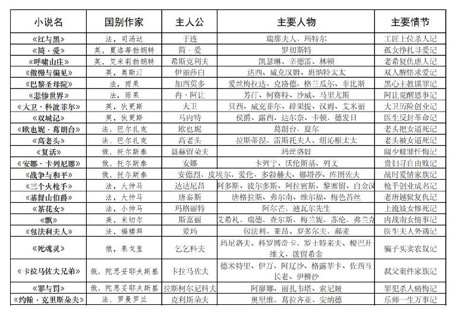

笔者用这一张图表，将这一时期的一些重要小说、国别、作者、主人公和主要事件进行了简要的整理，兴许会对理解故事内容有所帮助。由于篇幅原因，这里就无法对每部小说进行情节的展开。但是由于笔者和这段文学史渊源比较深，感触比较多，这里姑且拿出来几首根据内容创作的蹩脚小诗展示，且作读者的笑料吧。

**爱·恨·进**

我深沉地爱着，  
在傲慢中悔改，在偏见中调转，  
到达你的身边——坦诚以待，  
无论你过往。[^5]

我沉重地恨着，  
在肆虐中怒吼，在离别中落泪，  
到达你的身边——一雪前耻，  
无论你是谁。[^6]

我努力地前进着，  
在黑暗中扎根，在痛苦中挣扎，  
到达你的身边——至死不渝，  
无论你如何。[^7]

**年代**

战争的年代，  
有一颗责任与爱的心：  
我将你带出狂澜，  
自己赴往洪流。  
生死。[^8]

恐怖的年代，  
有一颗日渐清晰的心：  
我将你救向光明，  
自己迎面猛兽。  
两尸。[^9]

悲惨的年代，  
有一颗不甘屈辱的心：  
我将你脱离鞭笞，  
自己逆来顺受。  
长辞。[^10]

**心**

我有一颗宏大的心——  
能给虚伪以沉重一击，  
能给荒诞以轻蔑一笑，  
能给堕落以鄙薄一眼；[^11]

我有一颗刚烈的心——  
能放下功名，和暴虐的野兽针锋相对，  
能隐藏身世，和浑浊的社会一刀两断，  
能追逐爱情，和世俗的肉体彻底决裂；[^12]

我有一颗炽热的心——  
能恨得畅快，更能爱得滚烫，  
能感动于澄澈内心，更能感化污浊外象，  
能被救赎于泥沼，更能救赎之于汪洋。[^13]

**人类**

人类到底是怎样的动物呢？

——人类就是卑劣的动物。

如果对人类太差，人类就会被逼到崩溃，脆弱的。[^14]  
如果对人类太好，人类就会恃宠反过来压榨给予者，无耻的。[^15]  
如果想要的得不到，人类就会欲望膨胀把自己逼上梁山，贪婪的。[^16]  
如果想要的得到了，人类反而会陷入迷茫和无限内斗，愚蠢的。[^17]

——人类就是卑劣的动物。

**沼泽**

我发现矛盾的沼泽。

烽火四起染雄烟，桃花盛开空牵连。  
问君问尔何解难，亦排冤情亦戍边。[^18]

我深陷矛盾的沼泽。

安守牢笼终不满，冒险寻宝乃焚火。  
愈陷愈深虚空中，触燃唯失真自我。[^19]

我摆脱矛盾的沼泽。

曾经过错有千万，心责意谴回良愿。  
上求下寻致赎罪，感化咒心光明还。[^20]

**惧**

我大胆地爱着。

我不畏惧身世的卑微，  
也不惧怕世俗的眼光——  
只追求一份真挚爱情。  
哪怕有背叛和误解。[^21]

我无穷地恨着。

我不畏惧道路的艰难，  
也不惧怕敌人的威严——  
只追求一份破晓正义。  
哪怕有退隐和牺牲。[^22]

我渴望地前进着。

我不畏惧诡诈的手段，  
也不惧怕利刃或子弹——  
只追求一份光荣事业。  
哪怕有分离和诱惑。[^23]

**世界**

一个错综迷离的世界：

情欲与亲情撕裂，血色与绯色交织，梦境的幻觉，现实的晦暗。[^24]

一个任性自私的世界：

恨意与子弹碰撞，悔意与良知摩擦，忏悔的悲催，超脱的新生。[^25]

一个谎言遍布的世界：

金钱与贪念勾结，生命与本性脱节。  
肮脏的街头，仓皇的鬼魂。[^26]

**小约翰**

湖边静谧，约翰钢琴。  
天赋祖父，童年遣兴。  
恋爱批评，仗义巴黎。  
一见如故，一见钟情。  
别离重逢，心理斗争。  
恬淡平静，悠远空明。[^27]

这些小诗水平极差，还望读者多多担待。总的来说，19世纪这些小说，普遍关注人性，描述的是周围人们的生活、人们的故事、人们的情感，既不是上一个时代神的故事，也不是下一个时代奇异的怪事，读来，有人觉得津津乐道，有人觉得情节老套、枯燥乏味。但无论如何，不能否认这些作品在文学史上的地位和价值。

[^5]: 自英国奥斯汀《傲慢与偏见》。
[^6]: 自英国艾米莉勃朗特《呼啸山庄》。
[^7]: 自英国夏洛蒂勃朗特《简·爱》。
[^8]: 自法国雨果《九三年》。
[^9]: 自法国雨果《巴黎圣母院》。
[^10]: 自法国雨果《悲惨世界》。
[^11]: 自英国狄更斯《雾都孤儿》。
[^12]: 自英国狄更斯《双城记》。
[^13]: 自英国狄更斯《大卫·科波菲尔》。
[^14]: 自法国巴尔扎克《欧也妮·葛朗台》。
[^15]: 自法国巴尔扎克《高老头》。
[^16]: 自法国福楼拜《包法利夫人》。
[^17]: 自美国米切尔《飘》。
[^18]: 自俄国托尔斯泰《战争与和平》。
[^19]: 自俄国托尔斯泰《安娜卡列尼娜》。
[^20]: 自俄国托尔斯泰《复活》。
[^21]: 自法国小仲马《茶花女》。
[^22]: 自法国大仲马《基督山伯爵》。
[^23]: 自法国大仲马《三个火枪手》。
[^24]: 自俄国陀思妥耶夫斯基《卡拉马佐夫兄弟》。
[^25]: 自俄国陀思妥耶夫斯基《罪与罚》。
[^26]: 自俄国果戈里《死魂灵》。
[^27]: 自法国罗曼·罗兰《约翰·克里斯朵夫》。

#### 3.1.3 个性：现代文学

至于西方现代文学，我尝试用“个性”一词来描述。西方现代文学愈发趋向于各种风格——20 世纪现实主义文学、20 世纪现代主义文学、20 世纪后现代主义文学。一个“现代”，一个“后现代”，就好似和之前的时代彻底划清了界限，成为了一个独具特色的时代。

现代这词的含义，似乎就是与古典的决裂，对古典的反叛，对更现代更先进的文学的追求，力争“把活整得又新又好”，而一个后现代主义，则是对现代的反叛，与现代的决裂，走着一条更远更深的道路。

这时间里，我对这些文学作品的关注点，从故事情节到了故事意境，从作者风格到作者流派，从文学表达技巧到新颖写作方式。接下来，我将主要介绍如下几部作品：

《魔山》《变形记》《喧哗与骚动》《追忆似水年华》《尤利西斯》《百年孤独》首先我说我对这些作品的关注点已经到所营造的意境。这么说，一是因为剧情已经难以捉摸，我难以沉下心来认真研讨，二是因为作者设计剧情的方向也引导读者减少对剧情的专注。于是，我对文章意境有了大体的理会，同样用了几首打油诗来描述：

**百年孤独**

夕阳披着万丈霞光，倾泻在浩渺的大海上。

赤粼粼的海面，送着浪花拍打在赤色大地上。

草木薄，惨淡地、凄黑地、点缀着。

破败的木屋立着，门半敞着，有几个赤身的人在做无耻的事。

吉卜赛人拖着麻袋，安详地走过。

远处的老何塞，正蹒跚远去，只留下一行胶印、无尽虚无，和百年孤独。

**尤利西斯**

石桥边，爱尔兰的狂澜暴虐地击打着。

海边矗立着一座石塔。

那塔由砖块垒成圆柱。

斯蒂芬在桥下，眺望着海的对岸和天的尽头，寻找着光芒万丈神和父。

布鲁姆低头望着，要把地壳望穿，那样子，在憧憬一匹马，一匹忠良的马。

**喧哗与骚动**

小镇外，田垄上，

三兄弟在河边。

小弟班吉像个幼童，喧嚷着奔跑、踢球。

二哥杰生握着一摞钞票，似在赏景，似在沉思。

大哥昆丁悲泪纵横，人消失了，只剩水中的影子。

回到小镇，几个房子，几个人类，一个白孔黑心，一个白心黑孔，还有一个白始黑终。

**追忆似水年华**

月笼罩着，星光洒向围着的别墅。

敞开的门里显露出两个身影。

两人举杯对酌，蝌蚪冷眼俯视以待。

楼上的窗子中，一人目视上好的钢琴，却不知所措、啐了一口。

另一盏窗子，那人手拿画册，精美细腻被丢弃到一边，获得了与一堆书页纷飞的书同样的命运。

魔山

群山怀抱中，有一座天池。

波光粼粼，澄澈美丽。

患者于山上——一山一屋，影厅哗笑，二山二屋，酒馆邂逅，三山三屋，舞会喧嚷，四山四屋，小酌慢谈。

诚然详，诚然亡。

下面介绍一下各书的流派和创新点。首先是托马斯·曼的《魔山》。这本书给人的印象就是好读又不好读。小说描述的是主人公汉斯来到疗养院的故事，描写了周围许多欧洲贵族、资产阶级。整个社会弥漫着颓废致死的氛围，给人以压抑之感。

这部获得诺贝尔文学奖的经典作品，已经超越了上一个时代现实主义或浪漫主义的拘束，冲到20世纪现代主义文学的历史中。现代主义者，生活在工业革命后、资本主义制度确立后发达的社会，用现代的种种视角来审视美学，并就此发展了现代主义文学、现代主义哲学、现代主义艺术。作者托马斯曼用现代主义的笔法，写出了一个疗养院之中的各种故事。

接下来是卡夫卡的《变形记》。卡夫卡是奥地利的伟大作家。除了中篇小说《变形记》，他的伟大作品还有《审判》和《城堡》。《变形记》写的是一个推销员辛苦工作以微薄工资供养家人，可当一日变成甲虫后，家里人都冷漠不堪，嫌弃他，最后孤独痛苦地死去。《城堡》喜的是测量员 K 长途跋涉来到城堡却如何都进不去的故事，而《审判》写的是普通公民 K被莫名其妙抓进监狱，最后被执行死刑的荒诞故事。卡夫卡常用这种现代主义的荒诞笔法，来揭示世界的冷漠与荒谬。

然后是三部经典意识流作品：福克纳的《喧哗与骚动》、普鲁斯特的《追忆似水年华》、乔伊斯的《尤利西斯》。这三部书给人的第一印象就是“怪”“又臭又长”和难读。的确，《追忆似水年华》不像是常人能读完的书，共有七部。所幸上海译文出版社出版了《追忆似水年华》精华本，七合一，还让人能够读完。所谓意识流，就是常常不加“XX心想”而直接对人物心理进行描写，想到哪里说到哪里，也因此这些心理描写难以读懂，甚至这部分不加标点，需要读者自行断句。

《喧哗与骚动》写的是美国南方没落的奴隶主一家的故事。长子昆丁因妹妹凯蒂风流投河自杀；次子杰生视财如命，贪婪冷酷；三子班吉有智力障碍。小说共有四章，前三张分别

以三个人的视角叙述了一遍故事，最后一章以女佣迪尔西的视角将故事又写了一遍。作者福克纳用意识流的笔法完美呈现了这个故事。也难怪福克纳说：“我重复写这个故事写了四遍。”《追忆似水年华》是一部散文式长河小说，以“我”为主人公，着力表现了现代资本主义社会无所事事的贵族遗老遗少和饱食终日的资产者。《尤利西斯》是爱尔兰作家詹姆斯乔伊斯的作品，写的是青年斯蒂芬寻找精神上的父亲和布鲁姆寻找一个儿子的故事。这部书描述的是一日之间的事件，却结合了《荷马史诗》的结构与叙述模式，与这部古希腊史诗“梦幻联动”，也是一部伟大的意识流作品。

提到福克纳，就不得不再说一说他的对头海明威了。海明威的一本《老人与海》享誉全球，但是他的其他著作《永别了武器》《太阳照常升起》《丧钟为谁而鸣》《乞力马扎罗的雪》都十分优秀。他的艺术风格独特，写作技巧高超，更是凝结了一代美国文化，为“迷惘的一代”提供了精神丰碑——坚强、意志、顽强、勇气。菲茨杰拉德的《了不起的盖茨比》中盖茨比这个能够奋斗的小伙子，也展现了美国式的精神。不同的是，另一位美国作家梭罗的《瓦尔登湖》就偏向于自然纯朴的文学了，写了自己在瓦尔登湖生活的18篇散文。四季更替，生活自然，返璞归真，令人向往。

《百年孤独》是当代作家马尔克斯的作品。这部作品堪称后现代主义的典范。对于这部书的介绍，我想放到下一篇拉美文学去写。

由于同处现代，下面的篇幅我将写一下不一样的文学——苏俄文学。

苏俄文学，我想简单谈几部：《钢铁是怎样炼成的》《童年在人间我的大学》《怎么办？》《日瓦戈医生》《静静的顿河》《癌症楼》。这看起来和本篇主题不符，似乎不是个性之小说。

但是，苏俄世界虽然也是欧洲，却诞生了不同体系的文学著作，岂不也是个性？

前三部名著在中国可谓是家喻户晓，大概是因为在中苏交好时期苏联强调奋斗与建设的文学传入较多也符合当时中国的主流观念——勤劳奋斗。奥斯特洛夫斯基的《钢铁是怎样炼成的》写的是工人的儿子保尔·柯察金童年受苦，后来在朱赫来的影响下加入了红军，在军队中多次受伤，最终双目失明全身瘫痪，在病榻上历时三年写下了《暴风雨所诞生的》。这是一部具有自传色彩的传奇故事，强调人的一生努力奋斗才能创造意义。高尔基的《童年在人间我的大学》是自传三部曲，写的是主人公阿廖沙童年虽受到疼爱，但观察到俄国小市民的丑恶嘴脸，后来走上社会独立谋生感受到了人间的痛苦，后来上大学梦想破灭，他历经波折进入社会大学，对人生和社会有了更深刻的理解。车尔尼雪夫斯基的《怎么办？》写的是少女薇拉嫁给罗普霍夫，创办了缝纫工场，却爱上了丈夫的朋友。后来罗普霍夫选择接受，

两家人和睦的生活在一起。这本书虽然看起来剧情古怪，却反映了作者对于人人幸福的社会的向往。

而另外三部的知名度就相对来说不那么高了。帕斯捷儿纳克的《日瓦戈医生》记述的是日瓦戈与妻子冬妮娅、女护士拉拉之间的三角爱情故事，表现了战争的无情与人性的消极。

肖洛霍夫《静静的顿河》是一部长篇鸿著，记述的是哥萨克人在一战、二月革命、十月革命和国内战争时期的苦难经历，展现的是哥萨克人通过战争与革命走向社会主义萨克人在第一次世界大战、二月革命和十月革命以及国内战争中的苦难历程，最终走向社会主义的历史。

全书围绕着一首哥萨克古歌来写（节选）：“静静的顿河，我们的父亲！静静的顿河，你的流水为什么这样浑？我静静的顿河的流水怎么能不浑！”却也在一定程度上揭露了无产阶级革命在阶级矛盾不尖锐的地区爆发的不合理性。索尔仁尼琴的《癌症楼》写的是主人公在劳改后患癌症进入癌症楼，最终沉睡的兽欲在他身上爆发的悲哀故事。这本书揭示了社会的不公与黑暗，在一定程度上讽刺了苏联模式对人性的压迫。有趣的是，许多苏联作家因为在他国写下反共反苏的文学作品而被西方世界认可，获得诸多文学奖项，甚至诺奖。

#### 3.1.4 魔性：拉美文学

笔者受到新时代互联网影响，对拉美文学产生了浓厚的兴趣，便拿来了许多拉美文学作品来看，作品有如下：

鲁尔福《佩德罗巴拉莫》；

马尔克斯《百年孤独》《霍乱时期的爱情》；

科萨塔尔《南方高速》；

略萨《酒吧长谈》；

波拉尼奥《2666》；

博尔赫斯《恶棍列传》《小径分叉的花园》；

聂鲁达《二十首情诗和一首绝望的歌》。

这些书给笔者的感受是：真是比现代主义还现代主义，比后现代主义还后现代主义，真不愧是魔幻现实主义文学。调侃归调侃，这些文学巨匠的文学造诣还是相当了得。

由于这些内容比较烦琐难以细说，下面我将这些文学作品列一个表，来阐发我对拉美文学特质的理解。

作家 国籍 作品名 主要内容 印象

佩德罗去科拉玛寻找父亲，但是父亲已去鲁尔福 墨西哥 佩德罗巴拉莫 荒诞、阴森世，通过鬼魂了解了父亲形象。

百年孤独 拉美布恩迪亚家族七代的百年兴衰。 神秘、魔幻哥伦马尔克斯 乌尔比诺和达萨青年爱情失败，乌中年浪比亚 霍乱时期的爱情 浪漫、瑰丽荡，老年后重新相爱结婚。

南方高速 堵车时，现代人开始关注身边事物，加速科萨塔尔 阿根廷 生活、哲思（短篇小说集） 后，时间飞速流逝，人们都消散。

奥德利亚独裁时期年轻记者圣地亚哥的略萨 秘鲁 酒吧长谈 拘束、罪恶所见所感。

波拉尼奥 智利 2666 文学家们了解大量妇女被杀害事件。 恐怖、压抑恶棍列传 日、中、美、英、土等地恶棍故事。

博尔赫斯 阿根廷 智慧、幽默小径分叉的花园 侦探故事，设置了迷宫与时间花园。

聂鲁达 智利 20情诗&1歌 充满浪漫与淫秽歌词的诗歌集。 浪漫、不羁拉美作品普遍突破了旧时代的拘束，继承和发展了现代主义、后现代主义，并学习吸收了20世纪的哲学流派如存在主义、虚无主义、现象学等，创立了属于自己的文学流派——魔幻现实主义。许多文学作品的故事情节极其荒诞，又具有极强的剧情效果，这种现象在马尔克斯的《百年孤独》体现极为明显。

《百年孤独》是极优秀的一部作品。一般来说较高水平的文学著作难以成为畅销作品，而这部获得过诺奖的文学巨著却做到了，足见马尔克斯高超的文字水平。全书塑造的人物、环境、剧情都极具特点，作者的用语习惯似乎啰嗦，但却有一种深藏的文字的美。这不仅是一个家族的百年兴衰史，更是整个拉美大陆历史社会大变迁的描绘。这种宏大的气势以及有趣的笔法，也让国内不少作家学习模仿，也诞生了很多试图模仿超越《百年孤独》的作品，如《白鹿原》《丰乳肥臀》。这里，一个拉美小村里大家族，随着百年的进程走向衰落。

其他作品里，有的恐怖，有的浪漫，有的富含哲思，有的具有生活气息，读来虽难懂，却令人兴致盎然。

### §3.2 艺术简史

#### 3.2.1 从古希腊到文艺复兴

继原始的洞穴壁画、古埃及金字塔等人类早期的艺术成就后，我们从古希腊艺术开始讲起。

古希腊这里，也就是整个西方艺术史的起源了，这期间诞生了许多优秀的杰作，比如雕塑作品《米洛斯的维纳斯》、建筑帕特农神庙等等。古罗马继承了古希腊的遗产，正如诗句所说“光荣属于希腊，伟大属于罗马”，古罗马也诞生了诸多的文明成果，不过很多难逃“照搬抄袭”古希腊的嫌疑，比如建筑万神庙、大斗兽场。而到了中世纪，教会神权统治着社会，这个时代由于神这一形象的压制，绘画作品十分死板，人物像是一个模子刻出来的，呆若木鸡毫无生气，作品内容也以宗教题材为最大多数，所有神还自带“光环”，例如《面包和鱼的奇迹》。不过也有试图打破这一桎梏的人，奥托。他的作品尝试了画出空间层次的感觉，让画面不再那么单调死板，如作品《金门之令》《哀悼基督》。

盛大的文艺复兴运动，为艺术发展注入了新的活力。文艺复兴提倡以人性代替神性，艺术家开始对人体的美感、人性的美感进行关注和描摹。艺术三贤达芬奇、米开朗基罗、拉斐尔各自留下了伟大的艺术作品。如达芬奇《蒙娜丽莎》《最后的晚餐》、米开朗基罗的雕塑《哀悼基督》《大卫》和绘画《西斯廷礼拜堂天顶画》、拉斐尔《草地上的圣母》《雅典学派》。所有这些作品，人物有了丰富的表情，也有了神韵和细腻的情感。

如果要评“第四贤”，那提香当之无愧。他的作品《圣母升天》《佩萨洛圣母》采用了非对称的动态构图，给人一种平衡的美感。提香之外，威尼斯画派的大师还有贝利尼、桑德罗、乔尔乔涅。

意大利文艺复兴这三贤之外，在北方德国也有一位文艺复兴大师，丢勒。他善于使用细微的笔法和透视法来画画，代表作品有《13岁自画像》《穿毛皮领大衣的28岁自画像》。

另外值得一提的一点是，西方从古至今的许多艺术作品都取材于古希腊神话和《圣经》，这也造成了很多文化隔阂，让我们难以把握西方美术的内涵，就好像老外也会对大闹天宫一头雾水一般。这里我们有必要去大体了解一下希腊神话里的诸神和《旧约》《新约》中上帝和人类的若干约定。但是是在由于体量过大，即使是大体了解也需要费时费力，这需要笔者和读者一起学习。

#### 3.2.2 巴洛克、洛可可、古典主义、浪漫主义、现实主义

时间继续推进，古希腊和文艺复兴确立起了“古典主义”的标准。随着教会发展，富丽

堂皇的巴洛克风格建筑应用到教堂上。贝尼尼的雕塑《普鲁托和普洛塞尔皮娜》《圣特蕾莎的沉迷》都是极优秀的作品。巴洛克风格风靡一时，路易十四修建的凡尔赛宫也是巴洛克的代表作，这一时期也诞生了很多巴洛克大师。这里主要介绍几位：卡拉瓦乔、鲁本斯、伦勃朗、委拉斯开兹、维米尔。出身平民的画家卡拉瓦乔常常关注底层人民的生活状态，他的画同时在光影的处理和静物的描摹上很高很妙，代表作《召唤使徒马太》《水果篮》《圣母之死》《犹迪杀死荷罗孚尼》。鲁本斯受到卡拉瓦乔的影响很大，他的作品《被诅咒者的堕落》《屠杀无辜》《劫夺吕西普斯之女》都人物众多却搭配协调。伦勃朗的代表作有《夜巡》《西菲利斯的密谋》，他对艺术有执着的追求，然而他的艺术理念并未被当时的社会认可。委拉斯开兹是宫廷画家，给贵族作了不少画。他的画以逼真著称，代表作有《宫娥》，其中《宫娥》巧用镜子的设计独出心裁。维米尔凭名画《戴珍珠耳环的少女》《倒牛奶的女仆》《绘画的艺术》也留名青史。

巴洛克后期的几位画家如富凯、普桑、勒布朗、洛兰这里不再花笔墨细说。不过洛兰的风景画确为一绝。路易十四之后，纸醉金迷的贵族风气仍存，也就随之诞生了精奢的洛可可艺术。路易十五的蓬皮杜夫人不是艺术家，却推动这一风格的艺术澎湃发展。洛可可艺术风格色彩艳丽，建筑也明丽鲜艳。这一时期的代表作品有华托的《舟发西苔岛》、布歇的《蓬巴杜夫人像》《狄安娜出浴》《宫女》、弗拉戈纳尔的《秋千》，建筑有维斯朝圣教堂、维森海利根教堂，另外还有塞夫勒瓷器，都是洛可可的代表标志。

随着法国大革命的爆发，这些豪奢的艺术风格的“命”也被新兴的革命党人“革”掉了，对古典主义的翻新：新古典主义应运而生。新古典主义的两位大师大卫和安格尔。大卫的作品《马拉之死》《荷拉斯兄弟之誓》都用画作表达了革命的激情；安格尔则擅长古典笔法的女性题材，著名作品有《泉》《大宫女》《瓦平松的宫女》，对丰满的人体美做出了生动诠释。

启蒙思潮深刻影响着人们，对理性的追求也促使一部分艺术家转向对情感、想象力、诗意的浪漫主义的追求。然而另一流派反感画宗教神话的新古典主义，也反感无病呻吟的浪漫主义，这一派便是现实主义了。

下面介绍浪漫主义。德国的弗里德里希擅长风景画，作品有《山上的十字架》《海边修道士》《冰河中的航船失事》，德国的龙格将浪漫主义精神用来描绘人物，作品有《胡森贝克家的孩子们》《清晨》。两幅重量级画作：籍里柯的《梅杜萨之筏》和德拉克罗瓦的《自由引导人民》，都成为描绘革命的传世经典。西班牙的宫廷画师戈雅擅长描绘丑恶的主题，代表作《1808 年 5 月 3 日夜枪杀起义者》《吞噬其子的农神》。英国的凡·戴克、康斯特布尔和透纳也都是浪漫主义的代表人物。

接下来是现实主义画家。库尔贝用自己的笔展现真实的东西，留下了《碎石工》《画室》《绝望的男子》等作品。米勒喜爱描绘农民，画了《播种者》《拾穗者》《晚祷》等优秀写实作品。此外，还有罗丹的雕塑《地狱之门》（《思想者》出自其中）、柯罗的景物作品《阿弗雷村》、卢梭的景物作品《树丛风景》、拉斐尔前派的画家（罗塞蒂、米莱、亨特）、俄国的巡回展演画派（克拉姆斯科依、列宾、列维坦、苏里科夫）。

#### 3.2.3 印象派、后印象派、现代艺术

印象派绝对是数一数二的艺术流派。我们从马奈开始说起。马奈的《草地上的午餐》《奥林匹亚》《阳台》引来无数社会批评，却也开启了新的时代。接下来就是一些知名的画家和画作，莫奈的《日出印象》《睡莲》《干草堆雪景》、嗜好芭蕾的德加的《舞台上的舞女》《芭蕾舞课》、雷诺阿的《小艾琳》《红磨坊的露天舞会》《拿水壶的小女孩》《大浴女》、跑去当土著的高更的《爪哇安娜》《两个大溪地女人》《我们从哪里来？我们是谁？我们到哪里去？》、梵高的《星月夜》《向日葵》《画架前自画像》《叼烟斗自画像》《没胡子自画像》、提倡抽象结构与协调平衡的保罗·塞尚的《普罗旺斯的山》《静物和打开的抽屉》《高脚盘、玻璃酒杯和苹果》。其中后三位大师高更、梵高、塞尚被归为后印象派。

进入20世纪的现代艺术，开启了一个对艺术全新解读的新的时代。艺术不再仅仅是之前所被定义的那个样子，立体派毕加索的《格尔尼卡》、野兽派马蒂斯的《红色的和谐》《舞蹈》、表现派蒙克的《病中的女人》《呐喊》、未来派巴拉的《拴着皮带的狗》、风格派蒙德里安的《红黄蓝的构图》和波洛克的《1949年1号》、抽象派康定斯基的《构图4号》《构图6号》《构图7号》《构图8号》、至上派马列维奇的《红色方块》《白色之上的白色》《至上主义的构图》、超现实主义派达利的《记忆的永恒》和玛格利特的《梦的钥匙》《恋人》和弗里达的《有荆棘鸟项链的自画像》、象征派布朗库西的《祈祷者》《沉睡的缪斯》、达达派阿尔普的《生长》《云朵牧羊人》、杜尚的小便池《泉》、包豪斯建筑、安迪·沃霍尔的波普艺术《玛丽莲梦露》、克洛斯的超写实主义艺术《马克》。可以说，艺术被重新定义了，人们对艺术的理解也不再是“像不像”了。

#### 3.2.4 再谈另一艺术：音乐史

音乐史相比美术史就没那么重要，但也令人感到陌生。对于音乐，我就姑且从巴洛克时期开始说起。

巴洛克时期大约在17-18世纪，这一时期教会音乐衰落，歌剧大大发展，歌剧大师有蒙特威尔第。继作曲家拉莫提出了和声理论，后来巴赫的贡献使自己被称为“西方音乐之父”。

巴赫所开创的音乐体裁众多，他的平均律、创意曲、赋格都流芳百世。另一位音乐家亨德尔较擅长写主调音乐、咏叹调。他们之后，还有“协奏曲之父”维瓦尔第、“奏鸣曲之父”斯卡拉蒂。

【交响曲】【协奏曲】【奏鸣曲】三个概念非常重要，也经常被搞混。交响曲指交响乐队演奏的大型套曲；协奏曲指一件充分展示其个性和技巧的独奏乐器与管弦乐队互相竞奏的大型器乐套曲；奏鸣曲则是一种“快-慢-快”的曲式，由一个乐器独奏，或者一个乐器与钢琴合奏，常有钢琴奏鸣曲、小提琴奏鸣曲等。

古典主义时期大约是在18-19世纪，其鼎盛时期被称为维也纳古典乐派。古典主义时期奏鸣曲、交响曲、歌剧不断发展，音乐向着主调音乐靠近，从巴洛克时期的“乱”走向古典主义时期的“治”。这一时期的知名音乐家，有莫扎特、贝多芬、比才、海顿、曼海姆、格鲁克等。贝多芬的音乐兼具英雄气概和浪漫情怀，充满正能量和抗争意味；莫扎特的音乐则具有崇高的怜悯情感，似来自天上。

浪漫主义时期则是在19-20世纪。这一时期钢琴地位进一步上升，民族乐派兴起，优秀作家有舒伯特、、门德尔松、肖邦、舒曼、李斯特、勃拉姆斯、柏辽兹、瓦格纳、马勒、施特劳斯，罗西尼和威尔第也进一步发展了歌剧。民族乐派代表人物有斯美塔那、德沃夏克、肖邦、勃拉姆斯、德彪西、柴可夫斯基、拉赫玛尼诺夫等人最后一个时期就是现代音乐，风格复杂，走向现代化。勋伯格、斯特拉文斯基、普罗科菲耶夫、肖斯塔科维奇等人的音乐充分表达“自我”，表达现代音乐。

#### 3.3 本部分参考书目

文学原著见§3.4。《外国文学史（上下）》，高等教育出版社，郑克鲁《西方文学简史》，江西美术出版社，文聘元《谈美》《谈美书简》，朱光潜《黄与蓝的交响》，作家出版社，易中天 邓晓芒《对立之美》，中信出版集团，严伯钧

《大话西方艺术史》，海南出版社，意公子《行者无疆》，长江文艺出版社，余秋雨

#### 3.4 文学原著

《荷马史诗》 《汤姆叔叔的小屋》 《罪与罚》 《喧哗与骚动》  
《十日谈》 《百万英镑》 《卡拉马佐夫兄弟》 《了不起的盖茨比》  
《神曲》 《马克吐温小说》 《约翰·克里斯朵夫》 《老人与海》  
《莎士比亚戏剧》 《莫泊桑小说》 《猎人笔记》 《瓦尔登湖》  
《浮士德》 《契诃夫小说》 《童年在人间我的大学》 《荒原狼》  
《少年维特的烦恼》 《欧亨利小说》 《母亲》 《月亮与六便士》  
《堂吉诃德》 《欧也妮·葛朗台》 《钢铁是怎样炼成的》 《百年孤独》  
《红与黑》 《高老头》 《癌症楼》 《霍乱时期的爱情》  
《简·爱》 《复活》 《怎么办？》 《佩德罗巴拉莫》  
《呼啸山庄》 《安娜卡列尼娜》 《静静的顿河》 《南方高速》  
《傲慢与偏见》 《战争与和平》 《日瓦格医生》 《酒吧长谈》  
《巴黎圣母院》 《三个火枪手》 《局外人》 《2666》  
《悲惨世界》 《茶花女》 《鼠疫》 《恶棍列传》  
《九三年》 《基督山伯爵》 《西西弗神话》 《小径分岔的花园》  
《大卫·科波菲尔》 《飘》 《魔山》 《二十首情诗和一首绝望的歌》  
《雾都孤儿》 《包法利夫人》 《尤利西斯》 《双城记》 《死魂灵》 《追忆逝水年华》

## 第四部分 简明西方社会科学

### §4.0 前言

这一部分，是我最感兴趣的部分，却也是我最没有把握去写的一部分。

亚里士多德说：“人类是天生的政治动物。”的确，我们不得不关注我们的周围环境，并以此研究，产生学问。研究自然的那部分自然科学也产自西方，但我实在没有能力讲出来，研究人类社会这一部分便是社会科学了。社会科学现在发展的比较完善，毕竟人类自城邦诞生就已开始对其研究，发展时间很长。但又完全不完善，因为社会科学这种比较文字化的说辞，正着反着都能证明，也因此很难说对与错，且更不能进入定量研究阶段。

总之，再说“简明西方社会科学”有哪些内容吧。社会科学，应当是包括政治学、经济学、社会学、法学、国际关系学的诸多学科的总和。这些领域，也是我一直以来感兴趣且有过“浅”入了解，读过些许几本政治学经济学讲义。但它们给我的直观感受就是，基础原理像废话一样简单，而深入的洞见又过于深入难懂。这难度似乎不是线性变化的，简单内容都可以通过生活常识轻松理解，而要达到高水平见解付出数倍努力也难。

因此，我想在这一部分把各领域最基本的原理较为全面地介绍一下，希望能在覆盖教科书基本内容的基础上能够略简化一下理解，以契合我们“简明”的目标。其内容大致包括：

政治思想史和政治常识、微观与宏观经济理论、社会与法律体系。这些内容横跨诸多领域，要阐述清楚明白绝非易事。难免出现纰漏和不到位处，望读者多多担待、批评指正。

### §4.1 政治思想史和政治常识

#### 4.1.1 政治意识形态史

这里我们要讲的政治意识形态史，也就是通常意义上的政治思想史。在第一部分的哲学史中，我们介绍过若干位哲学家的政治思想。所有的这些政治思想汇总起来，构成了意识形态变迁的历史。

对意识形态介绍，一般从自由主义开始。自由主义反对封建制、君主专制，反对经济上的重商主义，提倡的是个人主义、自由平等、理性、宪政，以及经济上的放任主义。古典自由主义的大师有洛克、亚当·斯密、密尔等。洛克认为政府权力来自于被统治者的共同认可，统治应该基于被统治者的统一，他提出的生来自由、国民意志也对《独立宣言》《美国西纳法》产生重要影响。亚当斯密是一位经济学家，提出经济自由放任政策，并提出经济上的理性人假设和看不见的手等重要理论。密尔的理论从假定每个人绝对自由开始，但是绝对自由可能干涉其他人的绝对自由，因此社会要给自由限制，目的是给他人保护。因此政府只有在一个人行为对他人造成侵害时才能干涉。

面对经济危机、贫富差异、托拉斯垄断等问题，古典自由主义受到挑战。保守主义、社会主义等意识形态兴起，自由主义内部也出现了现代自由主义这一新的思潮。现代自由主义提出要“把政府找回来”，在尊重公民自由的情况下，提倡政府干预。罗斯福总统在大萧条时期的3R计划（Relief Recovery Reform）便是这一思想的应用。凯恩斯的一本《通论》也提出，自由放任政策可能导致经济问题，需要政府干预来促进经济增长、稳定就业、维持货币稳定。罗尔斯也是现代自由主义政治哲学家，他的《正义论》通过无知之幕提出了自由和平等原则，同时也要求政府干预。

到了20世纪70年代，西方经济出现滞胀现象，福利社会也带来很多社会病，新古典自由主义或称新自由主义应运而生。哈耶克的《通往奴役之路》提出，中央机构并不是完全靠得住的，社会需要创新于是需要自由。米瑟斯也是新自由主义者，他认为市场经济会提供最多的机会，公有制会导致生产力的下降。弗里德曼提倡经济自由，反对教育国有垄断，提倡市场机制。诺齐克的《无政府、国家与乌托邦》主张最小国家论，反对现代自由主义。

保守主义也是重要的思潮，同样也很复杂。学者们总结了保守主义的若干重要原则，捍卫传统、经验主义、承认人类的不完善（即对乌托邦的否定）、社会是有机体（不能靠理论

臆想改造社会）、重视秩序等级和权威、重视家庭宗教道德和财产权。这些原则并不是绝对的，不同的学派学说也会有出入，但这确实传达了保守主义的大致观点。英国的撒切尔夫人、美国的里根总统都是保守主义政治家。撒切尔夫人大力推进私有化改革，希望通过私有化建立民主国家；里根总统说“政府不是解决问题的手段，而是问题本身”。

对于社会主义，我想我们不必多说，从莫尔的《乌托邦》，到欧文、圣西门、傅里叶的空想社会主义，到马克思恩格斯的共产主义理论，我们都再熟悉不过了。社会主义不仅指导着苏联、中国等地的革命和建设，这种意识形态也在欧洲发挥着作用。

#### 4.1.2 国家政治的不同形态

霍布斯说，国家起源是因为若无伟大的利维坦，人们便处在每个人对每个人的战争中。

马克思说，国家是阶级矛盾不和调和的产物。韦伯说，国家是合法垄断暴力的组织。对于国家的解释，诸多学派各自有不同的说法。这里我们浅尝辄止，关注一下现实中政治的不同形态吧。

我们对国家形态的划分是很熟悉的。从小的唯物史观教育就告诉我们“原始-奴隶-封建

-资本主义-共产主义”的社会五形态。而在现代政治学中，去刻意区分资本主义国家和社会

主义国家是不明智的。于是遂划分为奴隶制、封建制、现代国家这三类。

重点要说的是国家政体。现代的政体区分方式和柏拉图、亚里士多德有所出入，可以大致分为民主、威权、极权，以及苏丹制。民主政体提倡个人自由、个人主义、自由选举；威权政体政治是有限的多元化，有独特的意识形态精神，由领袖或小团体行使权力；极权政体相当于全能主义，权力垄断，欸有多元化，有一个乌托邦的社会理念，动员加入政治，强调军人精神等；苏丹制则是完全的专制，没有法治，有高度的个人崇拜，高压暴力统治。借着这些特征，我们可以对世界上许多国家的政体进行区分。

有了国家形态和政体，国家就会在此基础上建构各种政治制度。有四方面重要的政治制度：政府形式、选举制度、政党体制、央地关系，其主要形式都列在文末的表中。

政府形式也是有意思的。先看美国的总统制。国会和总统由选民选举，总统、国会和联邦法院三权分立，总统选择内阁部长来管理政府部门。英国的议会制度是：选民选举产生议会，议会选择首相，国王形式上正式任命首相，首相选择内阁管理政府各部。法国的半总统制可以说是总统制和议会制的结合，选民选举议会，议会选举总统，总统选择总理和部长，而总统可以解散议会，议会可以倒阁。因此一般而言，法国的总统会选国会多数党领袖当总

理，这也是左右共治现象出现的原因。

至于选举制度、政党制度和和央地关系，就比较一目了然，顾名思义即可，而值得一提的是，达尔提出了四种主要模式，将政府形式和选举形式进行了搭配，它们分别是：

|  | 议会制 | 总统制 |
| --- | --- | --- |
| 简单多数制 | 英国模式 | 美国模式 |
| 比例代表制 | 欧陆模式 | 拉美模式 |

将本节内容整理成表，如下表。

| 项目 | 类型一 | 类型二 | 类型三 |
| --- | --- | --- | --- |
| 意识形态 | 自由主义 | 保守主义 | 社会主义 |
| 国家形态 | 奴隶制国家 | 封建国家 | 现代国家 |
| 国家政体[^28] | 民主 | 威权 | 极权 |
| 政府形式（民主国家） | 议会制 (Britain) | 总统制 (America) | 半总统制 (France) |
| 选举制度（民主国家） | 多数决定制 | 比例代表制 | 混合制 |
| 政党体制（民主国家） | 多党制 | 两党制 | 一党制 |
| 央地关系 | 联邦制 | 单一制 | 混合制 |

#### 4.1.3 政治哲学的诸议题

宪法是一个重要的政治学问题。宪法与政治制度是独立的且可以人为设计的。宪法和政治制度可以决定立法-行政关系、中央-地方关系、选举问题、政党问题。在这些方面，我国实行根本政治制度人民代表大会制度、基本政治制度中国共产党领导的多党合作和政治协商制度，来决定政治学上的基本问题。

从现代政治学的角度观察，民主似乎是一个主流趋势。当今世界没有国家公开反对民主。

同样的，法治也是如此。政府权力有限、司法审查、依宪行政都是法治思想的体现。

民族不论在历史上还是今日政治上都扮演着重要的角色。nation一词既是民族又是国家，也就是说，民族与国家似乎总是建立着联系。事实上，几乎每一个民族都在追求其独立的国家或政治，因此而生的战争更不在少数。17-19世纪就是欧洲民族国家兴起的时代。这也是我国政治制度民族区域自治制度实施的必要性。

公民的政治参与也随着时代的发展愈发普遍。可以发现，公民的政治参与直接取决于该

[^28]: 亚里士多德提出的政体，包括三种正宗政体：君主政体、贵族政体、共和政体，和其对应的三种变态政体，分别为僭主政体、寡头政体、平民政体。而古代的政体划分和现代是有出入的。

国的政体，在民主政体、威权政体、极权政体下，民众的政治参与是不同的。另一方面，政治有时是和平的，有时是暴力的。克劳塞维茨说战争是政治的延续。我们可以理解，战争是暴力年代的政治。国家爆发革命、社会暴力的理论，有以下几种主流：一、马克思主义阶级冲突理论。二、群体心理理论——群众的集体情感心理学。三、系统共识价值理论——社会体系和系统的严重失衡。四、政治冲突理论——争夺权力。民众层面上，我国实行基层群众自治制度，在此看来也是有重要意义的。

在政治哲学这个板块中，我们还不得不谈一下政治学的研究问题。当今时代的政治学研究需要科学手段，需要把握因果关系，分析变量，采取适当的数学函数关系，试图去定量描述。例如，一个解释腐败的理论假说给出的公式就是 $C=F(Pr,C\&B)$。

#### 4.1.4 国际政治与国家利益

当今21世纪也是全球化的时代，我们应该更多地在国家政治之外了解一下国际政治。

国际政治和国家政治不同，国际政治是一种“无政府状态”，不存在一个“世界政府”来对世界统一管辖。因此，国际上的最高权力就是国家主权。主权概念是绝对的，主权国家是完全自治的，有至高无上的权力。国际法针对的也就是国际政治实体，也就是主权国家。

国际法的基本原则我们熟知，比如互相尊重主权和领土完整、互不侵犯、互不干涉内政、平等互利、和平共处。国际法对国家武力使用、国际责任都作出了限制，也对国际人权提出了更高的要求。

国际中，必然会出现国际冲突。冲突类型可以大致分为：核对抗的安全困境、民族主义影响的分离问题、国内问题外溢、大国争锋危机、多因素摩擦等。对国际冲突和国际利益竞争很好的理解工具便是地缘政治。地缘政治提倡用地理环境问题来解释政治现象、分析国际关系、部署政治战略。理解世界地理上的几大政治势力，还可以类比战国争雄、三国逐鹿、南北朝对峙等概念来辅助理解。例如可以分析旧大陆上的三大政治势力：中国、俄罗斯、欧洲三方的关系、欧洲内部林立的诸国、旧大陆另外两簇势力印度和日本各自与中俄欧的关系、俄罗斯与中亚西亚的关系、中国与东亚东南亚的关系等。而新大陆上美国独霸。美国有得天独厚的地理条件，远离旧大陆的纷扰，同时东西临两大洋，战略操作方便，也奠定了美国的世界霸主地位。因此美国对旧大陆的战略，就是一头掐西欧，一头掐东亚。中国的地理环境就不那么有利，内部平原，西北荒漠，西南高山，东南靠海但外面布满岛链。中国想要地缘发展，也必然要通过一带一路、中巴合作、收复台湾突破岛链、建立RCEP等战略实现。

### §4.2 微观与宏观经济理论

#### 4.2.1 经济学基本概念与微观市场

经济学在社科中的重要程度甚至压过政治学。现代西方政治学理论有这样一些基本事实，介绍如下。

①人们面临权衡取舍 ②某种东西的成本是为了它所放弃的东西③理性人考虑边际量 ④人们会对激励做出反应⑤贸易可以使每个人的状况都变得更好 ⑥市场通常是组织经济活动的一种好方法⑦政府有时可以改善市场结果 ⑧一国生活水平取决于它生产物品与服务的能力⑨政府发行过多货币时物价上升 ⑩社会面临通货膨胀和失业之间短期权衡取舍分工、贸易和市场在绝大多数情况下都是好的，既然谈到贸易，就要分析市场运行原理，也就是分析市场的的供给和需求。供给和需求这一对概念非常重要，用它能分析解决无数经济学问题。

如图，供给需求曲线，其交点被称为均衡点。均衡点是市场经济的倾向。外部因素改变，会导致 S 曲线或者 D 曲线平移，并使市场逐渐向新的均衡点移动。如果政府设置价格上限或者价格下限，就会导致供不应求或供过于求。

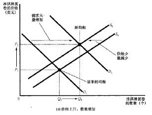

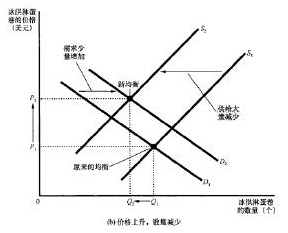

弹性指的是一个量变化比例除以价格变动比例，反应的是这个量对价格反应是否灵敏。需求弹性与供给弹性可以写作：

$$
E_D=\left|\frac{\Delta D\%}{\Delta P\%}\right|,\qquad
E_S=\left|\frac{\Delta S\%}{\Delta P\%}\right|
$$

计算弹性的比较好的公式是中点法：

$$
E_D=\frac{(D_2-D_1)/D}{(P_2-P_1)/P}
=\frac{(D_2-D_1)P}{(P_2-P_1)D}
$$

反映到 S-D 曲线中，斜率大的，弹性较小，价格变化对其影响不大，属于必需品；斜率小的，弹性较大，价格变化对其影响大，属于奢侈品。

需求曲线以下的面积，可以表示消费者剩余；供给曲线以上的面积，可以表示生产者剩余。这里面隐藏了一个边际思想，就是价格等于边际收益的时候，个人效益最大化。

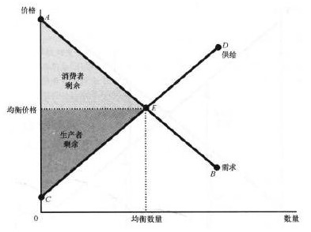

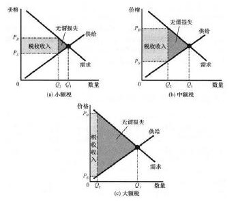

而当政府收税时，价格变化，整个三角形面积除掉新的消费者剩余、生产者剩余、税收额，还造成了一块无谓的损失。上图中，从a到c，无谓损失单调递增，而税收收入先上升再下降，容易用二次函数工具证明，这条二次曲线也被称为拉弗曲线。

我们已经谈到了供需平衡、弹性计算、消费/生产剩余、税收与损失这些重点内容。另一些市场，如生产要素市场，以及我们在§4.2.3要提到的货币市场、总供给与总需求市场，都可以用这种S-D曲线描述。

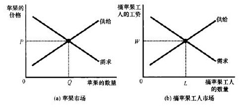

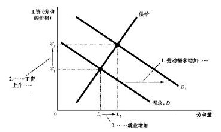

市场虽说有利，却也不是万能的。第一，外部性是造成市场失灵的重要原因。外部性就是一些没有被计入市场的外部因素，例如汽车尾气的负外部性、修建历史建筑的正外部性等。

政府可以通过征税、管制或者补贴等方式来应对这些现象。第二，还有许多没有价格的产品，根据是否具竞争性和是否具排他性，我们可以将物品分为：

| 性质[^29] | 竞争性 | 非竞争性 |
| --- | --- | --- |
| 排他性 | 私人物品，如衣服、拥挤的收费道路 | 俱乐部物品，如消防、有线电视、畅通的收费道路 |
| 非排他性 | 公共资源，如海中鱼、环境、拥挤的不收费道路 | 公共物品，如国防、畅通的不收费道路 |

面对公共资源、公共物品，供给需求分析也就失灵了。第三，市场还容易导致贫富分化、收入不均、信息不对称、经营管理不善等问题。

#### 4.2.2 个人和企业的决策

为了效益最大化，个人会选择将拥有的钱投到别处。个人可能选择储蓄或者投资（股票、债券、定期存单）。这时候就需要个人充分权衡风险和收益，毕竟理性人需要权衡。

对于市场上的企业，有四种形态：完全竞争市场、垄断竞争市场、寡头市场、垄断市场。

在每一种市场条件下，企业的决策是不一样的。在分析不同市场下企业的决策之前，让我们先了解几个重要概念。

固定成本（FC）是不随产量而变动的成本，如租金、雇员工资，可变成本（VC）指随产量变动的成本，如咖啡豆的成本。平均总成本（ATC）就是总成本（TC）除以产量，类似地：

$$
AFC=\frac{FC}{Q},\qquad
AVC=\frac{VC}{Q},\qquad
ATC=\frac{TC}{Q}=\frac{FC+VC}{Q}=AFC+AVC
$$

额外地且更重要地，边际成本：

$$
MC=\frac{\Delta TC}{\Delta Q}
$$

一般而言，边际成本递增，平均总成本先减后增。类似的概念还有总收益 TR、平均收益和边际收益：

$$
AR=\frac{TR}{Q},\qquad
MR=\frac{\Delta TR}{\Delta Q}
$$

竞争市场模型中，存在无数买方卖方，商品价格 P 是既定的，即 P=MR=AR。当且仅当边际成本等于边际收益即 MC=MR=P 时利润最大化，当且仅当总收益小于可变成本时即 TR<VC（简单的变换得 P<AVC）时停止营业，企业利润为 $(P-ATC)\times Q$。但在长期的市场中，由于自由进入和退出的推动，ATC 最终会等于 P，在这时，似乎企业利润为 0，但是企业利润等于会计利润加上隐性成本，因此会计利润仍然是正值。

[^29]: 可以粗略地认为，有没有排他性指的是该物品的使用是否需要门槛，有没有竞争性指的是使用该物品是否妨碍别人使用该物品。

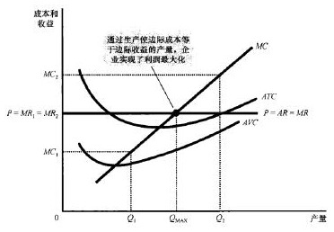

垄断模型中，价格 P 的曲线是斜向下的，就类似于我们之前了解的需求曲线。当且仅当边际成本等于边际收益即 P=AR=MC 时利润最大化，此时的价格 P 是高于边际收益 MR 的，企业利润也为 $(P-ATC)\times Q$。为了防止垄断者过多攫取利益干扰市场，政府会颁布反托拉斯法，并鼓励竞争。

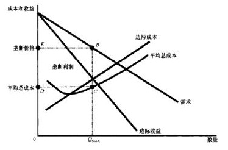

垄断竞争模型相当于垄断和完全竞争的杂合体。短期中，MC=MR 时，利润最大等于 $(P-ATC)\times Q$，长期中，垄断竞争企业会像完全竞争企业一样，P 会与 ATC 相切。

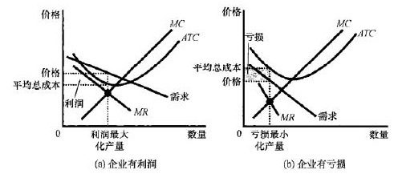

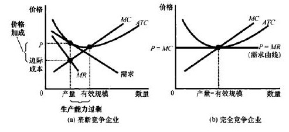

寡头市场则是只有几个少数卖者的市场。寡头分析一般需要引入博弈论，这里就略去。

寡头可能会勾结形成卡特尔（联合起来行事的集团），也可能会陷入博弈论的囚徒困境中无法合作。总之，寡头最终会使各自的产量达到某种均衡，名曰纳什均衡。此时，一般而言，$Q_{垄断}<Q_{寡头}<Q_{竞争}$，$P_{垄断}>P_{寡头}>P_{竞争}$。

#### 4.2.3 宏观经济的众多变量

此处，经济学中的变量可以类比物理中的“物理量”去理解。这里的变量包括但不限于GDP、CPI、货币量、利率、汇率、失业率、通货膨胀率、准备金率、顺差/逆差额。笔者将逐一分析各个方面的物理量，再去分析它们之间如何互动作用，内容大致覆盖经济学教科书的内容，但讲解思路有所不同。

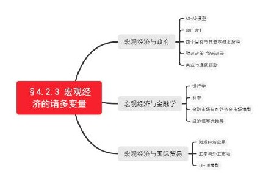

**（一）宏观经济与政府**

提到宏观经济，我们要想到什么叫宏观。宏观顾名思义就是考虑整个国家而不仅仅是一个微观市场的经济状态。这里引入我们宏观经济学的第一个模型：AS-AD（总供给-总需求）

模型。这种模型衡量了整个所有市场所有企业的生产，是很重要的。

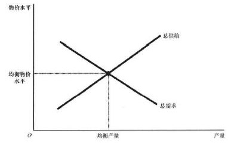

接下来，我们要说到两组概念 GDP 和 CPI。GDP（gross domestic product）指国内生产总值，是在某一既定时期一个国家内生产的所有最终物品与服务的市场价值，可以用来衡量经济状况。值得注意的一点是，一个体系内，总消费一定等于总收入。我们可以得到这样一个表达式：GDP 等于消费加投资加政府购买加净出口，以数学表达式的形式来写，就是：

$$
Y=C+I+G+NX
$$

由于货币价格改变，真实 GDP 于是指按不变价格评定的生产，名义 GDP 指按现期价格评定的生产。GDP 平减指数的定义就是名义 GDP 除以真实 GDP，用平减指数增长率还可以反映通货膨胀率：

$$
rate=\frac{GDPd_2-GDPd_1}{GDPd_1}\times100\%
$$

CPI（consumer price index）指消费物价指数。计算方式是当年一篮子物品价格除以基年一篮子物品价格。它同样可以反映通货膨胀率：

$$
rate=\frac{CPI_2-CPI_1}{CPI_1}\times100\%
$$

有了这些基本数据，我们可以开始考虑宏观经济的目标。其目标就是经济增长、充分就业、物价稳定和国际收支平衡。经济增长很重要，根本原因是生产力的提升；充分就业也很重要，失业是经济停滞、劳动需求减少的表现，失业率高一定不会是个好事；物价稳定很重要，过度的通货膨胀或通货紧缩都不是好事，而低水平（3%左右）的通胀率一定程度可以促进经济增长，关于货币价格，我们接下来还会再说；国际收支平衡也很重要，如果出口大于进口就有贸易顺差，如果进口大于出口就有贸易逆差，顺差代表金钱流入本国，逆差代表金钱流出本国。

有了目标，我们重点要说的就是政府如何达成这些目标，也就是重点分析政府的财政政策和货币政策。财政政策研究政府的钱从哪来往哪花的问题。如果政府支出超过税收，就称财政赤字；如果政府支出小于税收，就称财政盈余。如果政府希望促进经济，就会采取扩张性财政政策，让更多的金钱流入社会；反之则是紧缩性财政政策。这种措施是逆经济周期的，经济冷时让经济升温，经济热时让经济降温。

接下来是货币政策。货币政策取决于中央银行。美联储有四个工具：准备金率（不可贷出的存款比率）、贴现率（银行向央行借款的利率）、公开市场操作（买卖银行的债券）、量化宽松（美联储往外贷前）。如果想要增加货币供给量，刺激经济，就可以降低准备金率、降低贴现率、购买银行债券、向外贷款，反之则为收缩性货币政策。而使用货币政策来刺激经济，实际上是增加了货币量，而不增加真正的金钱量，则会造成通货膨胀，而货币这一部分损失的价值都由发展中国家如中国承担了。美国发行了过多货币而没有那么多真实的产品，中国正好用真实的产品换取美元，从而缓解了美国的恶性膨胀危机。这里，增加货币量导致

货币贬值的现象，我们用这样一个模型描述：

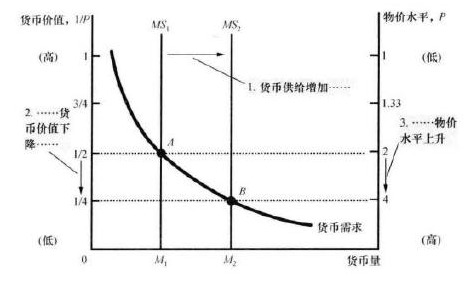

这一部分我们最后要说的是一种有趣的现象，它叫菲利普斯曲线，指的是低失业率和低通胀率是鱼和熊掌不可兼得的关系。菲利普斯曲线在某一段历史时期确实描述了现实状况。

经后来学者研究，短期内确实有菲利普斯曲线的取舍，长期内可能并无明确关系。

**（二）宏观经济与金融学**

货币有三种基本功能：交易媒介、价值储存工具、计价单位。银行的功能很有趣，它创造了货币。例如C银行接受了100元存款，留10元准备金，90元放贷，而客户仍有100元的存款，债务人又有了 90 元，货币供给就是 190 元，银行创造了货币。货币乘数定义是 1美元准备金产生的货币量，也就是准备金率的倒数。

利率被区分为名义利率和真实利率，真实利率是经过通胀校正过的。也有公式真实利率=名义利率−通货膨胀率。

金融学中还有别的经济杠杆。我们在（一）部分略微涉及到一些。最重要的金融市场就是债券市场和股票市场。前者是企业向公众借款的工具，后者是出售企业的所有权。整个金融市场的供给和需求，我们用可贷资金市场模型来分析。

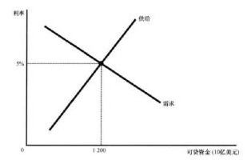

还记得我们一开始的公式 $Y=C+I+G+NX$ 吗？我们用它来继续推导公式。

考虑一个封闭体系，没有国际贸易，$NX=0$，则有：

$$
Y-C-G=I
$$

而等式左边为国民储蓄 S，因此得到重要恒等式：

$$
S=I
$$

说明储蓄等于投资。在开放体系中，$NX\neq0$，$Y-C-G=I+NX$，又净出口 NX 等于资本净流出 NCO，因此得到：

$$
S=I+NCO
$$

即储蓄等于国内投资加资本净流出。这些量是紧密联系的，我们在（三）部分还要研究它们。

**（三）宏观经济与国际贸易**

国际贸易，我们可以先用微观经济学中比较优势的概念和消费/生产剩余曲线去理解。

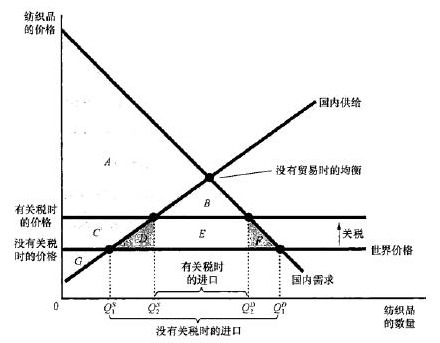

微观经济模型也是很好用的，不过在这里，下面我们考察宏观经济的诸多模型。

外汇市场上，汇率绝对是至关重要的概念。名义汇率指的是一个人可以用一国的通货交换另一国通货的比率，例如1美元换80日元。真实汇率指的是一个人可以用一国的产品交换另一国产品的比率，如1kg美国奶酪兑0.5kg瑞士奶酪。真实汇率和名义汇率之间的计算关系是：

$$
真实汇率=\frac{名义汇率\times 国内价格}{国外价格}
$$

定义国内一篮子 CPI 为 P，国外一篮子 CPI 为 P*，名义汇率为 e，可以得到公式：

$$
真实利率=\frac{e\times P}{P^*}
$$

一种理论购买力平价理论认为名义汇率应当取决于两国的物价水平，即：

$$
e=\frac{P^*}{P}
$$

强势货币指可以兑换他国货币变多，弱势反之。这里举例分析货币和贸易的关系。当美元走强，商人把东西卖到美国可以得到更多价值，于是向美国出口。因此，外国投资人喜欢强势美元，而美国的外地投资人会喜欢弱势美元。

到这里，我们就有能力考虑把政府财政政策、货币政策、金融市场、国际贸易都综合在一起了。我们要见识这样一个外汇模型，这个模型综合了可贷资金市场和货币市场。以政府赤字和资本外逃为例，我们分析一下货币量、利率、汇率都会如何变化，如图所示。

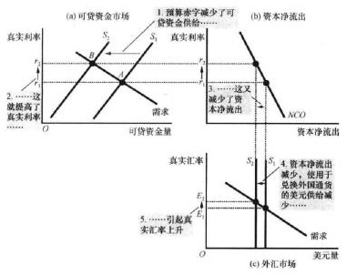

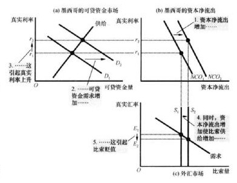

外汇市场中，当资本净流出减少时，该货币增值，资本净流出增加，货币贬值。

### §4.3 社会与法律体系

#### 4.3.1 社会学的研究

社会学研究什么？它似乎包罗万象，毕竟整个社会既包括了政治经济，又包含文化艺术，还有人与人的交往。虽然社会这个概念是先于政治和经济的，但是社会学的建立可远远晚于政治学和经济学。下面我们简要介绍一下社会学史。

社会学起源于19世纪孔德的实证主义哲学，孔德也被称为社会学之父。而后面的社会学三位奠基人，分别是马克思、韦伯、涂尔干。马克思的理论，从生产力与生产关系的矛盾运动，到经济基础决定上层建筑的唯物史观，再到阶级斗争共产主义的革命思想，我们都再熟悉不过。韦伯的代表作是《新教伦理与资本主义精神》，他提出现代化就是祛魅化，祛除了宗教这般超自然力量，追求理性的力量。他一并分析，新教的禁欲态度与追求金钱利益的资本主义紧密相连（劳动是符合上帝意志的，劳动促进财富积累因而使正当的），资本主义起源于新教，而随着世俗化发展，对金钱的追求削弱了原来的宗教性。现代社会是科层制和法理型支配的。涂尔干则相信社会就像物一样实在，因而可以发展成科学。人去接触社会事实、社会规范的过程中，就是人的社会化。现代社会中，人是通过分工有机地团结形成分化社会，而不像原始社会考相同生活思维方式联结形成的机械团结。涂尔干还着重分析过自杀，将自杀分为利己、利他、失范、宿命四种类型。

社会学于是走向了两条道路。一条是孔德、斯宾塞、涂尔干代表的社会唯实论，相信存在社会这一事实，涂尔干建立了集体主义方法论，这后来发展为包括社会系统理论、功能主义在内的宏观社会学。另一条是韦伯、齐美尔、米德代表的社会唯名论，认为只存在个体或个体之间的关系，社会只是一个指代名词，其中认为存在个体的被称为个人主义方法论，认为存在人际关系的被称为关系主义方法论，这些后来发展为包括诠释学派、互动理论在内的微观社会学。

除了这两条路之外，还有法兰克福学派与结构主义。法兰克福学派起源于对纳粹的分析和批判，代表人物有霍克海默、阿多诺、本雅明、哈贝马斯，他们倡导理性，其理论强于分析具有强社会批判性被称为批判理论，长期在哲学、社会学、经济学发挥作用。结构主义则起源列维-斯特劳斯，认为现有习惯和文化才有社会的样子。其后来发展为福柯代表的后结构主义，提出现代社会的权力由中世纪让人死的权力（死亡权力）变为让人活的权力（生命权力），现代社会的权力也不再是中世纪那种自上而下的，而是让人们在社会中自觉被约束遵守纪律的全景监狱。

#### 4.3.2 社会公平正义

社会学家提出的理论，常常有社会运行的机制、人与人的关系、社会的权力和意识形态等方面，也常有理论涉及人文地理学、现象学语言学、社会心理学、经济学等方面。这些思想固然重要且有价值，但都各家有各家的理，各自提出自己的新概念新方法。本节，我们不再谈具体的社会学家的思想，讨论一下社会中最让人关注的公平正义问题。

现代社会，维护社会公平正义主要靠的是法律。法是追求公平与正义的，这是法哲学的基本原理。于是这一讲，我们谈一些重要的法学概念。

刑法学的起源，大概是有神授说、战争说、社会契约理论（卢梭）、正义理论（康德、黑格尔）四门学说。刑法的功能是辩证的：既能实现惩罚犯罪的保护技能，又能恪守保障罪犯人权的保障机能。

现代法治国家刑法的基本原则就是“法无规定不为罪，法无规定不处罚”。第二是罪刑相当原则，即重罪重刑、轻罪轻刑、无罪不刑。第三是人人平等原则。犯罪行为的三大特征是刑事违法性、严重社会危害性、应受刑罚处罚性。犯罪的排除，可能有正当防卫、紧急避险、特殊防卫等。未完成的犯罪包括犯罪预备、犯罪未遂和犯罪中止。

在我国，一些重要罪行有：危害公共安全罪（危险方法类犯罪、事故犯罪）、破坏社会主义市场经济秩序罪（伪劣商品犯罪、走私与公司犯罪、金融犯罪、其他经济犯罪）、侵犯公民人身权利民主权利罪（生命健康、性自由权、侵犯自由、婚姻家庭类）、侵犯财产罪（强制占有型的财产犯罪、平和占有型的财产犯罪）、妨害社会管理秩序罪（扰乱公共秩序罪、妨害司法罪及卖淫罪）、贪污贿赂罪（贪污犯罪、贿赂犯罪）。

#### 4.4 本部分参考书目

《政治学通识》，北京大学出版社，包刚升  
《国际政治概论》，北京大学出版社，王逸舟  
《做一个清醒的现代人》，湖南文艺出版社，刘擎  
《西方现代思想讲义》，新星出版社，刘擎  
《谁在世界中心》，中信出版集团，温骏轩  
《一本书看懂地缘世界》，中信出版集团，王伟  
《百年大变局：世界与中国》，中共中央党校出版社，张蕴岭  
《大趋势：中国下一步》，东方出版社，郑永年  
《十四五大战略与2035远景》，东方出版社，胡鞍钢  
《中国2049》，北京大学出版社，姚洋、黄益平、美，杜大伟  
《大国崛起》，人民出版社，唐晋  
《美帝国的崩溃》，人民出版社，挪威，约翰·加尔通  
《美国政党与选举》，译林出版社，美，梅塞尔  
《美国最高法院》，译林出版社，美，格林豪斯  
《美国国会》，译林出版社，美，里奇  
《美国总统制》，译林出版社，美，琼斯  
《资本主义》，译林出版社，美，富尔彻  
《经济学原理》，北京大学出版社，美，曼昆  
《斯坦福极简经济学》，湖南人民出版社，美，泰勒  
《小岛经济学》，中信出版集团，美，希夫  
《牛奶可乐经济学》，北京联合公司出版社，美，弗兰克  
《西方经济学》，中国人民大学出版社，高鸿业  
《薛兆丰经济学讲义》，中信出版集团，薛兆丰  
《刑法学讲义》，云南出版集团，罗翔  
《原来这就是社会学》，南海出版公司，日，田中正人  
《乡土中国》，人民出版社，费孝通  
《美国人的性格》，华东师范大学出版社，费孝通

插图来源：《经济学原理》，北京大学出版社，美，曼昆。

## 后记与致谢

这个夏天，注定是一个很忙的夏天，也令我感到无比充实。毕竟是准高二学生，被安排不少的新课和强基课，再加之今年春天以来开始了 Two-Dimension 领域研究，暑假里进行了非常多 T-D 经典作品的拜读。但是，正如我在导言中所提到的，这个计划从很久前就已经开始构思，我也很早就有想做这个项目的冲动。怎样才能实现我自己的价值？这是我一直在思考的一个问题。我渴望成为一个强大的有能力的人，这就必须要求我克服困难，不管多忙压力多大。我渴望用我的笔在试卷上取得成就，也渴望用它在墨纸上挥洒一通。于是，7月24日，我终于做了一份关于《西方文化基础》创作的企划案，正式决定把长期以来的写作愿望在这个暑假形成现实。今日，8月21日，暑假的最后一天，我结束了整篇的写作，虽说质量不佳，完全达不到出版物的水平，但它至少作为我这初高中几年学习研究的成果汇报，还是很满足的。

暑假的工作实在是很忙，我也有过很多想放弃的想法。一路上，我把创作的感受和我的朋友们进行了分享，也很感谢朋友们的鼓励和赞赏，这也给了我不放弃、坚持到底的动力。

今天我可以说，I’ve made it！这里我对支持鼓励我、给我提修改意见的朋友们表示衷心的感谢。我应该没能达到企划案中的目标“创作出让所有人为之动容的文化讲解”，但我认为，接下来若干年的不断继续学习和沉淀，修改文章，总有一天我能达到这个目的。

治学踏实，思想万岁，真理永恒，仍然在路上。

我知道我很渺小。

我渴望变强。

2022年8月21日于青岛
